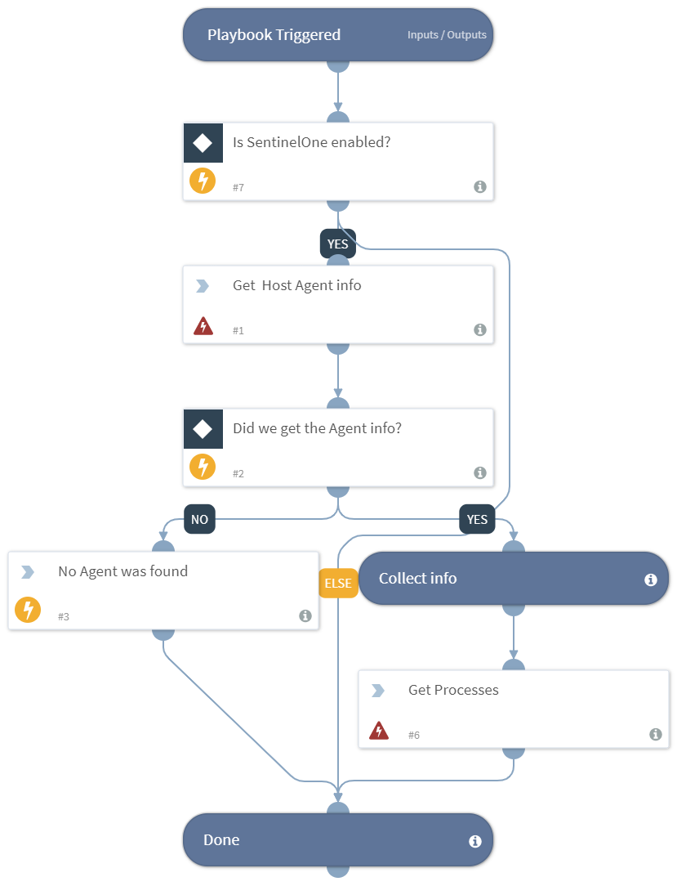

Collects endpoint information based on SentinelOne commands.

Input:
* Hostname (Default: ${Endpoint.Hostname})

## Dependencies
This playbook uses the following sub-playbooks, integrations, and scripts.

### Sub-playbooks
This playbook does not use any sub-playbooks.

### Integrations
* SentinelOne

### Scripts
* Print
* Exists

### Commands
* so-agents-query
* so-get-agent-processes

## Playbook Inputs
---

| **Name** | **Description** | **Default Value** |  **Required** |
| --- | --- | --- | --- |  
| Hostname | The hostname of the device to run on. | ${Endpoint.Hostname} | Optional |

## Playbook Outputs
---
There are no outputs for this playbook.
## Playbook Image
---

