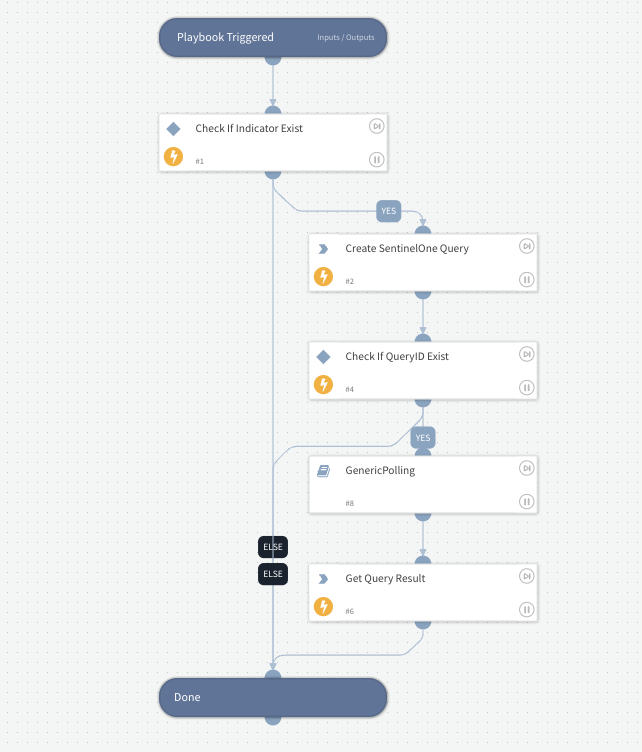

Runs Query on Endpoints for SHA1 values.

## Dependencies

This playbook uses the following sub-playbooks, integrations, and scripts.

### Sub-playbooks

* GenericPolling

### Integrations

* SentinelOne-V2
* SentinelOneEventCollector

### Scripts

This playbook does not use any scripts.

### Commands

* sentinelone-create-query
* sentinelone-get-events

## Playbook Inputs

---

| **Name** | **Description** | **Default Value** | **Required** |
| --- | --- | --- | --- |
| sha1 | Comma seperated strings of SHA1 hashes. |  | Optional |
| interval | Frequency that the polling command will run \(minutes\). | 1 | Optional |
| timeout | Amount of time to poll before declaring a timeout and resuming the playbook \(in minutes\). | 10 | Optional |

## Playbook Outputs

---
There are no outputs for this playbook.

## Playbook Image

---

