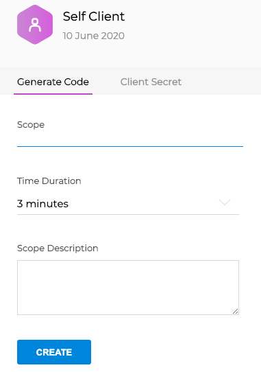

IT Service Management

## Configure ServiceDeskPlus on Cortex XSOAR

1. Navigate to **Settings** > **Integrations** > **Servers & Services**.
2. Search for ServiceDeskPlus.
3. Click **Add instance** to create and configure a new integration instance.

## Instance Creation Flow for Cloud

To create an instance of the Service Desk Plus integration, you need to get a Client ID, Client Secret, and Refresh Token.
Follow the next steps to create an instance:

1. Select the data center in which your data resides.
2. Register your app using [ZOHO App Registration](https://api-console.zoho.com). Make sure you copy the Client ID and Client Secret of the app to the Cortex XSOAR instance and click the **Done** button.
3. In the registered app, select the **Generate Code** tab and define the scopes for the app.
4. From the Cortex XSOAR CLI run the command `!service-desk-plus-generate-refresh-token` and paste the generated code into the code parameter.
5. Copy the generated refresh token to the Cortex XSOAR instance and click the **Test** button to validate the instance.

## Instance Creation Flow for On-Premise
To create an instance of the Service Desk Plus integration, you need to get a On-Premises Server URL and a Technician Key.

Follow the next steps to create an instance:

1. Enter the On-Premise Server URL info.
2. Enter the Technician Key.
3. Click the **Test** button to validate the instance.

**NOTES**
- For more details about the app authorization process refer to [App Authorization](https://www.manageengine.com/products/service-desk/sdpod-v3-api/SDPOD-V3-API.html)
- The code generated in the app is only valid for a limited time.
- In order to avoid repeating this process, the created Refresh Token should be saved for future use.
- For more details about generating a technician key please refer to the [help documentation](https://help.servicedeskplus.com/api/rest-api.html$key)



| **Parameter** | **Description** | **Required** |
| --- | --- | --- |
| server_url | Data Center Location: Select the domain location that is applicable for you application | True |
| technician_key | Technician Key | False |
| server_url_on_premise | On-Premise Server URL | False |
| client_id | Client ID | False |
| client_secret | Client Secret | False |
| refresh_token | Refresh Token | False |
| isFetch | Fetch incidents | False |
| incidentType | Incident type | False |
| insecure | Trust any certificate \(not secure\) | False |
| proxy | Use system proxy settings | False |
| fetch_status | The status of the requests that should be fetched. Multiple status can be entered, separated by a comma. | False |
| fetch_time | First fetch time range \(&lt;number&gt; &lt;time unit&gt;, e.g., 1 hour, 30 minutes\) | False |
| fetch_limit | The maximum number of incidents that should be fetched each time | False |
| fetch_filter | Use this field to filter the incidents that are being fetched according to any of the request properties.  Please see additional information for exact filter format. Overrides the status filter, if given. | False |

4. Click **Test** to validate the URLs, token, and connection.
## Commands
You can execute these commands from the Cortex XSOAR CLI, as part of an automation, or in a playbook.
After you successfully execute a command, a DBot message appears in the War Room with the command details.
### service-desk-plus-requests-list
***
View the details of requests. If no parameters are given the details of all requests will be shown.


#### Base Command

`service-desk-plus-requests-list`
#### Input

| **Argument Name** | **Description** | **Required** |
| --- | --- | --- |
| request_id | The unique request id of the request that should be shown. | Optional | 
| start_index | Use this to get a list of tasks starting from this index.<br/>e.g: 6 | Optional | 
| page_size | Use this to mention the number of requests that needs to be returned.<br/>e.g: 15. By default, will return only the first 10 requests. | Optional | 
| search_fields | The column name and value to be searched for in the format of a json object. e.g {“subject”:“Change like this”,“priority.name”:“High”} | Optional | 
| filter_by | The name of the filter that should be used. e.g {“name”:“My_Open”} | Optional | 


#### Context Output

| **Path** | **Type** | **Description** |
| --- | --- | --- |
| ServiceDeskPlus.Request.Requester | Unknown | The requester of the request | 
| ServiceDeskPlus.Request.CreatedTime | Date | The time the request was created | 
| ServiceDeskPlus.Request.Template | Unknown | The template that was used to create the request | 
| ServiceDeskPlus.Request.DisplayId | String | The display id of the request | 
| ServiceDeskPlus.Request.Id | String | The unique id of the request | 
| ServiceDeskPlus.Request.Subject | String | The subject of the request | 
| ServiceDeskPlus.Request.Technician | String | The technician that was assigned to the request | 
| ServiceDeskPlus.Request.Status | String | The status of the request | 
| ServiceDeskPlus.Request.DueByTime | Date | The due date of the request | 
| ServiceDeskPlus.Request.Group | String | The group to which the request belongs | 
| ServiceDeskPlus.Request.IsServiceRequest | Boolean | Indicates whether the request is a service request or not | 
| ServiceDeskPlus.Request.CancellationRequested | Boolean | Indicates whether a cancellation was requested | 
| ServiceDeskPlus.Request.HasNotes | Boolean | Indicates whether the command has notes or not | 


#### Command Example
```!service-desk-plus-requests-list start_index=32 page_size=2```

#### Context Example
```
{
    "ServiceDeskPlus": {
        "Request": [
            {
                "CancellationRequested": false,
                "CreatedTime": "2020-06-30T15:27:33.000Z",
                "DisplayId": "172",
                "HasNotes": false,
                "Id": "123640000000279007",
                "IsServiceRequest": false,
                "Requester": {
                    "email_id": null,
                    "is_technician": false,
                    "sms_mail": null,
                    "phone": null,
                    "name": "First Last",
                    "mobile": null,
                    "id": "123640000000244019",
                    "photo_url": "https://contacts.zoho.com/file?exp=10&ID=-1&t=user&height=60&width=60",
                    "is_vip_user": false,
                    "department": null
                },
                "Status": "Open",
                "Subject": "Update Existing Request",
                "Template": {
                    "id": "123640000000006655",
                    "name": "Default Request"
                }
            },
            {
                "CancellationRequested": false,
                "CreatedTime": "2020-07-01T08:03:12.000Z",
                "DisplayId": "180",
                "HasNotes": false,
                "Id": "123640000000281015",
                "IsServiceRequest": false,
                "Requester": {
                    "department": null,
                    "email_id": null,
                    "id": "123640000000244019",
                    "is_technician": false,
                    "is_vip_user": false,
                    "mobile": null,
                    "name": "First Last",
                    "phone": null,
                    "photo_url": "https://contacts.zoho.com/file?exp=10&ID=-1&t=user&height=60&width=60",
                    "sms_mail": null
                },
                "Status": "Open",
                "Subject": "Create New Request",
                "Template": {
                    "id": "123640000000006655",
                    "name": "Default Request"
                }
            }
        ]
    }
}
```

#### Human Readable Output

>### Requests
>|CreatedTime|Id|Requester|Status|Subject|
>|---|---|---|---|---|
>| 2020-06-30T15:27:33.000Z | 123640000000279007 | First Last | Open | Update Existing Request |
>| 2020-07-01T08:03:12.000Z | 123640000000281015 | First Last | Open | Create New Request |


### service-desk-plus-request-delete
***
Deletes the request with the specified ID. To delete multiple IDs, pass a comma-separated list (string) of the IDs of the requests.

#### Base Command

`service-desk-plus-request-delete`
#### Input

| **Argument Name** | **Description** | **Required** |
| --- | --- | --- |
| request_id | The id of the request that should be deleted | Required | 


#### Context Output

There is no context output for this command.

#### Command Example
```!service-desk-plus-request-delete request_id=123640000000279019```

#### Human Readable Output

>### Successfully deleted request(s) 123640000000279019

### service-desk-plus-request-create
***
Create new requests


#### Base Command

`service-desk-plus-request-create`
#### Input

| **Argument Name** | **Description** | **Required** |
| --- | --- | --- |
| subject | Subject of this request | Required | 
| description | Description of this request | Optional | 
| request_type | Type of this request. Choose one of the listed options or provide a dictionary representing a request_type object. | Optional | 
| impact | Impact of this request. Choose one of the listed options or provide a dictionary representing an impact object. | Optional | 
| status | Indicates the current status of this request. Choose one of the listed options or provide a dictionary representing a status object. | Optional | 
| mode | The mode in which the request is created. Choose one of the listed options or provide a dictionary representing a mode object. | Optional | 
| level | Level of the request. Choose one of the listed options or provide a dictionary representing a level object. | Optional | 
| urgency | Urgency of the request. Choose one of the listed options or provide a dictionary representing an urgency object. | Optional | 
| priority | Priority of the request. Choose one of the listed options or provide a dictionary representing a priority object. | Optional | 
| service_category | Service category to which this request belongs. String representing the category's name. | Optional | 
| requester | Indicates the requester of this request. Type the name of the requester as a string or a dictionary representing a requester object. | Optional | 
| assets | Array of asset objects associated to this request | Optional | 
| site | Denotes the site to which this request belongs. Type a site name or provide a dictionary representing a site object. | Optional | 
| group | Group to which this request belongs. Type the name of the group or a dictionary representing a group object. | Optional | 
| technician | Technician assigned to this request. Type the name of the technician or a dictionary representing a technician object. | Optional | 
| category | Category to which the request belongs. Fill in the name of the category or a dictionary representing a category object. | Optional | 
| subcategory | Subcategory to which this request belongs. Fill in the name of the subcategory or a dictionary representing a subcategory object. | Optional | 
| item | Item of this request. Fill in the item's name or a dictionary representing an item object. | Optional | 
| email_ids_to_notify | Array of Email ids, which needs to be notified about the happenings of this request | Optional | 
| is_fcr | Boolean value indicating if the request has been marked as First Call Resolution | Optional | 
| resources | Holds the resource data mapped to the request | Optional | 
| udf_fields | Holds udf fields' values associated with the request. Input format: A string of the form "key1:value1,key2:value2" or a dictionary of the form "{'key1':'val1','key2':'val2'}" | Optional | 

**Note:**
>Fields that represent an object can be filled either by providing the name only or the entire object. For example, the technician parameter can be defined either by filling 
>*technician="First Last"* or *technician="{'name':'First Last', 'id':'12345', 'email_id':'email@paloaltonetworks.com'}"*

#### Context Output

| **Path** | **Type** | **Description** |
| --- | --- | --- |
| ServiceDeskPlus.Request.Requester | Unknown | The requester of the request | 
| ServiceDeskPlus.Request.CreatedTime | Date | The time the request was created | 
| ServiceDeskPlus.Request.Template | Unknown | The template that was used to create the request | 
| ServiceDeskPlus.Request.DisplayId | String | The display id of the request | 
| ServiceDeskPlus.Request.Id | String | The unique id of the request | 
| ServiceDeskPlus.Request.Subject | String | The subject of the request | 
| ServiceDeskPlus.Request.Technician | String | The technician that was assigned to the request | 
| ServiceDeskPlus.Request.Status | String | The status of the request | 
| ServiceDeskPlus.Request.DueByTime | Date | The due date of the request | 
| ServiceDeskPlus.Request.Group | String | The group to which the request belongs | 
| ServiceDeskPlus.Request.IsServiceRequest | Boolean | Indicates whether the request is a service request or not | 
| ServiceDeskPlus.Request.CancellationRequested | Boolean | Indicates whether a cancellation was requested | 
| ServiceDeskPlus.Request.HasNotes | Boolean | Indicates whether the command has notes or not | 


#### Command Example
```!service-desk-plus-request-create subject="Create New Request" requester="{'name':'First Last'}"```

#### Context Example
```
{
    "ServiceDeskPlus": {
        "Request": {
            "CancellationRequested": false,
            "CreatedBy": {
                "department": null,
                "email_id": "email@paloaltonetworks.com",
                "id": "123640000000142582",
                "is_technician": true,
                "is_vip_user": false,
                "mobile": null,
                "name": "First Last",
                "phone": null,
                "photo_url": "https://contacts.zoho.com/file?exp=10&ID=712874208&t=user&height=60&width=60",
                "sms_mail": null
            },
            "CreatedTime": "2020-07-01T08:17:06.000Z",
            "DisplayId": "181",
            "HasAttachments": false,
            "HasLinkedRequests": false,
            "HasNotes": false,
            "HasProblem": false,
            "HasProject": false,
            "HasRequestInitiatedChange": false,
            "Id": "123640000000276021",
            "IsEscalated": false,
            "IsFcr": false,
            "IsFirstResponseOverdue": false,
            "IsOverdue": false,
            "IsRead": false,
            "IsReopened": false,
            "IsServiceRequest": false,
            "IsTrashed": false,
            "LastUpdatedTime": "2020-07-01T08:17:06.000Z",
            "Requester": {
                "department": null,
                "email_id": null,
                "id": "123640000000244019",
                "is_technician": false,
                "is_vip_user": false,
                "mobile": null,
                "name": "First Last",
                "phone": null,
                "photo_url": "https://contacts.zoho.com/file?exp=10&ID=-1&t=user&height=60&width=60",
                "sms_mail": null
            },
            "Status": "Open",
            "Subject": "Create New Request",
            "Template": {
                "id": "123640000000006655",
                "name": "Default Request"
            },
            "TimeElapsed": "0",
            "UdfFields": {
                "udf_char2": "def test"
            },
            "UnrepliedCount": 0
        }
    }
}
```

#### Human Readable Output

>### Service Desk Plus request was successfully created
>|CreatedTime|Id|Requester|Status|Subject|
>|---|---|---|---|---|
>| 2020-07-01T08:17:06.000Z | 123640000000276021 | First Last | Open | Create New Request |


### service-desk-plus-request-update
***
Update the request with the given request id.


#### Base Command

`service-desk-plus-request-update`
#### Input

| **Argument Name** | **Description** | **Required** |
| --- | --- | --- |
| request_id | The ID of this request | Required | 
| subject | Subject of this request | Optional | 
| description | Description of this request | Optional | 
| request_type | Type of this request. Choose one of the listed options or provide a dictionary representing a request_type object. | Optional | 
| impact | Impact of this request. Choose one of the listed options or provide a dictionary representing an impact object. | Optional | 
| status | Indicates the current status of this request. Choose one of the listed options or provide a dictionary representing a status object. | Optional | 
| mode | The mode in which the request is created. Choose one of the listed options or provide a dictionary representing a mode object. | Optional | 
| level | Level of the request. Choose one of the listed options or provide a dictionary representing a level object. | Optional | 
| urgency | Urgency of the request. Choose one of the listed options or provide a dictionary representing an urgency object. | Optional | 
| priority | Priority of the request. Choose one of the listed options or provide a dictionary representing a priority object. | Optional | 
| service_category | Service category to which this request belongs. String representing the category's name. | Optional | 
| requester | Indicates the requester of this request. Type the name of the requester as a string or a dictionary representing a requester object. | Optional | 
| assets | Array of asset objects associated to this request | Optional | 
| site | Denotes the site to which this request belongs. Type a site name or provide a dictionary representing a site object. | Optional | 
| group | Group to which this request belongs. Type the name of the group or a dictionary representing a group object. | Optional | 
| technician | Technician assigned to this request. Type the name of the technician or a dictionary representing a technician object. | Optional | 
| category | Category to which the request belongs. Fill in the name of the category or a dictionary representing a category object. | Optional | 
| subcategory | Subcategory to which this request belongs. Fill in the name of the subcategory or a dictionary representing a subcategory object. | Optional | 
| item | Item of this request. Fill in the item's name or a dictionary representing an item object. | Optional | 
| email_ids_to_notify | Array of Email ids, which needs to be notified about the happenings of this request | Optional | 
| is_fcr | Boolean value indicating if the request has been marked as First Call Resolution | Optional | 
| resources | Holds the resource data mapped to the request | Optional | 
| udf_fields | Holds udf fields' values associated with the request. Input format: A string of the form "key1:value1,key2:value2" or a dictionary of the form "{'key1':'val1','key2':'val2'}" | Optional | 
| update_reason | The reason for updating this request | Optional | 
| status_change_comments | Comments added while changing the request's status | Optional | 


#### Context Output

| **Path** | **Type** | **Description** |
| --- | --- | --- |
| ServiceDeskPlus.Request.Requester | Unknown | The requester of the request | 
| ServiceDeskPlus.Request.CreatedTime | Date | The time the request was created | 
| ServiceDeskPlus.Request.Template | Unknown | The template that was used to create the request | 
| ServiceDeskPlus.Request.DisplayId | String | The display id of the request | 
| ServiceDeskPlus.Request.Id | String | The unique id of the request | 
| ServiceDeskPlus.Request.Subject | String | The subject of the request | 
| ServiceDeskPlus.Request.Technician | String | The technician that was assigned to the request | 
| ServiceDeskPlus.Request.Status | String | The status of the request | 
| ServiceDeskPlus.Request.DueByTime | Date | The due date of the request | 
| ServiceDeskPlus.Request.Group | String | The group to which the request belongs | 
| ServiceDeskPlus.Request.IsServiceRequest | Boolean | Indicates whether the request is a service request or not | 
| ServiceDeskPlus.Request.CancellationRequested | Boolean | Indicates whether a cancellation was requested | 
| ServiceDeskPlus.Request.HasNotes | Boolean | Indicates whether the command has notes or not | 


#### Command Example
```!service-desk-plus-request-update request_id=123640000000284007 subject="Update Existing Request"```

#### Context Example
```
{
    "ServiceDeskPlus": {
        "Request": {
            "CancellationRequested": false,
            "CreatedBy": {
                "department": null,
                "email_id": "email@paloaltonetworks.com",
                "id": "123640000000142582",
                "is_technician": true,
                "is_vip_user": false,
                "mobile": null,
                "name": "First Last",
                "phone": null,
                "photo_url": "https://contacts.zoho.com/file?exp=10&ID=712874208&t=user&height=60&width=60",
                "sms_mail": null
            },
            "CreatedTime": "2020-07-01T07:41:14.000Z",
            "DisplayId": "177",
            "Group": {
                "deleted": false,
                "id": "123640000000006681",
                "name": "Network",
                "site": null
            },
            "HasAttachments": false,
            "HasLinkedRequests": false,
            "HasNotes": false,
            "HasProblem": false,
            "HasProject": false,
            "HasRequestInitiatedChange": false,
            "Id": "123640000000284007",
            "IsEscalated": false,
            "IsFcr": false,
            "IsFirstResponseOverdue": false,
            "IsOverdue": false,
            "IsRead": false,
            "IsReopened": true,
            "IsServiceRequest": false,
            "IsTrashed": false,
            "LastUpdatedTime": "2020-07-01T08:17:08.000Z",
            "Requester": {
                "department": null,
                "email_id": null,
                "id": "123640000000244019",
                "is_technician": false,
                "is_vip_user": false,
                "mobile": null,
                "name": "First Last",
                "phone": null,
                "photo_url": "https://contacts.zoho.com/file?exp=10&ID=-1&t=user&height=60&width=60",
                "sms_mail": null
            },
            "Resolution": {
                "content": "Resolution Content"
            },
            "RespondedTime": "2020-07-01T08:12:31.000Z",
            "Status": "Open",
            "Subject": "Update Existing Request",
            "Template": {
                "id": "123640000000006655",
                "name": "Default Request"
            },
            "TimeElapsed": "0",
            "UdfFields": {
                "udf_char2": "def test"
            },
            "UnrepliedCount": 0
        }
    }
}
```

#### Human Readable Output

>### Service Desk Plus request was successfully updated
>|CreatedTime|Id|Requester|Status|Subject|
>|---|---|---|---|---|
>| 2020-07-01T07:41:14.000Z | 123640000000284007 | First Last | Open | Update Existing Request |


### service-desk-plus-request-assign
***
Assigns the request with the given request id to a technician/group


#### Base Command

`service-desk-plus-request-assign`
#### Input

| **Argument Name** | **Description** | **Required** |
| --- | --- | --- |
| request_id | The id of the request that should be assigned | Required | 
| technician | The name of the technician that should be assigned to the request | Optional | 
| group | The name of the group that should be assigned to the request | Optional | 


#### Context Output

There is no context output for this command.

#### Command Example
```!service-desk-plus-request-assign request_id=123640000000284007 group="Network"```

#### Context Example
```
{}
```

#### Human Readable Output

>### Service Desk Plus request 123640000000284007 was successfully assigned

### service-desk-plus-request-pickup
***
Allows the technician to pickup the request with the given request id on his name.


#### Base Command

`service-desk-plus-request-pickup`
#### Input

| **Argument Name** | **Description** | **Required** |
| --- | --- | --- |
| request_id | The id of the request that should be picked up | Required | 


#### Context Output

There is no context output for this command.

#### Command Example
```!service-desk-plus-request-pickup request_id=123640000000279001```

#### Context Example
```
{}
```

#### Human Readable Output

>### Service Desk Plus request 123640000000279001 was successfully picked up

### service-desk-plus-linked-request-list
***
Gets a list with all the linked requests under a request


#### Base Command

`service-desk-plus-linked-request-list`
#### Input

| **Argument Name** | **Description** | **Required** |
| --- | --- | --- |
| request_id | The request for which the linked requests are requested | Required | 


#### Context Output

| **Path** | **Type** | **Description** |
| --- | --- | --- |
| ServiceDeskPlus.Request.LinkRequests.Comments | Unknown | The comment that was added to the linked request | 
| ServiceDeskPlus.Request.LinkRequests.LinkedRequest | Unknown | The linked request information | 


#### Command Example
```!service-desk-plus-linked-request-list request_id=123640000000284007```

#### Context Example
```
{
    "ServiceDeskPlus": {
        "Request": {
            "LinkRequests": [
                {
                    "LinkedRequest": {
                        "display_id": "179",
                        "id": "123640000000288001",
                        "subject": "Request for List",
                        "udf_fields": {
                            "udf_char1": null,
                            "udf_char2": "def test",
                            "udf_char3": null
                        }
                    }
                }
            ]
        }
    }
}
```

#### Human Readable Output

>### Linked requests to request 123640000000284007
>|LinkedRequest|
>|---|
>| subject: Request for List<br/>id: 123640000000288001<br/>udf_fields: {"udf_char1": null, "udf_char2": "def test", "udf_char3": null}<br/>display_id: 179 |


### service-desk-plus-request-resolution-add
***
Adds a resolution to the given request


#### Base Command

`service-desk-plus-request-resolution-add`
#### Input

| **Argument Name** | **Description** | **Required** |
| --- | --- | --- |
| request_id | The id of the request for which the resolution should be added | Required | 
| resolution_content | The content of the resolution that should be added to the request | Optional | 
| add_to_linked_requests | A boolean value indicating whether the same resolution should be added to all linked request of the request | Optional | 


#### Context Output

There is no context output for this command.

#### Command Example
```!service-desk-plus-request-resolution-add request_id=123640000000284007 resolution_content="Resolution Content"```

#### Context Example
```
{}
```

#### Human Readable Output

>### Resolution was successfully added to 123640000000284007

### service-desk-plus-request-resolutions-list
***
Gets the resolution to the given request


#### Base Command

`service-desk-plus-request-resolutions-list`
#### Input

| **Argument Name** | **Description** | **Required** |
| --- | --- | --- |
| request_id | The id of the request for which the resolution is desired | Required | 


#### Context Output

| **Path** | **Type** | **Description** |
| --- | --- | --- |
| ServiceDeskPlus.Request.Resolution.Content | Unknown | The content of the resolution of the request | 
| ServiceDeskPlus.Request.Resolution.SubmittedBy | Unknown | The details of who submitted the resolution | 
| ServiceDeskPlus.Request.Resolution.SubmittedOn | Unknown | The date the resolution was submitted | 
| ServiceDeskPlus.Request.Resolution.ResolutionAttachments | Unknown | The attachments that were added to the resolution | 


#### Command Example
```!service-desk-plus-request-resolutions-list request_id=123640000000284007```

#### Context Example
```
{
    "ServiceDeskPlus": {
        "Request": {
            "Resolution": {
                "Content": "Resolution Content",
                "SubmittedBy": {
                    "department": null,
                    "email_id": "email@paloaltonetworks.com",
                    "id": "123640000000142582",
                    "is_technician": true,
                    "is_vip_user": false,
                    "mobile": null,
                    "name": "First Last",
                    "phone": null,
                    "photo_url": "https://contacts.zoho.com/file?exp=10&ID=712874208&t=user&height=60&width=60",
                    "sms_mail": null
                },
                "SubmittedOn": "2020-07-01T08:12:31.000Z"
            }
        }
    }
}
```

#### Human Readable Output

>### Resolution of request 123640000000284007
>|Content|SubmittedBy|SubmittedOn|
>|---|---|---|
>| Resolution Content | First Last | 2020-07-01T08:12:31.000Z |


### service-desk-plus-generate-refresh-token
***
This function generates the refresh token that should be used in the instance configurations


#### Base Command

`service-desk-plus-generate-refresh-token`
#### Input

| **Argument Name** | **Description** | **Required** |
| --- | --- | --- |
| code | The code received when creating the application | Required | 


#### Context Output

There is no context output for this command.

#### Command Example
```!service-desk-plus-generate-refresh-token code=1000.ceb0e1b783c1e9647171e46a92bb444c.61adef3ee9d50c4a83e505ceee06d5b4```

#### Context Example
```
{}
```

#### Human Readable Output

>###Refresh Token: 1000.75a65edeb42492fedd0215d301d7a136.1ab14n19a900950205b44d033472de49
>Please paste the Refresh Token in the instance configuration and save it for future use.

### service-desk-plus-link-request-modify
***
Link or Unlink multiple commands


#### Base Command

`service-desk-plus-link-request-modify`
#### Input

| **Argument Name** | **Description** | **Required** |
| --- | --- | --- |
| request_id | The id of the request for which the links should be modified | Required | 
| action | Link / Unlink this request with the given requests | Required | 
| linked_requests_id | The IDs of the requests that should be linked to the given request. Multiple IDs can be passed, separated by a comma | Required | 
| comment | The comment that should be added when linking requests (optional). | Optional | 


#### Context Output

There is no context output for this command.

#### Command Example
```!service-desk-plus-link-request-modify action=Link request_id=123640000000284007 linked_requests_id=123640000000288001```

#### Context Example
```
{}
```

#### Human Readable Output

>## Request successfully linked

### service-desk-plus-request-close
***
Closes the specified request.


#### Base Command

`service-desk-plus-request-close`
#### Input

| **Argument Name** | **Description** | **Required** |
| --- | --- | --- |
| closure_comments | The comments that should be added when closing the request | Optional | 
| closure_code | The closure code to add to the request. Can be "Cancelled", "Failed", "Postponed", "Rejected", "Success" or "Unable to Reproduce" | Optional | 
| requester_ack_comments | The requester comments that should be added to the request | Optional | 
| requester_ack_resolution | Boolean. | Optional | 
| request_id | The id of the request that should be closed | Required | 


#### Context Output

There is no context output for this command.

#### Command Example
```!service-desk-plus-request-close request_id=123640000000288001```

#### Context Example
```
{}
```

#### Human Readable Output

>### Successfully closed request 123640000000288001
