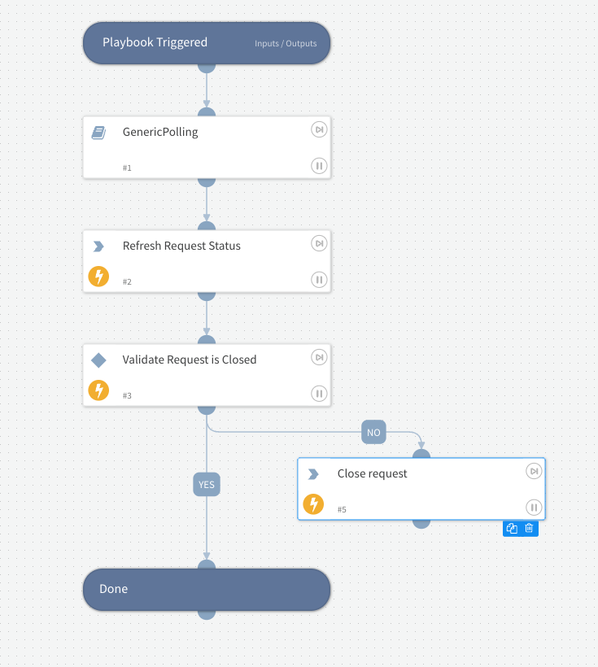

This playbook uses generic polling to wait until a request is closed.

## Dependencies

This playbook uses the following sub-playbooks, integrations, and scripts.

### Sub-playbooks

* GenericPolling

### Integrations

* ServiceDeskPlus

### Scripts

* AreValuesEqual

### Commands

* service-desk-plus-request-close
* service-desk-plus-requests-list

## Playbook Inputs

---

| **Name** | **Description** | **Default Value** | **Required** |
| --- | --- | --- | --- |
| RequestId | The id of the Service Desk Plus request |  | Required |
| Timeout | Amount of time to poll before declaring a timeout and resuming the playbook \(minutes\). |  | Required |
| Interval | Frequency that the polling command will run \(minutes\). |  | Required |

## Playbook Outputs

---

| **Path** | **Description** | **Type** |
| --- | --- | --- |
| ${ServiceDeskPlus.Request.ClosureInfo.closure_comments} | The closure comments added to the request. | unknown |
| ${ServiceDeskPlus.Request.ClosureInfo.closure_code} | The closure code added to the request | unknown |

## Playbook Image

---

