<!-- HTML_DOC -->

Deprecated. Use the ServiceNow v2 integration instead.

This integration was integrated and tested with the London version of ServiceNow.

<h2>Use cases</h2>
<ol>
<li>Get, update, create, delete ServiceNow tickets, in addition to adding links/comments and uploading files to them.</li>
<li>Fetch newly created incidents.</li>
<li>Get, update, create, delete records from any ServiceNow table.</li>
</ol>
<h2>Wrapper Scripts</h2>

There are 3 scripts that serve as examples for wrapping the following generic commands: <code>servicenow-query-table</code> - <code>ServiceNowQueryIncident</code> <code>servicenow-create-record</code> - <code>ServiceNowCreateIncident</code> <code>servicenow-update-record</code> - <code>ServiceNowUpdateIncident</code>

You can use these scripts if you want to wrap these commands around a ServiceNow table of your choice. These scripts are wrapped around the <code>incident</code> table, so to wrap them around another table simply copy the scripts and edit the code, arguments and outputs accordingly.

<h2>Configure ServiceNow on Cortex XSOAR</h2>

To use ServiceNow on Cortex XSOAR, ensure your user account has the rest_api_explorer and web_service_admin roles. These roles are required to make API calls. However, they may not suffice for viewing records in some tables. Please make sure you have the correct role so you have permissions to work with the relevant table.

<ol>
<li>Navigate to <strong>Settings</strong> &gt; <strong>Integrations</strong> &gt; <strong>Servers `&` Services</strong>.</li>
<li>Search for ServiceNow.</li>
<li>Click <strong>Add instance</strong> to create and configure a new integration instance. 
<ul>
<li>
<strong>Name</strong>: a textual name for the integration instance.</li>
<li><strong>ServiceNow URL, in the format https://company.service-now.com/</strong></li>
<li><strong>Username</strong></li>
<li><strong>Use system proxy settings</strong></li>
<li><strong>Trust any certificate (not secure)</strong></li>
<li><strong>Default ticket type for running ticket commands and fetching incidents. Can be incident, sc_request, problem or change_reuquest. Commands also take ticket_type argument</strong></li>
<li><strong>ServiceNow API Version (e.g. 'v1')</strong></li>
<li>
<strong>Fetch incidents</strong>: The query to use when fetching incidents, and how many incidents to fetch each time.</li>
<li><strong>The query to use when fetching ServiceNow incidents</strong></li>
<li><strong>How many ServiceNow incidents to fetch each time</strong></li>
<li><strong>Incident type</strong></li>
<li><strong>Get incident attachments</strong></li>
</ul>
</li>
<li>Click <strong>Test</strong> to validate the URLs, token, and connection.</li>
</ol>

<strong>Cortex XSOAR engine</strong>: If relevant, select the engine that acts as a proxy to the IMAP server. Engines are used when you need to access a remote network segments and there are network devices such as proxies, firewalls, etc. that prevent the Cortex XSOAR server from accessing the remote networks. For more information, see: <a href="https://docs-cortex.paloaltonetworks.com/r/Cortex-XSOAR/6.13/Cortex-XSOAR-Administrator-Guide/Engines">Cortex XSOAR 6.13 - Engines</a>  <a href="https://docs-cortex.paloaltonetworks.com/r/Cortex-XSOAR/8/Cortex-XSOAR-Cloud-Documentation/Engines">Cortex XSOAR 8 Cloud- Engines</a>  <a href="https://docs-cortex.paloaltonetworks.com/r/Cortex-XSOAR/8.7/Cortex-XSOAR-On-prem-Documentation/Engines">Cortex XSOAR 8.7 On-prem - Engines</a>.

<h2>Fetched Incidents Data</h2>

The integration fetches newly created tickets according to the following parameters, which you define in the instance configuration: <em><strong>ticket_type</strong></em>, <em><strong>query</strong></em>, and <em><strong>limit</strong></em>. For the first fetch, the integration will fetch incidents that were created 10 minutes earlier. After that, it will fetch incidents that were created after the timestamp of the last fetch.

Data:

<pre>{
    "result": [
        {
            "active": "false",
            "activity_due": "",
            "additional_assignee_list": "",
            "approval": "",
            "approval_history": "",
            "approval_set": "",
            "assigned_to": {
                "link": "https://dev56245.service-now.com/api/now/table/sys_user/46b87022a9fe198101a78787e40d7547",
                "value": "46b87022a9fe198101a78787e40d7547"
            },
            "assignment_group": {
                "link": "https://dev56245.service-now.com/api/now/table/sys_user_group/d625dccec0a8016700a222a0f7900d06",
                "value": "d625dccec0a8016700a222a0f7900d06"
            },
            "business_duration": "1970-01-22 21:46:21",
            "business_service": "",
            "business_stc": "1892781",
            "calendar_duration": "1970-04-02 20:46:21",
            "calendar_stc": "7937181",
            "caller_id": {
                "link": "https://dev56245.service-now.com/api/now/table/sys_user/5137153cc611227c000bbd1bd8cd2005",
                "value": "5137153cc611227c000bbd1bd8cd2005"
            },
            "category": "network",
            "caused_by": "",
            "child_incidents": "",
            "close_code": "Closed/Resolved by Caller",
            "close_notes": "Closed before close notes were made mandatory\n\t\t",
            "closed_at": "2018-02-21 23:10:06",
            "closed_by": {
                "link": "https://dev56245.service-now.com/api/now/table/sys_user/9ee1b13dc6112271007f9d0efdb69cd0",
                "value": "9ee1b13dc6112271007f9d0efdb69cd0"
            },
            "cmdb_ci": {
                "link": "https://dev56245.service-now.com/api/now/table/cmdb_ci/b0c4030ac0a800090152e7a4564ca36c",
                "value": "b0c4030ac0a800090152e7a4564ca36c"
            },
            "comments": "",
            "comments_and_work_notes": "",
            "company": "",
            "contact_type": "",
            "correlation_display": "",
            "correlation_id": "",
            "delivery_plan": "",
            "delivery_task": "",
            "description": "User can't access email on mail.company.com.\n\t\t",
            "due_date": "",
            "escalation": "0",
            "expected_start": "",
            "follow_up": "",
            "group_list": "",
            "hold_reason": "",
            "impact": "1",
            "incident_state": "7",
            "knowledge": "false",
            "location": {
                "link": "https://dev56245.service-now.com/api/now/table/cmn_location/1083361cc611227501b682158cabf646",
                "value": "1083361cc611227501b682158cabf646"
            },
            "made_sla": "false",
            "notify": "1",
            "number": "INC0000001",
            "opened_at": "2018-02-20 23:09:51",
            "opened_by": {
                "link": "https://dev56245.service-now.com/api/now/table/sys_user/681ccaf9c0a8016400b98a06818d57c7",
                "value": "681ccaf9c0a8016400b98a06818d57c7"
            },
            "order": "",
            "parent": "",
            "parent_incident": "",
            "priority": "1",
            "problem_id": {
                "link": "https://dev56245.service-now.com/api/now/table/problem/9d3a266ac6112287004e37fb2ceb0133",
                "value": "9d3a266ac6112287004e37fb2ceb0133"
            },
            "reassignment_count": "1",
            "reopen_count": "",
            "reopened_by": "",
            "reopened_time": "",
            "resolved_at": "2018-05-23 19:56:12",
            "resolved_by": {
                "link": "https://dev56245.service-now.com/api/now/table/sys_user/6816f79cc0a8016401c5a33be04be441",
                "value": "6816f79cc0a8016401c5a33be04be441"
            },
            "rfc": "",
            "severity": "1",
            "short_description": "Can't read email",
            "sla_due": "",
            "state": "7",
            "subcategory": "",
            "sys_class_name": "incident",
            "sys_created_by": "pat",
            "sys_created_on": "2016-09-21 18:24:13",
            "sys_domain": {
                "link": "https://dev56245.service-now.com/api/now/table/sys_user_group/global",
                "value": "global"
            },
            "sys_domain_path": "/",
            "sys_id": "9c573169c611228700193229fff72400",
            "sys_mod_count": "21",
            "sys_tags": "",
            "sys_updated_by": "admin",
            "sys_updated_on": "2018-05-23 20:16:07",
            "time_worked": "",
            "u_test": "",
            "upon_approval": "",
            "upon_reject": "",
            "urgency": "1",
            "user_input": "",
            "watch_list": "",
            "work_end": "",
            "work_notes": "",
            "work_notes_list": "",
            "work_start": ""
        },
        {
            "active": "true",
            "activity_due": "2018-05-23 21:51:11",
            "additional_assignee_list": "",
            "approval": "",
            "approval_history": "",
            "approval_set": "",
            "assigned_to": {
                "link": "https://dev56245.service-now.com/api/now/table/sys_user/46ca0887a9fe19810191e08e51927ebf",
                "value": "46ca0887a9fe19810191e08e51927ebf"
            },
            "assignment_group": {
                "link": "https://dev56245.service-now.com/api/now/table/sys_user_group/287ebd7da9fe198100f92cc8d1d2154e",
                "value": "287ebd7da9fe198100f92cc8d1d2154e"
            },
            "business_duration": "",
            "business_service": "",
            "business_stc": "",
            "calendar_duration": "",
            "calendar_stc": "",
            "caller_id": {
                "link": "https://dev56245.service-now.com/api/now/table/sys_user/5137153cc611227c000bbd1bd8cd2005",
                "value": "5137153cc611227c000bbd1bd8cd2005"
            },
            "category": "network",
            "caused_by": "",
            "child_incidents": "",
            "close_code": "",
            "close_notes": "",
            "closed_at": "",
            "closed_by": "",
            "cmdb_ci": {
                "link": "https://dev56245.service-now.com/api/now/table/cmdb_ci/b0c25d1bc0a800090168be1bfcdcd759",
                "value": "b0c25d1bc0a800090168be1bfcdcd759"
            },
            "comments": "",
            "comments_and_work_notes": "",
            "company": "",
            "contact_type": "",
            "correlation_display": "",
            "correlation_id": "",
            "delivery_plan": "",
            "delivery_task": "",
            "description": "User can't get to any of his files on the file server.",
            "due_date": "",
            "escalation": "3",
            "expected_start": "",
            "follow_up": "",
            "group_list": "",
            "hold_reason": "4",
            "impact": "1",
            "incident_state": "3",
            "knowledge": "false",
            "location": {
                "link": "https://dev56245.service-now.com/api/now/table/cmn_location/108486c7c611227500b093211aa88dcc",
                "value": "108486c7c611227500b093211aa88dcc"
            },
            "made_sla": "false",
            "notify": "1",
            "number": "INC0000002",
            "opened_at": "2018-02-14 23:07:12",
            "opened_by": {
                "link": "https://dev56245.service-now.com/api/now/table/sys_user/681ccaf9c0a8016400b98a06818d57c7",
                "value": "681ccaf9c0a8016400b98a06818d57c7"
            },
            "order": "",
            "parent": "",
            "parent_incident": "",
            "priority": "1",
            "problem_id": {
                "link": "https://dev56245.service-now.com/api/now/table/problem/9d3a266ac6112287004e37fb2ceb0133",
                "value": "9d3a266ac6112287004e37fb2ceb0133"
            },
            "reassignment_count": "1",
            "reopen_count": "",
            "reopened_by": "",
            "reopened_time": "",
            "resolved_at": "",
            "resolved_by": "",
            "rfc": "",
            "severity": "1",
            "short_description": "Network file shares access issue",
            "sla_due": "",
            "state": "3",
            "subcategory": "",
            "sys_class_name": "incident",
            "sys_created_by": "pat",
            "sys_created_on": "2016-09-10 22:30:06",
            "sys_domain": {
                "link": "https://dev56245.service-now.com/api/now/table/sys_user_group/global",
                "value": "global"
            },
            "sys_domain_path": "/",
            "sys_id": "9d385017c611228701d22104cc95c371",
            "sys_mod_count": "17",
            "sys_tags": "",
            "sys_updated_by": "admin",
            "sys_updated_on": "2018-05-23 19:51:11",
            "time_worked": "",
            "u_test": "",
            "upon_approval": "",
            "upon_reject": "",
            "urgency": "1",
            "user_input": "",
            "watch_list": "",
            "work_end": "",
            "work_notes": "",
            "work_notes_list": "",
            "work_start": ""
        }
    ]
}
</pre>
<h2>Commands</h2>

You can execute these commands from the Cortex XSOAR CLI, as part of an automation, or in a playbook. After you successfully execute a command, a DBot message appears in the War Room with the command details.

<ol>
<li><a href="#h_2106334508571543393959765">Get ticket information: servicenow-get-ticket</a></li>
<li><a href="#h_2766128079841543393964767">Create a ticket: servicenow-create-ticket</a></li>
<li><a href="#h_57281505611101543393969762">Update a ticket: servicenow-update-ticket</a></li>
<li><a href="#h_68978447212351543393976748">Delete a ticket: servicenow-delete-ticket</a></li>
<li><a href="#h_88472210313581543393982361">Add a link to a ticket: servicenow-add-link</a></li>
<li><a href="#h_53831027625241543393995300">Add a comment to a ticket: servicenow-add-comment</a></li>
<li><a href="#h_982871326451543394001189">Get ticket information for a query: servicenow-query-tickets</a></li>
<li><a href="#h_59791168127661543394007101">Upload a file to a ticket: servicenow-upload-file</a></li>
<li><a href="#h_42025144228861543394012547">Get record information: servicenow-get-record</a></li>
<li><a href="#h_31329423830051543394018349">Query a table: servicenow-query-table</a></li>
<li><a href="#h_11">Create a record in a table: servicenow-create-record</a></li>
<li><a href="#h_82174951331301543394025269">Update a record in a table: servicenow-update-record</a></li>
<li><a href="#h_70112060732471543394030180">Delete a record from a table: servicenow-delete-record</a></li>
<li><a href="#h_6980755125801543393891359">List API fields for a table: servicenow-list-table-fields</a></li>
<li><a href="#h_36360169033681543394035550">Query computers: servicenow-query-computers</a></li>
<li><a href="#h_65378198335911543394040311">Query groups: servicenow-query-groups</a></li>
<li><a href="#h_7352020637051543394046045">Query users: servicenow-query-users</a></li>
<li><a href="#h_4958559901351544082835053">Get table names: servicenow-get-table-name</a></li>
<li><a href="#h_a467aa87-6fbc-4eef-bf89-81f7c839f442" target="_self">Get ticket notes: servicenow-get-ticket-notes</a></li>
</ol>
<h3 id="h_2106334508571543393959765">1. Get ticket information</h3>

Retrieves ticket information by the ticket ID.

<h5>Base Command</h5>

<code>servicenow-get-ticket</code>

<h5>Input</h5>
<table style="width: 746px;" border="2" cellpadding="6">
<thead>
<tr>
<th style="width: 168px;"><strong>Argument Name</strong></th>
<th style="width: 449px;"><strong>Description</strong></th>
<th style="width: 91px;"><strong>Required</strong></th>
</tr>
</thead>
<tbody>
<tr>
<td style="width: 168px;">id</td>
<td style="width: 449px;">Ticket system ID to retrieve</td>
<td style="width: 91px;">Optional</td>
</tr>
<tr>
<td style="width: 168px;">ticket_type</td>
<td style="width: 449px;">Ticket type</td>
<td style="width: 91px;">Optional</td>
</tr>
<tr>
<td style="width: 168px;">number</td>
<td style="width: 449px;">Ticket number to retrieve</td>
<td style="width: 91px;">Optional</td>
</tr>
<tr>
<td style="width: 168px;">get_attachments</td>
<td style="width: 449px;">Whether to retrieve ticket attachments, default is false</td>
<td style="width: 91px;">Optional</td>
</tr>
</tbody>
</table>

 

<h5>Context Output</h5>
<table style="width: 746px;" border="2" cellpadding="6">
<thead>
<tr>
<th style="width: 337px;"><strong>Path</strong></th>
<th style="width: 77px;"><strong>Type</strong></th>
<th style="width: 294px;"><strong>Description</strong></th>
</tr>
</thead>
<tbody>
<tr>
<td style="width: 337px;">ServiceNow.Ticket.ID</td>
<td style="width: 77px;">string</td>
<td style="width: 294px;">ServiceNow ticket ID</td>
</tr>
<tr>
<td style="width: 337px;">ServiceNow.Ticket.OpenedBy</td>
<td style="width: 77px;">string</td>
<td style="width: 294px;">ServiceNow ticket opener ID</td>
</tr>
<tr>
<td style="width: 337px;">ServiceNow.Ticket.CreatedOn</td>
<td style="width: 77px;">date</td>
<td style="width: 294px;">ServiceNow ticket creation date</td>
</tr>
<tr>
<td style="width: 337px;">ServiceNow.Ticket.Assignee</td>
<td style="width: 77px;">string</td>
<td style="width: 294px;">ServiceNow ticket assignee ID</td>
</tr>
<tr>
<td style="width: 337px;">ServiceNow.Ticket.State</td>
<td style="width: 77px;">string</td>
<td style="width: 294px;">ServiceNow ticket state</td>
</tr>
<tr>
<td style="width: 337px;">ServiceNow.Ticket.Summary</td>
<td style="width: 77px;">string</td>
<td style="width: 294px;">ServiceNow ticket short summary</td>
</tr>
<tr>
<td style="width: 337px;">ServiceNow.Ticket.Number</td>
<td style="width: 77px;">string</td>
<td style="width: 294px;">ServiceNow ticket number</td>
</tr>
<tr>
<td style="width: 337px;">ServiceNow.Ticket.Active</td>
<td style="width: 77px;">boolean</td>
<td style="width: 294px;">ServiceNow ticket active</td>
</tr>
<tr>
<td style="width: 337px;">ServiceNow.Ticket.AdditionalComments</td>
<td style="width: 77px;">string</td>
<td style="width: 294px;">ServiceNow ticket comments</td>
</tr>
<tr>
<td style="width: 337px;">ServiceNow.Ticket.Priority</td>
<td style="width: 77px;">string</td>
<td style="width: 294px;">ServiceNow ticket priority</td>
</tr>
<tr>
<td style="width: 337px;">ServiceNow.Ticket.OpenedAt</td>
<td style="width: 77px;">date</td>
<td style="width: 294px;">ServiceNow ticket opening time</td>
</tr>
<tr>
<td style="width: 337px;">ServiceNow.Ticket.ResolvedBy</td>
<td style="width: 77px;">string</td>
<td style="width: 294px;">ServiceNow ticket resolver ID</td>
</tr>
<tr>
<td style="width: 337px;">ServiceNow.Ticket.CloseCode</td>
<td style="width: 77px;">string</td>
<td style="width: 294px;">ServiceNow ticket close code</td>
</tr>
<tr>
<td style="width: 337px;">File.Info</td>
<td style="width: 77px;">string</td>
<td style="width: 294px;">Attachment file info</td>
</tr>
<tr>
<td style="width: 337px;">File.Name</td>
<td style="width: 77px;">string</td>
<td style="width: 294px;">Attachment file name</td>
</tr>
<tr>
<td style="width: 337px;">File.Size</td>
<td style="width: 77px;">number</td>
<td style="width: 294px;">Attachment file size</td>
</tr>
<tr>
<td style="width: 337px;">File.SHA1</td>
<td style="width: 77px;">string</td>
<td style="width: 294px;">Attachment file SHA-1</td>
</tr>
<tr>
<td style="width: 337px;">File.SHA256</td>
<td style="width: 77px;">string</td>
<td style="width: 294px;">Attachment file SHA-256</td>
</tr>
<tr>
<td style="width: 337px;">File.EntryID</td>
<td style="width: 77px;">string</td>
<td style="width: 294px;">Attachment file entry ID</td>
</tr>
<tr>
<td style="width: 337px;">File.Type</td>
<td style="width: 77px;">string</td>
<td style="width: 294px;">Attachment file type</td>
</tr>
<tr>
<td style="width: 337px;">File.MD5</td>
<td style="width: 77px;">string</td>
<td style="width: 294px;">Attachment file MD5</td>
</tr>
</tbody>
</table>

 

<h5>Command Example</h5>

<code>!servicenow-get-ticket number=INC0010052</code>

<h5>Context Example</h5>
<pre>{
    "ServiceNow": {
        "Ticket": {
            "Active": "true",
            "CreatedOn": "2018-09-04 08:21:33",
            "ID": "0c23f8d24f102300d316b63ca310c742",
            "Number": "INC0010052",
            "OpenedAt": "2018-09-04 08:21:33",
            "OpenedBy": "6816f79cc0a8016401c5a33be04be441",
            "Priority": "4 - Low",
            "State": "1 - New",
            "Summary": "This is a new ticket"
        }
    }
}
</pre>
<h5>Human Readable Output</h5>

<a href="../../doc_files/49080934-eac54300-f24d-11e8-8a68-41401ef2f37c.png" target="_blank" rel="noopener noreferrer">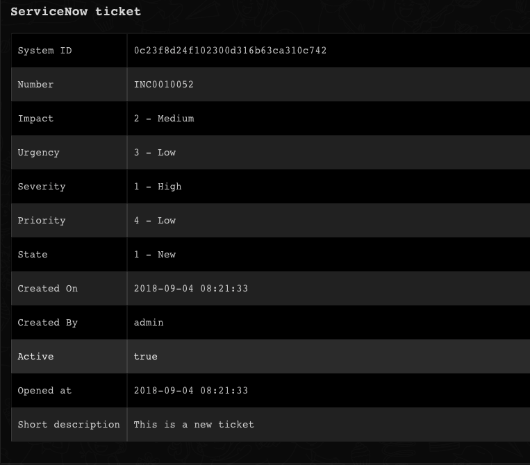</a>

<h3 id="h_2766128079841543393964767">2. Create a ticket</h3>

Creates a new ServiceNow ticket.

<h5>Base Command</h5>

<code>servicenow-create-ticket</code>

<h5>Input</h5>
<table style="width: 748px;" border="2" cellpadding="6">
<thead>
<tr>
<th style="width: 194px;"><strong>Argument Name</strong></th>
<th style="width: 443px;"><strong>Description</strong></th>
<th style="width: 71px;"><strong>Required</strong></th>
</tr>
</thead>
<tbody>
<tr>
<td style="width: 194px;">short_description</td>
<td style="width: 443px;">Short description of the ticket</td>
<td style="width: 71px;">Optional</td>
</tr>
<tr>
<td style="width: 194px;">ticket_type</td>
<td style="width: 443px;">Ticket type</td>
<td style="width: 71px;">Optional</td>
</tr>
<tr>
<td style="width: 194px;">urgency</td>
<td style="width: 443px;">Ticket urgency</td>
<td style="width: 71px;">Optional</td>
</tr>
<tr>
<td style="width: 194px;">severity</td>
<td style="width: 443px;">Ticket severity</td>
<td style="width: 71px;">Optional</td>
</tr>
<tr>
<td style="width: 194px;">impact</td>
<td style="width: 443px;">Ticket impact</td>
<td style="width: 71px;">Optional</td>
</tr>
<tr>
<td style="width: 194px;">active</td>
<td style="width: 443px;">Set ticket as Active</td>
<td style="width: 71px;">Optional</td>
</tr>
<tr>
<td style="width: 194px;">activity_due</td>
<td style="width: 443px;">Set ticket ActivityDue - format "2016-07-02 21:51:11"</td>
<td style="width: 71px;">Optional</td>
</tr>
<tr>
<td style="width: 194px;">additional_assignee_list</td>
<td style="width: 443px;">List of assigned users to the ticket</td>
<td style="width: 71px;">Optional</td>
</tr>
<tr>
<td style="width: 194px;">approval_history</td>
<td style="width: 443px;">Ticket history approval</td>
<td style="width: 71px;">Optional</td>
</tr>
<tr>
<td style="width: 194px;">approval_set</td>
<td style="width: 443px;">Set ticket ApprovalSet - format "2016-07-02 21:51:11"</td>
<td style="width: 71px;">Optional</td>
</tr>
<tr>
<td style="width: 194px;">assigned_to</td>
<td style="width: 443px;">To whom the ticket is assigned</td>
<td style="width: 71px;">Optional</td>
</tr>
<tr>
<td style="width: 194px;">business_duration</td>
<td style="width: 443px;">Format: YYYY-MM-DD HH:MM:SS</td>
<td style="width: 71px;">Optional</td>
</tr>
<tr>
<td style="width: 194px;">business_service</td>
<td style="width: 443px;">Business service</td>
<td style="width: 71px;">Optional</td>
</tr>
<tr>
<td style="width: 194px;">business_stc</td>
<td style="width: 443px;">Business source</td>
<td style="width: 71px;">Optional</td>
</tr>
<tr>
<td style="width: 194px;">calendar_duration</td>
<td style="width: 443px;">Format: YYYY-MM-DD HH:MM:SS</td>
<td style="width: 71px;">Optional</td>
</tr>
<tr>
<td style="width: 194px;">caller_id</td>
<td style="width: 443px;">UID Format</td>
<td style="width: 71px;">Optional</td>
</tr>
<tr>
<td style="width: 194px;">category</td>
<td style="width: 443px;">Category of ticket</td>
<td style="width: 71px;">Optional</td>
</tr>
<tr>
<td style="width: 194px;">caused_by</td>
<td style="width: 443px;">UID Format</td>
<td style="width: 71px;">Optional</td>
</tr>
<tr>
<td style="width: 194px;">close_code</td>
<td style="width: 443px;">Ticket's close code</td>
<td style="width: 71px;">Optional</td>
</tr>
<tr>
<td style="width: 194px;">close_notes</td>
<td style="width: 443px;">Close notes of the ticket</td>
<td style="width: 71px;">Optional</td>
</tr>
<tr>
<td style="width: 194px;">closed_at</td>
<td style="width: 443px;">Format: YYYY-MM-DD HH:MM:SS</td>
<td style="width: 71px;">Optional</td>
</tr>
<tr>
<td style="width: 194px;">closed_by</td>
<td style="width: 443px;">User who closed the ticket</td>
<td style="width: 71px;">Optional</td>
</tr>
<tr>
<td style="width: 194px;">cmdb_ci</td>
<td style="width: 443px;">UID Format</td>
<td style="width: 71px;">Optional</td>
</tr>
<tr>
<td style="width: 194px;">comments</td>
<td style="width: 443px;">Format type journal input</td>
<td style="width: 71px;">Optional</td>
</tr>
<tr>
<td style="width: 194px;">comments_and_work_notes</td>
<td style="width: 443px;">Format type journal input</td>
<td style="width: 71px;">Optional</td>
</tr>
<tr>
<td style="width: 194px;">company</td>
<td style="width: 443px;">UID Format</td>
<td style="width: 71px;">Optional</td>
</tr>
<tr>
<td style="width: 194px;">contact_type</td>
<td style="width: 443px;">Contact type</td>
<td style="width: 71px;">Optional</td>
</tr>
<tr>
<td style="width: 194px;">correlation_display</td>
<td style="width: 443px;">Correlation display</td>
<td style="width: 71px;">Optional</td>
</tr>
<tr>
<td style="width: 194px;">correlation_id</td>
<td style="width: 443px;">Correlation id</td>
<td style="width: 71px;">Optional</td>
</tr>
<tr>
<td style="width: 194px;">delivery_plan</td>
<td style="width: 443px;">UID Format</td>
<td style="width: 71px;">Optional</td>
</tr>
<tr>
<td style="width: 194px;">display</td>
<td style="width: 443px;">If you want to display comments, work_notes...</td>
<td style="width: 71px;">Optional</td>
</tr>
<tr>
<td style="width: 194px;">description</td>
<td style="width: 443px;">Ticket description</td>
<td style="width: 71px;">Optional</td>
</tr>
<tr>
<td style="width: 194px;">due_date</td>
<td style="width: 443px;">Format: YYYY-MM-DD HH:MM:SS</td>
<td style="width: 71px;">Optional</td>
</tr>
<tr>
<td style="width: 194px;">escalation</td>
<td style="width: 443px;">Escalation</td>
<td style="width: 71px;">Optional</td>
</tr>
<tr>
<td style="width: 194px;">expected_start</td>
<td style="width: 443px;">Format: YYYY-MM-DD HH:MM:SS</td>
<td style="width: 71px;">Optional</td>
</tr>
<tr>
<td style="width: 194px;">follow_up</td>
<td style="width: 443px;">Format: YYYY-MM-DD HH:MM:SS</td>
<td style="width: 71px;">Optional</td>
</tr>
<tr>
<td style="width: 194px;">group_list</td>
<td style="width: 443px;">UID format list</td>
<td style="width: 71px;">Optional</td>
</tr>
<tr>
<td style="width: 194px;">knowledge</td>
<td style="width: 443px;">Is the ticket solved in the knowledge base</td>
<td style="width: 71px;">Optional</td>
</tr>
<tr>
<td style="width: 194px;">location</td>
<td style="width: 443px;">Location of the ticket</td>
<td style="width: 71px;">Optional</td>
</tr>
<tr>
<td style="width: 194px;">made_sla</td>
<td style="width: 443px;">SLA of the ticket</td>
<td style="width: 71px;">Optional</td>
</tr>
<tr>
<td style="width: 194px;">notify</td>
<td style="width: 443px;">Notify about this ticket</td>
<td style="width: 71px;">Optional</td>
</tr>
<tr>
<td style="width: 194px;">order</td>
<td style="width: 443px;">Order number</td>
<td style="width: 71px;">Optional</td>
</tr>
<tr>
<td style="width: 194px;">parent</td>
<td style="width: 443px;">UID Format</td>
<td style="width: 71px;">Optional</td>
</tr>
<tr>
<td style="width: 194px;">parent_incident</td>
<td style="width: 443px;">UID Format</td>
<td style="width: 71px;">Optional</td>
</tr>
<tr>
<td style="width: 194px;">problem_id</td>
<td style="width: 443px;">UID Format</td>
<td style="width: 71px;">Optional</td>
</tr>
<tr>
<td style="width: 194px;">reassignment_count</td>
<td style="width: 443px;">How many users included in this ticket before</td>
<td style="width: 71px;">Optional</td>
</tr>
<tr>
<td style="width: 194px;">reopen_count</td>
<td style="width: 443px;">How many time the ticket has been reopened</td>
<td style="width: 71px;">Optional</td>
</tr>
<tr>
<td style="width: 194px;">resolved_at</td>
<td style="width: 443px;">Format: YYYY-MM-DD HH:MM:SS</td>
<td style="width: 71px;">Optional</td>
</tr>
<tr>
<td style="width: 194px;">resolved_by</td>
<td style="width: 443px;">UID Format</td>
<td style="width: 71px;">Optional</td>
</tr>
<tr>
<td style="width: 194px;">rfc</td>
<td style="width: 443px;">UID</td>
<td style="width: 71px;">Optional</td>
</tr>
<tr>
<td style="width: 194px;">sla_due</td>
<td style="width: 443px;">Format: YYYY-MM-DD HH:MM:SS</td>
<td style="width: 71px;">Optional</td>
</tr>
<tr>
<td style="width: 194px;">subcategory</td>
<td style="width: 443px;">Subcategory</td>
<td style="width: 71px;">Optional</td>
</tr>
<tr>
<td style="width: 194px;">sys_updated_by</td>
<td style="width: 443px;">Last updated by</td>
<td style="width: 71px;">Optional</td>
</tr>
<tr>
<td style="width: 194px;">sys_updated_on</td>
<td style="width: 443px;">Format: YYYY-MM-DD HH:MM:SS</td>
<td style="width: 71px;">Optional</td>
</tr>
<tr>
<td style="width: 194px;">user_input</td>
<td style="width: 443px;">Input from the end user</td>
<td style="width: 71px;">Optional</td>
</tr>
<tr>
<td style="width: 194px;">watch_list</td>
<td style="width: 443px;">A list of watched tickets</td>
<td style="width: 71px;">Optional</td>
</tr>
<tr>
<td style="width: 194px;">work_end</td>
<td style="width: 443px;">Format: YYYY-MM-DD HH:MM:SS</td>
<td style="width: 71px;">Optional</td>
</tr>
<tr>
<td style="width: 194px;">work_notes</td>
<td style="width: 443px;">Format journal list</td>
<td style="width: 71px;">Optional</td>
</tr>
<tr>
<td style="width: 194px;">work_notes_list</td>
<td style="width: 443px;">List with UIDs</td>
<td style="width: 71px;">Optional</td>
</tr>
<tr>
<td style="width: 194px;">work_start</td>
<td style="width: 443px;">Date when started to work on the ticket</td>
<td style="width: 71px;">Optional</td>
</tr>
<tr>
<td style="width: 194px;">assignment_group</td>
<td style="width: 443px;">Set AssignmentGroup - sys_id of group</td>
<td style="width: 71px;">Optional</td>
</tr>
<tr>
<td style="width: 194px;">incident_state</td>
<td style="width: 443px;">integer</td>
<td style="width: 71px;">Optional</td>
</tr>
<tr>
<td style="width: 194px;">number</td>
<td style="width: 443px;">Ticket number</td>
<td style="width: 71px;">Optional</td>
</tr>
<tr>
<td style="width: 194px;">priority</td>
<td style="width: 443px;">Priority of the ticket</td>
<td style="width: 71px;">Optional</td>
</tr>
<tr>
<td style="width: 194px;">template</td>
<td style="width: 443px;">Template name to use as a base to create new tickets.</td>
<td style="width: 71px;">Optional</td>
</tr>
<tr>
<td style="width: 194px;">custom_fields</td>
<td style="width: 443px;">Custom(user defined) fields in the format: fieldname1=value;fieldname2=value;...</td>
<td style="width: 71px;">Optional</td>
</tr>
<tr>
<td style="width: 194px;">change_type</td>
<td style="width: 443px;">Type of change request ticket</td>
<td style="width: 71px;">Optional</td>
</tr>
<tr>
<td style="width: 194px;">state</td>
<td style="width: 443px;">State of the ticket, e.g., "Closed" or "7" or "7 - Closed</td>
<td style="width: 71px;">Optional</td>
</tr>
<tr>
<td style="width: 194px;">opened_at</td>
<td style="width: 443px;">Time the ticket was opened (YYYY-MM-DD HH:MM:SS)</td>
<td style="width: 71px;">Optional</td>
</tr>
</tbody>
</table>

 

<h5>Context Output</h5>
<table style="width: 746px;" border="2" cellpadding="6">
<thead>
<tr>
<th style="width: 335px;"><strong>Path</strong></th>
<th style="width: 79px;"><strong>Type</strong></th>
<th style="width: 294px;"><strong>Description</strong></th>
</tr>
</thead>
<tbody>
<tr>
<td style="width: 335px;">ServiceNow.Ticket.ID</td>
<td style="width: 79px;">string</td>
<td style="width: 294px;">ServiceNow ticket ID</td>
</tr>
<tr>
<td style="width: 335px;">ServiceNow.Ticket.OpenedBy</td>
<td style="width: 79px;">string</td>
<td style="width: 294px;">ServiceNow ticket opener ID</td>
</tr>
<tr>
<td style="width: 335px;">ServiceNow.Ticket.CreatedOn</td>
<td style="width: 79px;">date</td>
<td style="width: 294px;">ServiceNow ticket creation date</td>
</tr>
<tr>
<td style="width: 335px;">ServiceNow.Ticket.Assignee</td>
<td style="width: 79px;">string</td>
<td style="width: 294px;">ServiceNow ticket assignee ID</td>
</tr>
<tr>
<td style="width: 335px;">ServiceNow.Ticket.State</td>
<td style="width: 79px;">string</td>
<td style="width: 294px;">ServiceNow ticket state</td>
</tr>
<tr>
<td style="width: 335px;">ServiceNow.Ticket.Summary</td>
<td style="width: 79px;">string</td>
<td style="width: 294px;">ServiceNow ticket short summary</td>
</tr>
<tr>
<td style="width: 335px;">ServiceNow.Ticket.Number</td>
<td style="width: 79px;">string</td>
<td style="width: 294px;">ServiceNow ticket number</td>
</tr>
<tr>
<td style="width: 335px;">ServiceNow.Ticket.Active</td>
<td style="width: 79px;">boolean</td>
<td style="width: 294px;">ServiceNow ticket active</td>
</tr>
<tr>
<td style="width: 335px;">ServiceNow.Ticket.AdditionalComments</td>
<td style="width: 79px;">string</td>
<td style="width: 294px;">ServiceNow ticket comments</td>
</tr>
<tr>
<td style="width: 335px;">ServiceNow.Ticket.Priority</td>
<td style="width: 79px;">string</td>
<td style="width: 294px;">ServiceNow ticket priority</td>
</tr>
<tr>
<td style="width: 335px;">ServiceNow.Ticket.OpenedAt</td>
<td style="width: 79px;">date</td>
<td style="width: 294px;">ServiceNow ticket opening time</td>
</tr>
<tr>
<td style="width: 335px;">ServiceNow.Ticket.ResolvedBy</td>
<td style="width: 79px;">string</td>
<td style="width: 294px;">ServiceNow ticket resolver ID</td>
</tr>
<tr>
<td style="width: 335px;">ServiceNow.Ticket.CloseCode</td>
<td style="width: 79px;">string</td>
<td style="width: 294px;">ServiceNow ticket close code</td>
</tr>
</tbody>
</table>

 

<h5>Command Example</h5>

<code>!servicenow-create short_description="This is a new ticket" ticket_type="incident" type="normal"</code>

<h5>Context Example</h5>
<pre>{
    "ServiceNow": {
        "Ticket": {
            "Active": "true",
            "CreatedOn": "2018-11-27 12:11:39",
            "ID": "bd5d42994f82230021ae045e9310c7bd",
            "Number": "INC0010449",
            "OpenedAt": "2018-11-27 12:11:39",
            "OpenedBy": "6816f79cc0a8016401c5a33be04be441",
            "Priority": "5 - Planning",
            "State": "1 - New",
            "Summary": "This is a new ticket"
        }
    }
}
</pre>
<h5>Human Readable Output</h5>

<a href="../../doc_files/49081133-7939c480-f24e-11e8-9e91-bad17c618e8d.png" target="_blank" rel="noopener noreferrer">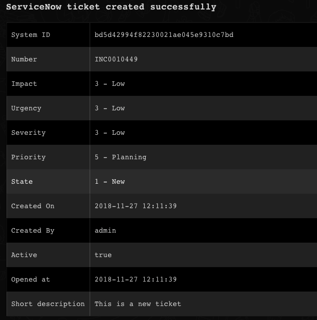</a>

<h3 id="h_57281505611101543393969762">3. Update a ticket</h3>

Updates a specified ServiceNow ticket.

<h5>Base Command</h5>

<code>servicenow-update-ticket</code>

<h5>Input</h5>
<table style="width: 746px;" border="2" cellpadding="6">
<thead>
<tr>
<th style="width: 190px;"><strong>Argument Name</strong></th>
<th style="width: 447px;"><strong>Description</strong></th>
<th style="width: 71px;"><strong>Required</strong></th>
</tr>
</thead>
<tbody>
<tr>
<td style="width: 190px;">short_description</td>
<td style="width: 447px;">Short description of the ticket</td>
<td style="width: 71px;">Optional</td>
</tr>
<tr>
<td style="width: 190px;">ticket_type</td>
<td style="width: 447px;">Ticket type</td>
<td style="width: 71px;">Optional</td>
</tr>
<tr>
<td style="width: 190px;">urgency</td>
<td style="width: 447px;">Ticket urgency</td>
<td style="width: 71px;">Optional</td>
</tr>
<tr>
<td style="width: 190px;">severity</td>
<td style="width: 447px;">Ticket severity</td>
<td style="width: 71px;">Optional</td>
</tr>
<tr>
<td style="width: 190px;">impact</td>
<td style="width: 447px;">Ticket impact</td>
<td style="width: 71px;">Optional</td>
</tr>
<tr>
<td style="width: 190px;">active</td>
<td style="width: 447px;">Does the ticket active (true/false)</td>
<td style="width: 71px;">Optional</td>
</tr>
<tr>
<td style="width: 190px;">activity_due</td>
<td style="width: 447px;">Format: YYYY-MM-DD HH:MM:SS</td>
<td style="width: 71px;">Optional</td>
</tr>
<tr>
<td style="width: 190px;">additional_assignee_list</td>
<td style="width: 447px;">List of assigned users to the ticket</td>
<td style="width: 71px;">Optional</td>
</tr>
<tr>
<td style="width: 190px;">approval_history</td>
<td style="width: 447px;">Ticket history approval</td>
<td style="width: 71px;">Optional</td>
</tr>
<tr>
<td style="width: 190px;">approval_set</td>
<td style="width: 447px;">Set ticket ApprovalSet - format "2016-07-02 21:51:11"</td>
<td style="width: 71px;">Optional</td>
</tr>
<tr>
<td style="width: 190px;">assigned_to</td>
<td style="width: 447px;">To whom the ticket is assigned</td>
<td style="width: 71px;">Optional</td>
</tr>
<tr>
<td style="width: 190px;">business_duration</td>
<td style="width: 447px;">Format: YYYY-MM-DD HH:MM:SS</td>
<td style="width: 71px;">Optional</td>
</tr>
<tr>
<td style="width: 190px;">business_service</td>
<td style="width: 447px;">Business service</td>
<td style="width: 71px;">Optional</td>
</tr>
<tr>
<td style="width: 190px;">business_stc</td>
<td style="width: 447px;">Business source</td>
<td style="width: 71px;">Optional</td>
</tr>
<tr>
<td style="width: 190px;">calendar_duration</td>
<td style="width: 447px;">Format: YYYY-MM-DD HH:MM:SS</td>
<td style="width: 71px;">Optional</td>
</tr>
<tr>
<td style="width: 190px;">caller_id</td>
<td style="width: 447px;">UID Format</td>
<td style="width: 71px;">Optional</td>
</tr>
<tr>
<td style="width: 190px;">category</td>
<td style="width: 447px;">Category name</td>
<td style="width: 71px;">Optional</td>
</tr>
<tr>
<td style="width: 190px;">caused_by</td>
<td style="width: 447px;">UID Format</td>
<td style="width: 71px;">Optional</td>
</tr>
<tr>
<td style="width: 190px;">close_code</td>
<td style="width: 447px;">Ticket's close code</td>
<td style="width: 71px;">Optional</td>
</tr>
<tr>
<td style="width: 190px;">close_notes</td>
<td style="width: 447px;">Close notes of the ticket</td>
<td style="width: 71px;">Optional</td>
</tr>
<tr>
<td style="width: 190px;">closed_at</td>
<td style="width: 447px;">Format: YYYY-MM-DD HH:MM:SS</td>
<td style="width: 71px;">Optional</td>
</tr>
<tr>
<td style="width: 190px;">closed_by</td>
<td style="width: 447px;">User who closed the ticket</td>
<td style="width: 71px;">Optional</td>
</tr>
<tr>
<td style="width: 190px;">cmdb_ci</td>
<td style="width: 447px;">UID Format</td>
<td style="width: 71px;">Optional</td>
</tr>
<tr>
<td style="width: 190px;">comments</td>
<td style="width: 447px;">Format type journal input</td>
<td style="width: 71px;">Optional</td>
</tr>
<tr>
<td style="width: 190px;">comments_and_work_notes</td>
<td style="width: 447px;">Format type journal input</td>
<td style="width: 71px;">Optional</td>
</tr>
<tr>
<td style="width: 190px;">company</td>
<td style="width: 447px;">UID Format</td>
<td style="width: 71px;">Optional</td>
</tr>
<tr>
<td style="width: 190px;">contact_type</td>
<td style="width: 447px;">Contact type</td>
<td style="width: 71px;">Optional</td>
</tr>
<tr>
<td style="width: 190px;">correlation_display</td>
<td style="width: 447px;">Correlation display</td>
<td style="width: 71px;">Optional</td>
</tr>
<tr>
<td style="width: 190px;">correlation_id</td>
<td style="width: 447px;">Correlation id</td>
<td style="width: 71px;">Optional</td>
</tr>
<tr>
<td style="width: 190px;">delivery_plan</td>
<td style="width: 447px;">UID Format</td>
<td style="width: 71px;">Optional</td>
</tr>
<tr>
<td style="width: 190px;">display</td>
<td style="width: 447px;">If you want to display comments, work_notes...</td>
<td style="width: 71px;">Optional</td>
</tr>
<tr>
<td style="width: 190px;">description</td>
<td style="width: 447px;">Ticket description</td>
<td style="width: 71px;">Optional</td>
</tr>
<tr>
<td style="width: 190px;">due_date</td>
<td style="width: 447px;">Format: YYYY-MM-DD HH:MM:SS</td>
<td style="width: 71px;">Optional</td>
</tr>
<tr>
<td style="width: 190px;">escalation</td>
<td style="width: 447px;">Escalation</td>
<td style="width: 71px;">Optional</td>
</tr>
<tr>
<td style="width: 190px;">expected_start</td>
<td style="width: 447px;">Format: YYYY-MM-DD HH:MM:SS</td>
<td style="width: 71px;">Optional</td>
</tr>
<tr>
<td style="width: 190px;">follow_up</td>
<td style="width: 447px;">Format: YYYY-MM-DD HH:MM:SS</td>
<td style="width: 71px;">Optional</td>
</tr>
<tr>
<td style="width: 190px;">group_list</td>
<td style="width: 447px;">UID format list</td>
<td style="width: 71px;">Optional</td>
</tr>
<tr>
<td style="width: 190px;">knowledge</td>
<td style="width: 447px;">Is the ticket solved in the knowledge base</td>
<td style="width: 71px;">Optional</td>
</tr>
<tr>
<td style="width: 190px;">location</td>
<td style="width: 447px;">Location of the ticket</td>
<td style="width: 71px;">Optional</td>
</tr>
<tr>
<td style="width: 190px;">made_sla</td>
<td style="width: 447px;">SLA of the ticket</td>
<td style="width: 71px;">Optional</td>
</tr>
<tr>
<td style="width: 190px;">notify</td>
<td style="width: 447px;">Notify about this ticket</td>
<td style="width: 71px;">Optional</td>
</tr>
<tr>
<td style="width: 190px;">order</td>
<td style="width: 447px;">Order number</td>
<td style="width: 71px;">Optional</td>
</tr>
<tr>
<td style="width: 190px;">parent</td>
<td style="width: 447px;">UID Format</td>
<td style="width: 71px;">Optional</td>
</tr>
<tr>
<td style="width: 190px;">parent_incident</td>
<td style="width: 447px;">UID Format</td>
<td style="width: 71px;">Optional</td>
</tr>
<tr>
<td style="width: 190px;">problem_id</td>
<td style="width: 447px;">UID Format</td>
<td style="width: 71px;">Optional</td>
</tr>
<tr>
<td style="width: 190px;">reassignment_count</td>
<td style="width: 447px;">How many users included in this ticket before</td>
<td style="width: 71px;">Optional</td>
</tr>
<tr>
<td style="width: 190px;">reopen_count</td>
<td style="width: 447px;">How many time the ticket has been reopened</td>
<td style="width: 71px;">Optional</td>
</tr>
<tr>
<td style="width: 190px;">resolved_at</td>
<td style="width: 447px;">Format: YYYY-MM-DD HH:MM:SS</td>
<td style="width: 71px;">Optional</td>
</tr>
<tr>
<td style="width: 190px;">resolved_by</td>
<td style="width: 447px;">UID Format</td>
<td style="width: 71px;">Optional</td>
</tr>
<tr>
<td style="width: 190px;">rfc</td>
<td style="width: 447px;">UID</td>
<td style="width: 71px;">Optional</td>
</tr>
<tr>
<td style="width: 190px;">sla_due</td>
<td style="width: 447px;">Format: YYYY-MM-DD HH:MM:SS</td>
<td style="width: 71px;">Optional</td>
</tr>
<tr>
<td style="width: 190px;">subcategory</td>
<td style="width: 447px;">Subcategory</td>
<td style="width: 71px;">Optional</td>
</tr>
<tr>
<td style="width: 190px;">sys_updated_by</td>
<td style="width: 447px;">Last updated by</td>
<td style="width: 71px;">Optional</td>
</tr>
<tr>
<td style="width: 190px;">sys_updated_on</td>
<td style="width: 447px;">Format: YYYY-MM-DD HH:MM:SS</td>
<td style="width: 71px;">Optional</td>
</tr>
<tr>
<td style="width: 190px;">user_input</td>
<td style="width: 447px;">Input from the end user</td>
<td style="width: 71px;">Optional</td>
</tr>
<tr>
<td style="width: 190px;">watch_list</td>
<td style="width: 447px;">A list of watched tickets</td>
<td style="width: 71px;">Optional</td>
</tr>
<tr>
<td style="width: 190px;">work_end</td>
<td style="width: 447px;">Format: YYYY-MM-DD HH:MM:SS</td>
<td style="width: 71px;">Optional</td>
</tr>
<tr>
<td style="width: 190px;">work_notes</td>
<td style="width: 447px;">Format journal list</td>
<td style="width: 71px;">Optional</td>
</tr>
<tr>
<td style="width: 190px;">work_notes_list</td>
<td style="width: 447px;">List with UIDs</td>
<td style="width: 71px;">Optional</td>
</tr>
<tr>
<td style="width: 190px;">work_start</td>
<td style="width: 447px;">Date when started to work on the ticket</td>
<td style="width: 71px;">Optional</td>
</tr>
<tr>
<td style="width: 190px;">assignment_group</td>
<td style="width: 447px;">UID</td>
<td style="width: 71px;">Optional</td>
</tr>
<tr>
<td style="width: 190px;">incident_state</td>
<td style="width: 447px;">integer</td>
<td style="width: 71px;">Optional</td>
</tr>
<tr>
<td style="width: 190px;">number</td>
<td style="width: 447px;">Ticket number</td>
<td style="width: 71px;">Optional</td>
</tr>
<tr>
<td style="width: 190px;">priority</td>
<td style="width: 447px;">Priority of the ticket</td>
<td style="width: 71px;">Optional</td>
</tr>
<tr>
<td style="width: 190px;">id</td>
<td style="width: 447px;">System ID of the ticket to update</td>
<td style="width: 71px;">Required</td>
</tr>
<tr>
<td style="width: 190px;">custom_fields</td>
<td style="width: 447px;">Custom(user defined) fields in the format: fieldname1=value;fieldname2=value;...</td>
<td style="width: 71px;">Optional</td>
</tr>
<tr>
<td style="width: 190px;">change_type</td>
<td style="width: 447px;">Type of Change Request ticket</td>
<td style="width: 71px;">Optional</td>
</tr>
<tr>
<td style="width: 190px;">state</td>
<td style="width: 447px;">State of the ticket, e.g., "Closed" or "7" or "7 - Closed</td>
<td style="width: 71px;">Optional</td>
</tr>
</tbody>
</table>

 

<h5>Context Output</h5>
<table style="width: 748px;" border="2" cellpadding="6">
<thead>
<tr>
<th style="width: 337px;"><strong>Path</strong></th>
<th style="width: 77px;"><strong>Type</strong></th>
<th style="width: 294px;"><strong>Description</strong></th>
</tr>
</thead>
<tbody>
<tr>
<td style="width: 337px;">ServiceNow.Ticket.ID</td>
<td style="width: 77px;">string</td>
<td style="width: 294px;">ServiceNow ticket ID</td>
</tr>
<tr>
<td style="width: 337px;">ServiceNow.Ticket.OpenedBy</td>
<td style="width: 77px;">string</td>
<td style="width: 294px;">ServiceNow ticket opener ID</td>
</tr>
<tr>
<td style="width: 337px;">ServiceNow.Ticket.CreatedOn</td>
<td style="width: 77px;">date</td>
<td style="width: 294px;">ServiceNow ticket creation date</td>
</tr>
<tr>
<td style="width: 337px;">ServiceNow.Ticket.Assignee</td>
<td style="width: 77px;">string</td>
<td style="width: 294px;">ServiceNow ticket assignee ID</td>
</tr>
<tr>
<td style="width: 337px;">ServiceNow.Ticket.State</td>
<td style="width: 77px;">string</td>
<td style="width: 294px;">ServiceNow ticket state</td>
</tr>
<tr>
<td style="width: 337px;">ServiceNow.Ticket.Summary</td>
<td style="width: 77px;">string</td>
<td style="width: 294px;">ServiceNow ticket short summary</td>
</tr>
<tr>
<td style="width: 337px;">ServiceNow.Ticket.Number</td>
<td style="width: 77px;">string</td>
<td style="width: 294px;">ServiceNow ticket number</td>
</tr>
<tr>
<td style="width: 337px;">ServiceNow.Ticket.Active</td>
<td style="width: 77px;">boolean</td>
<td style="width: 294px;">ServiceNow ticket active</td>
</tr>
<tr>
<td style="width: 337px;">ServiceNow.Ticket.AdditionalComments</td>
<td style="width: 77px;">string</td>
<td style="width: 294px;">ServiceNow ticket comments</td>
</tr>
<tr>
<td style="width: 337px;">ServiceNow.Ticket.Priority</td>
<td style="width: 77px;">string</td>
<td style="width: 294px;">ServiceNow ticket priority</td>
</tr>
<tr>
<td style="width: 337px;">ServiceNow.Ticket.OpenedAt</td>
<td style="width: 77px;">date</td>
<td style="width: 294px;">ServiceNow ticket opening time</td>
</tr>
<tr>
<td style="width: 337px;">ServiceNow.Ticket.ResolvedBy</td>
<td style="width: 77px;">string</td>
<td style="width: 294px;">ServiceNow ticket resolver ID</td>
</tr>
<tr>
<td style="width: 337px;">ServiceNow.Ticket.CloseCode</td>
<td style="width: 77px;">string</td>
<td style="width: 294px;">ServiceNow ticket close code</td>
</tr>
</tbody>
</table>

 

<h5>Command Example</h5>

<code>!servicenow-update ticket_type="incident" impact="2" id="c34852514fc2230021ae045e9310c7ab"</code>

<h5>Context Example</h5>
<pre>{
    "ServiceNow": {
        "Ticket": {
            "Active": "true",
            "CreatedOn": "2018-11-27 12:59:32",
            "ID": "c34852514fc2230021ae045e9310c7ab",
            "Number": "INC0010452",
            "OpenedAt": "2018-11-27 12:59:32",
            "OpenedBy": "6816f79cc0a8016401c5a33be04be441",
            "Priority": "4 - Low",
            "State": "1 - New"
        }
    }
}
</pre>
<h5>Human Readable Output</h5>

<a href="../../doc_files/49081247-e4839680-f24e-11e8-848f-fda6bc14fe9e.png" target="_blank" rel="noopener noreferrer">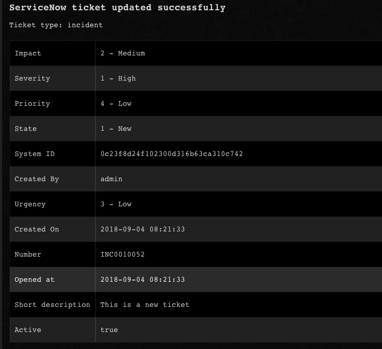</a>

<h3 id="h_68978447212351543393976748">4. Delete a ticket</h3>

Deletes a specified ServiceNow ticket.

<h5>Base Command</h5>

<code>servicenow-delete-ticket</code>

<h5>Input</h5>
<table style="width: 748px;" border="2" cellpadding="6">
<thead>
<tr>
<th style="width: 276px;"><strong>Argument Name</strong></th>
<th style="width: 269px;"><strong>Description</strong></th>
<th style="width: 163px;"><strong>Required</strong></th>
</tr>
</thead>
<tbody>
<tr>
<td style="width: 276px;">id</td>
<td style="width: 269px;">Ticket system ID</td>
<td style="width: 163px;">Required</td>
</tr>
<tr>
<td style="width: 276px;">ticket_type</td>
<td style="width: 269px;">Ticket type</td>
<td style="width: 163px;">Optional</td>
</tr>
</tbody>
</table>

 

<h5>Context Output</h5>

There is no context output for this command.

<h5>Command Example</h5>

<code>!servicenow-delete-ticket id=0c23f8d24f102300d316b63ca310c742</code>

<h5>Human Readable Output</h5>

<h3 id="h_88472210313581543393982361">5. Add a link to a ticket</h3>

Adds a link to a specified ServiceNow ticket.

<h5>Base Command</h5>

<code>servicenow-add-link</code>

<h5>Input</h5>
<table style="width: 748px;" border="2" cellpadding="6">
<thead>
<tr>
<th style="width: 130px;"><strong>Argument Name</strong></th>
<th style="width: 507px;"><strong>Description</strong></th>
<th style="width: 71px;"><strong>Required</strong></th>
</tr>
</thead>
<tbody>
<tr>
<td style="width: 130px;">id</td>
<td style="width: 507px;">Ticket system ID</td>
<td style="width: 71px;">Required</td>
</tr>
<tr>
<td style="width: 130px;">ticket_type</td>
<td style="width: 507px;">Ticket type</td>
<td style="width: 71px;">Optional</td>
</tr>
<tr>
<td style="width: 130px;">link</td>
<td style="width: 507px;">The actual link to publish in ServiceNow ticket, valid url format, like <a href="http://www.demisto.com/" rel="nofollow">http://www.demisto.com</a>
</td>
<td style="width: 71px;">Required</td>
</tr>
<tr>
<td style="width: 130px;">post-as-comment</td>
<td style="width: 507px;">Publish the link as comment on the ticket, if false will publish the link as WorkNote, format boolean</td>
<td style="width: 71px;">Optional</td>
</tr>
<tr>
<td style="width: 130px;">text</td>
<td style="width: 507px;">The text to represent the link</td>
<td style="width: 71px;">Optional</td>
</tr>
</tbody>
</table>

 

<h5>Context Output</h5>

There is no context output for this command.

<h5>Command Example</h5>

<code>!servicenow-add-link id="bd5d42994f82230021ae045e9310c7bd" ticket_type="incident" link="www.demisto.com" text="this is a link"</code>

<h5>Human Readable Output</h5>

<a href="../../doc_files/49081488-b6eb1d00-f24f-11e8-8c33-4da0b732937a.png" target="_blank" rel="noopener noreferrer">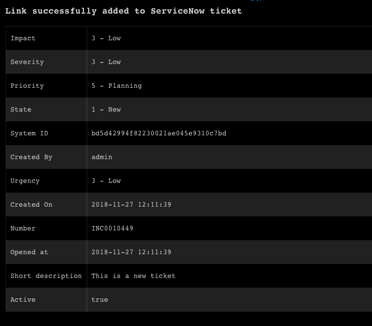</a>

<h3 id="h_53831027625241543393995300">6. Add a comment to a ticket</h3>

Adds a comment to a specified ticket.

<h5>Base Command</h5>

<code>servicenow-add-comment</code>

<h5>Input</h5>
<table style="width: 746px;" border="2" cellpadding="6">
<thead>
<tr>
<th style="width: 138px;"><strong>Argument Name</strong></th>
<th style="width: 499px;"><strong>Description</strong></th>
<th style="width: 71px;"><strong>Required</strong></th>
</tr>
</thead>
<tbody>
<tr>
<td style="width: 138px;">id</td>
<td style="width: 499px;">Ticket system ID</td>
<td style="width: 71px;">Required</td>
</tr>
<tr>
<td style="width: 138px;">ticket_type</td>
<td style="width: 499px;">Ticket type</td>
<td style="width: 71px;">Optional</td>
</tr>
<tr>
<td style="width: 138px;">comment</td>
<td style="width: 499px;">Comment to add</td>
<td style="width: 71px;">Required</td>
</tr>
<tr>
<td style="width: 138px;">post-as-comment</td>
<td style="width: 499px;">Publish the link as a comment on the ticket, if false will publish the link as WorkNote, format boolean</td>
<td style="width: 71px;">Optional</td>
</tr>
</tbody>
</table>

 

<h5>Context Output</h5>

There is no context output for this command.

<h5>Command Example</h5>

<code>!servicenow-add-comment id="0c23f8d24f102300d316b63ca310c742" ticket_type="incident" comment="This is a comment"</code>

<h5>Human Readable Output</h5>

<a href="../../doc_files/49081549-e13cda80-f24f-11e8-9b64-19e3f49483e8.png" target="_blank" rel="noopener noreferrer">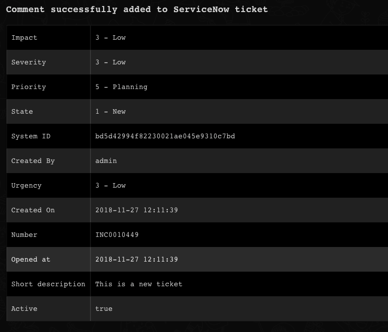</a>

<h3 id="h_982871326451543394001189">7. Get ticket information from a query</h3>

Retrieves ticket information via a query.

<h5>Base Command</h5>

<code>servicenow-query-tickets</code>

<h5>Input</h5>
<table style="width: 746px;" border="2" cellpadding="6">
<thead>
<tr>
<th style="width: 135px;"><strong>Argument Name</strong></th>
<th style="width: 502px;"><strong>Description</strong></th>
<th style="width: 71px;"><strong>Required</strong></th>
</tr>
</thead>
<tbody>
<tr>
<td style="width: 135px;">limit</td>
<td style="width: 502px;">Limit for how many tickets to retrieve</td>
<td style="width: 71px;">Optional</td>
</tr>
<tr>
<td style="width: 135px;">ticket_type</td>
<td style="width: 502px;">Ticket type</td>
<td style="width: 71px;">Optional</td>
</tr>
<tr>
<td style="width: 135px;">query</td>
<td style="width: 502px;">The query to run. To learn about querying in ServiceNow, see <a href="https://docs.servicenow.com/bundle/istanbul-servicenow-platform/page/use/common-ui-elements/reference/r_OpAvailableFiltersQueries.html" rel="nofollow">the ServiceNow documentation</a>.</td>
<td style="width: 71px;">Optional</td>
</tr>
<tr>
<td style="width: 135px;">offset</td>
<td style="width: 502px;">Starting record index to begin retrieving records from</td>
<td style="width: 71px;">Optional</td>
</tr>
</tbody>
</table>

 

<h5>Context Output</h5>
<table style="width: 748px;" border="2" cellpadding="6">
<thead>
<tr>
<th style="width: 187px;"><strong>Path</strong></th>
<th style="width: 70px;"><strong>Type</strong></th>
<th style="width: 451px;"><strong>Description</strong></th>
</tr>
</thead>
<tbody>
<tr>
<td style="width: 187px;">Ticket.ID</td>
<td style="width: 70px;">string</td>
<td style="width: 451px;">The unique ticket identifier</td>
</tr>
<tr>
<td style="width: 187px;">Ticket.Creator</td>
<td style="width: 70px;">string</td>
<td style="width: 451px;">A string field that indicates the user who created the ticket</td>
</tr>
<tr>
<td style="width: 187px;">Ticket.CreatedOn</td>
<td style="width: 70px;">date</td>
<td style="width: 451px;">The date and time when the ticket was created</td>
</tr>
<tr>
<td style="width: 187px;">Ticket.Assignee</td>
<td style="width: 70px;">string</td>
<td style="width: 451px;">Specifies the user assigned to complete the ticket. By default, this field uses a reference qualifier to only display users with the itil role.</td>
</tr>
<tr>
<td style="width: 187px;">Ticket.State</td>
<td style="width: 70px;">string</td>
<td style="width: 451px;">Status of the ticket</td>
</tr>
<tr>
<td style="width: 187px;">Ticket.Summary</td>
<td style="width: 70px;">string</td>
<td style="width: 451px;">A human-readable title for the record</td>
</tr>
<tr>
<td style="width: 187px;">Ticket.Number</td>
<td style="width: 70px;">string</td>
<td style="width: 451px;">The display value of the ticket</td>
</tr>
<tr>
<td style="width: 187px;">Ticket.Active</td>
<td style="width: 70px;">boolean</td>
<td style="width: 451px;">Specifies whether work is still being done on a task or whether the work for the task is complete</td>
</tr>
<tr>
<td style="width: 187px;">Ticket.AdditionalComments</td>
<td style="width: 70px;">unknown</td>
<td style="width: 451px;">Comments about the task record</td>
</tr>
<tr>
<td style="width: 187px;">Ticket.Priority</td>
<td style="width: 70px;">string</td>
<td style="width: 451px;">Specifies how high a priority the ticket should be for the assignee</td>
</tr>
<tr>
<td style="width: 187px;">Ticket.OpenedAt</td>
<td style="width: 70px;">date</td>
<td style="width: 451px;">The date and time when the ticket was opened for the first time</td>
</tr>
<tr>
<td style="width: 187px;">Ticket.Escalation</td>
<td style="width: 70px;">string</td>
<td style="width: 451px;">Indicates how long the ticket has been open</td>
</tr>
</tbody>
</table>

 

<h5>Command Example</h5>

<code>!servicenow-query-tickets limit="10" query="impact&lt;2^short_descriptionISNOTEMPTY" ticket_type="incident"</code>

<h5>Context Example</h5>
<pre>{
    "ServiceNow": {
        "Ticket": [
            {
                "Active": "false",
                "Assignee": "46b87022a9fe198101a78787e40d7547",
                "CloseCode": "Closed/Resolved by Caller",
                "CreatedOn": "2016-09-21 18:24:13",
                "ID": "9c573169c611228700193229fff72400",
                "Number": "INC0000001",
                "OpenedAt": "2018-02-20 23:09:51",
                "OpenedBy": "681ccaf9c0a8016400b98a06818d57c7",
                "Priority": "1 - Critical",
                "ResolvedBy": "9ee1b13dc6112271007f9d0efdb69cd0",
                "State": "7 - Closed",
                "Summary": "Can't read email"
            },
            {
                "Active": "true",
                "Assignee": "46ca0887a9fe19810191e08e51927ebf",
                "CreatedOn": "2016-09-10 22:30:06",
                "ID": "9d385017c611228701d22104cc95c371",
                "Number": "INC0000002",
                "OpenedAt": "2018-02-14 23:07:12",
                "OpenedBy": "681ccaf9c0a8016400b98a06818d57c7",
                "Priority": "1 - Critical",
                "State": "3 - On Hold",
                "Summary": "Network file shares access issue"
            },
            {
                "Active": "true",
                "Assignee": "46d44a23a9fe19810012d100cca80666",
                "CreatedOn": "2016-09-25 14:41:46",
                "ID": "e8caedcbc0a80164017df472f39eaed1",
                "Number": "INC0000003",
                "OpenedAt": "2018-02-21 23:07:30",
                "OpenedBy": "681b365ec0a80164000fb0b05854a0cd",
                "Priority": "1 - Critical",
                "State": "2 - In Progress",
                "Summary": "Wireless access is down in my area"
            },
            {
                "Active": "false",
                "Assignee": "46c6f9efa9fe198101ddf5eed9adf6e7",
                "CloseCode": "Solved (Work Around)",
                "CreatedOn": "2016-09-21 22:34:12",
                "ID": "9d3c1197c611228701cd1d94bc32d76d",
                "Number": "INC0000004",
                "OpenedAt": "2018-02-27 22:49:22",
                "OpenedBy": "681b365ec0a80164000fb0b05854a0cd",
                "Priority": "1 - Critical",
                "ResolvedBy": "9ee1b13dc6112271007f9d0efdb69cd0",
                "State": "7 - Closed",
                "Summary": "Forgot email password"
            },
            {
                "Active": "false",
                "Assignee": "46c6f9efa9fe198101ddf5eed9adf6e7",
                "CloseCode": "Closed/Resolved by Caller",
                "CreatedOn": "2016-09-25 15:14:01",
                "ID": "e8e875b0c0a80164009dc852b4d677d5",
                "Number": "INC0000005",
                "OpenedAt": "2018-02-16 23:06:52",
                "OpenedBy": "6816f79cc0a8016401c5a33be04be441",
                "Priority": "1 - Critical",
                "ResolvedBy": "6816f79cc0a8016401c5a33be04be441",
                "State": "7 - Closed",
                "Summary": "CPU load high for over 10 minutes"
            },
            {
                "Active": "false",
                "Assignee": "46ca0887a9fe19810191e08e51927ebf",
                "CloseCode": "Closed/Resolved by Caller",
                "CreatedOn": "2016-09-18 20:42:01",
                "ID": "8d6246c7c0a80164012fb063cecd4ace",
                "Number": "INC0000006",
                "OpenedAt": "2018-02-20 23:08:05",
                "OpenedBy": "5136503cc611227c0183e96598c4f706",
                "Priority": "1 - Critical",
                "ResolvedBy": "9ee1b13dc6112271007f9d0efdb69cd0",
                "State": "7 - Closed",
                "Summary": "Hangs when trying to print VISIO document"
            },
            {
                "Active": "true",
                "Assignee": "5137153cc611227c000bbd1bd8cd2007",
                "CreatedOn": "2014-03-10 20:43:10",
                "ID": "8d6353eac0a8016400d8a125ca14fc1f",
                "Number": "INC0000007",
                "OpenedAt": "2015-08-12 23:08:24",
                "OpenedBy": "681ccaf9c0a8016400b98a06818d57c7",
                "Priority": "1 - Critical",
                "State": "3 - On Hold",
                "Summary": "Need access to sales DB for the West"
            },
            {
                "Active": "false",
                "Assignee": "681b365ec0a80164000fb0b05854a0cd",
                "CloseCode": "Closed/Resolved by Caller",
                "CreatedOn": "2016-09-18 20:43:58",
                "ID": "8d641046c0a80164000bc7c0d3ed46a0",
                "Number": "INC0000008",
                "OpenedAt": "2018-02-28 23:08:39",
                "OpenedBy": "681ccaf9c0a8016400b98a06818d57c7",
                "Priority": "1 - Critical",
                "ResolvedBy": "9ee1b13dc6112271007f9d0efdb69cd0",
                "State": "7 - Closed",
                "Summary": "Printer in my office is out of toner"
            },
            {
                "Active": "false",
                "Assignee": "5137153cc611227c000bbd1bd8cd2007",
                "CloseCode": "Closed/Resolved by Caller",
                "CreatedOn": "2018-03-05 22:51:33",
                "ID": "46b66a40a9fe198101f243dfbc79033d",
                "Number": "INC0000009",
                "OpenedAt": "2018-02-27 22:50:23",
                "OpenedBy": "9ee1b13dc6112271007f9d0efdb69cd0",
                "Priority": "1 - Critical",
                "ResolvedBy": "9ee1b13dc6112271007f9d0efdb69cd0",
                "State": "7 - Closed",
                "Summary": "Reset my password"
            },
            {
                "Active": "false",
                "Assignee": "5137153cc611227c000bbd1bd8cd2007",
                "CloseCode": "Solved (Work Around)",
                "CreatedOn": "2018-03-05 23:18:07",
                "ID": "46cebb88a9fe198101aee93734f9768b",
                "Number": "INC0000013",
                "OpenedAt": "2018-03-04 23:15:58",
                "OpenedBy": "9ee1b13dc6112271007f9d0efdb69cd0",
                "Priority": "1 - Critical",
                "ResolvedBy": "9ee1b13dc6112271007f9d0efdb69cd0",
                "State": "7 - Closed",
                "Summary": "EMAIL is slow when an attachment is involved"
            }
        ]
    }
}
</pre>
<h5>Human Readable Output</h5>

<a href="../../doc_files/49081849-bf902300-f250-11e8-9786-f55cd9faa98a.png" target="_blank" rel="noopener noreferrer">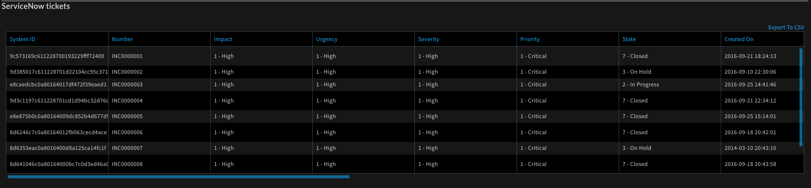</a>

<h3 id="h_59791168127661543394007101">8. Upload a file to a ticket</h3>

Uploads a file to a specified ServiceNow ticket.

<h5>Base Command</h5>

<code>servicenow-upload-file</code>

<h5>Input</h5>
<table style="width: 748px;" border="2" cellpadding="6">
<thead>
<tr>
<th style="width: 140px;"><strong>Argument Name</strong></th>
<th style="width: 492px;"><strong>Description</strong></th>
<th style="width: 76px;"><strong>Required</strong></th>
</tr>
</thead>
<tbody>
<tr>
<td style="width: 140px;">id</td>
<td style="width: 492px;">Ticket system ID</td>
<td style="width: 76px;">Required</td>
</tr>
<tr>
<td style="width: 140px;">ticket_type</td>
<td style="width: 492px;">Ticket type</td>
<td style="width: 76px;">Optional</td>
</tr>
<tr>
<td style="width: 140px;">file_id</td>
<td style="width: 492px;">War Room entry ID that includes the file</td>
<td style="width: 76px;">Required</td>
</tr>
<tr>
<td style="width: 140px;">file_name</td>
<td style="width: 492px;">File name of uploaded file to override the existing file name in entry</td>
<td style="width: 76px;">Optional</td>
</tr>
</tbody>
</table>

 

<h5>Context Output</h5>
<table style="width: 748px;" border="2" cellpadding="6">
<thead>
<tr>
<th style="width: 278px;"><strong>Path</strong></th>
<th style="width: 90px;"><strong>Type</strong></th>
<th style="width: 340px;"><strong>Description</strong></th>
</tr>
</thead>
<tbody>
<tr>
<td style="width: 278px;">Ticket.File.Filename</td>
<td style="width: 90px;">string</td>
<td style="width: 340px;">Name of the file</td>
</tr>
<tr>
<td style="width: 278px;">Ticket.File.Link</td>
<td style="width: 90px;">string</td>
<td style="width: 340px;">Download link for the file</td>
</tr>
<tr>
<td style="width: 278px;">Ticket.File.SystemID</td>
<td style="width: 90px;">string</td>
<td style="width: 340px;">System ID of the file</td>
</tr>
</tbody>
</table>

 

<h5>Command Example</h5>

<code>!servicenow-upload-file file_id=8781@cc00e449-9e7b-4609-8a68-1c8c01114562 id=bd5d42994f82230021ae045e9310c7bd</code>

<h5>Context Example</h5>
<pre>{
    "File": {
        "EntryID": "8786@cc00e449-9e7b-4609-8a68-1c8c01114562",
        "Extension": "txt",
        "Info": "text/plain; charset=utf-8",
        "MD5": "ea499981fdaadbd1a26250b0d925bf43",
        "Name": "file.txt",
        "SHA1": "7ca8be259038fbc1c10ab953363114f3e222f842",
        "SHA256": "02790f5a87eaa10abf8023268ea576d7a72acaab77e0a8371e44491b357728bc",
        "SSDeep": "384:fBr9CRIuXUA+m0x/nL8LuyahOMKFE3qw3db27XUS354AI3NUrXG:5r9i0xfL8LuyahOMK+3z3db2L354vdiW",
        "Size": 51080,
        "Type": "ASCII text\n"
    },
    "ServiceNow": {
        "Ticket": {
            "File": {
                "Filename": "file.txt",
                "Link": "https://dev56245.service-now.com/api/now/attachment/8cc29e1d4f82230021ae045e9310c723/file",
                "SystemID": "8cc29e1d4f82230021ae045e9310c723"
            },
            "ID": "bd5d42994f82230021ae045e9310c7bd"
        }
    }
}
</pre>
<h5>Human Readable Output</h5>

<a href="../../doc_files/49082217-e569f780-f251-11e8-8fda-a0516b297d6f.png" target="_blank" rel="noopener noreferrer">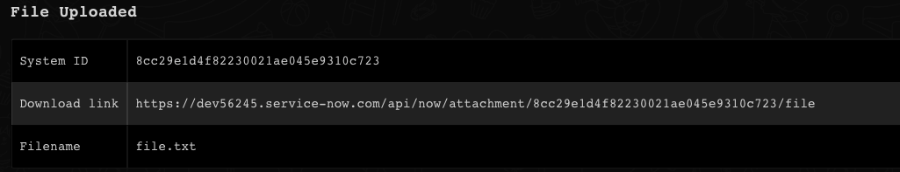</a>

<h3 id="h_42025144228861543394012547">9. Get record information</h3>

Retrieves information for a specified record.

<h5>Base Command</h5>

<code>servicenow-get-record</code>

<h5>Input</h5>
<table style="width: 744px;" border="2" cellpadding="6">
<thead>
<tr>
<th style="width: 146px;"><strong>Argument Name</strong></th>
<th style="width: 491px;"><strong>Description</strong></th>
<th style="width: 71px;"><strong>Required</strong></th>
</tr>
</thead>
<tbody>
<tr>
<td style="width: 146px;">id</td>
<td style="width: 491px;">Record system ID</td>
<td style="width: 71px;">Required</td>
</tr>
<tr>
<td style="width: 146px;">fields</td>
<td style="width: 491px;">Comma-separated table fields to display and output to the context, e.g., name,tag,company. ID field is added by default.</td>
<td style="width: 71px;">Optional</td>
</tr>
<tr>
<td style="width: 146px;">table_name</td>
<td style="width: 491px;">The name of the table to get the record from</td>
<td style="width: 71px;">Required</td>
</tr>
</tbody>
</table>

 

<h5>Context Output</h5>
<table style="width: 748px;" border="2" cellpadding="6">
<thead>
<tr>
<th style="width: 209px;"><strong>Path</strong></th>
<th style="width: 49px;"><strong>Type</strong></th>
<th style="width: 450px;"><strong>Description</strong></th>
</tr>
</thead>
<tbody>
<tr>
<td style="width: 209px;">ServiceNow.Record.ID</td>
<td style="width: 49px;">string</td>
<td style="width: 450px;">The unique record identifier for the record</td>
</tr>
<tr>
<td style="width: 209px;">ServiceNow.Record.UpdatedBy</td>
<td style="width: 49px;">string</td>
<td style="width: 450px;">A string field that indicates the user who most recently updated the record</td>
</tr>
<tr>
<td style="width: 209px;">ServiceNow.Record.UpdatedAt</td>
<td style="width: 49px;">date</td>
<td style="width: 450px;">A time-stamp field that indicates the date and time of the most recent update</td>
</tr>
<tr>
<td style="width: 209px;">ServiceNow.Record.CreatedBy</td>
<td style="width: 49px;">string</td>
<td style="width: 450px;">A string field that indicates the user who created the record</td>
</tr>
<tr>
<td style="width: 209px;">ServiceNow.Record.CreatedOn</td>
<td style="width: 49px;">date</td>
<td style="width: 450px;">A time-stamp field that indicates when a record was created</td>
</tr>
</tbody>
</table>

 

<h5>Command Example</h5>

<code>!servicenow-get-record table_name=alm_asset id=00a96c0d3790200044e0bfc8bcbe5dc3 fields=asset_tag,sys_updated_by,display_name</code>

<h5>Context Example</h5>
<pre>{
    "ServiceNow": {
        "Record": {
            "ID": "00a96c0d3790200044e0bfc8bcbe5dc3",
            "asset_tag": "P1000479",
            "display_name": "P1000479 - Apple MacBook Pro 15\"",
            "sys_updated_by": "system"
        }
    }
}</pre>
<h5>Human Readable Output</h5>

<a href="../../doc_files/49082687-17c82480-f253-11e8-9ab2-bdbb379fbdad.png" target="_blank" rel="noopener noreferrer">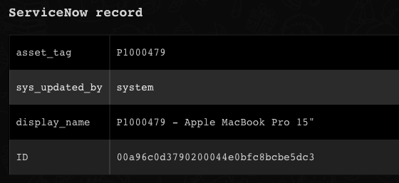</a>

<h3 id="h_31329423830051543394018349">10. Query a table</h3>

Queries a specified table in ServiceNow.

<h5>Base Command</h5>

<code>servicenow-query-table</code>

<h5>Input</h5>
<table style="width: 744px;" border="2" cellpadding="6">
<thead>
<tr>
<th style="width: 145px;"><strong>Argument Name</strong></th>
<th style="width: 492px;"><strong>Description</strong></th>
<th style="width: 71px;"><strong>Required</strong></th>
</tr>
</thead>
<tbody>
<tr>
<td style="width: 145px;">table_name</td>
<td style="width: 492px;">The name of the table to query</td>
<td style="width: 71px;">Required</td>
</tr>
<tr>
<td style="width: 145px;">limit</td>
<td style="width: 492px;">Limit for how many tickets to retrieve</td>
<td style="width: 71px;">Optional</td>
</tr>
<tr>
<td style="width: 145px;">query</td>
<td style="width: 492px;">The query to run. For more information about querying in ServiceNow, see <a href="https://docs.servicenow.com/bundle/istanbul-servicenow-platform/page/use/common-ui-elements/reference/r_OpAvailableFiltersQueries.html" rel="nofollow">the ServiceNow documentation.</a>
</td>
<td style="width: 71px;">Optional</td>
</tr>
<tr>
<td style="width: 145px;">fields</td>
<td style="width: 492px;">Comma-separated table fields to display and output to the context, e.g., name,tag,company. ID field is added by default.</td>
<td style="width: 71px;">Optional</td>
</tr>
<tr>
<td style="width: 145px;">offset</td>
<td style="width: 492px;">Starting record index to begin retrieving records from</td>
<td style="width: 71px;">Optional</td>
</tr>
</tbody>
</table>

 

<h5>Context Output</h5>
<table style="width: 748px;" border="2" cellpadding="6">
<thead>
<tr>
<th style="width: 212px;"><strong>Path</strong></th>
<th style="width: 48px;"><strong>Type</strong></th>
<th style="width: 448px;"><strong>Description</strong></th>
</tr>
</thead>
<tbody>
<tr>
<td style="width: 212px;">ServiceNow.Results.ID</td>
<td style="width: 48px;">string</td>
<td style="width: 448px;">The unique record identifier for the record</td>
</tr>
<tr>
<td style="width: 212px;">ServiceNow.Results.UpdatedBy</td>
<td style="width: 48px;">string</td>
<td style="width: 448px;">A string field that indicates the user who most recently updated the record</td>
</tr>
<tr>
<td style="width: 212px;">ServiceNow.Results.UpdatedAt</td>
<td style="width: 48px;">date</td>
<td style="width: 448px;">A time-stamp field that indicates the date and time of the most recent update</td>
</tr>
<tr>
<td style="width: 212px;">ServiceNow.Results.CreatedBy</td>
<td style="width: 48px;">string</td>
<td style="width: 448px;">A string field that indicates the user who created the record</td>
</tr>
<tr>
<td style="width: 212px;">ServiceNow.Results.CreatedOn</td>
<td style="width: 48px;">date</td>
<td style="width: 448px;">A time-stamp field that indicates when a record was created</td>
</tr>
</tbody>
</table>

 

<h5>Command Example</h5>
<pre><code>!servicenow-query-table table_name=alm_asset fields=asset_tag,sys_updated_by,display_name query=display_nameCONTAINSMacBook</code></pre>
<h5>Context Example</h5>
<pre>{
    "ServiceNow": {
        "Record": [
            {
                "ID": "00a96c0d3790200044e0bfc8bcbe5dc3",
                "asset_tag": "P1000479",
                "display_name": "P1000479 - Apple MacBook Pro 15\"",
                "sys_updated_by": "system"
            },
            {
                "ID": "01a92c0d3790200044e0bfc8bcbe5d36",
                "asset_tag": "P1000807",
                "display_name": "P1000807 - Apple MacBook Pro 17\"",
                "sys_updated_by": "system"
            },
            {
                "ID": "01a9a80d3790200044e0bfc8bcbe5d53",
                "asset_tag": "P1000637",
                "display_name": "P1000637 - Apple MacBook Air 13\"",
                "sys_updated_by": "system"
            },
            {
                "ID": "02a9a80d3790200044e0bfc8bcbe5dba",
                "asset_tag": "P1000412",
                "display_name": "P1000412 - Apple MacBook Pro 17\"",
                "sys_updated_by": "system"
            },
            {
                "ID": "02a9ac0d3790200044e0bfc8bcbe5d5e",
                "asset_tag": "P1000563",
                "display_name": "P1000563 - Apple MacBook Pro 15\"",
                "sys_updated_by": "system"
            },
            {
                "ID": "03a9680d3790200044e0bfc8bcbe5d4c",
                "asset_tag": "P1000626",
                "display_name": "P1000626 - Apple MacBook Air 13\"",
                "sys_updated_by": "system"
            },
            {
                "ID": "03a9ac0d3790200044e0bfc8bcbe5d9d",
                "asset_tag": "P1000551",
                "display_name": "P1000551 - Apple MacBook Pro 15\"",
                "sys_updated_by": "system"
            },
            {
                "ID": "04a96c0d3790200044e0bfc8bcbe5db3",
                "asset_tag": "P1000503",
                "display_name": "P1000503 - Apple MacBook Pro 15\"",
                "sys_updated_by": "system"
            },
            {
                "ID": "04a9a80d3790200044e0bfc8bcbe5d1b",
                "asset_tag": "P1000640",
                "display_name": "P1000640 - Apple MacBook Air 13\"",
                "sys_updated_by": "system"
            },
            {
                "ID": "04a9e80d3790200044e0bfc8bcbe5d41",
                "asset_tag": "P1000815",
                "display_name": "P1000815 - Apple MacBook Pro 17\"",
                "sys_updated_by": "system"
            }
        ]
    }
}
</pre>
<h5>Human Readable Output</h5>

<a href="../../doc_files/49082769-480fc300-f253-11e8-93f2-c2ca049ffdbc.png" target="_blank" rel="noopener noreferrer">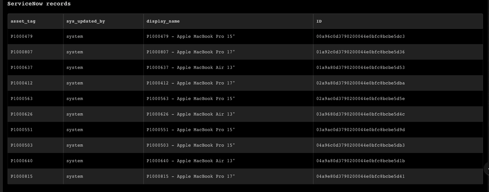</a>

<h3 id="h_11">11. Create a record in a table</h3>

Creates a new record in a specified ServiceNow table.

<h5>Base Command</h5>

<code>servicenow-create-record</code>

<h5>Input</h5>
<table style="width: 748px;" border="2" cellpadding="6">
<thead>
<tr>
<th style="width: 135px;"><strong>Argument Name</strong></th>
<th style="width: 502px;"><strong>Description</strong></th>
<th style="width: 71px;"><strong>Required</strong></th>
</tr>
</thead>
<tbody>
<tr>
<td style="width: 135px;">table_name</td>
<td style="width: 502px;">The name of the table to create a record in</td>
<td style="width: 71px;">Required</td>
</tr>
<tr>
<td style="width: 135px;">fields</td>
<td style="width: 502px;">Fields and their values to create the record with, in the format: fieldname1=value;fieldname2=value;...</td>
<td style="width: 71px;">Optional</td>
</tr>
<tr>
<td style="width: 135px;">custom_fields</td>
<td style="width: 502px;">Custom(user defined) fields in the format: fieldname1=value;fieldname2=value;...</td>
<td style="width: 71px;">Optional</td>
</tr>
<tr>
<td style="width: 135px;">template</td>
<td style="width: 502px;">Template name to use as a base to create new records</td>
<td style="width: 71px;">Optional</td>
</tr>
</tbody>
</table>

 

<h5>Context Output</h5>
<table style="width: 746px;" border="2" cellpadding="6">
<thead>
<tr>
<th style="width: 210px;"><strong>Path</strong></th>
<th style="width: 48px;"><strong>Type</strong></th>
<th style="width: 450px;"><strong>Description</strong></th>
</tr>
</thead>
<tbody>
<tr>
<td style="width: 210px;">ServiceNow.Record.ID</td>
<td style="width: 48px;">string</td>
<td style="width: 450px;">The unique record identifier for the record</td>
</tr>
<tr>
<td style="width: 210px;">ServiceNow.Record.UpdatedBy</td>
<td style="width: 48px;">string</td>
<td style="width: 450px;">A string field that indicates the user who most recently updated the record</td>
</tr>
<tr>
<td style="width: 210px;">ServiceNow.Record.UpdatedAt</td>
<td style="width: 48px;">date</td>
<td style="width: 450px;">A time-stamp field that indicates the date and time of the most recent update</td>
</tr>
<tr>
<td style="width: 210px;">ServiceNow.Record.CreatedBy</td>
<td style="width: 48px;">string</td>
<td style="width: 450px;">A string field that indicates the user who created the record</td>
</tr>
<tr>
<td style="width: 210px;">ServiceNow.Record.CreatedOn</td>
<td style="width: 48px;">date</td>
<td style="width: 450px;">time-stamp field that indicates when a record was created</td>
</tr>
</tbody>
</table>

 

<h5>Command Example</h5>
<pre><code>!servicenow-create-record table_name=incident fields="short_description=My description;assigned_to=my user"
</code></pre>
<h5>Context Example</h5>
<pre>{
    "ServiceNow": {
        "Record": {
            "CreatedAt": "2018-11-27 12:51:44",
            "CreatedBy": "admin",
            "ID": "748692114fc2230021ae045e9310c7ff",
            "UpdatedAt": "2018-11-27 12:51:44",
            "UpdatedBy": "admin"
        }
    }
}
</pre>
<h5>Human Readable Output</h5>

<a href="../../doc_files/49083041-1519ff00-f254-11e8-9af9-ac2fd755965d.png" target="_blank" rel="noopener noreferrer">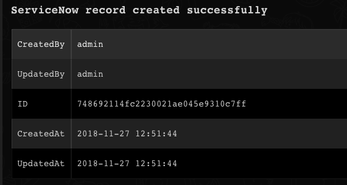</a>

<h3 id="h_82174951331301543394025269">12. Update a record in a table</h3>

Updates a record in a specified ServiceNow table.

<h5>Base Command</h5>

<code>servicenow-update-record</code>

<h5>Input</h5>
<table style="width: 746px;" border="2" cellpadding="6">
<thead>
<tr>
<th style="width: 136px;"><strong>Argument Name</strong></th>
<th style="width: 501px;"><strong>Description</strong></th>
<th style="width: 71px;"><strong>Required</strong></th>
</tr>
</thead>
<tbody>
<tr>
<td style="width: 136px;">table_name</td>
<td style="width: 501px;">The name of the table to update the record in</td>
<td style="width: 71px;">Required</td>
</tr>
<tr>
<td style="width: 136px;">id</td>
<td style="width: 501px;">The system ID of the ticket to update</td>
<td style="width: 71px;">Required</td>
</tr>
<tr>
<td style="width: 136px;">fields</td>
<td style="width: 501px;">Fields and their values to update in the record, in the format: fieldname1=value;fieldname2=value;...</td>
<td style="width: 71px;">Optional</td>
</tr>
<tr>
<td style="width: 136px;">custom_fields</td>
<td style="width: 501px;">Custom (user-defined) fields and their values to update in the record, in the format: fieldname1=value;fieldname2=value;...</td>
<td style="width: 71px;">Optional</td>
</tr>
</tbody>
</table>

 

<h5>Context Output</h5>
<table style="width: 748px;" border="2" cellpadding="6">
<thead>
<tr>
<th style="width: 213px;"><strong>Path</strong></th>
<th style="width: 45px;"><strong>Type</strong></th>
<th style="width: 450px;"><strong>Description</strong></th>
</tr>
</thead>
<tbody>
<tr>
<td style="width: 213px;">ServiceNow.Record.ID</td>
<td style="width: 45px;">string</td>
<td style="width: 450px;">The unique record identifier for the record.</td>
</tr>
<tr>
<td style="width: 213px;">ServiceNow.Record.UpdatedBy</td>
<td style="width: 45px;">string</td>
<td style="width: 450px;">A string field that indicates the user who most recently updated the record.</td>
</tr>
<tr>
<td style="width: 213px;">ServiceNow.Record.UpdatedAt</td>
<td style="width: 45px;">date</td>
<td style="width: 450px;">A time-stamp field that indicates the date and time of the most recent update.</td>
</tr>
<tr>
<td style="width: 213px;">ServiceNow.Record.CreatedBy</td>
<td style="width: 45px;">string</td>
<td style="width: 450px;">A string field that indicates the user who created the record.</td>
</tr>
<tr>
<td style="width: 213px;">ServiceNow.Record.CreatedOn</td>
<td style="width: 45px;">date</td>
<td style="width: 450px;">time-stamp field that indicates when a record was created.</td>
</tr>
</tbody>
</table>

 

<h5>Command Example</h5>

<code>!servicenow-update-record table_name=incident id=748692114fc2230021ae045e9310c7ff fields="short_description=new desc;assigned_to=new user"</code>

<h5>Context Example</h5>
<pre>{
    "ServiceNow": {
        "Record": {
            "CreatedAt": "2018-11-27 12:51:44",
            "CreatedBy": "admin",
            "ID": "748692114fc2230021ae045e9310c7ff",
            "UpdatedAt": "2018-11-27 12:53:48",
            "UpdatedBy": "admin"
        }
    }
}
</pre>
<h5>Human Readable Output</h5>

<a href="../../doc_files/49083116-5d392180-f254-11e8-8854-6b250075eab2.png" target="_blank" rel="noopener noreferrer">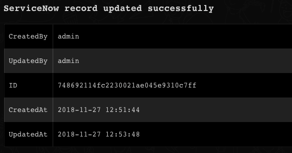</a>

<h3 id="h_70112060732471543394030180">13. Delete a record from a table</h3>

Deletes a record from a specified ServiceNow table.

<h5>Base Command</h5>

<code>servicenow-delete-record</code>

<h5>Input</h5>
<table style="width: 748px;" border="2" cellpadding="6">
<thead>
<tr>
<th style="width: 193px;"><strong>Argument Name</strong></th>
<th style="width: 401px;"><strong>Description</strong></th>
<th style="width: 114px;"><strong>Required</strong></th>
</tr>
</thead>
<tbody>
<tr>
<td style="width: 193px;">table_name</td>
<td style="width: 401px;">The table name</td>
<td style="width: 114px;">Required</td>
</tr>
<tr>
<td style="width: 193px;">id</td>
<td style="width: 401px;">The system ID of the ticket to delete</td>
<td style="width: 114px;">Required</td>
</tr>
</tbody>
</table>

 

<h5>Context Output</h5>

There is no context output for this command.

<h5>Command Example</h5>
<pre><code>!servicenow-delete-record id=748692114fc2230021ae045e9310c7ff table_name=incident</code></pre>
<h5>Human Readable Output</h5>

<h3 id="h_6980755125801543393891359">14. List API fiels for a table</h3>

Lists API fields for a specified ServiceNow table.

<h5>Base Command</h5>

<code>servicenow-list-table-fields</code>

<h5>Input</h5>
<table style="width: 748px;" border="2" cellpadding="6">
<thead>
<tr>
<th style="width: 301px;"><strong>Argument Name</strong></th>
<th style="width: 227px;"><strong>Description</strong></th>
<th style="width: 180px;"><strong>Required</strong></th>
</tr>
</thead>
<tbody>
<tr>
<td style="width: 301px;">table_name</td>
<td style="width: 227px;">Table name</td>
<td style="width: 180px;">Required</td>
</tr>
</tbody>
</table>
<h5> </h5>
<h5>Context Output</h5>
<table style="width: 748px;" border="2" cellpadding="6">
<thead>
<tr>
<th style="width: 265px;"><strong>Path</strong></th>
<th style="width: 114px;"><strong>Type</strong></th>
<th style="width: 329px;"><strong>Description</strong></th>
</tr>
</thead>
<tbody>
<tr>
<td style="width: 265px;">ServiceNow.Field</td>
<td style="width: 114px;">string</td>
<td style="width: 329px;">Table API field name</td>
</tr>
</tbody>
</table>

 

<h5>Command Example</h5>
<pre><code>!servicenow-list-table-fields table_name=alm_asset</code></pre>
<h5>Context Example</h5>
<pre>{
    "ServiceNow": {
        "Field": [
            {
                "Name": "reserved_for"
            },
            {
                "Name": "expenditure_type"
            },
            {
                "Name": "request_line"
            },
            {
                "Name": "checked_in"
            },
            {
                "Name": "sys_tags"
            },
            {
                "Name": "sys_created_on"
            },
            {
                "Name": "gl_account"
            },
            {
                "Name": "salvage_value"
            },
            {
                "Name": "ci"
            },
            {
                "Name": "asset_tag"
            },
            {
                "Name": "managed_by"
            },
            {
                "Name": "assigned_to"
            },
            {
                "Name": "install_status"
            },
            {
                "Name": "cost_center"
            },
            {
                "Name": "old_substatus"
            },
            {
                "Name": "pre_allocated"
            },
            {
                "Name": "display_name"
            },
            {
                "Name": "justification"
            },
            {
                "Name": "skip_sync"
            },
            {
                "Name": "sys_updated_by"
            },
            {
                "Name": "sys_created_by"
            },
            {
                "Name": "due"
            },
            {
                "Name": "comments"
            },
            {
                "Name": "beneficiary"
            },
            {
                "Name": "depreciated_amount"
            },
            {
                "Name": "lease_id"
            },
            {
                "Name": "sys_id"
            },
            {
                "Name": "purchase_date"
            },
            {
                "Name": "work_notes"
            },
            {
                "Name": "department"
            },
            {
                "Name": "serial_number"
            },
            {
                "Name": "location"
            },
            {
                "Name": "residual_date"
            },
            {
                "Name": "sys_class_name"
            },
            {
                "Name": "warranty_expiration"
            },
            {
                "Name": "vendor"
            },
            {
                "Name": "parent"
            },
            {
                "Name": "checked_out"
            },
            {
                "Name": "company"
            },
            {
                "Name": "sys_updated_on"
            },
            {
                "Name": "resale_price"
            },
            {
                "Name": "residual"
            },
            {
                "Name": "supported_by"
            },
            {
                "Name": "sys_mod_count"
            },
            {
                "Name": "disposal_reason"
            },
            {
                "Name": "invoice_number"
            },
            {
                "Name": "old_status"
            },
            {
                "Name": "sys_domain_path"
            },
            {
                "Name": "retired"
            },
            {
                "Name": "assigned"
            },
            {
                "Name": "depreciation"
            },
            {
                "Name": "model_category"
            },
            {
                "Name": "po_number"
            },
            {
                "Name": "acquisition_method"
            },
            {
                "Name": "due_in"
            },
            {
                "Name": "depreciation_date"
            },
            {
                "Name": "install_date"
            },
            {
                "Name": "substatus"
            },
            {
                "Name": "order_date"
            },
            {
                "Name": "cost"
            },
            {
                "Name": "support_group"
            },
            {
                "Name": "stockroom"
            },
            {
                "Name": "retirement_date"
            },
            {
                "Name": "sys_domain"
            },
            {
                "Name": "owned_by"
            },
            {
                "Name": "model"
            },
            {
                "Name": "delivery_date"
            },
            {
                "Name": "quantity"
            }
        ]
    }
}
</pre>
<h5>Human Readable Output</h5>

<a href="../../doc_files/49084292-b35b9400-f257-11e8-98b9-40c404c2a52f.png" target="_blank" rel="noopener noreferrer">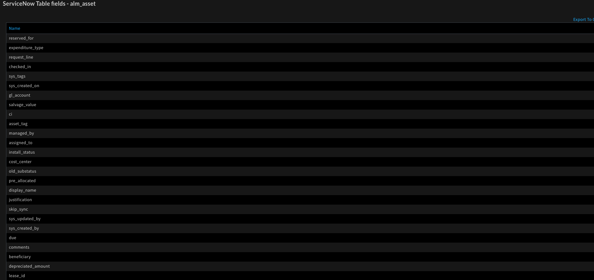</a>

<h3 id="h_36360169033681543394035550">15. Query computers</h3>

Queries the cmdb_ci_computer table in ServiceNow.

<h5>Base Command</h5>

<code>servicenow-query-computers</code>

<h5>Input</h5>
<table style="width: 746px;" border="2" cellpadding="6">
<thead>
<tr>
<th style="width: 132px;"><strong>Argument Name</strong></th>
<th style="width: 505px;"><strong>Description</strong></th>
<th style="width: 71px;"><strong>Required</strong></th>
</tr>
</thead>
<tbody>
<tr>
<td style="width: 132px;">computer_id</td>
<td style="width: 505px;">Query by computer sys_id</td>
<td style="width: 71px;">Optional</td>
</tr>
<tr>
<td style="width: 132px;">computer_name</td>
<td style="width: 505px;">Query by computer name</td>
<td style="width: 71px;">Optional</td>
</tr>
<tr>
<td style="width: 132px;">query</td>
<td style="width: 505px;">Query by specified query, for more information about querying in ServiceNow, see <a href="https://docs.servicenow.com/bundle/istanbul-servicenow-platform/page/use/common-ui-elements/reference/r_OpAvailableFiltersQueries.html" rel="nofollow">https://docs.servicenow.com/bundle/istanbul-servicenow-platform/page/use/common-ui-elements/reference/r_OpAvailableFiltersQueries.html</a>
</td>
<td style="width: 71px;">Optional</td>
</tr>
<tr>
<td style="width: 132px;">asset_tag</td>
<td style="width: 505px;">Query by asset tag</td>
<td style="width: 71px;">Optional</td>
</tr>
<tr>
<td style="width: 132px;">limit</td>
<td style="width: 505px;">Query results limit</td>
<td style="width: 71px;">Optional</td>
</tr>
<tr>
<td style="width: 132px;">offset</td>
<td style="width: 505px;">Starting record index to begin retrieving records from</td>
<td style="width: 71px;">Optional</td>
</tr>
</tbody>
</table>

 

<h5>Context Output</h5>
<table style="width: 748px;" border="2" cellpadding="6">
<thead>
<tr>
<th style="width: 342px;"><strong>Path</strong></th>
<th style="width: 64px;"><strong>Type</strong></th>
<th style="width: 302px;"><strong>Description</strong></th>
</tr>
</thead>
<tbody>
<tr>
<td style="width: 342px;">ServiceNow.Computer.ID</td>
<td style="width: 64px;">string</td>
<td style="width: 302px;">Computer sys_id</td>
</tr>
<tr>
<td style="width: 342px;">ServiceNow.Computer.AssetTag</td>
<td style="width: 64px;">string</td>
<td style="width: 302px;">Computer Asset tag</td>
</tr>
<tr>
<td style="width: 342px;">ServiceNow.Computer.Name</td>
<td style="width: 64px;">string</td>
<td style="width: 302px;">Computer name</td>
</tr>
<tr>
<td style="width: 342px;">ServiceNow.Computer.DisplayName</td>
<td style="width: 64px;">string</td>
<td style="width: 302px;">Computer display name</td>
</tr>
<tr>
<td style="width: 342px;">ServiceNow.Computer.SupportGroup</td>
<td style="width: 64px;">string</td>
<td style="width: 302px;">Computer support group</td>
</tr>
<tr>
<td style="width: 342px;">ServiceNow.Computer.OperatingSystem</td>
<td style="width: 64px;">string</td>
<td style="width: 302px;">Computer operating system</td>
</tr>
<tr>
<td style="width: 342px;">ServiceNow.Computer.Company</td>
<td style="width: 64px;">string</td>
<td style="width: 302px;">Computer company sys_id</td>
</tr>
<tr>
<td style="width: 342px;">ServiceNow.Computer.AssignedTo</td>
<td style="width: 64px;">string</td>
<td style="width: 302px;">Computer assigned to user sys_id</td>
</tr>
<tr>
<td style="width: 342px;">ServiceNow.Computer.State</td>
<td style="width: 64px;">string</td>
<td style="width: 302px;">Computer state</td>
</tr>
<tr>
<td style="width: 342px;">ServiceNow.Computer.Cost</td>
<td style="width: 64px;">string</td>
<td style="width: 302px;">Computer cost</td>
</tr>
<tr>
<td style="width: 342px;">ServiceNow.Computer.Comments</td>
<td style="width: 64px;">string</td>
<td style="width: 302px;">Computer comments</td>
</tr>
</tbody>
</table>

 

<h5>Command Example</h5>

<code>!servicenow-query-computers</code>

<h5>Context Example</h5>
<pre>{
    "ServiceNow": {
        "Computer": [
            {
                "AssetTag": "P1000503",
                "AssignedTo": "92826bf03710200044e0bfc8bcbe5dbb",
                "Company": "81fbfe03ac1d55eb286d832de58ae1fd",
                "Cost": "1799.99 USD",
                "DisplayName": "P1000503 - MacBook Pro 15\"",
                "ID": "00a96c0d3790200044e0bfc8bcbe5db4",
                "Name": "MacBook Pro 15\"",
                "OperatingSystem": "Mac OS 10 (OS/X)",
                "State": "In use"
            },
            {
                "AssetTag": "P1000640",
                "AssignedTo": "3682abf03710200044e0bfc8bcbe5d09",
                "Company": "81fca4cbac1d55eb355b4b6db0e3c80f",
                "Cost": "1599.99 USD",
                "DisplayName": "P1000640 - MacBook Air 13\"",
                "ID": "00a9a80d3790200044e0bfc8bcbe5d1c",
                "Name": "MacBook Air 13\"",
                "OperatingSystem": "Mac OS 10 (OS/X)",
                "State": "In use"
            },
            {
                "AssetTag": "P1000815",
                "AssignedTo": "86826bf03710200044e0bfc8bcbe5d42",
                "Company": "81fd65ecac1d55eb42a426568fc87a63",
                "Cost": "2499.99 USD",
                "DisplayName": "P1000815 - MacBook Pro 17\"",
                "ID": "00a9e80d3790200044e0bfc8bcbe5d42",
                "Name": "MacBook Pro 17\"",
                "OperatingSystem": "Mac OS 10 (OS/X)",
                "State": "In use"
            },
            {
                "AssetTag": "P1000814",
                "AssignedTo": "4e826bf03710200044e0bfc8bcbe5d41",
                "Company": "81fd65ecac1d55eb42a426568fc87a63",
                "Cost": "2499.99 USD",
                "DisplayName": "P1000814 - MacBook Pro 17\"",
                "ID": "00a9e80d3790200044e0bfc8bcbe5de8",
                "Name": "MacBook Pro 17\"",
                "OperatingSystem": "Mac OS 10 (OS/X)",
                "State": "In use"
            },
            {
                "AssetTag": "P1000517",
                "AssignedTo": "12826bf03710200044e0bfc8bcbe5dc3",
                "Company": "81fca4cbac1d55eb355b4b6db0e3c80f",
                "Cost": "1799.99 USD",
                "DisplayName": "P1000517 - MacBook Pro 15\"",
                "ID": "00a9ec0d3790200044e0bfc8bcbe5d06",
                "Name": "MacBook Pro 15\"",
                "OperatingSystem": "Mac OS 10 (OS/X)",
                "State": "In use"
            },
            {
                "AssetTag": "P1000666",
                "AssignedTo": "fe82abf03710200044e0bfc8bcbe5d18",
                "Company": "a66b1fb03710200044e0bfc8bcbe5d08",
                "Cost": "1599.99 USD",
                "DisplayName": "P1000666 - MacBook Air 13\"",
                "ID": "01a9280d3790200044e0bfc8bcbe5d79",
                "Name": "MacBook Air 13\"",
                "OperatingSystem": "Mac OS 10 (OS/X)",
                "State": "In use"
            },
            {
                "AssetTag": "P1000871",
                "AssignedTo": "4e826bf03710200044e0bfc8bcbe5d6f",
                "Company": "31bea3d53790200044e0bfc8bcbe5dec",
                "Cost": "2499.99 USD",
                "DisplayName": "P1000871 - MacBook Pro 17\"",
                "ID": "01a92c0d3790200044e0bfc8bcbe5d27",
                "Name": "MacBook Pro 17\"",
                "OperatingSystem": "Mac OS 10 (OS/X)",
                "State": "In use"
            },
            {
                "AssetTag": "P1000429",
                "AssignedTo": "c6826bf03710200044e0bfc8bcbe5d90",
                "Company": "4b7d13f03710200044e0bfc8bcbe5db6",
                "Cost": "2249.99 USD",
                "DisplayName": "P1000429 - ThinkStation C20",
                "ID": "01a9e40d3790200044e0bfc8bcbe5dab",
                "Name": "ThinkStation C20",
                "OperatingSystem": "Windows XP Professional",
                "State": "In use"
            },
            {
                "AssetTag": "P1000440",
                "AssignedTo": "8a826bf03710200044e0bfc8bcbe5d96",
                "Company": "81fca4cbac1d55eb355b4b6db0e3c80f",
                "Cost": "1699.99 USD",
                "DisplayName": "P1000440 - ThinkStation S20",
                "ID": "01a9ec0d3790200044e0bfc8bcbe5dc3",
                "Name": "ThinkStation S20",
                "OperatingSystem": "Windows XP Professional",
                "State": "In use"
            },
            {
                "AssetTag": "P1000357",
                "AssignedTo": "ce826bf03710200044e0bfc8bcbe5d67",
                "Company": "a66b1fb03710200044e0bfc8bcbe5d08",
                "Cost": "1329 USD",
                "DisplayName": "P1000357 - Precision T5500 Workstation",
                "ID": "02a9604d3790200044e0bfc8bcbe5d17",
                "Name": "Precision T5500 Workstation",
                "OperatingSystem": "Windows XP Professional",
                "State": "In use"
            }
        ]
    }
}
</pre>
<h5>Human Readable Output</h5>

<a href="../../doc_files/49084519-5dd3b700-f258-11e8-8675-47bf47bc3fba.png" target="_blank" rel="noopener noreferrer">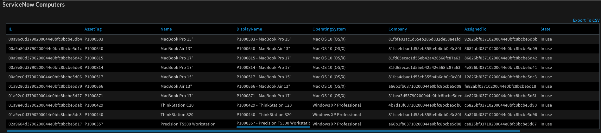</a>

<h3 id="h_65378198335911543394040311">16. Query groups</h3>

Queries the sys_user_group table in ServiceNow.

<h5>Base Command</h5>

<code>servicenow-query-groups</code>

<h5>Input</h5>
<table style="width: 748px;" border="2" cellpadding="6">
<thead>
<tr>
<th style="width: 135px;"><strong>Argument Name</strong></th>
<th style="width: 502px;"><strong>Description</strong></th>
<th style="width: 71px;"><strong>Required</strong></th>
</tr>
</thead>
<tbody>
<tr>
<td style="width: 135px;">group_id</td>
<td style="width: 502px;">Query by group sys_id</td>
<td style="width: 71px;">Optional</td>
</tr>
<tr>
<td style="width: 135px;">group_name</td>
<td style="width: 502px;">Query by group name</td>
<td style="width: 71px;">Optional</td>
</tr>
<tr>
<td style="width: 135px;">query</td>
<td style="width: 502px;">Query by specified query, for more information about querying in ServiceNow, see <a href="https://docs.servicenow.com/bundle/istanbul-servicenow-platform/page/use/common-ui-elements/reference/r_OpAvailableFiltersQueries.html" rel="nofollow">the ServiceNow documentation.</a>
</td>
<td style="width: 71px;">Optional</td>
</tr>
<tr>
<td style="width: 135px;">limit</td>
<td style="width: 502px;">Query results limit</td>
<td style="width: 71px;">Optional</td>
</tr>
<tr>
<td style="width: 135px;">offset</td>
<td style="width: 502px;">Starting record index to begin retrieving records from</td>
<td style="width: 71px;">Optional</td>
</tr>
</tbody>
</table>

 

<h5>Context Output</h5>
<table style="width: 748px;" border="2" cellpadding="6">
<thead>
<tr>
<th style="width: 352px;"><strong>Path</strong></th>
<th style="width: 83px;"><strong>Type</strong></th>
<th style="width: 273px;"><strong>Description</strong></th>
</tr>
</thead>
<tbody>
<tr>
<td style="width: 352px;">ServiceNow.Group.ID</td>
<td style="width: 83px;">string</td>
<td style="width: 273px;">Group sys_id</td>
</tr>
<tr>
<td style="width: 352px;">ServiceNow.Group.Description</td>
<td style="width: 83px;">string</td>
<td style="width: 273px;">Group description</td>
</tr>
<tr>
<td style="width: 352px;">ServiceNow.Group.Name</td>
<td style="width: 83px;">string</td>
<td style="width: 273px;">Group name</td>
</tr>
<tr>
<td style="width: 352px;">ServiceNow.Group.Manager</td>
<td style="width: 83px;">string</td>
<td style="width: 273px;">Group manager sys_id</td>
</tr>
<tr>
<td style="width: 352px;">ServiceNow.Group.Updated</td>
<td style="width: 83px;">date</td>
<td style="width: 273px;">Group update time</td>
</tr>
</tbody>
</table>

 

<h5>Command Example</h5>

<code>!servicenow-query-groups group_name=test1</code>

<h5>Context Example</h5>
<pre>{
    "ServiceNow": {
        "Group": {
            "Active": "true",
            "Description": "Incident Management Group",
            "ID": "12a586cd0bb23200ecfd818393673a30",
            "Name": "test1",
            "Updated": "2018-11-26 14:51:41"
        }
    }
}
</pre>
<h5>Human Readable Output</h5>

<a href="../../doc_files/49084595-95dafa00-f258-11e8-99d0-d55a044b5b8d.png" target="_blank" rel="noopener noreferrer">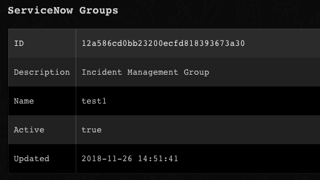</a>

<h3 id="h_7352020637051543394046045">17. Query users</h3>

Queries the sys_user table in ServiceNow.

<h5>Base Command</h5>

<code>servicenow-query-users</code>

<h5>Input</h5>
<table style="width: 748px;" border="2" cellpadding="6">
<thead>
<tr>
<th style="width: 130px;"><strong>Argument Name</strong></th>
<th style="width: 507px;"><strong>Description</strong></th>
<th style="width: 71px;"><strong>Required</strong></th>
</tr>
</thead>
<tbody>
<tr>
<td style="width: 130px;">user_id</td>
<td style="width: 507px;">Query by user sys_id</td>
<td style="width: 71px;">Optional</td>
</tr>
<tr>
<td style="width: 130px;">user_name</td>
<td style="width: 507px;">Query by username</td>
<td style="width: 71px;">Optional</td>
</tr>
<tr>
<td style="width: 130px;">query</td>
<td style="width: 507px;">Query by specified query, for more information about querying in ServiceNow, see <a href="https://docs.servicenow.com/bundle/istanbul-servicenow-platform/page/use/common-ui-elements/reference/r_OpAvailableFiltersQueries.html" rel="nofollow">the ServiceNow documentation.</a>
</td>
<td style="width: 71px;">Optional</td>
</tr>
<tr>
<td style="width: 130px;">limit</td>
<td style="width: 507px;">Query results limit</td>
<td style="width: 71px;">Optional</td>
</tr>
<tr>
<td style="width: 130px;">offset</td>
<td style="width: 507px;">Starting record index to begin retrieving records from</td>
<td style="width: 71px;">Optional</td>
</tr>
</tbody>
</table>

 

<h5>Context Output</h5>
<table style="width: 748px;" border="2" cellpadding="6">
<thead>
<tr>
<th style="width: 286px;"><strong>Path</strong></th>
<th style="width: 70px;"><strong>Type</strong></th>
<th style="width: 352px;"><strong>Description</strong></th>
</tr>
</thead>
<tbody>
<tr>
<td style="width: 286px;">ServiceNow.User.ID</td>
<td style="width: 70px;">string</td>
<td style="width: 352px;">User sys_id</td>
</tr>
<tr>
<td style="width: 286px;">ServiceNow.User.Name</td>
<td style="width: 70px;">string</td>
<td style="width: 352px;">User name (first, middle, last)</td>
</tr>
<tr>
<td style="width: 286px;">ServiceNow.User.UserName</td>
<td style="width: 70px;">string</td>
<td style="width: 352px;">User username</td>
</tr>
<tr>
<td style="width: 286px;">ServiceNow.User.Email</td>
<td style="width: 70px;">string</td>
<td style="width: 352px;">User email</td>
</tr>
<tr>
<td style="width: 286px;">ServiceNow.User.Created</td>
<td style="width: 70px;">date</td>
<td style="width: 352px;">User creation time</td>
</tr>
<tr>
<td style="width: 286px;">ServiceNow.User.Updated</td>
<td style="width: 70px;">date</td>
<td style="width: 352px;">User update time</td>
</tr>
</tbody>
</table>

 

<h5>Command Example</h5>
<pre><code>!servicenow-query-users user_name=sean.bonnet</code></pre>
<h5>Context Example</h5>
<pre>{
    "ServiceNow": {
        "User": {
            "Created": "2012-02-18 03:04:50",
            "Email": "sean.bonnet@example.com",
            "ID": "02826bf03710200044e0bfc8bcbe5d6d",
            "Name": "Sean Bonnet",
            "Updated": "2018-08-12 22:18:39",
            "UserName": "sean.bonnet"
        }
    }
}
</pre>
<h5>Human Readable Output</h5>

<a href="../../doc_files/49084694-dfc3e000-f258-11e8-83d5-f5ee9b23f9c6.png" target="_blank" rel="noopener noreferrer">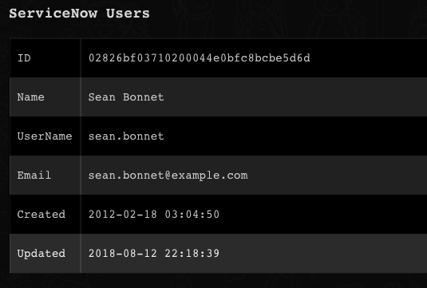</a>

<h3 id="h_4958559901351544082835053">18. Get table names</h3>

Retrieves table names by a label to use in commands.

<h5>Base Command</h5>
<pre><code>servicenow-get-table-name</code></pre>
<h5>Input</h5>
<table style="width: 748px;" border="2" cellpadding="6">
<thead>
<tr>
<th style="width: 152px;"><strong>Argument Name</strong></th>
<th style="width: 467px;"><strong>Description</strong></th>
<th style="width: 89px;"><strong>Required</strong></th>
</tr>
</thead>
<tbody>
<tr>
<td style="width: 152px;">label</td>
<td style="width: 467px;">The table label, e.g., Asset, Incident, IP address, etc.</td>
<td style="width: 89px;">Required</td>
</tr>
<tr>
<td style="width: 152px;">limit</td>
<td style="width: 467px;">The number of results to return</td>
<td style="width: 89px;">Optional</td>
</tr>
<tr>
<td style="width: 152px;">offset</td>
<td style="width: 467px;">Starting record index to begin retrieving records from</td>
<td style="width: 89px;">Optional</td>
</tr>
</tbody>
</table>

 

<h5>Context Output</h5>
<table style="width: 748px;" border="2" cellpadding="6">
<thead>
<tr>
<th style="width: 256px;"><strong>Path</strong></th>
<th style="width: 55px;"><strong>Type</strong></th>
<th style="width: 397px;"><strong>Description</strong></th>
</tr>
</thead>
<tbody>
<tr>
<td style="width: 256px;">ServiceNow.Table.ID</td>
<td style="width: 55px;">string</td>
<td style="width: 397px;">Table system ID</td>
</tr>
<tr>
<td style="width: 256px;">ServiceNow.Table.Name</td>
<td style="width: 55px;">string</td>
<td style="width: 397px;">Table name to use in commands, e.g., alm_asset</td>
</tr>
<tr>
<td style="width: 256px;">ServiceNow.Table.SystemName</td>
<td style="width: 55px;">string</td>
<td style="width: 397px;">Table system name, e.g., Asset</td>
</tr>
</tbody>
</table>
<h5> </h5>
<h5>Command Example</h5>
<pre><code>!servicenow-get-table-name label=Asset</code></pre>
<h5>Context Example</h5>
<pre>{
    "ServiceNow": {
        "Table": {
            "ID": "56cc519d5d521300651727c3e282e819",
            "Name": "alm_asset",
            "SystemName": "Asset"
        }
    }
}
</pre>
<h5>Human Readable Output</h5>

<a href="../../doc_files/49531657-66189b80-f8c3-11e8-8479-cba45949186c.png" target="_blank" rel="noopener noreferrer">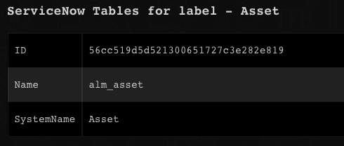</a>

<h3 id="h_a467aa87-6fbc-4eef-bf89-81f7c839f442">19. Get ticket notes</h3>

Returns notes for a specified ticket.

<h5>Base Command</h5>

<code>servicenow-get-ticket-notes</code>

<h5>Input</h5>
<table style="width: 749px;">
<thead>
<tr>
<th style="width: 241px;"><strong>Argument Name</strong></th>
<th style="width: 357px;"><strong>Description</strong></th>
<th style="width: 142px;"><strong>Required</strong></th>
</tr>
</thead>
<tbody>
<tr>
<td style="width: 241px;">id</td>
<td style="width: 357px;">Ticket System ID</td>
<td style="width: 142px;">Required</td>
</tr>
<tr>
<td style="width: 241px;">limit</td>
<td style="width: 357px;">Limit for the ticket notes</td>
<td style="width: 142px;">Optional</td>
</tr>
<tr>
<td style="width: 241px;">offset</td>
<td style="width: 357px;">Offset of the ticket notes</td>
<td style="width: 142px;">Optional</td>
</tr>
</tbody>
</table>

 

<h5>Context Output</h5>
<table style="width: 749px;">
<thead>
<tr>
<th style="width: 367px;"><strong>Path</strong></th>
<th style="width: 89px;"><strong>Type</strong></th>
<th style="width: 284px;"><strong>Description</strong></th>
</tr>
</thead>
<tbody>
<tr>
<td style="width: 367px;">ServiceNow.Ticket.ID</td>
<td style="width: 89px;">string</td>
<td style="width: 284px;">Ticket ID</td>
</tr>
<tr>
<td style="width: 367px;">ServiceNow.Ticket.Note.Value</td>
<td style="width: 89px;">unknown</td>
<td style="width: 284px;">Ticket note value</td>
</tr>
<tr>
<td style="width: 367px;">ServiceNow.Ticket.Note.CreatedOn</td>
<td style="width: 89px;">date</td>
<td style="width: 284px;">Ticket note created on date</td>
</tr>
<tr>
<td style="width: 367px;">ServiceNow.Ticket.Note.CreatedBy</td>
<td style="width: 89px;">string</td>
<td style="width: 284px;">Ticket note created by</td>
</tr>
<tr>
<td style="width: 367px;">ServiceNow.Ticket.Note.Type</td>
<td style="width: 89px;">string</td>
<td style="width: 284px;">Ticket note type</td>
</tr>
</tbody>
</table>

 

<h5>Command Example</h5>

<code>!servicenow-get-ticket-notes id=9c573169c611228700193229fff72400</code>

<h5>Context Example</h5>
<pre>{
    "ServiceNow": {
        "Ticket": {
            "ID": "9c573169c611228700193229fff72400",
            "Note": [
                {
                    "CreatedBy": "admin",
                    "CreatedOn": "2019-01-31 08:40:56",
                    "Type": "Comment",
                    "Value": "test"
                },
                {
                    "CreatedBy": "admin",
                    "CreatedOn": "2019-01-31 11:09:14",
                    "Type": "Work Note",
                    "Value": "hmm"
                }
            ]
        }
    }
</pre>
<h5>Human Readable Output</h5>

<a href="../../doc_files/52177960-28f05d00-27d1-11e9-8628-9e46a3916f61.png" target="_blank" rel="noopener noreferrer">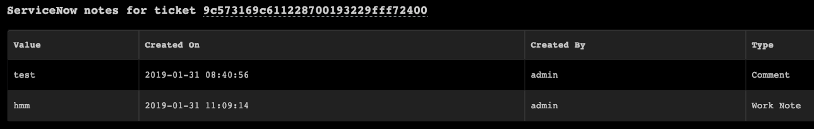</a>

 

<h2>Additional Information</h2>

The tables and fields in the ServiceNow UI are different than those in the API. Each table and field name in the UI have their representation in the API.

The integration allows viewing the API table name with the <code>servicenow-get-table</code> command and the API fields(columns) for each table using the <code>servicenow-list-fields</code> command, given the table has records.

In the API, fields that are linked to records in a table (e.g., user) return as an object of <code>link</code> and <code>value</code> as the <code>link</code> refers to the link to that record in the API and the <code>value</code> refers to the system ID of the record. By default, the integration retrieves the value of the object - which means its system ID.

<h2>Troubleshooting</h2>

If there is an error within ServiceNow, the message is usually indicative, e.g., <code>User Not Authenticated, details: Required to provide Auth information </code>, <code>Invalid table</code> or <code>No Record found, details: Record doesn't exist or ACL restricts the record retrieval</code>.

However there may be connection issues, e.g., when the ServiceNow server URL is incorrect or is unreachable.
