IT service management. Cortex XSOAR interfaces with ServiceNow to help streamline security-related service management and IT operations. For example, you can use the `ServiceNow` integration in order to:

- View, create, update or delete a ServiceNow ticket directly from the Cortex XSOAR CLI, and enrich it with Cortex XSOAR data.
- View, create, update and delete records from any ServiceNow table.
- Query ServiceNow data with the ServiceNow query syntax.
- Manage Security Incident Response (SIR) tickets with Cortex XSOAR, update tickets and enrich them with data.

Please refer to ServiceNow documentation for additional information. We especially recommend the [Operators available for filters and queries](https://docs.servicenow.com/bundle/xanadu-platform-user-interface/page/use/common-ui-elements/reference/r_OpAvailableFiltersQueries.html) page.

This integration was integrated and tested with the Xanadu version of ServiceNow.

This is the default integration for this content pack when configured by the Data Onboarder in Cortex XSIAM.

## Use cases
1. Get, update, create, and delete ServiceNow tickets, as well as add links and comments, or upload files to the tickets.
2. Fetch newly created incidents.
3. Get, update, create, delete records from any ServiceNow table.

## Required Permissions
To use ServiceNow on Cortex XSOAR, ensure your user account has the *snc_platform_rest_api_access* role.
 This role is required to make API calls.
 Also add to your user account the specific tables that you want to have access to.
 However, these permissions may not suffice for managing records in some tables. Make sure you have the correct role so you have permissions to work with the relevant table.
 
## Wrapper Scripts
There are 3 scripts that serve as examples for wrapping the following generic commands:
servicenow-query-table - ServiceNowQueryIncident
servicenow-create-record - ServiceNowCreateIncident
servicenow-update-record - ServiceNowUpdateIncident

You can use these scripts if you want to wrap these commands around a ServiceNow table of your choice.
These scripts are wrapped around the incident table, so to wrap them around another table simply copy the scripts and edit the code, arguments and outputs accordingly.
## Configure ServiceNow v2 on Cortex XSOAR

1. Navigate to **Settings** > **Integrations** > **Servers & Services**.
2. Search for ServiceNow v2.
3. Click **Add instance** to create and configure a new integration instance.
4. To ensure that mirroring works:
   1. Select the **Fetches incidents** radio button.
   2. Under **Classifier**, select ServiceNow Classifier.
   3. Under **Mapper (incoming)**, select ServiceNow - Incoming Mapper.
   4. Under **Mapper (outgoing)**, select ServiceNow - Outgoing Mapper.
   5. To enable mirroring to close a ticket in Cortex XSOAR, under the **Mirrored XSOAR Ticket closure method** dropdown, select the ticket closing method,
      or set the *Mirrored XSOAR Ticket custom close resolution code* or *Mirrored XSOAR Ticket custom close state code* parameter, in order to override the default closure method with a custom close code or custom state.
      In order to use *Mirrored XSOAR Ticket custom close resolution code* or *Mirrored XSOAR Ticket custom close state code* parameter, it must follow this format: "custom_state_code1=custom_label1,custom_state_code2=custom_label2,...",
      for example: “10=Design,11=Development,12=Testing”.
      Also, a matching user-defined list of customized incident close reasons must be configured as a "Server configuration" in Cortex XSOAR. (Meaning each Service Now custom state label will have a matching Cortex XSOAR custom close reason with the same name). ***Not following this format will result in a server error!***
      For more information about Customize Incident Close Reasons, see [Cortex XSOAR 6.13](https://docs-cortex.paloaltonetworks.com/r/Cortex-XSOAR/6.13/Cortex-XSOAR-Administrator-Guide/Customize-Incident-Close-Reasons) or [Cortex XSOAR 8 Cloud](https://docs-cortex.paloaltonetworks.com/r/Cortex-XSOAR/8/Cortex-XSOAR-Cloud-Documentation/Customize-incident-close-reasons) or [Cortex XSOAR 8.7 On-prem](https://docs-cortex.paloaltonetworks.com/r/Cortex-XSOAR/8.7/Cortex-XSOAR-On-prem-Documentation/Customize-incident-close-reasons).
      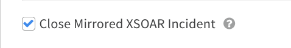
   6. To enable mirroring to close an incident in ServiceNow, under the **Mirrored ServiceNow Ticket closure method** dropdown, select the ticket closing method,
      or set the **Mirrored ServiceNow Ticket custom close state code** parameter, in order to override the default closure method with a custom state.
     
        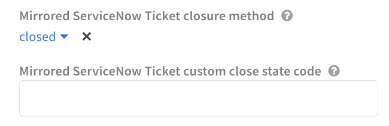

## JWT Profile Authentication Configuration

Grant access token to admin is not allowed.
Customer should have non-admin user with all necessary roles(only non-admin roles) in addition to existing  role snc_platform_rest_api_access that required to make API call

Prerequisites in order to support JWT
Create a Java Key Store and upload it to the instance
	(Accessing from the upper menu :All→System Definition→Certificates)
(Private key will be used as integration parameter)
Configure a JWT signing key (use keystore from above .Keep the Key Id -  it will be used as kid integration parameter) 
(All→System OAuth→JWT Keys)
Create a JWT provider with a JWT signing key
(Customer required to set  in Standard Claims the same values for aud, iss and sub that will be used as integration parameters. Claim Name sub in Standard Claims has to be existing non-admin servicenow user with all necessary roles)

(All→System OAuth→JWT providers)
Connect to an OAuth provider and create OAuth application registry
           (aud in JWT provider has to be equal to Client ID from OAuth JWT application - update JWT provider
If necessary.Value of Kid in JWT Verifier Maps has to be the  same as Key Id in JWT signing key -
 the value can be updated if necessary )
(All→System OAuth→Application Registry)


   5. Create API Access Policy or add Authentication profile to existing Policy
(All→System Web Services→API Access Policies→Rest API Access Policies )

IMPORTANT:

Standard Authentication Profile of type Oauth should be already present in ServiceNow and this one needs to be added to Policy.
API Access Policy should be configured as global in order to cover all available resources and not just now/table.


## Instance Creation Flow
This integration supports two types of authorization:
1. Basic authorization using username and password.
2. OAuth 2.0 authorization.

#### OAuth 2.0 Authorization
To use OAuth 2.0 authorization follow the next steps:
1. Login to your ServiceNow instance and create an endpoint for XSOAR to access your instance (please see [Snow OAuth](https://docs.servicenow.com/bundle/xanadu-platform-security/page/administer/security/concept/c_OAuthApplications.html) for more information). 
2. Copy the `Client Id` and `Client Secret` (press the lock next to the client secret to reveal it) that were automatically generated when creating the endpoint into the `Username` and `Password` fields of the instance configuration.
3. Select the `Use OAuth Login` checkbox and click the `Done` button.
4. Run the command `!servicenow-oauth-login` from the XSOAR CLI and fill in the username and password of the ServiceNow instance. This step generates an access token to the ServiceNow instance and is required only in the first time after configuring a new instance in the XSOAR platform.
5. (Optional) Test the created instance by running the `!servicenow-oauth-test` command.

**Notes:**
1. When running the `!servicenow-oauth-login` command, a refresh token is generated and will be used to produce new access tokens after the current access token has expired.
2. Every time the refresh token expires you will have to run the `servicenow-oauth-login` command again. Hence, we recommend setting the `Refresh Token Lifespan` field in the endpoint created in step 1 to a long period (can be set to several years). 
3. The grant type used to get an access token is `Resource owner password credentials`. See the [Snow documentation](https://docs.servicenow.com/bundle/xanadu-platform-security/page/administer/security/concept/c_OAuthApplications.html#d25788e201) for more information.


### Using Multi-Factor Authentication (MFA)
MFA can be used both when using basic authorization and when using OAuth 2.0 authorization, however we strongly recommend using OAuth 2.0 when using MFA.
If MFA is enabled for your user, follow the next steps:
1. Open the Google Authenticator application on your mobile device and make note of the number. The number refreshes every 30 seconds.
2. Enter your username and password, and append the One Time Password (OTP) that you currently see on your mobile device to your password without any extra spaces. For example, if your password is `12345` and the current OTP code is `424 058`, enter `12345424058`.

**Notes:**
1. When using basic authorization, you will have to update your password with the current OTP every time the current code expires (30 seconds), hence we recommend using OAuth 2.0 authorization.
2. For using OAuth 2.0 see the above instructions. The OTP code should be appended to the password parameter in the `!servicenow-oauth-login` command.

    | **Parameter** | **Description** | **Required** |
    |--------| --- | --- |
    | ServiceNow URL, in the format https://company.service-now.com/ |  | True |
    | Username/Client ID |  | False |
    | Password |  | False |
    | Use OAuth Login | Select this checkbox if to use OAuth 2.0 authentication. See \(?\) for more information. | False |
    | Default ticket type for running ticket commands and fetching incidents | The ticket type can be: incident, problem, change_request, sc_request, sc_task or sc_req_item. | False |
    | ServiceNow API Version (e.g. 'v1') |  | False |
    | Fetch incidents |  | False |
    | The query to use when fetching incidents |  | False |
    | How many incidents to fetch each time |  | False |
    | First fetch timestamp (&lt;number&gt; &lt;time unit&gt;, e.g., 12 hours, 7 days, 3 months, 1 year) |  | False |
    | Timestamp field to filter by (e.g., `opened_at`) This is how the filter is applied to the query: "ORDERBYopened_at^opened_at&gt;[Last Run]".<br/>To prevent duplicate incidents, this field is mandatory for fetching incidents. |  | False |
    | ServiceNow ticket column to be set as the incident name. Default is the incident number |  | False |
    | Incident type |  | False |
    | Get incident attachments |  | False |
    | Incident Mirroring Direction | Choose the direction to mirror the incident: Incoming \(from ServiceNow to Cortex XSOAR\), Outgoing \(from Cortex XSOAR to ServiceNow\), or Incoming and Outgoing \(from/to Cortex XSOAR and ServiceNow\). | False |
    | Use Display Value | Select this checkbox to retrieve comments and work notes without accessing the \`sys_field_journal\` table. | False |
    | Instance Date Format | Select the date format of your ServiceNow instance. Mandatory when using the \`Use Display Value\` option. More details under the troubleshooting section in the documentation of the integration. The integration supports the ServiceNow default time format (full form) `HH:mm:ss` with support to `a` notation for AM/PM. | False |
    | Comment Entry Tag | Choose the tag to add to an entry to mirror it as a comment in ServiceNow. | False |
    | Work Note Entry Tag | Choose the tag to add to an entry to mirror it as a work note in ServiceNow. | False |
    | File Entry Tag To ServiceNow | Choose the tag to add to an entry to mirror it as a file in ServiceNow. | False |
    | File Entry Tag From ServiceNow | Choose the tag to add to an entry to mirror it as a file from ServiceNow. | False |
    | Timestamp field to query for updates as part of the mirroring flow | According to the timestamp in this field, records will be queried to check for updates. | False |
    | How many incidents to mirror incoming each time | If a greater number of incidents than the limit were modified, then they won't be mirrored in. | False |
    | Custom Fields to Mirror | Custom \(user defined\) fields in the format: u_fieldname1,u_fieldname2 custom fields start with a 'u_'. These fields will be included in the mirroring capabilities, if added here. | False |
    | Mirrored XSOAR Ticket closure method | Define how to close the mirrored tickets in Cortex XSOAR. Choose 'resolved' to enable reopening from the UI. Otherwise, choose 'closed'. Choose 'None' to disable closing the mirrored tickets in Cortex XSOAR. | False |
    | Mirrored XSOAR Ticket custom close state code | Define how to close the mirrored tickets in Cortex XSOAR with a custom state. Enter here a comma-separated list of custom closure state codes and their labels (acceptable format example: “10=Design,11=Development,12=Testing”) to override the default closure method. Note that a matching user-defined list of custom close reasons must be configured as a "Server configuration" in Cortex XSOAR. Not following this format will result in closing the incident with a default close reason. | False |
    | Mirrored XSOAR Ticket custom close resolution code | Define how to close the mirrored tickets in Cortex XSOAR with a custom resolution code. Enter a comma-separated list of custom resolution codes and their labels (acceptable format example: “10=Design,11=Development,12=Testing”) to override the default closure method. Note that a matching user-defined list of custom close reasons must be configured as a "Server configuration" in Cortex XSOAR. Not following this format will result in closing the incident with a default close reason. | False |
    | Mirrored ServiceNow Ticket closure method | Define how to close the mirrored tickets in ServiceNow, choose 'resolved' to enable reopening from the UI. Otherwise, choose 'closed'. | False |
    | Mirrored ServiceNow Ticket custom close state code | Define how to close the mirrored tickets in ServiceNow with custom state. Enter here the custom closure state code \(should be an integer\) to override the default closure method. If the closure code does not exist, the default one will be used instead. | False |
    | Mirror Existing Notes For New Fetched Incidents | When enabled, comments and work notes are mirrored as note entries for each newly fetched incident. Note: This setting triggers an API call for each incident during the first mirroring, potentially causing overload if numerous incidents are present. | False |
    | Use system proxy settings |  | False |
    | Trust any certificate (not secure) |  | False |
    | Incidents Fetch Interval |  | False |
    | Advanced: Minutes to look back when fetching | Use this parameter to determine how long backward to look in the search for incidents that were created before the last run time and did not match the query when they were created. | False |


3. Click **Test** to validate the URLs, token, and connection.
4. Click **Done.**

## Fetch Incidents
The integration fetches newly created tickets according to the following parameters,
which you define in the instance configuration: ticket_type, query, and limit.
For the first fetch, the integration will fetch incidents that were created 10 minutes earlier. 
After that, the integration will fetch incidents created after the timestamp of the last fetch.

**look-back parameter note**:
In case the **look-back** parameter is initialized with a certain value and during a time that incidents were fetched, if changing 
the look back to a number that is greater than the previous value, then in the initial incident fetching there will be incidents duplications.
If the integration was already set with look back > 0, and the look-back is not being increased at any point of time, then those incident duplications would not occur.
Note that using a look-back value that is very large (more than an hour) can lead to an increase in the memory usage of the system in some cases, and it is highly unrecommended.
If there is a need to fetch incidents that require a long look-back to get fetched (for tracking issues, for example), use the mirroring feature and filter the results using the relevant tags instead of using the look-back feature. You can create a custom mapper and track the relevant fields. 

## Configure Incident Mirroring
**This feature is compliant with XSOAR version 6.0 and above.**  
When mirroring incidents, you can make changes in ServiceNow that will be reflected in Cortex XSOAR, or vice versa. 
You can also attach files from either of the systems which will then be available in the other system.  

The following instructions include steps for configuring the integration and incoming and outgoing mappers. However, they do not cover every option available in the integration nor classification and mapping features. 
For information about classification and mapping see [Classification and Mapping (Cortex XSOAR 6.13)](https://docs-cortex.paloaltonetworks.com/r/Cortex-XSOAR/6.13/Cortex-XSOAR-Administrator-Guide/Classification-and-Mapping) or [Classification and Mapping (Cortex XSOAR 8 Cloud)](https://docs-cortex.paloaltonetworks.com/r/Cortex-XSOAR/8/Cortex-XSOAR-Cloud-Documentation/Classification-and-mapping) or [Classification and Mapping (Cortex XSOAR 8.7 On-prem)](https://docs-cortex.paloaltonetworks.com/r/Cortex-XSOAR/8.7/Cortex-XSOAR-On-prem-Documentation/Classification-and-mapping).  

**Note:**  
- For Cortex XSOAR version 6.1 only, the final source of truth for an incident are the values in Cortex XSOAR.  For example, if you change the severity in Cortex XSOAR and then change it back in ServiceNow, the final value that will be presented is the one in Cortex XSOAR. For versions 6.2 and later, if mirroring is in both directions then the latest update is the source of truth. 
- The mirroring settings apply only for incidents that are fetched after applying the settings. Pre-existing comments or work notes are not fetched/mirrored at the time of incident creation.
- To use a custom mapper, you must first duplicate the mapper and edit the field in the copy of the mapper. If you detach the out of the box mapper and make changes to it, the pack does not automatically get updates.

To set up incident mirroring you need to:  
1. Configure the ServiceNow Service Account roles.
2. Configure mirroring for ServiceNow trigger incidents or configure mirroring for other trigger incidents.

### Configure the ServiceNow Service Account Roles  
To use ServiceNow on Cortex XSOAR, ensure your service account has the following roles required to make API calls:  
- Rest_api_explorer
- Snc_platform_rest_api_access
- itil (optional)

**Note:**
If you choose to give permissions only for specific tables, you then need to add to your user account the specific tables you want to have access to. Make sure you have the correct role so you have permissions to work with the relevant table. Keep in mind that these permissions may not suffice for managing records in some tables.
- Read access to sys_journal_field (this is an elevated privilege) for accessing comments and work notes and for incoming mirroring. This is **not required** if you have `Use Display Value` enabled with `Instance Date Format` defined.  

 **Note:**  
   See this ServiceNow community link for [giving elevated read access](https://community.servicenow.com/community?id=community_question&sys_id=b4051bf4db4c1cd823f4a345ca9619dc) and potential risks.

  

### Configure Incident Mirroring When the Trigger Incident is ServiceNow  
When the trigger incident is ServiceNow, you use the **ServiceNow Classifier** and leave the Incident type as N/A, with either the default incoming and outgoing mappers or optional custom mappers.

#### STEP 1 - Configure the ServiceNow v2 Integration Instance for Mirroring.
1. Navigate to **Integrations** and search for **ServiceNow v2**.
2. Click **Add instance**.
3. Select **Fetches incidents**.
4. Under **Classifier**, select **ServiceNow Classifier**.  
    **Note:**  
    You define either the **Classifier** or the **Incident type** (not both). It is recommended to define the **Classifier** and leave **Incident type** N/A to enable labeling custom incident types under the ServiceNow Classifier.

5. Under **Mapper (incoming)**, for default mapping select ServiceNow - Incoming Mapper. For custom mapping, follow the instructions in STEP 2 and then select the custom mapper name.
6. Under **Mapper (outgoing)**, for default mapping select ServiceNow - Outgoing Mapper. For
custom mapping, follow the instructions in STEP 3 and then select the custom mapper name.

 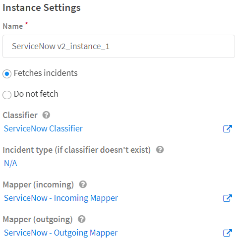

7. Enter the connection parameters.  
    - Confirm whether your organization uses basic authorization or OAuth authorization (most use basic) and enter the relevant authorization details.  
    -  Leave **ServiceNow API Version** empty since ServiceNow typically automatically provides the appropriate version. 
8. Under **The query to use when fetching incidents**, the default query is to filter for new incidents: stateNOT IN6,7, where 6= resolved incidents and 7= closed incidents. For a different query, ask your ServiceNow representative to provide the exact states and their numbers.
9. Select **Get incident attachments** to retrieve attachments from ServiceNow incident creation in Cortex XSOAR.
10. Select the **Incident Mirroring Direction**:  
    - **In** - Mirrors changes on the ServiceNow ticket in to the Cortex XSOAR ticket.
    - **Out** - Mirrors changes on the Cortex XSOAR ticket to the ServiceNow ticket.
    - **Both** - Mirrors changes both in and out on both tickets.
11. Enable the checkbox for **Use Display Value** if you want to fetch comments and work notes without using sys_journal_field table which required an elevated read only permission.
12. If **Use Display Value** is enabled, **Instance Date Format** needs to be set to the date format that matches the date format used in ServiceNow by the user account used to configure the instance.

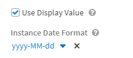

13. Set the Timestamp field to query as part of the mirroring flow. This defines the ticket_last_update - the epoch timestamp when the ServiceNow incident was last updated. The default is sys_updated_on.
14. Enter the relevant **Comment Entry Tag**, **Work Note Entry Tag**, **File Entry Tag To ServiceNow** and **File Entry Tag From ServiceNow** values.  
These values are mapped to the **dbotMirrorTags** incident field in Cortex XSOAR, which defines how Cortex XSOAR handles comments when you tag them in the War Room.  
**Note:**  
These tags work only for mirroring comments, work notes, and files from Cortex XSOAR to ServiceNow.

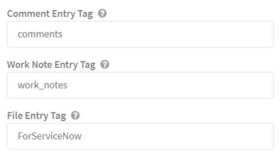

15. Configure any **Custom Fields to Mirror**. These must start with "u_". This is available for ServiceNow v2 version 2.2.10 and later.  
  **Note:**  
  To enable mirroring custom fields, make a copy of the incoming and outgoing mappers and add the custom fields to the copies (see STEP 2 and STEP 3). Select these copies in the integration instance **Mapper (incoming)** and **Mapper (outgoing)** settings.
16. To enable mirroring when closing an incident or ticket in Cortex XSOAR and ServiceNow, select the *closed* option from the **Mirrored XSOAR Ticket closure method** dropdown and **Mirrored ServiceNow Ticket closure method** respectively.
17. Click **Done**.

#### STEP 2 (Optional) Configure the Incoming Mapper by Incident Type for Custom Fields  
**Note:**
Any modifications require that the mappers be cloned before any changes can be applied.

1. Navigate to **Classification and Mapping** and for **Incidents** search for the **ServiceNow - Incoming Mapper**.
2. Select it and click **Duplicate**.
3. Under the **Incident Type** dropdown, select ServiceNow Create Ticket and Mirror.
4. Verify the mapper has these fields mapped. They will pull the values configured on the integration instance settings at the time of ingestion.
  
     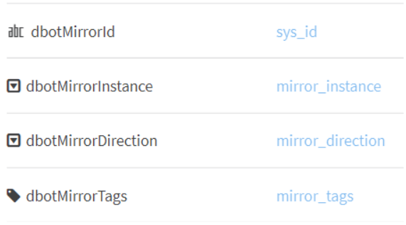 

    - **dbotMirrorId** - dbotMirrorId - the field used by the third-party integration to identify the ticket. This should be the sys_id of the ServiceNow ticket. The value is mapped to incident.servicenowticketid.
    - **dbotMirrorDirection** - determines whether mirroring is incoming, outgoing, or both. Default is Both. This should match the instance configuration.        
    - **dbotMirrorInstance** - determines the ServiceNow instance with which to mirror. This should match the instance configuration.
    - **dbotMirrorLastSync** - determines the field by which to indicate the last time that the systems synchronized.
    - **dbotMirrorTags** - determines the tags that you need to add in Cortex XSOAR for entries to be pushed to ServiceNow. They should be copied from the tags in the instance configuration. These are also the tags that must be put on the War Room record in order for it to sync.
      - To mirror files, use the **ForServiceNow** tag. 
      - To mirror general notes, use the **comments** tag.
      - To mirror private notes that can be read only by users with the necessary permissions, use the **work_notes** tag.
    - Configure any custom fields you want mapped to Cortex XSOAR. Custom fields start with “u_” and are available for ServiceNow v2 version 2.2.10 and later. These must be added to the integration instance **Custom Fields to Mirror** setting.

#### STEP 3 - Modify the Outgoing Mapper  
**Note:**  
Any modifications require that the mappers be cloned before any changes can be applied.
1. Navigate to **Classification and Mapping**, and for **Incidents** search for the **ServiceNow - Outgoing Mapper.**
2. Select it and click **Duplicate**.  
  The left side of the screen shows the ServiceNow fields to which to map and the right side of the
screen shows the Cortex XSOAR fields by which you are mapping.
3. Under the **Incident Type** dropdown, select the relevant incident type (for example **ServiceNow Ticket**).
4. Under **Schema Type**, select **incident**. The Schema Type represents the ServiceNow entity that
you are mapping to. In our example it is an incident, but it can also be any other kind of ticket that
ServiceNow supports.
5. On the right side of the screen, under **Incident**, select the incident based on which you want to
match.
6. Change the mapping according to your needs, including any fields you want mapped outward to ServiceNow and any custom fields. Make sure the custom fields you want mirrored are added to the integration instance settings.
7. Save your changes.

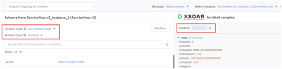


#### STEP 4 - Create an Incident in ServiceNow  
For purposes of this use case, it can be a simple incident. The new ticket will be ingested in Cortex XSOAR in approximately one minute.

#### STEP 5 - Add a Note to the Incident in Cortex XSOAR    
In the example below, we have written *A comment from Cortex XSOAR to ServiceNow*.
1. Click Actions > Tags and add the comments tag.
2. Add a file to the incident and mark it with the ForServiceNow tag.

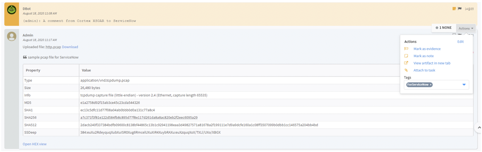  

3. Navigate back to the incident in ServiceNow and within approximately one minute, the changes will be reflected there, too.  
  You can make additional changes like closing the incident or changing severity and those will be reflected in both systems.

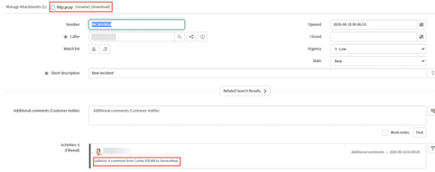


### Configure Incident Mirroring When the Trigger Incident is **Not** ServiceNow  

You can set up any source integration to create a ServiceNow ticket based on a fetched incident and mirror the ticket in Cortex XSOAR. To do this you need to:    
- Configure the ServiceNow v2 integration to map the appropriate fields from the **ServiceNow Create Ticket and Mirror** incident type to the relevant trigger incident type (for example, Phishing Custom).
- Set up the source integration to create a ServiceNow ticket and start mirroring.

#### STEP 1 - Configure the ServiceNow v2 Integration Instance for Mirroring.
1. Navigate to **Classification and Mapping**. For **Incidents**, search for **ServiceNow - Incoming Mapper** and **ServiceNow - Outgoing Mapper**.
2. For each mapper, click **Duplicate**.  
   Your copied mappers will be called **ServiceNow - Incoming Mapper_copy** and **ServiceNow - Outgoing Mapper_copy**, you can rename them. The copied mappers appear in the drop down for the **Mapper (incoming)** and **Mapper (outgoing)** integration instance settings fields.
3. Navigate to **Integrations** and search for **ServiceNow v2**.
4. Click **Add instance**.
5. Select **Do not Fetch**.
6. Under **Classifier**, select ServiceNow Classifier.  
    **Note:**  
    You define either the **Classifier** or the **Incident type** (not both). It is recommended to define the **Classifier** and leave **Incident type** N/A to enable labeling custom incident types under the ServiceNow Classifier.

7. Under **Mapper (incoming)**, select **ServiceNow - Incoming Mapper_copy** (or whatever you renamed it).
8. Under **Mapper (outgoing)**, select **ServiceNow - Outgoing Mapper_copy** (or whatever you renamed it). 
9. Enter the connection parameters.  
    - Confirm whether your organization uses basic authorization or OAuth authorization (most use basic) and enter the relevant authorization details.  
    -  Leave **ServiceNow API Version** empty since ServiceNow typically automatically provides the appropriate version. 
10. Under **The query to use when fetching incidents**, the default query is to filter for new incidents: stateNOT IN6,7, where 6= resolved incidents and 7= closed incidents. For a different query, ask your ServiceNow representative to provide the exact states and their numbers.
11. Select **Get incident attachments** to retrieve attachments from ServiceNow incident creation in Cortex XSOAR.
12. Select the **Incident Mirroring Direction**:  
    - **In** - Mirrors changes on the ServiceNow ticket in to the Cortex XSOAR ticket.
    - **Out** - Mirrors changes on the Cortex XSOAR ticket to the ServiceNow ticket.
    - **Both** - Mirrors changes both in and out on both tickets.
13. Enable the checkbox for **Use Display Value** if you want to fetch comments and work notes without using sys_journal_field table which required an elevated read only permission.
14. If **Use Display Value** is enabled, **Instance Date Format** needs to be set to the date format that matches the date format used in ServiceNow by the user account used to configure the instance.


15. Set the **Timestamp field to query as part of the mirroring flow**. This defines the ticket_last_update - the epoch timestamp when the ServiceNow incident was last updated. The default is sys_updated_on.
16. Enter the relevant **Comment Entry Tag**, **Work Note Entry Tag**, **File Entry Tag To ServiceNow** and **File Entry Tag From ServiceNow** values.
These values are mapped to the **dbotMirrorTags** incident field in Cortex XSOAR, which defines how Cortex XSOAR handles comments when you tag them in the War Room.  
**Note:**  
These tags work only for mirroring comments from Cortex XSOAR to ServiceNow.


17. Configure any **Custom Fields to Mirror**. These must start with "u_". This is available for ServiceNow v2 version 2.2.10 and later.  
  **Note:**  
  To enable mirroring custom fields, make a copy of the incoming and outgoing mappers and add the custom fields to the copies (see STEP 2 and STEP 3). Select these copies in the integration instance **Mapper (incoming)** and **Mapper (outgoing)** settings.
18. To enable mirroring when closing an incident or ticket in Cortex XSOAR and ServiceNow, select the *closed* option from the **Mirrored XSOAR Ticket closure method** dropdown and **Mirrored ServiceNow Ticket closure method** respectively.
19. Click **Done**.

#### STEP 2 (Optional) Configure the Incoming Mapper by Incident Type for Custom Fields  
**Note:**
Any modifications require that the mappers be cloned before any changes can be applied.

1. Navigate to **Classification and Mapping** and for **Incidents** search for the **ServiceNow - Incoming Mapper_copy** (or whatever you renamed it).
2. Under the **Incident Type** dropdown, select the relevant triggering incident type, for example Phishing.
3. Verify the mapper has these fields mapped. They will pull the values configured on the integration instance settings at the time of ingestion.
  
      

    - **dbotMirrorId** - dbotMirrorId - the field used by the third-party integration to identify the ticket. This should be the sys_id of the ServiceNow ticket. The value is mapped to incident.servicenowticketid.
    - **dbotMirrorDirection** - determines whether mirroring is incoming, outgoing, or both. Default is Both. This should match the instance configuration.        
    - **dbotMirrorInstance** - determines the ServiceNow instance with which to mirror. This should match the instance configuration.
    - **dbotMirrorLastSync** - determines the field by which to indicate the last time that the systems synchronized.
    - **dbotMirrorTags** - determines the tags that you need to add in Cortex XSOAR for entries to be pushed to ServiceNow. They should be copied from the tags in the instance configuration. These are also the tags that must be put on the War Room record in order for it to sync.
      - To mirror files from XSOAR to ServiceNow, use the **ForServiceNow** tag. 
      - Mirrored files from ServiceNow to XSOAR will be tagged by *default* with the **FromServiceNow** tag.
      - To mirror general notes, use the **comments** tag.
      - To mirror private notes that can be read only by users with the necessary permissions, use the **work_notes** tag.
    - Configure any custom fields you want mapped to Cortex XSOAR. Custom fields start with “u_” and are available for ServiceNow v2 version 2.2.10 and later. These must be added to the integration instance **Custom Fields to Mirror** setting.  
4. Save your changes.

#### STEP 3 - Modify the Outgoing Mapper for Custom Fields  
**Note:**  
Any modifications require that the mappers be cloned before any changes can be applied.
1. Navigate to **Classification and Mapping**, and for **Incidents** search for the **ServiceNow - Outgoing Mapper_copy** (or whatever you renamed it).
2. Under the **Incident Type** dropdown, select the relevant incident type (for example **ServiceNow Ticket**).
3. Under **Schema Type**, select **incident**. The Schema Type represents the ServiceNow entity that
you are mapping to. In our example it is an incident, but it can also be any other kind of ticket that
ServiceNow supports.
4. On the right side of the screen, under **Incident**, select the incident based on which you want to
match.  
   The left side of the screen shows the ServiceNow fields to which to map and the right side of the screen shows the Cortex XSOAR fields by which you are mapping.
5. Change the mapping according to your needs, including any fields you want mapped outward to ServiceNow and any custom fields. Make sure the custom fields you want mirrored are added to the integration instance settings.
6. Save your changes.


#### STEP 4 - Set up Your Source Integration  
Set up your source integration so that after fetching a trigger incident a ServiceNow ticket is created and mirroring starts.  
1. Fetch an incident with your chosen integration. For example, for Phishing using any email integration (Gmail, MSGraph, O365).
2. Classify and map the incident fields.
3. Create a task in the playbook that creates a ServiceNow ticket followed by a set incident task that starts the mirroring capability.  

Example:
The following shows the Create New Record playbook task, which creates a ServiceNow ticket.  

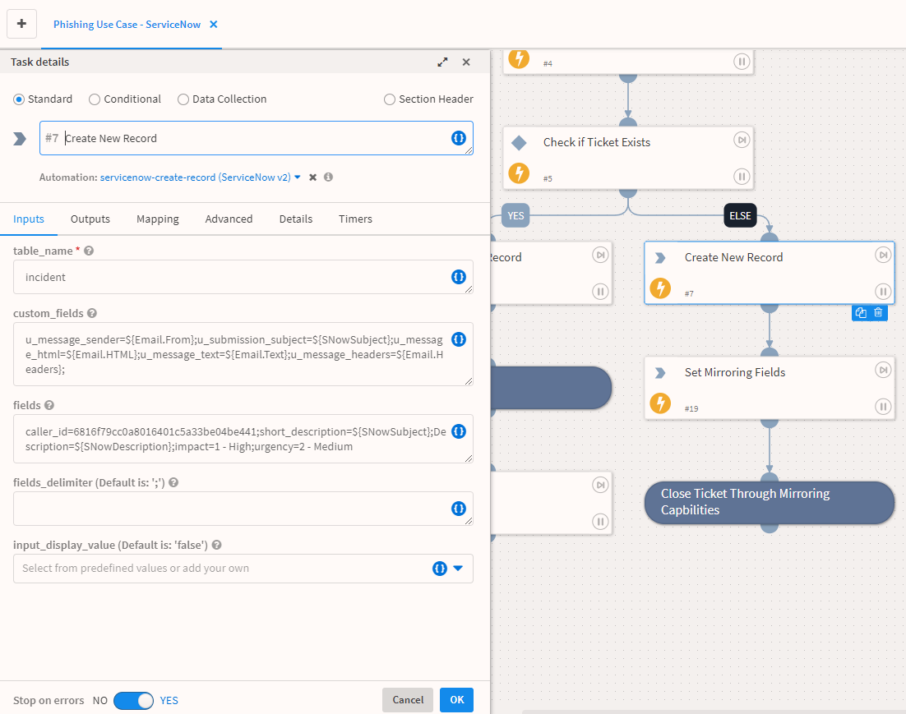

The Create New Record task is followed by the Set Mirroring Fields task, which starts the mirroring capability.  

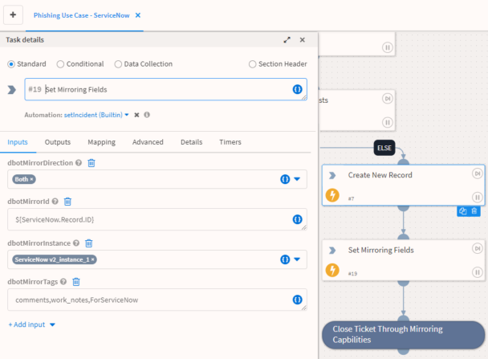

The new ServiceNow ticket will be ingested in Cortex XSOAR in approximately one minute.

#### STEP 5 - Add a Note to the Incident in Cortex XSOAR  
In the example below, we have written *A comment from Cortex XSOAR to ServiceNow*.
1. Click Actions > Tags and add the comments tag.
2. Add a file to the incident and mark it with the ForServiceNow tag.

  

3. Navigate back to the incident in ServiceNow and within approximately one minute, the changes will be reflected there, too.  
  You can make additional changes like closing the incident or changing severity and those will be reflected in both systems.


## Commands
You can execute these commands from the Cortex XSOAR CLI, as part of an automation, or in a playbook.
After you successfully execute a command, a DBot message appears in the War Room with the command details.
### servicenow-login
***
This function should be used once before running any command when using OAuth authentication.

#### Base Command

`servicenow-login`
#### Input

| **Argument Name** | **Description** | **Required** |
| --- | --- | --- |
| username | The username that should be used for login. | Required | 
| password | The password that should be used for login. | Required | 

#### Context Output

There is no context output for this command.

#### Command Example
```!servicenow-login username=username password=password```

#### Context Example
```json
{}
```

#### Human Readable Output

>### Logged in successfully

### servicenow-test
***
Test the instance configuration when using OAuth authorization.


#### Base Command

`servicenow-test`
#### Input

There are no input arguments for this command.

#### Context Output

There is no context output for this command.

#### Command Example
```!servicenow-test```

#### Context Example
```json
{}
```

#### Human Readable Output

>### Instance Configured Successfully


### servicenow-get-ticket
***
Retrieves ticket information by ticket ID.


#### Base Command

`servicenow-get-ticket`
#### Input

| **Argument Name** | **Description** | **Required** |
| --- | --- | --- |
| id | Ticket system ID for which to retrieve information. | Optional | 
| ticket_type | Ticket type. Can be "incident", "problem", "change_request", "sc_request", "sc_task", "sc_req_item", or "sn_si_incident". Default is "incident". | Optional |
| number | Ticket number to retrieve. | Optional | 
| get_attachments | If "true" will retrieve ticket attachments.Note this option will always use the v1 API version, as it is not supported in v2. Default is "false". | Optional | 
| custom_fields | Custom fields on which to query. For example: state_code=AR,time_zone=PST. | Optional | 
| additional_fields | Additional fields to display in the War Room entry and incident context. | Optional | 


#### Context Output

| **Path** | **Type** | **Description** |
| --- | --- | --- |
| ServiceNow.Ticket.ID | string | ServiceNow ticket ID. | 
| ServiceNow.Ticket.OpenedBy | string | ServiceNow ticket opener ID. | 
| ServiceNow.Ticket.CreatedOn | date | ServiceNow ticket creation date. | 
| ServiceNow.Ticket.Assignee | string | ServiceNow ticket assignee ID. | 
| ServiceNow.Ticket.State | string | ServiceNow ticket state. | 
| ServiceNow.Ticket.Summary | string | ServiceNow ticket short summary. | 
| ServiceNow.Ticket.Number | string | ServiceNow ticket number. | 
| ServiceNow.Ticket.Active | boolean | ServiceNow ticket active. | 
| ServiceNow.Ticket.AdditionalComments | string | ServiceNow ticket comments. | 
| ServiceNow.Ticket.Priority | string | ServiceNow ticket priority. | 
| ServiceNow.Ticket.OpenedAt | date | ServiceNow ticket opening time. | 
| ServiceNow.Ticket.ResolvedBy | string | ServiceNow ticket resolver ID. | 
| ServiceNow.Ticket.CloseCode | string | ServiceNow ticket close code. | 
| File.Info | string | Attachment file info. | 
| File.Name | string | Attachment file name. | 
| File.Size | number | Attachment file size. | 
| File.SHA1 | string | Attachment file SHA1 hash. | 
| File.SHA256 | string | Attachment file SHA256 hash. | 
| File.EntryID | string | Attachment file entry ID. | 
| File.Type | string | Attachment file type. | 
| File.MD5 | string | Attachment file MD5 hash. | 


#### Command Example
```!servicenow-get-ticket number=INC0000040```

#### Context Example
```
{
    "ServiceNow": {
        "Ticket": {
            "Active": "true",
            "Assignee": "admin",
            "CreatedOn": "2020-01-26 00:43:54",
            "Creator": "admin",
            "ID": "id",
            "Number": "INC0000040",
            "OpenedAt": "2020-01-26 00:42:45",
            "OpenedBy": "admin",
            "Priority": "3 - Moderate",
            "State": "3",
            "Summary": "JavaScript error on hiring page of corporate website"
        }
    },
    "Ticket": {
        "Active": "true",
        "Assignee": "admin",
        "CreatedOn": "2020-01-26 00:43:54",
        "Creator": "admin",
        "ID": "id",
        "Number": "INC0000040",
        "OpenedAt": "2020-01-26 00:42:45",
        "OpenedBy": "admin",
        "Priority": "3 - Moderate",
        "State": "3",
        "Summary": "JavaScript error on hiring page of corporate website"
    }
}
```

#### Human Readable Output

>### ServiceNow ticket
>|System ID|Number|Impact|Urgency|Severity|Priority|State|Created On|Created By|Active|Description|Opened At|Short Description|
>|---|---|---|---|---|---|---|---|---|---|---|---|---|
>| id | INC0000040 | 2 - Medium | 2 - Medium | 3 - Low | 3 - Moderate | 3 - On Hold | 2020-01-26 00:43:54 | admin | true | Seeing JavaScript error message on hiring page on Explorer and Firefox. | 2020-01-26 00:42:45 | JavaScript error on hiring page of corporate website |


### servicenow-create-ticket
***
Creates new ServiceNow ticket.


#### Base Command

`servicenow-create-ticket`
#### Input

| **Argument Name** | **Description** | **Required** |
| --- | --- | --- |
| short_description | Short description of the ticket. | Optional | 
| ticket_type | Ticket type. Can be "incident", "problem", "change_request", "sc_request", "sc_task", "sc_req_item", "sn_si_incident" or "std_change_template". Default is "incident". | Optional |
| urgency | Ticket urgency. You can either select from the predefined options or enter another value, for example: "Urgent" or "5". | Optional | 
| severity | Ticket severity. You can either select from the predefined options or enter another value, for example: "Urgent" or "5". | Optional | 
| impact | Ticket impact. | Optional | 
| active | Whether to set the ticket as Active. Can be "true" or "false". | Optional | 
| activity_due | The ticket activity due date, in the format "2016-07-02 21:51:11". | Optional | 
| additional_assignee_list | List of users assigned to the ticket. | Optional | 
| approval_history | Ticket history approval. | Optional | 
| approval_set | The ticket approval set date, in the format "2016-07-02 21:51:11". | Optional | 
| assigned_to | User assigned to the ticket. | Optional | 
| business_duration | Business duration, in the format: YYYY-MM-DD HH:MM:SS. | Optional | 
| business_service | Business service. | Optional | 
| business_stc | Business source. | Optional | 
| business_criticality | Business criticality of the ticket. | Optional |
| calendar_duration | Calendar duration, in the format: YYYY-MM-DD HH:MM:SS. | Optional |
| caller_id | Caller ID (UID format). | Optional | 
| category | Category of the ticket. | Optional | 
| caused_by | UID Format | Optional | 
| close_code | Ticket's close code. Can be "Solved (Work Around)", "Solved (Permanently)", "Solved Remotely (Work Around)", "Solved Remotely (Permanently)", "Not Solved (Not Reproducible)", "Not Solved (Too Costly)", or "Closed/Resolved by Caller". | Optional | 
| close_notes | Close notes of the ticket. | Optional | 
| closed_at | When the ticket was closed, in the format: YYYY-MM-DD HH:MM:SS. | Optional | 
| closed_by | User who closed the ticket. | Optional | 
| cmdb_ci | UID Format. | Optional | 
| comments | Format type journal input. | Optional | 
| comments_and_work_notes | Format type journal input. | Optional | 
| company | Company (UID format). | Optional | 
| contact_type | Contact type. | Optional | 
| correlation_display | Correlation display. | Optional | 
| correlation_id | Correlation ID. | Optional | 
| delivery_plan | Delivery plan (UID format). | Optional | 
| display | Whether to display comments, work notes, and so on. Can be "true" or "false". | Optional | 
| description | Ticket description. | Optional | 
| due_date | Ticket due date, in the format: YYYY-MM-DD HH:MM:SS. | Optional | 
| escalation | Escalation | Optional | 
| expected_start | Expected start date/time, in the format: YYYY-MM-DD HH:MM:SS. | Optional | 
| follow_up | Follow up date/time, in the format: YYYY-MM-DD HH:MM:SS. | Optional | 
| group_list | UID format list (group). | Optional | 
| knowledge | Whether the ticket is solved in the knowledge base. Can be "true" or "false". | Optional | 
| location | Location of the ticket. | Optional | 
| made_sla | SLA of the ticket. | Optional | 
| notify | Whether to be notified about this ticket. Can be "1" or "0". | Optional | 
| order | Order number. | Optional | 
| parent | UID Format | Optional | 
| parent_incident | UID Format | Optional | 
| problem_id | UID Format | Optional | 
| reassignment_count | The number of users included in this ticket. | Optional | 
| reopen_count | How many times the ticket has been reopened. | Optional |
| resolved_at | The date/time that the ticket was resolved, in the format: YYYY-MM-DD HH:MM:SS. | Optional |
| resolved_by | ID of the user that resolved the ticket. | Optional |
| risk_score | Incident risk score. | Optional |
| rfc | UID | Optional | 
| sla_due | SLA due date/time, in the format: YYYY-MM-DD HH:MM:SS. | Optional | 
| subcategory | Ticket subcategory. | Optional | 
| sys_updated_by | Last updated by. | Optional | 
| sys_updated_on | Last date/time that the system was updated, in the format: YYYY-MM-DD HH:MM:SS. | Optional | 
| user_input | Input from the end user. | Optional | 
| watch_list | A list of watched tickets. | Optional | 
| work_end | Format: YYYY-MM-DD HH:MM:SS | Optional | 
| work_notes | Format journal list | Optional | 
| work_notes_list | List work notes UIDs. | Optional | 
| work_start | Date/time when work started on the ticket. | Optional | 
| assignment_group | The sys_id of the group to assign. | Optional | 
| incident_state | The number that represents the incident state. | Optional | 
| number | Ticket number. | Optional | 
| priority | Priority of the ticket. | Optional | 
| template | Template name to use as a base to create new tickets. | Optional | 
| custom_fields | Custom (user defined) fields in the format: fieldname1=value;fieldname2=value; custom fields start with a "u_". | Optional | 
| change_type | Type of Change Request ticket. Can be "normal", "standard", or "emergency". Default is "normal". | Optional | 
| state | State of the ticket, for example: "Closed" or "7" or "7 - Closed". | Optional | 
| opened_at |  Date/time the ticket was opened, in the format: YYYY-MM-DD HH:MM:SS. | Optional | 
| caller | Caller system ID. | Optional | 
| approval | Ticket approval. | Optional | 
| additional_fields | Additional fields in the format: fieldname1=value;fieldname2=value; | Optional | 
| input_display_value | Flag that indicates whether to set field values using the display value or the actual value. True will treat the input value as the display value. False treats the input values as actual values. The default setting is false. | Optional |

For more information regarding the input_display_value Argument, please see: https://docs.servicenow.com/bundle/xanadu-platform-administration/page/administer/exporting-data/concept/query-parameters-display-value.html


#### Context Output

| **Path** | **Type** | **Description** |
| --- | --- | --- |
| ServiceNow.Ticket.ID | string | ServiceNow ticket ID. | 
| ServiceNow.Ticket.OpenedBy | string | ServiceNow ticket opener ID. | 
| ServiceNow.Ticket.CreatedOn | date | ServiceNow ticket creation date. | 
| ServiceNow.Ticket.Assignee | string | ServiceNow ticket assignee ID. | 
| ServiceNow.Ticket.State | string | ServiceNow ticket state. | 
| ServiceNow.Ticket.Summary | string | ServiceNow ticket short summary. | 
| ServiceNow.Ticket.Number | string | ServiceNow ticket number. | 
| ServiceNow.Ticket.Active | boolean | ServiceNow ticket active. | 
| ServiceNow.Ticket.AdditionalComments | string | ServiceNow ticket comments. | 
| ServiceNow.Ticket.Priority | string | ServiceNow ticket priority. | 
| ServiceNow.Ticket.OpenedAt | date | ServiceNow ticket opening time. | 
| ServiceNow.Ticket.ResolvedBy | string | ServiceNow ticket resolver ID. | 
| ServiceNow.Ticket.CloseCode | string | ServiceNow ticket close code. | 


#### Command Example
```!servicenow-create-ticket active=true severity="2 - Medium" short_description="Ticket example"```

#### Context Example
```
{
    "ServiceNow": {
        "Ticket": {
            "Active": "true",
            "CreatedOn": "2020-05-10 09:04:06",
            "Creator": "admin",
            "ID": "id",
            "Number": "INC0010002",
            "OpenedAt": "2020-05-10 09:04:06",
            "OpenedBy": "admin",
            "Priority": "5 - Planning",
            "State": "1",
            "Summary": "Ticket exmaple"
        }
    },
    "Ticket": {
        "Active": "true",
        "CreatedOn": "2020-05-10 09:04:06",
        "Creator": "admin",
        "ID": "id",
        "Number": "INC0010002",
        "OpenedAt": "2020-05-10 09:04:06",
        "OpenedBy": "admin",
        "Priority": "5 - Planning",
        "State": "1",
        "Summary": "Ticket example"
    }
}
```

#### Human Readable Output

>### ServiceNow ticket was created successfully.
>|System ID|Number|Impact|Urgency|Severity|Priority|State|Created On|Created By|Active|Opened At|Short Description|
>|---|---|---|---|---|---|---|---|---|---|---|---|
>| id | INC0010002 | 3 - Low | 3 - Low | 2 - Medium | 5 - Planning | 1 - New | 2020-05-10 09:04:06 | admin | true | 2020-05-10 09:04:06 | Ticket example |


### servicenow-update-ticket
***
Updates the specified ticket.


#### Base Command

`servicenow-update-ticket`
#### Input

| **Argument Name** | **Description** | **Required** |
| --- | --- | --- |
| short_description | Short description of the ticket. | Optional | 
| ticket_type | Ticket type. Can be "incident", "problem", "change_request", "sc_request", "sc_task", "sc_req_item", or "sn_si_incident". Default is "incident". | Optional |
| urgency | Ticket urgency. You can either select from the predefined options or enter another value, for example: "Urgent" or "5". | Optional | 
| severity | Ticket severity. You can either select from the predefined options or enter another value, for example: "Urgent" or "5". | Optional | 
| impact | Ticket impact. | Optional | 
| active | Whether the ticket is Active. Can be "true" or "false". | Optional | 
| activity_due | The ticket activity due date, in the format: "2016-07-02 21:51:11". | Optional | 
| additional_assignee_list | List of users assigned to the ticket. | Optional | 
| approval_history | Ticket history approval. | Optional | 
| approval_set | The ticket approval set date/time, in the format: "2016-07-02 21:51:11". | Optional | 
| assigned_to | User assigned to the ticket. | Optional | 
| business_duration | Business duration, in the format: YYYY-MM-DD HH:MM:SS. | Optional | 
| business_service | Business service. | Optional |
| business_stc | Business source. | Optional |
| business_criticality | Business criticality of the ticket. | Optional |
| calendar_duration | Calendar duration, in the format: YYYY-MM-DD HH:MM:SS. | Optional |
| caller_id | Caller ID (UID format). | Optional | 
| category | Category name. | Optional | 
| caused_by | UID format. | Optional | 
| close_code | Ticket's close code. Ticket's close code. Can be "Solved (Work Around)", "Solved (Permanently)", "Solved Remotely (Work Around)", "Solved Remotely (Permanently)", "Not Solved (Not Reproducible)", "Not Solved (Too Costly)", or "Closed/Resolved by Caller". | Optional | 
| close_notes | Close notes of the ticket. | Optional | 
| closed_at | Date/time the ticket was closed, in the format: YYYY-MM-DD HH:MM:SS. | Optional | 
| closed_by | User who closed the ticket. | Optional | 
| cmdb_ci | UID Format. | Optional | 
| comments | Format type journal input. | Optional | 
| comments_and_work_notes | Format type journal input. | Optional | 
| company | UID Format. | Optional | 
| contact_type | Contact type. | Optional | 
| correlation_display | Correlation display. | Optional | 
| correlation_id | Correlation ID. | Optional | 
| delivery_plan | UID Format. | Optional | 
| display | Whether to display comments, work notes, and so on. Can be "true" or "false". | Optional | 
| description | Ticket description. | Optional | 
| due_date | Ticket due date, in the format: YYYY-MM-DD HH:MM:SS. | Optional | 
| escalation | Escalation. | Optional | 
| expected_start | Expected start date/time, in the format: YYYY-MM-DD HH:MM:SS. | Optional | 
| follow_up | Follow up date/time, in the format: YYYY-MM-DD HH:MM:SS. | Optional | 
| group_list | UID format list. | Optional | 
| knowledge | Whether the ticket is solved in the knowledge base. Can be "true" or "false". | Optional | 
| location | Location of the ticket. | Optional | 
| made_sla | SLA of the ticket. | Optional | 
| notify | Whether to be notified about this ticket. Can be "1" or "0". | Optional | 
| order | Order number. | Optional | 
| parent | Parent (UID format). | Optional | 
| parent_incident | Parent incident (UID format). | Optional | 
| problem_id | Problem ID (UID format). | Optional | 
| reassignment_count | The number of users included in this ticket. | Optional | 
| reopen_count | The number of times the ticket has been reopened. | Optional | 
| resolved_at | Date/time the ticket was resolved, in the format: YYYY-MM-DD HH:MM:SS. | Optional | 
| resolved_by | Resolved by (UID format). | Optional |
| risk_score | Incident risk score. | Optional |
| rfc | UID | Optional | 
| sla_due | SLA due date/time, in the format: YYYY-MM-DD HH:MM:SS. | Optional | 
| subcategory | Ticket subcategory. | Optional | 
| sys_updated_by | Last updated by | Optional | 
| sys_updated_on | Date/time the system was last updated. | Optional | 
| user_input | Input from the end user. | Optional | 
| watch_list | A list of watched tickets. | Optional | 
| work_end | Format: YYYY-MM-DD HH:MM:SS | Optional | 
| work_notes | Format journal list. | Optional | 
| work_notes_list | Comma-separated list of work notes UIDs. | Optional | 
| work_start | Date/time when work started on the ticket. | Optional | 
| assignment_group | Assignment group UID. | Optional | 
| incident_state | Number representing the incident state. | Optional | 
| number | Ticket number. | Optional | 
| priority | Priority of the ticket. | Optional | 
| id | System ID of the ticket to update. | Required | 
| custom_fields | Custom (user defined) fields in the format: fieldname1=value;fieldname2=value; custom fields start with a "u_". | Optional | 
| change_type | Type of Change Request ticket. Can be "normal", "standard", or "emergency". Default is "normal". | Optional | 
| state | State of the ticket, for example: "Closed" or "7" or "7 - Closed". | Optional | 
| caller | Caller system ID. | Optional | 
| approval | Ticket approval. | Optional | 
| additional_fields | Additional fields in the format: fieldname1=value;fieldname2=value; | Optional | 
| input_display_value | Flag that indicates whether to set field values using the display value or the actual value. True will treat the input value as the display value. False treats the input values as actual values. The default setting is false. | Optional |
| clear_fields | A comma-separated list of fields to clear. | Optional | 

For more information regarding the input_display_value Argument, please see: https://docs.servicenow.com/bundle/xanadu-platform-administration/page/administer/exporting-data/concept/query-parameters-display-value.html

#### Context Output

There is no context output for this command.

#### Command Example
```!servicenow-update-ticket id=id severity="2 - Medium"```

#### Context Example
```
{
    "ServiceNow": {
        "Ticket": {
            "Active": "true",
            "Assignee": "admin",
            "CreatedOn": "2020-01-26 00:43:54",
            "Creator": "admin",
            "ID": "id",
            "Number": "INC0000040",
            "OpenedAt": "2020-01-26 00:42:45",
            "OpenedBy": "admin",
            "Priority": "3 - Moderate",
            "State": "3",
            "Summary": "JavaScript error on hiring page of corporate website"
        }
    }
}
```

#### Human Readable Output

>### ServiceNow ticket updated successfully
>Ticket type: incident
>|Active|Created By|Created On|Description|Impact|Number|Opened At|Priority|Severity|Short Description|State|System ID|Urgency|
>|---|---|---|---|---|---|---|---|---|---|---|---|---|
>| true | admin | 2020-01-26 00:43:54 | Seeing JavaScript error message on hiring page on Explorer and Firefox. | 2 - Medium | INC0000040 | 2020-01-26 00:42:45 | 3 - Moderate | 2 - Medium | JavaScript error on hiring page of corporate website | 3 - On Hold | 471d4732a9fe198100affbf655e59172 | 2 - Medium |


### servicenow-delete-ticket
***
Deletes a ticket from ServiceNow.


#### Base Command

`servicenow-delete-ticket`
#### Input

| **Argument Name** | **Description** | **Required** |
| --- | --- | --- |
| id | Ticket System ID | Required | 
| ticket_type | Ticket type. Can be "incident", "problem", "change_request", "sc_request", "sc_task", "sc_req_item", or "sn_si_incident". | Optional |


#### Context Output

There is no context output for this command.

#### Command Example
```!servicenow-delete-ticket id=id```

#### Context Example
```
{}
```

#### Human Readable Output

>Ticket with ID id was successfully deleted.

### servicenow-query-tickets
***
Retrieves ticket information according to the supplied query.


#### Base Command

`servicenow-query-tickets`
#### Input

| **Argument Name** | **Description** | **Required** |
| --- | --- | --- |
| limit | The maximum number of tickets to retrieve. | Optional | 
| ticket_type | Ticket type. Can be "incident", "problem", "change_request", "sc_request", "sc_task", "sc_req_item", or "sn_si_incident". Default is "incident". | Optional |
| query | The query to run. To learn about querying in ServiceNow, see https://docs.servicenow.com/bundle/istanbul-servicenow-platform/page/use/common-ui-elements/reference/r_OpAvailableFiltersQueries.html | Optional | 
| offset | Starting record index to begin retrieving records from. | Optional | 
| additional_fields | Additional fields to present in the War Room entry and incident context. | Optional || system_params | System parameters in the format: fieldname1=value;fieldname2=value. For example: "sysparm_display_value=al;&sysparm_exclude_reference_link=True" | Optional | 
| system_params | System parameters in the format: fieldname1=value;fieldname2=value. For example: "sysparm_display_value=true;sysparm_exclude_reference_link=True" | Optional | 


#### Context Output

| **Path** | **Type** | **Description** |
| --- | --- | --- |
| Ticket.ID | string | The unique ticket identifier. | 
| Ticket.Creator | string | A string field that indicates the user who created the ticket. | 
| Ticket.CreatedOn | date | The date/time when the ticket was created. | 
| Ticket.Assignee | string | Specifies the user assigned to complete the ticket. By default, this field uses a reference qualifier to only display users with the itil role. | 
| Ticket.State | string | Status of the ticket. | 
| Ticket.Summary | string | A human\-readable title for the record. | 
| Ticket.Number | string | The display value of the ticket. | 
| Ticket.Active | boolean | Specifies whether work is still being done on a task or whether the work for the task is complete. | 
| Ticket.AdditionalComments | Unknown | Comments about the task record. | 
| Ticket.Priority | string | Specifies the ticket priority for the assignee. | 
| Ticket.OpenedAt | date | The date/time when the ticket was first opened. | 
| Ticket.Escalation | string | Indicates how long the ticket has been open. | 


#### Command Example
```!servicenow-query-tickets limit="3" query="impact<2^short_descriptionISNOTEMPTY" ticket_type="incident"```

#### Context Example
```
{
    "ServiceNow": {
        "Ticket": [
            {
                "Active": "false",
                "Assignee": "admin",
                "CloseCode": "Closed/Resolved by Caller",
                "CreatedOn": "2018-08-24 18:24:13",
                "Creator": "admin",
                "ID": "id",
                "Number": "INC0000001",
                "OpenedAt": "2020-01-23 23:09:51",
                "OpenedBy": "admin",
                "Priority": "1 - Critical",
                "ResolvedBy": "admin",
                "State": "7",
                "Summary": "Can't read email"
            },
            {
                "Active": "true",
                "Assignee": "admin",
                "CreatedOn": "2018-08-13 22:30:06",
                "Creator": "admin",
                "ID": "id",
                "Number": "INC0000002",
                "OpenedAt": "2020-01-17 23:07:12",
                "OpenedBy": "admin",
                "Priority": "1 - Critical",
                "State": "3",
                "Summary": "Network file shares access issue"
            },
            {
                "Active": "true",
                "Assignee": "admin",
                "CreatedOn": "2018-08-28 14:41:46",
                "Creator": "admin",
                "ID": "id",
                "Number": "INC0000003",
                "OpenedAt": "2020-01-24 23:07:30",
                "OpenedBy": "admin",
                "Priority": "1 - Critical",
                "State": "2",
                "Summary": "Wireless access is down in my area"
            }
        ]
    },
    "Ticket": [
        {
            "Active": "false",
            "Assignee": "admin",
            "CloseCode": "Closed/Resolved by Caller",
            "CreatedOn": "2018-08-24 18:24:13",
            "Creator": "admin",
            "ID": "id",
            "Number": "INC0000001",
            "OpenedAt": "2020-01-23 23:09:51",
            "OpenedBy": "admin",
            "Priority": "1 - Critical",
            "ResolvedBy": "admin",
            "State": "7",
            "Summary": "Can't read email"
        },
        {
            "Active": "true",
            "Assignee": "admin",
            "CreatedOn": "2018-08-13 22:30:06",
            "Creator": "admin",
            "ID": "id",
            "Number": "INC0000002",
            "OpenedAt": "2020-01-17 23:07:12",
            "OpenedBy": "admin",
            "Priority": "1 - Critical",
            "State": "3",
            "Summary": "Network file shares access issue"
        },
        {
            "Active": "true",
            "Assignee": "admin",
            "CreatedOn": "2018-08-28 14:41:46",
            "Creator": "admin",
            "ID": "id",
            "Number": "INC0000003",
            "OpenedAt": "2020-01-24 23:07:30",
            "OpenedBy": "admin",
            "Priority": "1 - Critical",
            "State": "2",
            "Summary": "Wireless access is down in my area"
        }
    ]
}
```

#### Human Readable Output

>### ServiceNow tickets
>|System ID|Number|Impact|Urgency|Severity|Priority|State|Created On|Created By|Active|Close Notes|Close Code|Description|Opened At|Resolved By|Resolved At|Short Description|
>|---|---|---|---|---|---|---|---|---|---|---|---|---|---|---|---|---|
>| id | INC0000001 | 1 - High | 1 - High | 1 - High | 1 - Critical | 7 - Closed | 2018-08-24 18:24:13 | pat | false | Closed before close notes were made mandatory<br/>		 | Closed/Resolved by Caller | User can't access email on mail.company.com.<br/>		 | 2020-01-23 23:09:51 | admin | 2020-04-24 19:56:12 | Can't read email |
>| id | INC0000002 | 1 - High | 1 - High | 1 - High | 1 - Critical | 3 - On Hold | 2018-08-13 22:30:06 | pat | true |  |  | User can't get to any of his files on the file server. | 2020-01-17 23:07:12 |  |  | Network file shares access issue |
>| id | INC0000003 | 1 - High | 1 - High | 1 - High | 1 - Critical | 2 - In Progress | 2018-08-28 14:41:46 | admin | true |  |  | I just moved from floor 2 to floor 3 and my laptop cannot connect to any wireless network. | 2020-01-24 23:07:30 |  |  | Wireless access is down in my area |


### servicenow-add-link
***
Adds a link to the specified ticket.


#### Base Command

`servicenow-add-link`
#### Input

| **Argument Name** | **Description** | **Required** |
| --- | --- | --- |
| id | Ticket System ID. | Required | 
| ticket_type | Ticket type. Can be "incident", "problem", "change_request", "sc_request", "sc_task", "sc_req_item", or "sn_si_incident". Default is "incident". | Optional |
| link | The actual link to publish in ServiceNow ticket, in a valid URL format, for example, http://www.demisto.com. | Required | 
| post-as-comment | Whether to publish the link as comment on the ticket. Can be "true" or "false". If false will publish the link as WorkNote. | Optional | 
| text | The text to represent the link. | Optional | 


#### Context Output

There is no context output for this command.

#### Command Example
```!servicenow-add-link id=id link="http://www.demisto.com" text=demsito_link```

#### Context Example
```
{}
```

#### Human Readable Output

>### Link successfully added to ServiceNow ticket
>|System ID|Number|Impact|Urgency|Severity|Priority|State|Created On|Created By|Active|Description|Opened At|Short Description|
>|---|---|---|---|---|---|---|---|---|---|---|---|---|
>| id | INC0000040 | 2 - Medium | 2 - Medium | 2 - Medium | 3 - Moderate | 3 - On Hold | 2020-01-26 00:43:54 | admin | true | Seeing JavaScript error message on hiring page on Explorer and Firefox. | 2020-01-26 00:42:45 | JavaScript error on hiring page of corporate website |


### servicenow-add-comment
***
Adds a comment to the specified ticket, by ticket ID.


#### Base Command

`servicenow-add-comment`
#### Input

| **Argument Name** | **Description** | **Required** |
| --- | --- | --- |
| id | Ticket System ID. | Required | 
| ticket_type | Ticket type. Can be "incident", "problem", "change_request", "sc_request", "sc_task", "sc_req_item", or "sn_si_incident". Default is "incident". | Optional |
| comment | Comment to add. | Required | 
| post-as-comment | Whether to publish the note as comment on the ticket. Can be "true" or "false". Default is "false". | Optional | 


#### Context Output

There is no context output for this command.

#### Command Example
```!servicenow-add-comment id=id comment="Nice work!"```

#### Context Example
```
{}
```

#### Human Readable Output

>### Comment successfully added to ServiceNow ticket
>|System ID|Number|Impact|Urgency|Severity|Priority|State|Created On|Created By|Active|Description|Opened At|Short Description|
>|---|---|---|---|---|---|---|---|---|---|---|---|---|
>| id | INC0000040 | 2 - Medium | 2 - Medium | 2 - Medium | 3 - Moderate | 3 - On Hold | 2020-01-26 00:43:54 | admin | true | Seeing JavaScript error message on hiring page on Explorer and Firefox. | 2020-01-26 00:42:45 | JavaScript error on hiring page of corporate website |


### servicenow-upload-file
***
Uploads a file to the specified ticket.


#### Base Command

`servicenow-upload-file`
#### Input

| **Argument Name** | **Description** | **Required** |
| --- | --- | --- |
| id | Ticket System ID. | Required | 
| ticket_type | Ticket type. Can be "incident", "problem", "change_request", "sc_request", "sc_task", "sc_req_item", or "sn_si_incident". Default is "incident". | Optional |
| file_id | War Room entry ID that includes the file. | Required | 
| file_name | Filename of the uploaded file to override the existing file name in the entry. | Optional | 


#### Context Output

| **Path** | **Type** | **Description** |
| --- | --- | --- |
| ServiceNow.Ticket.File.Filename | string | Name of the file. | 
| ServiceNow.Ticket.File.Link | string | Download link for the file. | 
| ServiceNow.Ticket.File.SystemID | string | System ID of the file. | 


#### Command Example
``` ```

#### Human Readable Output

### servicenow-delete-file

***
Delete an attachment from a ticket.

#### Base Command

`servicenow-delete-file`

#### Input

| **Argument Name** | **Description** | **Required** |
| --- | --- | --- |
| file_sys_id | Attachment File ID. | Required | 

#### Context Output

There is no context output for this command.
#### Command example
```!servicenow-delete-file file_sys_id=1234```
#### Human Readable Output

>Attachment with Sys ID 1234 was successfully deleted.

### servicenow-get-record
***
Retrieves record information, by record ID.


#### Base Command

`servicenow-get-record`
#### Input

| **Argument Name** | **Description** | **Required** |
| --- | --- | --- |
| id | Record System ID. | Required | 
| fields | Comma-separated list of table fields to display and output to the context, for example: name,tag,company. ID field is added by default. | Optional | 
| table_name | The name of the table from which to get the record. | Required | 


#### Context Output

| **Path** | **Type** | **Description** |
| --- | --- | --- |
| ServiceNow.Record.ID | string | The unique record identifier for the record. | 
| ServiceNow.Record.UpdatedBy | string | A string field that indicates the user who most recently updated the record. | 
| ServiceNow.Record.UpdatedAt | date | A time\-stamp field that indicates the date and time of the most recent update. | 
| ServiceNow.Record.CreatedBy | string | A string field that indicates the user who created the record. | 
| ServiceNow.Record.CreatedOn | date | A time\-stamp field that indicates when a record was created. | 


#### Command Example
```!servicenow-get-record table_name=alm_asset id=id fields=asset_tag,sys_updated_by,display_name```

#### Context Example
```
{
    "ServiceNow": {
        "Record": {
            "ID": "id",
            "asset_tag": "P1000807",
            "display_name": "P1000807 - Apple MacBook Pro 17\"",
            "sys_updated_by": "system"
        }
    }
}
```

#### Human Readable Output

>### ServiceNow record
>|ID|asset_tag|display_name|sys_updated_by|
>|---|---|---|---|
>| id | P1000807 | P1000807 - Apple MacBook Pro 17" | system |


### servicenow-query-table
***
Queries the specified table in ServiceNow.


#### Base Command

`servicenow-query-table`
#### Input

| **Argument Name** | **Description** | **Required** |
| --- | --- | --- |
| table_name | The name of the table to query | Required | 
| limit | The maximum number of tickets to retrieve. | Optional | 
| query | The query to run. For more information about querying in ServiceNow, see https://docs.servicenow.com/bundle/istanbul-servicenow-platform/page/use/common-ui-elements/reference/r_OpAvailableFiltersQueries.html | Optional | 
| fields | Comma-separated list of table fields to display and output to the context, for example: name,tag,company. ID field is added by default. | Optional | 
| offset | Starting record index to begin retrieving records from. | Optional | 
| system_params | System parameters in the format: fieldname1=value;fieldname2=value. For example: "sysparm_display_value=true;sysparm_exclude_reference_link=True" | Optional | 


#### Context Output

| **Path** | **Type** | **Description** |
| --- | --- | --- |
| ServiceNow.Record.ID | string | The unique record identifier for the record. | 
| ServiceNow.Record.UpdatedBy | string | A string field that indicates the user who most recently updated the record. | 
| ServiceNow.Record.UpdatedAt | date | A time\-stamp field that indicates the date and time of the most recent update. | 
| ServiceNow.Record.CreatedBy | string | A string field that indicates the user who created the record. | 
| ServiceNow.Record.CreatedOn | date | A time\-stamp field that indicates when a record was created. | 


#### Command Example
```!servicenow-query-table table_name=alm_asset fields=asset_tag,sys_updated_by,display_name query=display_nameCONTAINSMacBook limit=4```
```!servicenow-query-table table_name=sys_journal_field query=element_id=<SYS_ID>^ORDERBYsys_created_on limit=10 fields=value,name,element,sys_created_by,sys_created_on```

#### Context Example
```
{
    "ServiceNow": {
        "Record": [
            {
                "ID": "id",
                "asset_tag": "P1000637",
                "display_name": "P1000637 - Apple MacBook Air 13\"",
                "sys_updated_by": "system"
            },
            {
                "ID": "id",
                "asset_tag": "P1000412",
                "display_name": "P1000412 - Apple MacBook Pro 17\"",
                "sys_updated_by": "system"
            },
            {
                "ID": "id",
                "asset_tag": "P1000563",
                "display_name": "P1000563 - Apple MacBook Pro 15\"",
                "sys_updated_by": "system"
            },
            {
                "ID": "id",
                "asset_tag": "P1000626",
                "display_name": "P1000626 - Apple MacBook Air 13\"",
                "sys_updated_by": "system"
            }
        ]
    }
}
```

#### Human Readable Output

>### ServiceNow records
>|ID|asset_tag|display_name|sys_updated_by|
>|---|---|---|---|
>| id | P1000637 | P1000637 - Apple MacBook Air 13" | system |
>| id | P1000412 | P1000412 - Apple MacBook Pro 17" | system |
>| id | P1000563 | P1000563 - Apple MacBook Pro 15" | system |
>| id | P1000626 | P1000626 - Apple MacBook Air 13" | system |


### servicenow-create-record
***
Creates a new record in the specified ServiceNow table.


#### Base Command

`servicenow-create-record`
#### Input

| **Argument Name** | **Description** | **Required** |
| --- | --- | --- |
| table_name | The name of the table in which to create a record. | Required | 
| fields | Fields and their values to create the record with, in the format: fieldname1=value;fieldname2=value;... | Optional | 
| custom_fields | Custom (user defined) fields in the format: fieldname1=value;fieldname2=value;... | Optional | 
| input_display_value | Flag that indicates whether to set field values using the display value or the actual value. True will treat the input value as the display value. False treats the input values as actual values. The default setting is false. | Optional |

For more information regarding the input_display_value Argument, please see: https://docs.servicenow.com/bundle/xanadu-platform-administration/page/administer/exporting-data/concept/query-parameters-display-value.html


#### Context Output

| **Path** | **Type** | **Description** |
| --- | --- | --- |
| ServiceNow.Record.ID | string | The unique record identifier for the record. | 
| ServiceNow.Record.UpdatedBy | string | A string field that indicates the user who most recently updated the record. | 
| ServiceNow.Record.UpdatedAt | date | A time\-stamp field that indicates the date and time of the most recent update. | 
| ServiceNow.Record.CreatedBy | string | A string field that indicates the user who created the record. | 
| ServiceNow.Record.CreatedOn | date | A time\-stamp field that indicates when a record was created. | 


#### Command Example
```!servicenow-create-record table_name=alm_asset fields="asset_tag=P1000807"```

#### Context Example
```
{
    "ServiceNow": {
        "Record": {
            "CreatedAt": "2020-05-10 09:04:27",
            "CreatedBy": "admin",
            "ID": "id",
            "UpdatedAt": "2020-05-10 09:04:27",
            "UpdatedBy": "admin"
        }
    }
}
```

#### Human Readable Output

>### ServiceNow record created successfully
>|CreatedAt|CreatedBy|ID|UpdatedAt|UpdatedBy|
>|---|---|---|---|---|
>| 2020-05-10 09:04:27 | admin | id | 2020-05-10 09:04:27 | admin |


### servicenow-update-record
***
Updates a record in the specified ServiceNow table.


#### Base Command

`servicenow-update-record`
#### Input

| **Argument Name** | **Description** | **Required** |
| --- | --- | --- |
| table_name | The name of the table to update the record in. | Required | 
| id | The system ID of the ticket to update. | Required | 
| fields | Fields and their values to update in the record, in the format: fieldname1=value;fieldname2=value;... | Optional | 
| custom_fields | Custom (user defined) fields and their values to update in the record, in the format: fieldname1=value;fieldname2=value;... | Optional |
| input_display_value | Flag that indicates whether to set field values using the display value or the actual value. True will treat the input value as the display value. False treats the input values as actual values. The default setting is false. | Optional |
| clear_fields | A comma-separated list of fields to clear. | Optional | 

For more information regarding the input_display_value Argument, please see: https://docs.servicenow.com/bundle/xanadu-platform-administration/page/administer/exporting-data/concept/query-parameters-display-value.html

#### Context Output

| **Path** | **Type** | **Description** |
| --- | --- | --- |
| ServiceNow.Record.ID | string | The unique record identifier for the record. | 
| ServiceNow.Record.UpdatedBy | string | A string field that indicates the user who most recently updated the record. | 
| ServiceNow.Record.UpdatedAt | date | A time\-stamp field that indicates the date and time of the most recent update. | 
| ServiceNow.Record.CreatedBy | string | A string field that indicates the user who created the record. | 
| ServiceNow.Record.CreatedOn | date | A time\-stamp field that indicates when a record was created. | 


#### Command Example
```!servicenow-update-record table_name=alm_asset id=id custom_fields="display_name=test4"```

#### Context Example
```
{
    "ServiceNow": {
        "Record": {
            "CreatedAt": "2019-07-16 08:14:09",
            "CreatedBy": "admin",
            "ID": "id",
            "UpdatedAt": "2020-05-09 19:08:42",
            "UpdatedBy": "system"
        }
    }
}
```

#### Human Readable Output

>### ServiceNow record with ID 01a92c0d3790200044e0bfc8bcbe5d36 updated successfully
>|CreatedAt|CreatedBy|ID|UpdatedAt|UpdatedBy|
>|---|---|---|---|---|
>| 2019-07-16 08:14:09 | admin | id | 2020-05-09 19:08:42 | system |


### servicenow-delete-record
***
Deletes a record in the specified ServiceNow table.


#### Base Command

`servicenow-delete-record`
#### Input

| **Argument Name** | **Description** | **Required** |
| --- | --- | --- |
| table_name | The table name. | Required | 
| id | The system ID of the ticket to delete. | Required | 


#### Context Output

There is no context output for this command.

#### Command Example
```!servicenow-delete-record table_name=alm_asset id=id```

#### Context Example
```
{}
```

#### Human Readable Output

>ServiceNow record with ID id was successfully deleted.

### servicenow-list-table-fields
***
Lists API fields for the specified ServiceNow table.


#### Base Command

`servicenow-list-table-fields`
#### Input

| **Argument Name** | **Description** | **Required** |
| --- | --- | --- |
| table_name | Table name | Required | 


#### Context Output

| **Path** | **Type** | **Description** |
| --- | --- | --- |
| ServiceNow.Field | string | Table API field name. | 


#### Command Example
```!servicenow-list-table-fields table_name=alm_asset```

#### Context Example
```
{
    "ServiceNow": {
        "Field": [
            {
                "Name": "parent"
            },
            {
                "Name": "skip_sync"
            },
            {
                "Name": "residual_date"
            },
            {
                "Name": "residual"
            },
            {
                "Name": "sys_updated_on"
            },
            {
                "Name": "request_line"
            },
            {
                "Name": "sys_updated_by"
            },
            {
                "Name": "due_in"
            },
            {
                "Name": "model_category"
            },
            {
                "Name": "sys_created_on"
            },
            {
                "Name": "sys_domain"
            },
            {
                "Name": "disposal_reason"
            },
            {
                "Name": "model"
            },
            {
                "Name": "install_date"
            },
            {
                "Name": "gl_account"
            },
            {
                "Name": "invoice_number"
            },
            {
                "Name": "sys_created_by"
            },
            {
                "Name": "warranty_expiration"
            },
            {
                "Name": "depreciated_amount"
            },
            {
                "Name": "substatus"
            },
            {
                "Name": "pre_allocated"
            },
            {
                "Name": "owned_by"
            },
            {
                "Name": "checked_out"
            },
            {
                "Name": "display_name"
            },
            {
                "Name": "sys_domain_path"
            },
            {
                "Name": "delivery_date"
            },
            {
                "Name": "retirement_date"
            },
            {
                "Name": "beneficiary"
            },
            {
                "Name": "install_status"
            },
            {
                "Name": "cost_center"
            },
            {
                "Name": "supported_by"
            },
            {
                "Name": "assigned"
            },
            {
                "Name": "purchase_date"
            },
            {
                "Name": "work_notes"
            },
            {
                "Name": "managed_by"
            },
            {
                "Name": "sys_class_name"
            },
            {
                "Name": "sys_id"
            },
            {
                "Name": "po_number"
            },
            {
                "Name": "stockroom"
            },
            {
                "Name": "checked_in"
            },
            {
                "Name": "resale_price"
            },
            {
                "Name": "vendor"
            },
            {
                "Name": "company"
            },
            {
                "Name": "retired"
            },
            {
                "Name": "justification"
            },
            {
                "Name": "department"
            },
            {
                "Name": "expenditure_type"
            },
            {
                "Name": "depreciation"
            },
            {
                "Name": "assigned_to"
            },
            {
                "Name": "depreciation_date"
            },
            {
                "Name": "old_status"
            },
            {
                "Name": "comments"
            },
            {
                "Name": "cost"
            },
            {
                "Name": "quantity"
            },
            {
                "Name": "acquisition_method"
            },
            {
                "Name": "ci"
            },
            {
                "Name": "sys_mod_count"
            },
            {
                "Name": "old_substatus"
            },
            {
                "Name": "sys_tags"
            },
            {
                "Name": "order_date"
            },
            {
                "Name": "support_group"
            },
            {
                "Name": "reserved_for"
            },
            {
                "Name": "due"
            },
            {
                "Name": "location"
            },
            {
                "Name": "lease_id"
            },
            {
                "Name": "salvage_value"
            }
        ]
    }
}
```

#### Human Readable Output

>### ServiceNow Table fields - alm_asset
>|Name|
>|---|
>| parent |
>| skip_sync |
>| residual_date |
>| residual |
>| sys_updated_on |
>| request_line |
>| sys_updated_by |
>| due_in |
>| model_category |
>| sys_created_on |
>| sys_domain |
>| disposal_reason |
>| model |
>| install_date |
>| gl_account |
>| invoice_number |
>| sys_created_by |
>| warranty_expiration |
>| depreciated_amount |
>| substatus |
>| pre_allocated |
>| owned_by |
>| checked_out |
>| display_name |
>| sys_domain_path |
>| delivery_date |
>| retirement_date |
>| beneficiary |
>| install_status |
>| cost_center |
>| supported_by |
>| assigned |
>| purchase_date |
>| work_notes |
>| managed_by |
>| sys_class_name |
>| sys_id |
>| po_number |
>| stockroom |
>| checked_in |
>| resale_price |
>| vendor |
>| company |
>| retired |
>| justification |
>| department |
>| expenditure_type |
>| depreciation |
>| assigned_to |
>| depreciation_date |
>| old_status |
>| comments |
>| cost |
>| quantity |
>| acquisition_method |
>| ci |
>| sys_mod_count |
>| old_substatus |
>| sys_tags |
>| order_date |
>| support_group |
>| reserved_for |
>| due |
>| location |
>| lease_id |
>| salvage_value |


### servicenow-query-computers
***
Queries the cmdb_ci_computer table in ServiceNow.


#### Base Command

`servicenow-query-computers`
#### Input

| **Argument Name** | **Description** | **Required** |
| --- | --- | --- |
| computer_id | Query by computer sys_id. | Optional | 
| computer_name | Query by computer name. | Optional | 
| query | Query by specified query, for more information about querying in ServiceNow, see https://docs.servicenow.com/bundle/istanbul-servicenow-platform/page/use/common-ui-elements/reference/r_OpAvailableFiltersQueries.html | Optional | 
| asset_tag | Query by asset tag. | Optional | 
| limit | Maximum number of query results. Default is 10. | Optional | 
| offset | Starting record index to begin retrieving records from. | Optional | 


#### Context Output

| **Path** | **Type** | **Description** |
| --- | --- | --- |
| ServiceNow.Computer.ID | string | Computer system ID. | 
| ServiceNow.Computer.AssetTag | string | Computer Asset tag. | 
| ServiceNow.Computer.Name | string | Computer name. | 
| ServiceNow.Computer.DisplayName | string | Computer display name. | 
| ServiceNow.Computer.SupportGroup | string | Computer support group. | 
| ServiceNow.Computer.OperatingSystem | string | Computer operating system. | 
| ServiceNow.Computer.Company | string | Computer company system ID. | 
| ServiceNow.Computer.AssignedTo | string | Computer assigned to user system ID. | 
| ServiceNow.Computer.State | string | Computer state. | 
| ServiceNow.Computer.Cost | string | Computer cost. | 
| ServiceNow.Computer.Comments | string | Computer comments. | 


#### Command Example
```!servicenow-query-computers asset_tag=P1000412```

#### Context Example
```
{
    "ServiceNow": {
        "Computer": {
            "AssetTag": "P1000412",
            "AssignedTo": "admin",
            "Company": "admin",
            "Cost": "2499.99 USD",
            "DisplayName": "P1000412 - MacBook Pro 17\"",
            "ID": "id",
            "Name": "MacBook Pro 17\"",
            "OperatingSystem": "Mac OS 10 (OS/X)",
            "State": "In use"
        }
    }
}
```

#### Human Readable Output

>### ServiceNow Computers
>|ID|Asset Tag|Name|Display Name|Operating System|Company|Assigned To|State|Cost|
>|---|---|---|---|---|---|---|---|---|
>| id | P1000412 | MacBook Pro 17" | P1000412 - MacBook Pro 17" | Mac OS 10 (OS/X) | admin | admin | In use | 2499.99 USD |


### servicenow-query-groups
***
Queries the sys_user_group table in ServiceNow.


#### Base Command

`servicenow-query-groups`
#### Input

| **Argument Name** | **Description** | **Required** |
| --- | --- | --- |
| group_id | Query by group system ID. | Optional | 
| group_name | Query by group name. | Optional | 
| query | Query by specified query, for more information about querying in ServiceNow, see https://docs.servicenow.com/bundle/istanbul-servicenow-platform/page/use/common-ui-elements/reference/r_OpAvailableFiltersQueries.html | Optional | 
| limit | Maximum number of query results. Default is 10. | Optional | 
| offset | Starting record index to begin retrieving records from. | Optional | 


#### Context Output

| **Path** | **Type** | **Description** |
| --- | --- | --- |
| ServiceNow.Group.ID | string | Group system ID. | 
| ServiceNow.Group.Description | string | Group description. | 
| ServiceNow.Group.Name | string | Group name. | 
| ServiceNow.Group.Manager | string | Group manager system ID. | 
| ServiceNow.Group.Updated | date | Date/time the group was last updated. | 


#### Command Example
```!servicenow-query-groups group_name=test1```

#### Context Example
```
{}
```

#### Human Readable Output

>No groups found.

### servicenow-query-users
***
Queries the sys_user table in ServiceNow.


#### Base Command

`servicenow-query-users`
#### Input

| **Argument Name** | **Description** | **Required** |
| --- | --- | --- |
| user_id | Query by user system ID. | Optional | 
| user_name | Query by username. | Optional | 
| query | Query by specified query, for more information about querying in ServiceNow, see https://docs.servicenow.com/bundle/istanbul-servicenow-platform/page/use/common-ui-elements/reference/r_OpAvailableFiltersQueries.html | Optional | 
| limit | Maximum number of query results. Default is 10. | Optional | 
| offset | Starting record index to begin retrieving records from. | Optional | 


#### Context Output

| **Path** | **Type** | **Description** |
| --- | --- | --- |
| ServiceNow.User.ID | string | User system ID. | 
| ServiceNow.User.Name | string | User name \(first and last\). | 
| ServiceNow.User.UserName | string | User username. | 
| ServiceNow.User.Email | string | User email address. | 
| ServiceNow.User.Created | date | Date/time the user was created. | 
| ServiceNow.User.Updated | date | Date/time the user was last updated. | 


#### Command Example
```!servicenow-query-users user_name=sean.bonnet```

#### Context Example
```
{
    "ServiceNow": {
        "User": {
            "Created": "2012-02-18 03:04:50",
            "Email": "sean.bonnet@example.com",
            "ID": "id",
            "Name": "Sean Bonnet",
            "Updated": "2020-04-25 19:01:46",
            "UserName": "sean.bonnet"
        }
    }
}
```

#### Human Readable Output

>### ServiceNow Users
>|ID|Name|User Name|Email|Created|Updated|
>|---|---|---|---|---|---|
>| id | Sean Bonnet | sean.bonnet | sean.bonnet@example.com | 2012-02-18 03:04:50 | 2020-04-25 19:01:46 |


### servicenow-get-table-name
***
Gets table names by a label to use in commands.


#### Base Command

`servicenow-get-table-name`
#### Input

| **Argument Name** | **Description** | **Required** |
| --- | --- | --- |
| label | The table label, for example: Asset, Incident, IP address, and so on. | Required | 
| limit | Maximum number of query results. Default is 10. | Optional | 
| offset | Starting record index to begin retrieving records from. | Optional | 


#### Context Output

| **Path** | **Type** | **Description** |
| --- | --- | --- |
| ServiceNow.Table.ID | string | Table system ID. | 
| ServiceNow.Table.Name | string | Table name to use in commands, for example: alm\_asset. | 
| ServiceNow.Table.SystemName | string | Table system name, for example: Asset. | 


#### Command Example
```!servicenow-get-table-name label=ACE```

#### Context Example
```
{
    "ServiceNow": {
        "Table": {
            "ID": "id",
            "Name": "cmdb_ci_lb_ace",
            "SystemName": "CMDB CI Lb Ace"
        }
    }
}
```

#### Human Readable Output

>### ServiceNow Tables for label - ACE
>|ID|Name|System Name|
>|---|---|---|
>| id | cmdb_ci_lb_ace | CMDB CI Lb Ace |


### servicenow-get-ticket-notes

***
Gets notes from the specified ServiceNow ticket. Notes can be retrieved either by granting Read permissions for the sys_journal_field table, or by setting the `use_display_value` parameter to true.

#### Base Command

`servicenow-get-ticket-notes`

#### Input

| **Argument Name** | **Description** | **Required** |
| --- | --- | --- |
| id | Ticket System ID. | Required | 
| limit | Maximum number of ticket notes. Default is 10. | Optional | 
| offset | Offset of the ticket notes. Default is 0. | Optional | 
| use_display_value | Whether to use `sysparm_display_value` to retrieve comments and work notes. Overrides the value set in the instance configuration. Possible values are: true, false. | Optional | 
| ticket_type | The ticket type that notes should be retrieved for when using the `use_display_value` option. Possible values are: incident, problem, change_request, sc_request, sc_task, sc_req_item, sn_si_incident. Default is incident. | Optional | 
| add_as_entry | Whether to add ticket notes and work notes as notes in the War Room. Possible values are true, false. | Optional | 

#### Context Output

| **Path** | **Type** | **Description** |
| --- | --- | --- |
| ServiceNow.Ticket.ID | string | Ticket ID. | 
| ServiceNow.Ticket.Note.Value | unknown | Ticket note value. | 
| ServiceNow.Ticket.Note.CreatedOn | date | Date/time the ticket note was created. | 
| ServiceNow.Ticket.Note.CreatedBy | string | User who created the ticket note. | 
| ServiceNow.Ticket.Note.Type | string | Ticket note type. | 


#### Command Example
```!servicenow-get-ticket-notes id=id```

#### Context Example
```
{
    "ServiceNow": {
        "Ticket": {
            "ID": "id",
            "Note": [
                {
                    "CreatedBy": "admin",
                    "CreatedOn": "2020-01-26 00:43:54",
                    "Type": "Comment",
                    "Value": "JavaScript error (line 202) on the home page. Not sure what is\n\t\t\tgoing on, does not happen on my Windows machine!\n\t\t"
                },
                {
                    "CreatedBy": "admin",
                    "CreatedOn": "2020-04-17 23:12:43",
                    "Type": "Comment",
                    "Value": "Added an attachment"
                },
                {
                    "CreatedBy": "admin",
                    "CreatedOn": "2020-05-10 09:04:15",
                    "Type": "Work Note",
                    "Value": "[code]<a class=\"web\" target=\"_blank\" href=\"http://www.demisto.com\" >demsito_link</a>[/code]"
                },
                {
                    "CreatedBy": "admin",
                    "CreatedOn": "2020-05-10 09:04:18",
                    "Type": "Work Note",
                    "Value": "Nice work!"
                }
            ]
        }
    }
}
```

#### Human Readable Output

>### ServiceNow notes for ticket 471d4732a9fe198100affbf655e59172
>|Value|Created On|Created By|Type|
>|---|---|---|---|
>| JavaScript error (line 202) on the home page. Not sure what is<br/>			going on, does not happen on my Windows machine!<br/>		 | 2020-01-26 00:43:54 | admin | Comment |
>| Added an attachment | 2020-04-17 23:12:43 | admin | Comment |
>| [code]<a class="web" target="_blank" href="http://www.demisto.com" >demsito_link</a>[/code] | 2020-05-10 09:04:15 | admin | Work Note |
>| Nice work! | 2020-05-10 09:04:18 | admin | Work Note |


### servicenow-add-tag
***
Adds a tag to a ticket. The tag will be visible in the label_entry table and can be retrieved using the "!servicenow-query-table table_name=label_entry fields=title,table,sys_id,id_display,id_type" command.


#### Base Command

`servicenow-add-tag`
#### Input

| **Argument Name** | **Description** | **Required** |
| --- | --- | --- |
| id | Ticket System ID. | Required | 
| tag_id | Tag system ID. Can be retrieved using the "!servicenow-query-table table_name=label fields=name,active,sys_id" command. | Required | 
| title | Tag title. For example: "Incident - INC000001". | Required | 
| ticket_type | Ticket type. Can be "incident", "problem", "change_request", "sc_request", "sc_task", "sc_req_item", or "sn_si_incident". Default is "incident". | Optional |


#### Context Output

| **Path** | **Type** | **Description** |
| --- | --- | --- |
| ServiceNow.Ticket.ID | String | The unique ticket identifier. | 
| ServiceNow.Ticket.TagTitle | String | Ticket tag title. | 
| ServiceNow.Ticket.TagID | String | Ticket tag ID. | 


### servicenow-query-items
***
Queries the sc_cat_item table in ServiceNow.


#### Base Command

`servicenow-query-items`
#### Input

| **Argument Name** | **Description** | **Required** |
| --- | --- | --- |
| name | Query by name. Does not require an exact match. | Optional | 
| offset | Starting record index to begin retrieving records from. | Optional | 
| limit | Maximum number of query results. Default is 10. | Optional | 


#### Context Output

| **Path** | **Type** | **Description** |
| --- | --- | --- |
| ServiceNow.CatalogItem.ID | String | Catalog item system ID. | 
| ServiceNow.CatalogItem.Name | String | Catalog item name. | 
| ServiceNow.CatalogItem.Description | String | Catalog item description. | 
| ServiceNow.CatalogItem.Price | Number | Catalog item price. | 


#### Command Example
```!servicenow-query-items name=laptop limit=2```

#### Context Example
```
{
    "ServiceNow": {
        "CatalogItem": [
            {
                "Description": "Lenovo - Carbon x1",
                "ID": "id",
                "Name": "Standard Laptop",
                "Price": "1100"
            },
            {
                "Description": "Dell XPS 13",
                "ID": "id",
                "Name": "Development Laptop (PC)",
                "Price": "1100"
            }
        ]
    }
}
```

#### Human Readable Output

>### ServiceNow Catalog Items
>|ID|Name|Price|Description|
>|---|---|---|---|
>| id | Standard Laptop | 1100 | Lenovo - Carbon x1 |
>| id | Development Laptop (PC) | 1100 | Dell XPS 13 |


### servicenow-get-item-details
***
Retrieves item details by system ID.


#### Base Command

`servicenow-get-item-details`
#### Input

| **Argument Name** | **Description** | **Required** |
| --- | --- | --- |
| id | Catalog item system ID. | Required | 


#### Context Output

| **Path** | **Type** | **Description** |
| --- | --- | --- |
| ServiceNow.CatalogItem.ID | String | Catalog item system ID. | 
| ServiceNow.CatalogItem.Name | String | Catalog item name. | 
| ServiceNow.CatalogItem.Description | String | Catalog item description. | 
| ServiceNow.CatalogItem.Price | Number | Catalog item price. | 
| ServiceNow.CatalogItem.Variables.Mandatory | Boolean | Is the variable mandatory as part of the ordering process. | 
| ServiceNow.CatalogItem.Variables.Name | String | A name to identify the question. | 
| ServiceNow.CatalogItem.Variables.Question | String | Question to ask users ordering the catalog item. | 
| ServiceNow.CatalogItem.Variables.Type | String | The variable type. | 


#### Command Example
```!servicenow-get-item-details id=id```

#### Context Example
```
{
    "ServiceNow": {
        "CatalogItem": {
            "Description": "Dell XPS 13",
            "ID": "id",
            "Name": "Development Laptop (PC)",
            "Price": "$1,000.00",
            "Variables": [
                {
                    "Mandatory": false,
                    "Name": "hard_drive",
                    "Question": "What size solid state drive do you want?",
                    "Type": "Multiple Choice"
                },
                {
                    "Mandatory": false,
                    "Name": "requested_os",
                    "Question": "Please specify an operating system",
                    "Type": "Multiple Choice"
                }
            ]
        }
    }
}
```

#### Human Readable Output

>### ServiceNow Catalog Item
>|ID|Name|Description|
>|---|---|---|
>| id | Development Laptop (PC) | Dell XPS 13 |
>### Item Variables
>|Question|Type|Name|Mandatory|
>|---|---|---|---|
>| What size solid state drive do you want? | Multiple Choice | hard_drive | false |
>| Please specify an operating system | Multiple Choice | requested_os | false |


### servicenow-create-item-order
***
Orders the specified catalog item.


#### Base Command

`servicenow-create-item-order`
#### Input

| **Argument Name** | **Description** | **Required** |
| --- | --- | --- |
| id | Catalog item system ID. | Required | 
| quantity | Quantity of the item to order. | Required | 
| variables | If there are mandatory variables defined for the item, they must be passed to the endpoint. Can be retrieved using the servicenow-get-item-details command. For example, var1=value1;var2=value2. | Optional | 


#### Context Output

| **Path** | **Type** | **Description** |
| --- | --- | --- |
| ServiceNow.OrderRequest.ID | String | Generated request system ID. | 
| ServiceNow.OrderRequest.RequestNumber | String | Number of the generated request. | 


#### Command Example
```!servicenow-create-item-order id=id quantity=1 variables="hard_drive=16GB;requested_os=linux"```

#### Context Example
```
{
    "ServiceNow": {
        "OrderRequest": {
            "ID": "id",
            "RequestNumber": "REQ0010004"
        }
    }
}
```

#### Human Readable Output

>### ServiceNow Order Request
>|ID|Request Number|
>|---|---|
>| id | REQ0010004 |


### servicenow-document-route-to-queue
***
Documents a route to a queue. Requires an installation of the Advanced Work Assignments plugin. An active queue and service channel to the designated table.


#### Base Command

`servicenow-document-route-to-queue`
#### Input

| **Argument Name** | **Description** | **Required** |
| --- | --- | --- |
| queue_id | Queue ID. Can be retrieved using the "!servicenow-query-table table_name=awa_queue fields=name,number,order" command. | Required | 
| document_table | Document table. | Optional | 
| document_id | Document ID. | Required | 


#### Context Output

| **Path** | **Type** | **Description** |
| --- | --- | --- |
| ServiceNow.WorkItem.WorkItemID | String | Unique ID of the work item assigned to the queue. | 
| ServiceNow.WorkItem.DocumentTable | String | Name of the table associated with the document | 
| ServiceNow.WorkItem.DocumentID | String | Unique ID of the document to be routed to the queue. | 
| ServiceNow.WorkItem.QueueID | String | Unique ID of the queue on which to route a document. | 
| ServiceNow.WorkItem.DisplayName | String | Name of the document to be routed by this work item, for example: case record. | 


### get-mapping-fields
***
Returns the list of fields for an incident type. This command is for debugging purposes.


#### Base Command

`get-mapping-fields`
#### Input

There are no input arguments for this command.

#### Context Output

There is no context output for this command.


### get-remote-data
***
Get remote data from a remote incident. This method does not update the current incident, and should be used for debugging purposes.


#### Base Command

`get-remote-data`
#### Input

| **Argument Name** | **Description** | **Required** |
| --- | --- | --- |
| id | The ticket ID. | Required | 
| lastUpdate | Retrieve entries that were created after lastUpdate. | Required | 


#### Context Output

There is no context output for this command.

### servicenow-get-tasks-for-co
***
gets the tasks associated to change request


#### Base Command

`servicenow-get-tasks-for-co`
#### Input

| **Argument Name** | **Description** | **Required** |
| --- | --- | --- |
| id | ID of the change request. | Required | 


#### Context Output

| **Path** | **Type** | **Description** |
| --- | --- | --- |
| ServiceNow.Tasks.ID | String | Task ID | 
| ServiceNow.Tasks.Description | Unknown | Description of task | 
| ServiceNow.Tasks.Name | Unknown | Name of task | 
| ServiceNow.Tasks.State | Unknown | state of task | 

#### Command example
```!servicenow-get-tasks-for-co id="1234"```
#### Context Example
```json
{
    "ServiceNow": {
        "Tasks": {
            "ServiceNow.Tasks(val.ID===obj.ID)": [
                {
                    "Description": "test",
                    "ID": "1234",
                    "Name": "CTASK0010007",
                    "State": "1 - New"
                }
            ]
        }
    }
}
```

#### Human Readable Output

>### ServiceNow Catalog Items
>|ID|Name|State|Description|
>|---|---|---|---|
>| 1234 | CTASK0010007 | 1 - New | test |

### servicenow-create-co-from-template
***
Create a change request from a template.


#### Base Command

`servicenow-create-co-from-template`
#### Input

| **Argument Name** | **Description** | **Required** |
| --- | --- | --- |
| template | Template for creating a standard change request. | Required |
| force_default_url | Whether to force-use the default api version (not versioned), ignoring the API version parameter. Default is false | Optional | 


#### Context Output

| **Path** | **Type** | **Description** |
| --- | --- | --- |
| ServiceNow.Ticket.ID | Unknown | ServiceNow ticket ID. | 
| ServiceNow.Ticket.OpenedBy | Unknown | ServiceNow ticket opener ID. | 
| ServiceNow.Ticket.CreatedOn | Unknown | ServiceNow ticket creation date. | 
| ServiceNow.Ticket.Assignee | Unknown | ServiceNow ticket assignee ID. | 
| ServiceNow.Ticket.State | Unknown | ServiceNow ticket state. | 
| ServiceNow.Ticket.Summary | Unknown | ServiceNow ticket short summary. | 
| ServiceNow.Ticket.Number | Unknown | ServiceNow ticket number. | 
| ServiceNow.Ticket.Active | Unknown | ServiceNow ticket active. | 
| ServiceNow.Ticket.AdditionalComments | Unknown | ServiceNow ticket comments. | 
| ServiceNow.Ticket.Priority | Unknown | ServiceNow ticket priority. | 
| ServiceNow.Ticket.OpenedAt | Unknown | ServiceNow ticket opening time. | 
| ServiceNow.Ticket.ResolvedBy | Unknown | ServiceNow ticket resolver ID. | 
| ServiceNow.Ticket.CloseCode | Unknown | ServiceNow ticket close code. | 

#### Command example
```!servicenow-create-co-from-template template=1234```
#### Context Example
```json
{
    "ServiceNow": {
        "Ticket": {
            "ServiceNow.Ticket(val.ID===obj.ID)": {
                "Active": {
                    "display_value": "true",
                    "value": true
                },
                "AdditionalComments": {
                    "display_value": "",
                    "value": ""
                },
                "CloseCode": {
                    "display_value": "",
                    "value": ""
                },
                "CreatedOn": {
                    "display_value": "03/05/2022 08:17:00",
                    "display_value_internal": "2022-05-03 08:17:00",
                    "value": "2022-05-03 15:17:00"
                },
                "Creator": "1234",
                "ID": {
                    "display_value": "1234",
                    "value": "1234"
                },
                "Number": {
                    "display_value": "CHG001234",
                    "value": "CHG001234"
                },
                "OpenedAt": {
                    "display_value": "03/05/2022 08:17:00",
                    "display_value_internal": "2022-05-03 08:17:00",
                    "value": "2022-05-03 15:17:00"
                },
                "OpenedBy": "1234",
                "Priority": [
                    "4 - Low"
                ],
                "State": {
                    "display_value": "New",
                    "value": -5
                },
                "Summary": {
                    "display_value": "Add network switch to cabinet",
                    "value": "Add network switch to cabinet"
                }
            },
            "Ticket(val.ID===obj.ID)": {
                "Active": {
                    "display_value": "true",
                    "value": true
                },
                "AdditionalComments": {
                    "display_value": "",
                    "value": ""
                },
                "CloseCode": {
                    "display_value": "",
                    "value": ""
                },
                "CreatedOn": {
                    "display_value": "03/05/2022 08:17:00",
                    "display_value_internal": "2022-05-03 08:17:00",
                    "value": "2022-05-03 15:17:00"
                },
                "Creator": "1234",
                "ID": {
                    "display_value": "1234",
                    "value": "1234"
                },
                "Number": {
                    "display_value": "CHG001234",
                    "value": "CHG001234"
                },
                "OpenedAt": {
                    "display_value": "03/05/2022 08:17:00",
                    "display_value_internal": "2022-05-03 08:17:00",
                    "value": "2022-05-03 15:17:00"
                },
                "OpenedBy": "6b0e49021b158150042611b4bd4bcb5e",
                "Priority": [
                    "4 - Low"
                ],
                "State": {
                    "display_value": "New",
                    "value": -5
                },
                "Summary": {
                    "display_value": "Add network switch to cabinet",
                    "value": "Add network switch to cabinet"
                }
            }
        }
    }
}
```

#### Human Readable Output

>### ServiceNow ticket was created successfully.
>|System ID|Number|Impact|Urgency|Priority|State|Created On|Created By|Active|Description|Opened At|Short Description|
>|---|---|---|---|---|---|---|---|---|---|---|---|
>| 1234 | CHG001234 | 3 - Ministry | 3 - Low | 4 - Low | -5 - New | 2022-05-03 15:17:00 | admin_cnt_test_Jan2022-01 | true | This standard change template describes adding a new network switch to a datacenter cabinet | 2022-05-03 15:17:00 | Add network switch to cabinet |

### servicenow-generic-api-call
***
Generic call to ServiceNow api


#### Base Command

`servicenow-generic-api-call`
#### Input

| **Argument Name** | **Description** | **Required** |
| --- | --- | --- |
| method | action to be performed on path. Possible values are: GET, POST, PATCH, DELETE. Default is 0. | Required | 
| path | the API path starting with forward slash (/). | Required | 
| json_body | whether or not the request body is json. Possible values are: true, false. Default is false. | Optional |
| body | json to send in body. | Optional | 
| headers | json of headers to add. | Optional | 
| sc_api | Service Catalog Call. Possible values are: true, false. Default is false. | Optional | 
| cr_api | Change Request Call. Possible values are: true, false. Default is false. | Optional | 
| custom_api | Define a custom API root (like /api/custom/tasks). | Optional | 


#### Context Output

| **Path** | **Type** | **Description** |
| --- | --- | --- |
| ServiceNow.Generic.Response | string | Generic response to servicenow api | 

#### Command example
```!servicenow-generic-api-call method=GET path="/table/sn_cmdb_workspace_cmdb_ci_demo"```
#### Context Example
```json
{
    "ServiceNow": {
        "Generic": {
            "Response": {
                "result": [
                    {
                        "sys_created_by": "admin_test_Nov2020-01",
                        "sys_created_on": "2021-02-13 13:36:55",
                        "sys_id": "1234",
                        "sys_mod_count": "0",
                        "sys_tags": "",
                        "sys_updated_by": "admin_test_Nov2020-01",
                        "sys_updated_on": "2021-02-13 13:36:55"
                    }
                ]
            }
        }
    }
}
```

#### Human Readable Output

>Request for GET method is successful

### servicenow-get-ticket-attachments

***
Retrieve file attachments from tickets.

#### Base Command

`servicenow-get-ticket-attachments`

#### Input

| **Argument Name** | **Description** | **Required** |
| --- | --- | --- |
| sys_id | sys_id of the ticket containing the file. | Required | 

#### Context Output

There is no context output for this command.

#### Human Readable Output

>Successfully retrieved attachments for ticket with sys id 111

### Troubleshooting  
The following are tips for handling issues with mirroring incidents between ServiceNow and Cortex XSOAR.

| **Issue** | **Recommendation**                                                                                                                                                                                                                                                                                                                                                                                                                                                                                                                                                                                                                                                                                                                                                                                                                                                                                                                                                                                                                                                                                                                                                                                                                                                                                                                                                                                                                                                                                                                                                                                                                                                  |
| --- |---------------------------------------------------------------------------------------------------------------------------------------------------------------------------------------------------------------------------------------------------------------------------------------------------------------------------------------------------------------------------------------------------------------------------------------------------------------------------------------------------------------------------------------------------------------------------------------------------------------------------------------------------------------------------------------------------------------------------------------------------------------------------------------------------------------------------------------------------------------------------------------------------------------------------------------------------------------------------------------------------------------------------------------------------------------------------------------------------------------------------------------------------------------------------------------------------------------------------------------------------------------------------------------------------------------------------------------------------------------------------------------------------------------------------------------------------------------------------------------------------------------------------------------------------------------------------------------------------------------------------------------------------------------------|
| Unauthorized connection error. | Check the credentials. <br></br>Make sure the oauth ID and secret are created using the account configured on Cortex XSOAR. [Refer the KB](https://support.servicenow.com/kb?id=kb_article_view&sysparm_article=KB0783632).<br></br>Check the roles to ensure the following roles are granted - itil (For ServiceNow v2), cmdb_inst_admin (For ServiceNow CMDB), rest_api_explorer, snc_platform_rest_api_access, web_service_admin.<br></br>Use the client ID and secret in place of username and password in the instance configuration. And use the account's username and password during the oauth step in the pop up window.<br></br>                                                                                                                                                                                                                                                                                                                                                                                                                                                                                                                                                                                                                                                                                                                                                                                                                                                                                                                                                                                                                                                                                                                                                                                                                                                                                      |   
| Mirroring is not working. | Open Context Data and search for dbot. Confirm the dbot fields are configured correctly either through the mapper for that specific incident type or using setIncident. Specifically, make sure the integration instance is configured correctly for the mirroring direction (ingoing, outgoing, both) - dbotMirrorId, dbotMirrorDirection, dbotMirrorInstance, dbotMirrorTags                                                                                                                                                                                                                                                                                                                                                                                                                                                                                                                                                                                                                                                                                                                                                                                                                                                                                                                                                                                                                                                                                                                                                                                                                                                                                      |   
| Comments and work notes from before incident creation are not fetched/mirrored. | Mirroring settings apply only for incidents that are fetched after applying the settings. <br></br> For example, if a user creates a ServiceNow incident with added comments/work notes and then defines a ServiceNow integration instance with mirroring in Cortex XSOAR, those comments/work notes are not fetched with the incident in Cortex XSOAR. <br></br> To fetch pre-existing comments/work notes, you can use the ***servicenow-get-ticket-notes*** command.  <br></br> To retrieve comments and work notes using this command follow one of these steps: <br></br> - Grant elevated privileges to the **sys_journal_field**. This is done by assigning the **Itil** role (see this ServiceNow community link on [giving elevated read access](https://community.servicenow.com/community?id=community_question&sys_id=b4051bf4db4c1cd823f4a345ca9619dc) and potential risks). <br></br> - Select the `Use Display Value` checkbox in the instance configuration. This will retrieve comments and work notes using their display value from ServiceNow. When choosing this option, you must select the date format of your instance from the `Instance Date Format` dropdown menu (see the [ServiceNow documentation](https://docs.servicenow.com/bundle/tokyo-platform-administration/page/administer/time/task/t_PersonalizeTheSystemDateFormat.html) for an explanation how to find the date format of your instance). Note that in this case, the values that will appear under the `sys_created_by` field of the retrieved notes are the display values from ServiceNow and not the system values, e.g., "System Administrator" instead of "admin". |  
| Ticket is not closing. | Verify the integration instance is configured correctly for the *Mirrored XSOAR Ticket closure method* or *Mirrored ServiceNow Ticket closure method* fields.                                                                                                                                                                                                                                                                                                                                                                                                                                                                                                                                                                                                                                                                                                                                                                                                                                                                                                                                                                                                                                                                                                                                                                                                                                                                                                                                                                                                                                                                                                                       |
| Required fields are not getting sent. | This may be a mapping issue, specifically if close reason and close notes are required.                                                                                                                                                                                                                                                                                                                                                                                                                                                                                                                                                                                                                                                                                                                                                                                                                                                                                                                                                                                                                                                                                                                                                                                                                                                                                                                                                                                                                                                                                                                                                                             |
| Auto-Extract extracts sys_id as a file. | This is by design. To resolve this:  <br></br> - Turn off Auto-Extract for all fields and only used on specific fields.  <br></br> - Turn off Auto-Extract at the incident level and use the task level for extraction.                                                                                                                                                                                                                                                                                                                                                                                                                                                                                                                                                                                                                                                                                                                                                                                                                                                                                                                                                                                                                                                                                                                                                                                                                                                                                                                                                                                                                                             |
| Date displayed in the Cortex XSOAR layout is not aligned with ServiceNow. | 1. Navigate to the `incoming-mapper` you are using. <br></br> 2. For every field that uses the ``DateStringToISOFormat`` script, change the ``dayfirst`` argument  to ``true``.                                                                                                                                                                                                                                                                                                                                                                                                                                                                                                                                                                                                                                                                                                                                                                                                                                                                                                                                                                                                                                                                                                                                                                                                                                                                                                                                                                                                                                                                                     
