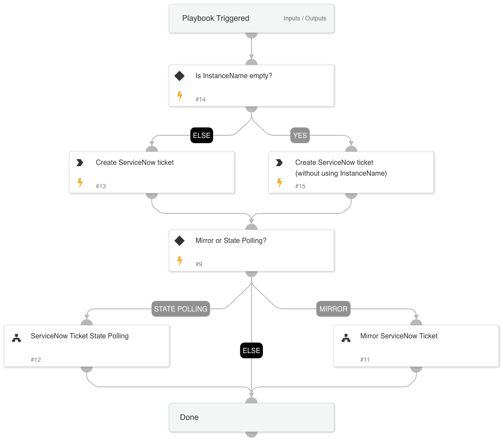

Create ServiceNow Ticket allows you to open new tickets as a task from a parent playbook.
When creating the ticket, you can decide to update based on the ticket's state, which will wait for the ticket to resolve or close with StatePolling. 
Alternatively, you can select to mirror the ServiceNow ticket and incident fields. To apply either of these options, set the SyncTicket value in the playbook inputs to one of the following options: 
1. StatePolling
2. Mirror
3. Leave Blank to use none.

## Dependencies
This playbook uses the following sub-playbooks, integrations, and scripts.

### Sub-playbooks
* ServiceNow Ticket State Polling
* Mirror ServiceNow Ticket

### Integrations
ServiceNow v2

### Scripts
This playbook does not use any scripts.

### Commands
servicenow-create-ticket

## Playbook Inputs
---

| **Name** | **Description** | **Default Value** | **Required** |
| --- | --- | --- | --- |
| Category | Set the category of the ServiceNow Ticket. |  | Optional |
| AssignmentGroup | The group to which to assign the new ticket. |  | Optional |
| ShortDescription | A short description of the ticket. |  | Optional |
| Impact | SThe impact for the new ticket. Leave empty for ServiceNow default impact. |  | Optional |
| Urgency | The urgency of the new ticket. Leave empty for ServiceNow default urgency. |  | Optional |
| Severity  |The severity of the new ticket. Leave empty for ServiceNow default severity. |  | Optional |
| Comment | A comment for the created ticket. |  | Optional |
| SyncTicket | The value of the desired sync method with ServiceNow Ticket. You can choose one of the following options: 1. StatePolling 2. Mirror  3. Blank for none   GenericPolling polls for the state of the ticket and runs until the ticket state is either resolved or closed.   Mirror - You can use the Mirror option to perform a full sync with the ServiceNow Ticket. The ticket data is synced automatically between ServiceNow and Cortex XSOAR with the ServiceNow mirror feature. If this option is selected, FieldPolling is true by default.  | Mirror | Optional |
| PollingInterval | The interval time \(in minutes\) for the polling to run. |  | Optional |
| PollingTimeout | The amount of time \(in minutes\) to poll the status of the ticket before declaring a timeout and resuming the playbook. |  | Optional |
| AdditionalPollingCommandName | In this use case, additional polling commands are relevant when using StatePolling, and there is more than one ServiceNow instance. It will specify the polling command to use a specific instance to run on.  If so, add "Using" to the value.  The playbook will then take the instance name as the instance to use.  |  | Optional |
| InstanceName | The ServiceNow instance that will be used for mirroring/running polling commands.  | ServiceNow v2_instance_1 | Optional |
| MirrorDirection | The mirror direction. It should be one of the following:  1. In 2. Out 3. Both | Both | Optional |
| MirrorCommentTags | The tags for mirror comments and files to ServiceNow. | comments,work_notes,ForServiceNow | Optional |
| FieldPolling | Set the value to true or false to determine if the playbook will execute the FieldPolling sub-playbook. It is useful when it is needed to wait for the ServiceNow ticket to be resolved and continue the parent playbook. FieldPolling will run until the ticket state is either resolved or closed. |  | Optional |
| TicketType | The ServiceNow ticket type. Options are "incident", "problem", "change_request", "sc_request", "sc_task", or "sc_req_item". Default is "incident". |  | Optional |

## Playbook Outputs
---

| **Path** | **Description** | **Type** |
| --- | --- | --- |
| ServiceNow.Ticket.ID | Ticket ID. | string |
| ServiceNow.Ticket.OpenedBy | Ticket opener ID. | string |
| ServiceNow.Ticket.CreatedOn | Ticket creation date. | string |
| ServiceNow.Ticket.Assignee | Ticket assignee ID. | string |
| ServiceNow.Ticket.State | Ticket state. | string |
| ServiceNow.Ticket.Summary | Ticket short summary. | string |
| ServiceNow.Ticket.Number | Ticket number. | string |
| ServiceNow.Ticket.Active | Ticket active. | string |
| ServiceNow.Ticket.AdditionalComments | Ticket comments. | string |
| ServiceNow.Ticket.Priority | Ticket priority. | string |
| ServiceNow.Ticket.OpenedAt | Ticket opening time. | string |
| ServiceNow.Ticket.ResolvedBy | Ticket resolver ID. | string |
| ServiceNow.Ticket.CloseCode | Ticket close code. | string |

## Playbook Image
---

