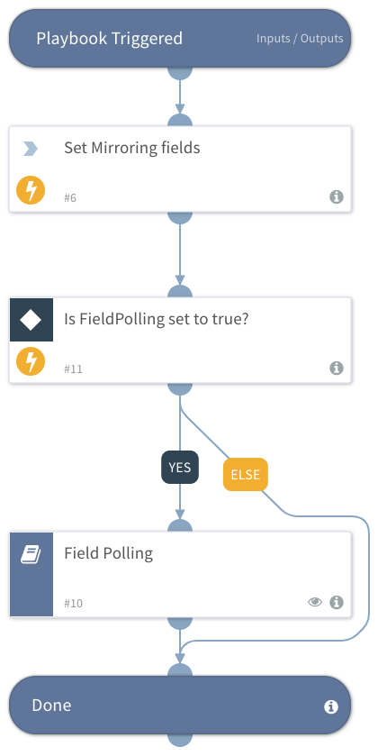

Mirror ServiceNow Ticket is designed to serve as a sub-playbook, which enables ticket mirroring with ServiceNow.
It will allow you to manage ServiceNow tickets in Cortex xSOAR. While data is continuously synced between ServiceNow and Cortex xSOAR, including ServiceNow schema, fields, comments, work notes, and attachments.
To enable OoB mirroring, use the ServiceNow Create ticket  - common mappers for incoming and outgoing mirroring.

FieldPolling - It is optional to set the FieldPolling value to true if it is desirable to wait for the ticket to resolve or close. If FieldPolling is set to true, the FieldPolling Playbook will poll for the state(ServiceNow State field) of the ServiceNow ticket until it marks as resolved/closed.

In Addition to the Playbook, It is recommended to use the included layout for ServiceNow Ticket, which helps visualize ServiceNow ticket information in Cortex xSAOAR.
You can add the new layout as a tab to existing layouts at the edit layout screen.

## Dependencies
This playbook uses the following sub-playbooks, integrations, and scripts.

### Sub-playbooks
* Field Polling - Generic

### Integrations
This playbook does not use any integrations.

### Scripts
This playbook does not use any scripts.

### Commands
* setIncident

## Playbook Inputs
---

| **Name** | **Description** | **Default Value** | **Required** |
| --- | --- | --- | --- |
| IncidentID | ServiceNow Incident number to mirror. |  | Optional |
| MirrorInstanceName | Set the mirror instance name to enable mirroring with ServiceNow |  | Optional |
| MirrorDirection | Set the mirror direction, should be one of the following:  1. Out 2. Both | Both | Optional |
| MirrorCommentTags | Set tags for mirror comments and files to ServiceNow | comments,work_notes,ForServiceNow | Optional |
| FieldPolling  | Set the value to true or false to determine if the FieldPolling sub-playbook will be executed in the context of a parent playbook. this is useful in cases when ita is needed to wait for the ServiceNow ticket to be resolved in order to continue the parent playbook.  |  | Optional |
| FieldPollingInterval | Set interval time for the polling to run \(In minutes\) |  | Optional |
| FieldPollingTimeout |  Set the amount of time to poll the status of the ticket before declaring a timeout and resuming the playbook. \(In minutes\) |  | Optional |

## Playbook Outputs
---
There are no outputs for this playbook.

## Playbook Image
---

