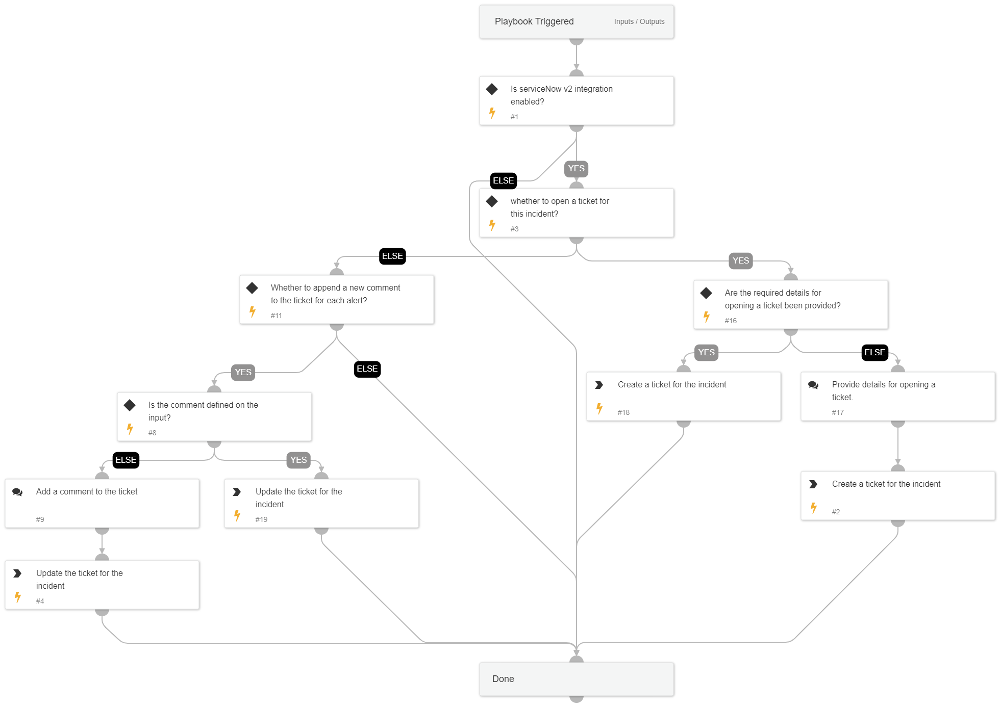

`ServiceNow - Ticket Management` allows you to open a new ticket or comment on an existing ticket.

## Dependencies

This playbook uses the following sub-playbooks, integrations, and scripts.

### Sub-playbooks

This playbook does not use any sub-playbooks.

### Integrations

* ServiceNow
* ServiceNowv2

### Scripts

This playbook does not use any scripts.

### Commands

* servicenow-create-ticket
* servicenow-update-ticket

## Playbook Inputs

---

| **Name** | **Description** | **Default Value** | **Required** |
| --- | --- | --- | --- |
| serviceNowTicketID | The ticket ID. |  | Optional |
| serviceNowCategory | The category of the ServiceNow ticket. |  | Optional |
| description | Description of the ticket. |  | Optional |
| serviceNowImpact | The impact for the new ticket. Leave empty for ServiceNow default impact. |  | Optional |
| serviceNowUrgency | The urgency of the new ticket. Leave empty for ServiceNow default urgency. |  | Optional |
| serviceNowSeverity  | The severity of the new ticket. Leave empty for ServiceNow default severity. |  | Optional |
| CommentToAdd | Comment for the ticket. |  | Optional |
| serviceNowTicketType | The ServiceNow ticket type. Options are "incident", "problem", "change_request", "sc_request", "sc_task", or "sc_req_item". Default is "incident". |  | Optional |
| addCommentPerEndpoint | Whether to add a new comment to the ticket for each endpoint in the incident. Possible values: True/False. | True | Optional |
| serviceNowShortDescription | A short description of the ticket. |  | Optional |
| Action | Whether to open a new ticket or to add a new comment. Possible values: NewTicket/AddComment. |  | Optional |
| serviceNowAssignmentGroup | The group to which to assign the new ticket. |  | Optional |

## Playbook Outputs

---

| **Path** | **Description** | **Type** |
| --- | --- | --- |
| ServiceNow.Ticket.ID | ServiceNow Ticket ID. | unknown |

## Playbook Image

---

