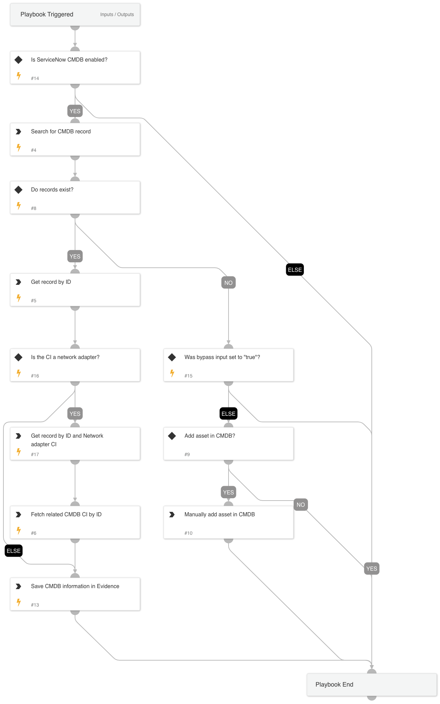

Subplaybook for finding CI records in ServiceNow CMDB.

## Dependencies

This playbook uses the following sub-playbooks, integrations, and scripts.

### Sub-playbooks

This playbook does not use any sub-playbooks.

### Integrations

* ServiceNow CMDB

### Scripts

* ToTable
* Exists

### Commands

* servicenow-cmdb-records-list
* servicenow-cmdb-record-get-by-id

## Playbook Inputs

---

| **Name** | **Description** | **Default Value** | **Required** |
| --- | --- | --- | --- |
| SearchCIClass | The CMDB CI class to perform the search on \(Defaults to cmdb_ci\). | cmdb_ci | Optional |
| SearchQueryField | The CI field used to perform the query \(Defaults to ip_address\). | ip_address | Optional |
| SearchQueryValue | The value used to perform the query. |  | Required |
| BypassAddRecord | Value to determine if the "add asset to CMDB" branch should be skipped in order to prevent direction to manual task.  By default this is set to "false" but a "true" value will bypass. | false | Optional |

## Playbook Outputs

---

| **Path** | **Description** | **Type** |
| --- | --- | --- |
| ServiceNowCMDB.Record | Discovered CI records | unknown |
| ServiceNowCMDB.Records | A list of all the records that were found in the CMDB table. | unknown |

## Playbook Image

---

