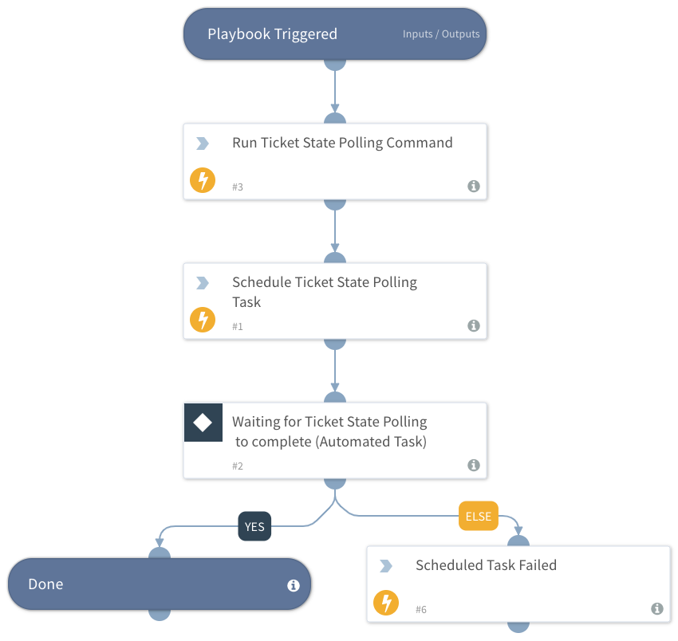

Use ServiceNow Incident State Polling as a sub-playbook when required to pause the execution of a master playbook until the ServiceNow ticket state is either resolved or closed.
This playbook implements polling by continuously running the servicenow-get-ticket command until the state is either resolved or closed.

## Dependencies
This playbook uses the following sub-playbooks, integrations, and scripts.

### Sub-playbooks
This playbook does not use any sub-playbooks.

### Integrations
This playbook does not use any integrations.

### Scripts
* RunPollingCommand
* ScheduleGenericPolling
* PrintErrorEntry

### Commands
This playbook does not use any commands.

## Playbook Inputs
---

| **Name** | **Description** | **Default Value** | **Required** |
| --- | --- | --- | --- |
| TicketNumber | The ServiceNow ticket number to poll for its state. |  | Required |
| Interval | Frequency that the polling command will run \(minutes\). |  | Required |
| Timeout | Amount of time to poll before declaring a timeout and resuming the playbook \(in minutes\). |  | Required |
| InstanceName | Set the ServiceNow Instance that will be used by the polling command. Only relevant when there is more than one ServiceNow instance. |  | Optional |
| AdditionalPollingCommandName | Additional polling commands are relevant when using StatePolling, and there is more than one ServiceNow instance. It will specify the polling command to use a specific instance to run on.  If so, please add "Using" to the value.  The polling command will then take the instance name as the instance to use.  |  | Optional |

## Playbook Outputs
---
There are no outputs for this playbook.

## Playbook Image
---
