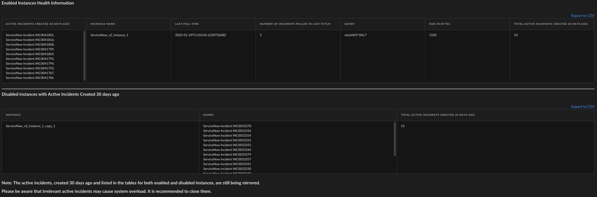

Troubleshot ServiceNow v2 integration by displaying health information of enabled instances and old and active incidents of disabled instances.

## Script Data
---

| **Name** | **Description** |
| --- | --- |
| Script Type | python |
| Tags | ServiceNow,ServiceNowv2 |
| Cortex XSOAR Version | 3.5.0+ |

### Open Instances Health Information

|Instance Name|Last Pull Time|Number of Incidents Pulled|Open Incidents 30 days|Query|Size In Bytes|
|---|---|---|---|---|---|
| ServiceNow_v2_instance_1 | 2025-01-28T12:29:45.140651734Z | 1 | ServiceNow Incident INC001111, ServiceNow Incident INC002222 | stateNOT IN6,7 | 3083 |

### Closed instances with open incidents

|Instance Name| Incidents|
|---|---|
| ServiceNow_v2_instance_disabled | ServiceNow Incident INC001111 |

### Example

