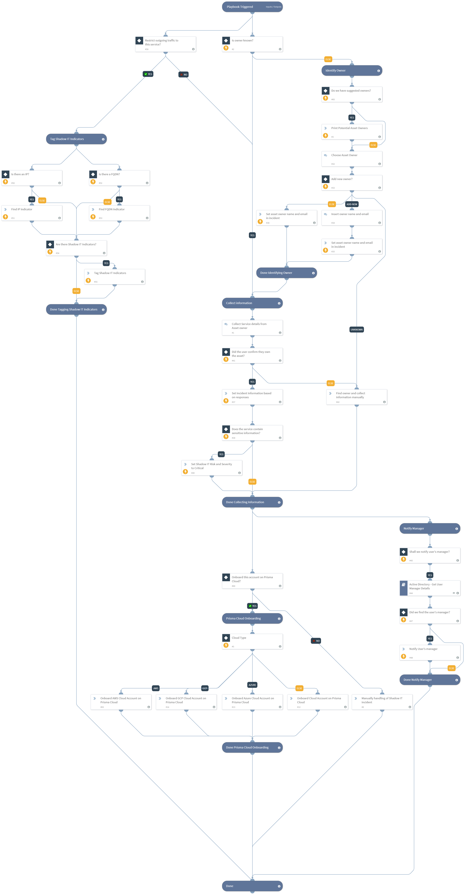

This playbook is used to handle a Shadow IT incident. A Shadow IT incident occurs when a resource attributed to the organization that is not sanctioned by IT nor protected by the InfoSec team is found.

This playbook handles the incident by helping the analyst find the owner of the resource based on existing evidence. The playbook also marks the service indicators (IP or FQDN) with a Shadow IT tag. The possible owner and their manager are notified and onboarding of the asset on Prisma Cloud is triggered through a manual process.
Supported Cortex XSOAR versions: 6.0.0 and later.

## Dependencies
This playbook uses the following sub-playbooks, integrations, and scripts.

### Sub-playbooks
* **Active Directory - Get User Manager Details**

### Integrations
This playbook does not use any integrations.

### Scripts
This playbook does not use any scripts.

### Commands
* ***setIncident***
* ***findIndicators***
* ***send-mail***
* ***appendIndicatorField***

## Playbook Inputs
---

| **Name** | **Description** | **Default Value** | **Required** |
| --- | --- | --- | --- |
| Notify Manager | Notify user's manager | Yes | Optional |
| ShadowITIndicatorTags | Tags to add to indicators to identify potential Shadow IT assets | ShadowIT | Optional |
| ManagerNotificationSubjectPrefix | This input is added as prefix to the owner name to build the subject of the email sent to the owner's manager. | Shadow IT asset detected - owned by  | Optional |
| ManagerNotificationBody | Body of the email to send to the owner's manager. | Dear ${UserManagerDisplayName},  we detected a Shadow IT service for User ${incident.shadowitaccountownername} who, according to the Company's directory, directly reports to you.  The service is: ${incident.shadowitip}:${incident.shadowitport} (FQDN: ${incident.shadowitfqdn}), please work with your team and us to resolve this issue.  Best regards,  InfoSec team | Optional |

## Playbook Outputs
---
There are no outputs for this playbook.

## Playbook Image
---

