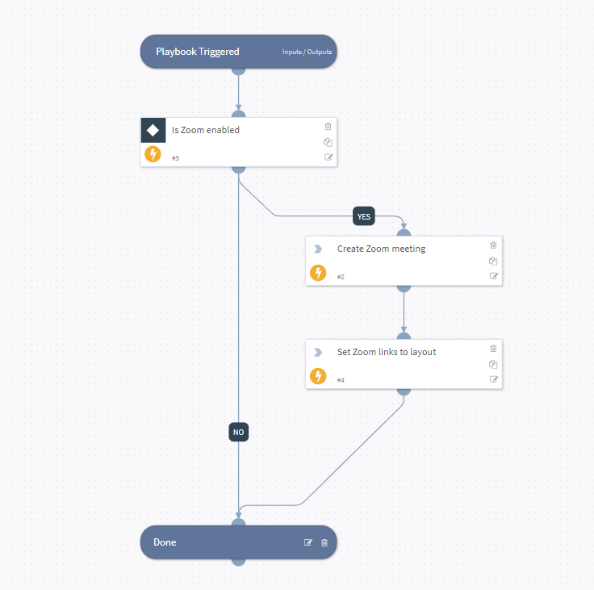

This playbook is used to create an online meeting for shift handover. Currently, this playbook supports Zoom.

## Dependencies
This playbook uses the following sub-playbooks, integrations, and scripts.

### Sub-playbooks
This playbook does not use any sub-playbooks.

### Integrations
This playbook does not use any integrations.

### Scripts
* IsIntegrationAvailable

### Commands
* zoom-create-meeting
* setIncident

## Playbook Inputs
---

| **Name** | **Description** | **Default Value** | **Required** |
| --- | --- | --- | --- |
| User | The user account for Zoom integration. |  | Optional |
| Topic | The topic for the Zoom meeting. | SOC shift handover meeting | Optional |

## Playbook Outputs
---
There are no outputs for this playbook.

## Playbook Image
---
