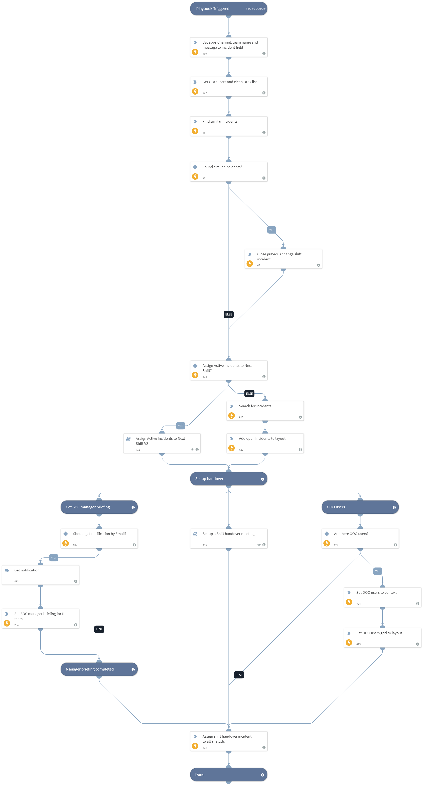

This playbook is used to set up shift handover meetings with all the accompanying processes such as creating an online meeting, creating a notification in a integrated chat app (for example Slack), creating a SOC manager briefing, and creating a display of the active incidents, team members who are on-call, and team members who are out of the office.
By modifying the playbook inputs you can decide whether to activate the Assign Active Incidents to Next Shift and whether a user who is out of the office will be taken into consideration.

## Dependencies
This playbook uses the following sub-playbooks, integrations, and scripts.

### Sub-playbooks
* Set up a Shift handover meeting
* Assign Active Incidents to Next Shift V2

### Integrations
This playbook does not use any integrations.

### Scripts
* SetGridField
* FindSimilarIncidents
* AssignAnalystToIncidentOOO
* Set
* SearchIncidentsV2
* GetUsersOOO

### Commands
* setIncident
* closeInvestigation

## Playbook Inputs
---

| **Name** | **Description** | **Default Value** | **Required** |
| --- | --- | --- | --- |
| AssignActiveIncidentsToNextShift | Yes - If you want the playbook to reassign active incidents to on-call users. The playbook will take into consideration users that are out of the office. No- If you do not want to reassign active incidents to on-call users. The current incident owner will remain.   | Yes | Optional |
| AppChannelName  | The name of channel that will be created in your messaging app for the shift handover. The name of the channel should not contain uppercase or special characters. If you want to use an existing channel, add that name here. Currently this input supports only two integrations: Microsoft Teams and Slack V2.    |  | Optional |
| AppMessage  | The message to send for the handover to your messaging app channel that you created. | Hi, please join the shift handover meeting. | Optional |
| SOCManagerEmail | If the Shift manager briefing section is left empty when a new shift handover incident is opened, an email will be sent to this address to request a shift manager briefing. |  | Optional |
| ShiftManagerBriefing  | The incident field that will provide the shift manager briefing for the layout. | ${incident.shiftmanagerbriefing} | Optional |
| TeamName | If using Microsoft Teams, provide your Microsoft team name. This input is mandatory for Microsoft Teams. |  | Optional |

## Playbook Outputs
---
There are no outputs for this playbook.

## Playbook Image
---
