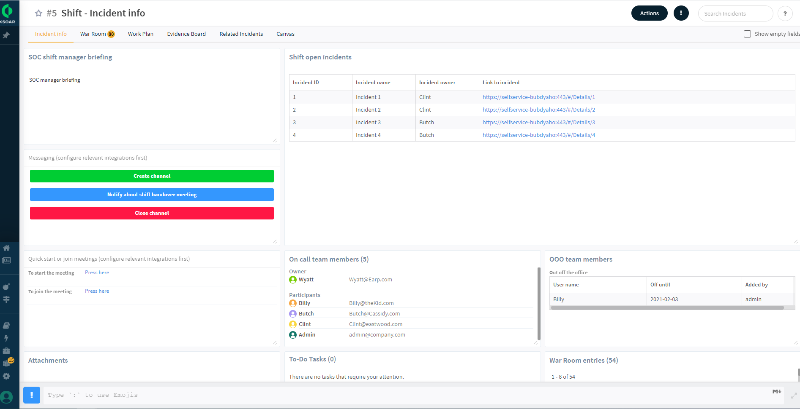

Shift management and shift handover are crucial processes of SOC team management.
This pack's purpose is provide a single interface for all those essential elements in one place in order to prevent loss of data in the shift handover process. 

### What does this pack do?

- Automatically reassign active incidents to the next shift
- Setting up online meeting
- Sending notification on relevant messaging apps.
- Providing SOC manager briefing for the team.
- Managing out of the office users.

For more information, visit our [Cortex XSOAR Developer Docs](https://xsoar.pan.dev/docs/reference/packs/Shift_management)

