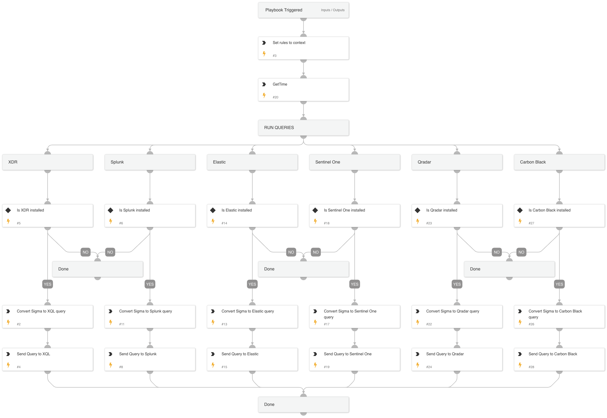

An example playbook on how to query Sigma rules from within TIM and query a SIEM/EDR.

## Dependencies

This playbook uses the following sub-playbooks, integrations, and scripts.

### Sub-playbooks

This playbook does not use any sub-playbooks.

### Scripts

* IsIntegrationAvailable
* SigmaConverttoQuery
* SearchIndicator
* GetTime

### Commands

* es-eql-search
* sentinelone-create-query
* xdr-xql-generic-query
* qradar-search-create
* cbd-alerts-search
* splunk-search

## Playbook Inputs

---

| **Name** | **Description** | **Default Value** | **Required** |
| --- | --- | --- | --- |
| Query |  | type:"Sigma Rule" | Optional |

## Playbook Outputs

---
There are no outputs for this playbook.

## Playbook Image

---

