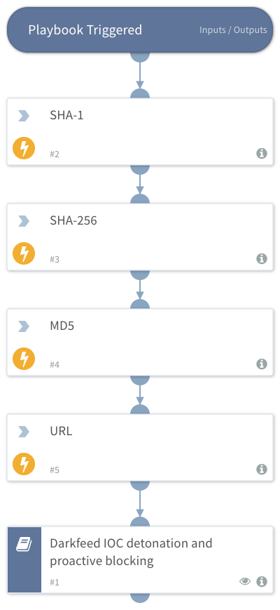

## Dependencies
This playbook uses the following sub-playbooks, integrations, and scripts.

### Sub-playbooks
* Darkfeed IOC detonation and proactive blocking

### Integrations
This playbook does not use any integrations.

### Scripts
* SetAndHandleEmpty

### Commands
This playbook does not use any commands.

## Playbook Inputs
---

| **Name** | **Description** | **Default Value** | **Required** |
| --- | --- | --- | --- |
| Indicator Query | Indicators matching the indicator query will be used as playbook input | sourceBrands:Sixgill_Darkfeed and sixgillfeedid:[darkfeed_010,darkfeed_002,darkfeed_012] and type:[URL,file] | Optional |

## Playbook Outputs
---
There are no outputs for this playbook.

## Playbook Image
---
