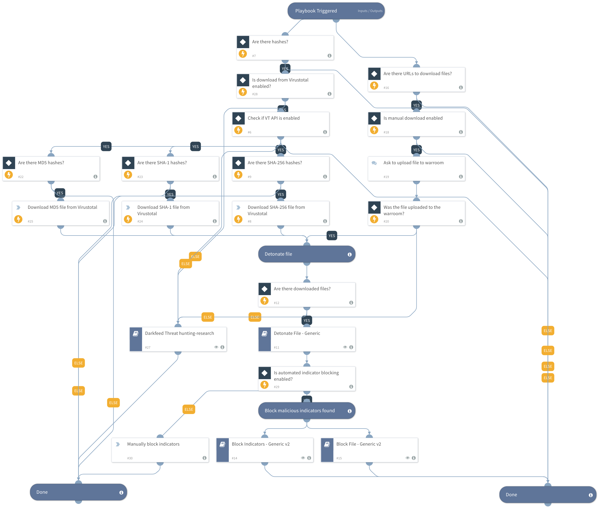

## Dependencies
This playbook uses the following sub-playbooks, integrations, and scripts.

### Sub-playbooks
* Darkfeed Threat hunting/research
* Block Indicators - Generic v2
* Detonate File - Generic
* Block File - Generic v2

### Integrations
This playbook does not use any integrations.

### Scripts
This playbook does not use any scripts.

### Commands
* vt-private-download-file

## Playbook Inputs
---

| **Name** | **Description** | **Default Value** | **Required** |
| --- | --- | --- | --- |
| File | File hash \(MD5, SHA\-1, SHA\-256\) from Darkfeed | File | Optional |
| Indicator Query | Indicators matching the indicator query will be used as playbook input |  | Optional |
| URL | URL from Darkfeed\_010 \- Malware available for download from the deep and dark web | URL | Optional |
| Manual download | Set "true" if analyst can manually download malware from deep and dark web filesharing site. | true | Optional |
| VTdownload | Set "true" if you would like to automatically download file from Virustotal API. | true | Optional |
| AutomatedIndicatorBlocking | Set "true" if you would like to automatically block discovered malicious indicators. | true | Optional |

## Playbook Outputs
---
There are no outputs for this playbook.

## Playbook Image
---
