Send messages and notifications to your Slack team.
This integration was integrated and tested with Slack.
## Configure SlackV3 on Cortex XSOAR

Slack V3 utilizes ["Socket Mode"](https://api.slack.com/apis/connections/socket) to enable the integration to communicate directly with Slack for mirroring. This requires a dedicated Slack app to be created for the XSOAR integration. See [Creating a Custom App](#creating-a-custom-app) on how to create your App in Slack.

Please refer to the video tutorial [found here](https://live.paloaltonetworks.com/t5/cortex-xsoar-how-to-videos/cortex-xsoar-how-to-video-slack-v3-configuration/ta-p/445226) to learn about configuring SlackV3 using the app manifest.

1. Navigate to **Settings** > **Integrations** > **Servers & Services**.
2. Search for SlackV3.
3. Click **Add instance** to create and configure a new integration instance.

    | **Parameter** | **Description** | **Required** |
    | --- | --- | --- |
    | `bot_token` | Slack API bot token. | False |
    | `app_token` | Slack API app token. | False |
    | `incidentNotificationChannel` | Dedicated Slack channel to receive notifications. | False |
    | `min_severity` | Minimum incident severity to send messages to Slack by. | False |
    | `incidentType` | Type of incidents created in Slack. | False |
    | `allow_incidents` | Allow external users to create incidents via direct messages. | False |
    | `proxy` | Use system proxy settings. | False |
    | `unsecure` | Trust any certificate (not secure). | False |
    | `longRunning` | Long running instance. Required for investigation mirroring and direct messages. | False |
    | `bot_name` | Bot display name in Slack (Cortex XSOAR by default). | False |
    | `bot_icon` | Bot icon in Slack - Image URL (Cortex XSOAR icon by default). | False |
    | `max_limit_time` | Maximum time to wait for a rate limiting call in seconds. | False |
    | `paginated_count` | Number of objects to return in each paginated call. | False |
    | `proxy_url` | Proxy URL to use in Slack API calls. | False |
    | `filtered_tags` | Comma-separated list of tags by which to filter the messages sent from XSOAR. Only supported in Cortex XSOAR V6.1 and above. | False |
    | `permitted_notifications` | Types of Notifications to send in the dedicated channel. | False |
    | `common_channels` | For workspaces where a handful of channels are consistently being used, you may add them as a CSV in the format ChannelName:ChannelID. | False |
    | `disable_caching` | When configured, Disable Caching will prevent the integration from paginating to search for Users or Conversations. Additionally, it will prevent excess data from being stored to the integration context. If this parameter is disabled, the instance may create high memory usage. | False |

4. Click **Test** to validate the URLs, token, and connection.

### Caching

When the `Disable Caching of Users and Channels` parameter is configured, there are no pagination calls made to Slack. This is to avoid rate limiting which can occur in workspaces where there are excessive amounts of channels or users. If there were no timeout issues with running commands on your environment prior to pack version 2.3.0, there is no direct need to enable this mode.

Additionally. with the `Common Channels` parameter configured, channels, and their ID's found in this parameter will be accessible to the integration to use while caching is disabled.

#### Finding a Channel ID
`Common Channels` follows the format, `First ChannelName:FirstChannelID, Second ChannelName:SecondChannelID`. To find the channel ID for the channels that are frequently used, please refer to the following steps:
1. Navigate to the channel you wish to retrieve an ID for.
2. Click the name of the channel.
3. On the bottom of the presented menu, the channel ID can be found.

Channel IDs typically follow the format `C` + Alphanumeric string.

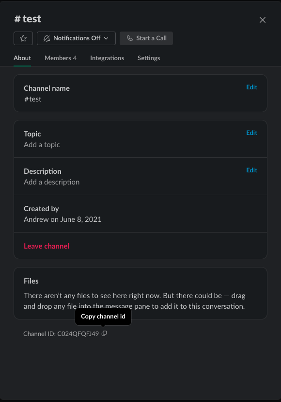

### Creating a Custom App
1. Navigate to: https://api.slack.com/apps/ .
2. Click **Create an App**.
 
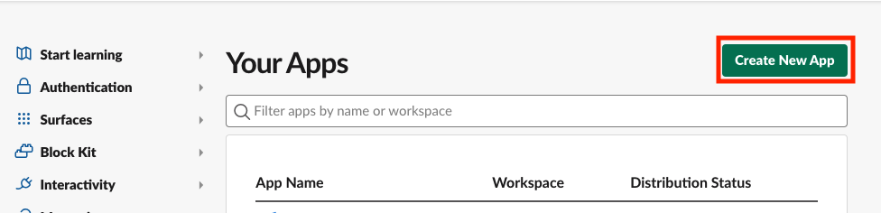

3. Click **From an app manifest**.

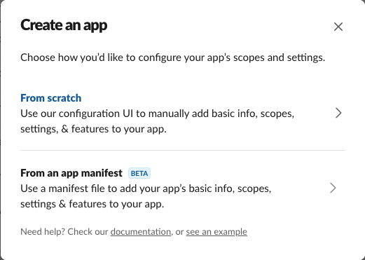

4. Next pick the workspace you would like the app to reside in and click ***Next***.

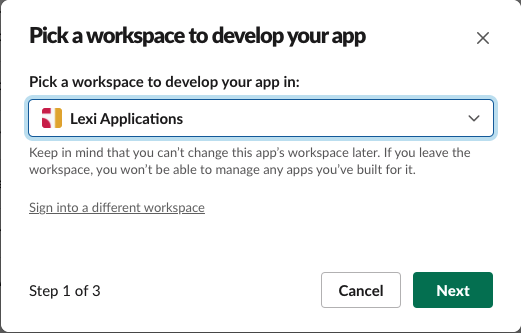

5. Next copy the text in the file found [here](https://raw.githubusercontent.com/demisto/content/master/Packs/Slack/doc_files/SlackV3_app_manifest.yml). The text is a manifset template with the recommended configuration for your app. 
6. Paste the copied text into the field "YAML" and click ***Next***.

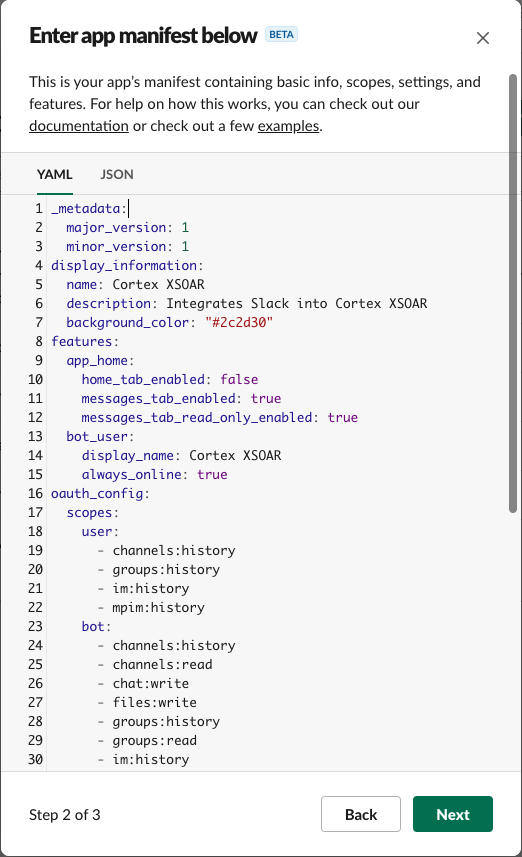

7. The next step is a summary of the app we created. Click ***Create*** to proceed.

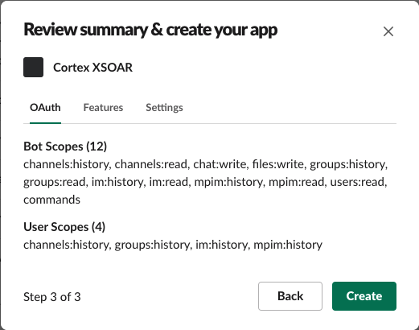

 
 ### Installing the App to Your Workspace
1. After creating your app, you will be redirected to the *Basic Information* page of your app settings.
  First, click ***Install to Workspace***

 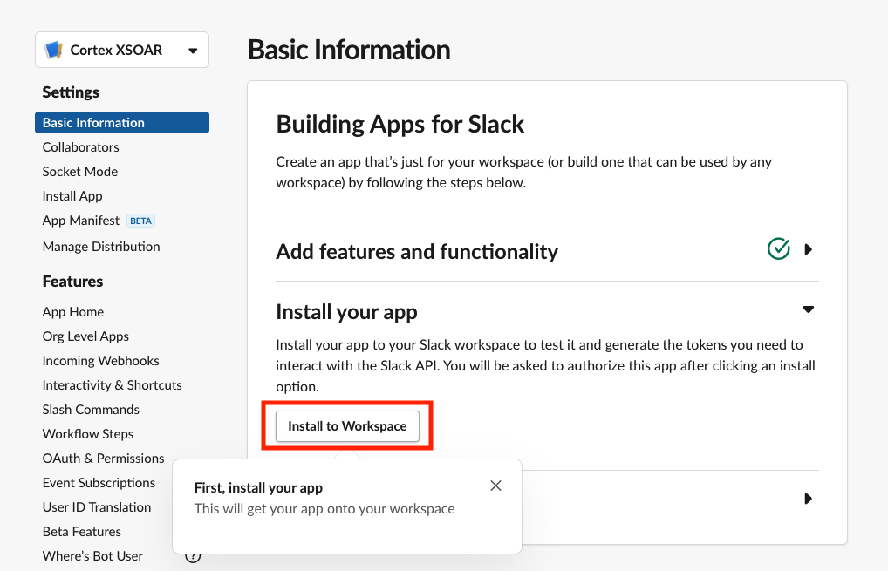
 
2. This will bring up a page which confirms that you are installing the app to your workspace.
 **If you do not see this step, you must request access from your Slack admin in order to proceed.**

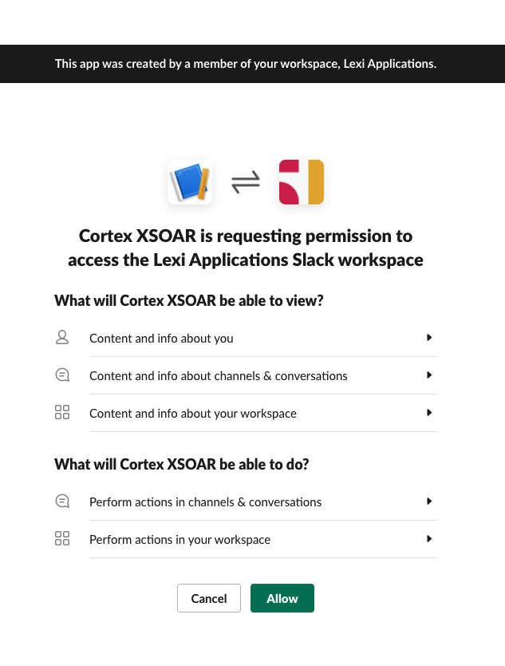

3. Once the app has been installed you will be redirected to the ***General*** page for your app. Scroll down to the section called ***App-Level Tokens*** and click ***Generate Token and Scopes***

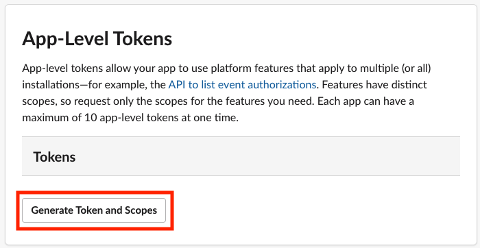 

4. Enter a name for the Token and click ***Add Scope***. Select the `connections:write` scope from the list.

 

5. Click ***Generate***.
6. After click ***Generate*** you will be redirected to a page which will display your app token. This token begins with `xapp`. Copy this token.
 


7. In your XSOAR SlackV3 intance configuration page. Paste the token in the parameter *App Token*. You may also configure the *App Token* as a credential.

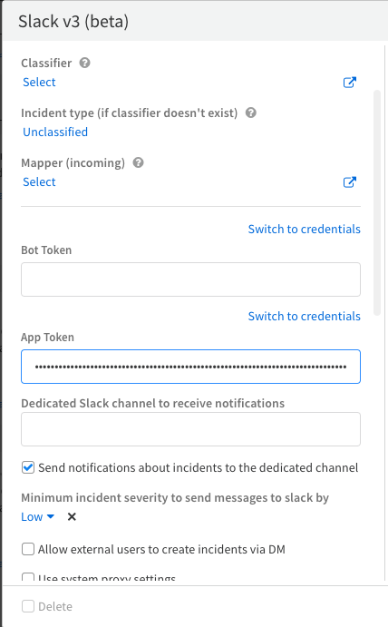

8. Navigate back to the Slack App configuration page and select ***OAuth & Permissions***. If this screen does not look like the following image, you may need assistance from your Slack admin.

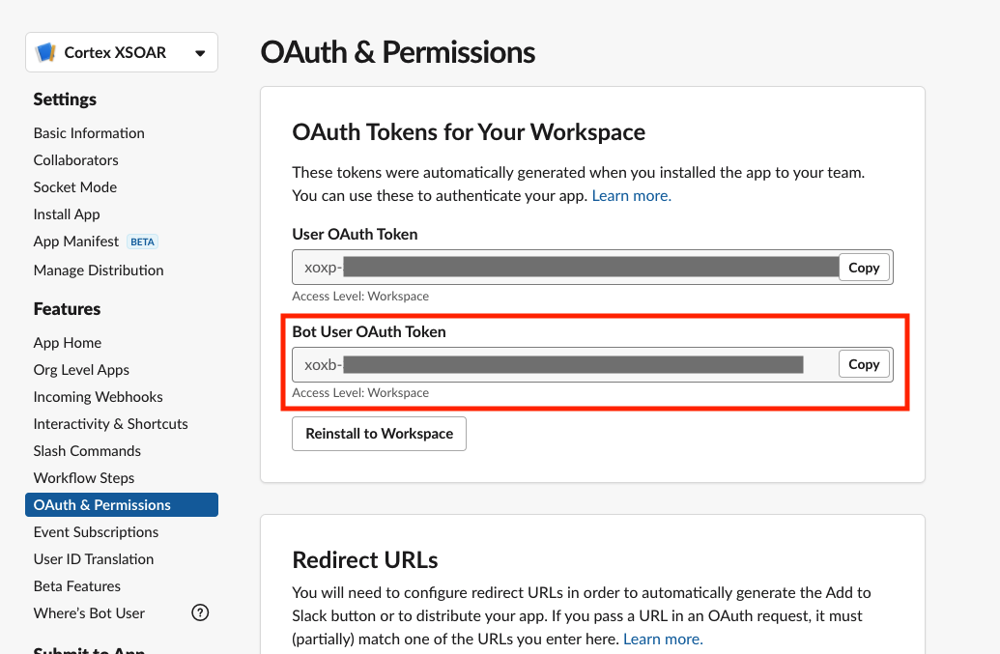

9. Copy the ***Bot User OAuth Token***.
10. In your XSOAR SlackV3 intance configuration page. Paste the token in the parameter *Bot Token*. You may also configure the *Bot Token* as a credential.

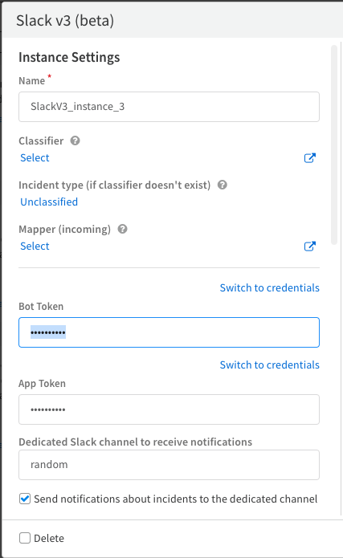

### Testing the Bot
1. Once you have configured the ***Dedicated Slack channel to receive notifications*** parameter, open Slack and invite your new app to the channel you have configured.
2. Navigate to your Instance Settings page in XSOAR and click ***Test***. A message should appear in the channel from your app.
 
  
## Backwards Compatibility with Slack V2
Slack V3 currently contains improvements to enhance the stability of the integration as well as the circumvention of OProxy. This version is intended to provide customers with more granular control over the Slack integration by enabling the Bring-Your-Own-App model and customizable scope-based authentication.

All commands are fully compatible with Slack V2 playbooks as their inputs and outputs have remained the same. As a customer, you should notice no significant change in the behavior of the Slack integration with your existing playbooks.

## Commands
You can execute these commands from the Cortex XSOAR CLI, as part of an automation, or in a playbook.
After you successfully execute a command, a DBot message appears in the War Room with the command details.
### mirror-investigation
***
Mirrors the investigation between Slack and the Cortex XSOAR War Room.


#### Base Command

`mirror-investigation`
#### Input

| **Argument Name** | **Description** | **Required** |
| --- | --- | --- |
| type | The mirroring type. Can be "all", which mirrors everything, "chat", which mirrors only chats (not commands), or "none", which stops all mirroring. Possible values are: all, chat, none. Default is all. | Optional | 
| autoclose | Whether the channel is auto-closed when an investigation is closed. Can be "true" or "false". Default is "true". | Optional | 
| direction | The mirroring direction. Can be "FromDemisto", "ToDemisto", or "Both". Default value is "Both". | Optional | 
| mirrorTo | The channel type. Can be "channel" or "group". The default value is "group". | Optional | 
| channelName | The name of the channel. The default is "incident-&lt;incidentID&gt;". | Optional | 
| channelTopic | The topic of the channel. | Optional | 
| kickAdmin | Whether to remove the Slack administrator (channel creator) from the mirrored channel. Possible values are: true, false. Default is false. | Optional | 


#### Context Output

There is no context output for this command.

#### Command Example
```
!mirror-investigation direction="FromDemisto" channelName="example" using-brand="SlackV3"
```

#### Human Readable Output
>Investigation mirrored successfully, channel:example


### send-notification
***
Sends a message to a user, group, or channel.


#### Base Command

`send-notification`
#### Input

| **Argument Name** | **Description** | **Required** |
| --- | --- | --- |
| message | The message content. When mentioning another Slack user, make sure to do so in the following format: &lt;@user_name&gt;. | Optional | 
| to | The user to whom to send the message. Can be either the username or email address. | Optional | 
| channel | The name of the Slack channel to which to send the message. | Optional | 
| channel_id | The ID of the Slack channel to which to send the message. | Optional | 
| entry | An entry ID to send as a link. | Optional | 
| ignoreAddURL | Whether to include a URL to the relevant component in Cortex XSOAR. Can be "true" or "false". Default value is "false". | Optional | 
| threadID | The ID of the thread to which to reply. Can be retrieved from a previous send-notification command. | Optional | 
| blocks | A JSON string of Slack blocks to send in the message. | Optional | 


#### Context Output

| **Path** | **Type** | **Description** |
| --- | --- | --- |
| Slack.Thread.ID | String | The Slack thread ID. | 


#### Command Example
```!send-notification channel="example" using-brand="SlackV3"```

#### Context Example
```json
{
    "Slack": {
        "Thread": {
            "ID": "1624272821.000700"
        }
    }
}
```

#### Human Readable Output

>Message sent to Slack successfully.
>Thread ID is: 1624272821.000700

### close-channel
***
Archives a Slack channel.


#### Base Command

`close-channel`
#### Input

| **Argument Name** | **Description** | **Required** |
| --- | --- | --- |
| channel | The name of the channel to archive. If not provided, the mirrored investigation channel is archived (if the channel exists). | Optional | 
| channel_id | The ID of the channel to archive. If not provided, the mirrored investigation channel is archived (if the channel exists). | Optional | 


#### Context Output

There is no context output for this command.

#### Command Example
```
!close-channel channel=new-slack-channel
```

#### Human Readable Output
>Channel successfully archived.


### slack-send-file
***
Sends a file to a user, channel, or group. If not specified, the file is sent to the mirrored investigation channel (if the channel exists).


#### Base Command

`slack-send-file`
#### Input

| **Argument Name** | **Description** | **Required** |
| --- | --- | --- |
| file | The ID of the file entry to send. | Required | 
| to | The user to whom to send the file. Can be the username or the email address. | Optional | 
| group | The name of the Slack group (private channel) to which to send the file. | Optional | 
| channel | The name of the Slack channel to which to send the file. | Optional | 
| channel_id | The ID of the Slack channel to which to send the file. | Optional | 
| threadID | The ID of the thread to which to reply. Can be retrieved from a previous send-notification command. | Optional | 
| comment | A comment to add to the file. | Optional | 


#### Context Output

There is no context output for this command.

#### Command Example
```
!slack-send-file file=87@129 channel=testing-docs comment="Look at this gif!"
```

#### Human Readable Output
>File sent to Slack successfully.


### slack-set-channel-topic
***
Sets the topic for a channel.


#### Base Command

`slack-set-channel-topic`
#### Input

| **Argument Name** | **Description** | **Required** |
| --- | --- | --- |
| channel | The channel name. If not specified, the topic of the mirrored investigation channel is set (if the channel exists). | Optional | 
| channel_id | The ID of the channel. If not specified, the topic of the mirrored investigation channel is set (if the channel exists). | Optional | 
| topic | The topic for the channel. | Required | 


#### Context Output

There is no context output for this command.

#### Command Example
```
!slack-set-channel-topic topic="Testing topic for documentation" channel=testing-docs
```

#### Human Readable Output
>Topic successfully set.


### slack-create-channel
***
Creates a channel in Slack.


#### Base Command

`slack-create-channel`
#### Input

| **Argument Name** | **Description** | **Required** |
| --- | --- | --- |
| type | The channel type. Can be "private" or "public". Default is private. | Optional | 
| name | The name of the channel. | Required | 
| users | A CSV list of user names or email addresses to invite to the channel. For example: "user1, user2...". | Optional | 


#### Context Output

| **Path** | **Type** | **Description** |
| --- | --- | --- |
| Slack.Channel.ID | String | The ID of the channel. | 
| Slack.Channel.Name | String | The name of the channel. | 

#### Context Example
```json
{
    "Slack": {
        "Channel": {
            "ID": "C0R2D2C3PO",
            "Name": "random"
        }
    }
}
```

#### Command Example
```
!slack-create-channel type="private" name="testing-docs"
```

#### Human Readable Output
>Successfully created the channel testing-docs


### slack-invite-to-channel
***
Invites users to join a channel.


#### Base Command

`slack-invite-to-channel`
#### Input

| **Argument Name** | **Description** | **Required** |
| --- | --- | --- |
| users | A CSV list of usernames or email addresses to invite to join the channel. For example: "user1, user2...". | Required | 
| channel | The name of the channel to which to invite the users. If the name of the channel is not specified, the name of the mirrored investigation channel is used (if the channel exists). | Optional | 
| channel_id | The ID of the channel to which to invite the users. If the ID of the channel is not specified, the name of the mirrored investigation channel is used (if the channel exists). | Optional | 


#### Context Output

There is no context output for this command.

#### Command Example
```
!slack-invite-to-channel users="Sir Testing McTesterface" channel=new-slack-channel
```

#### Human Readable Output
>Successfully invited users to the channel.


### slack-kick-from-channel
***
Removes users from the specified channel.


#### Base Command

`slack-kick-from-channel`
#### Input

| **Argument Name** | **Description** | **Required** |
| --- | --- | --- |
| users | A CSV list of usernames or email addresses to remove from the a channel. For example: "user1, user2...". | Required | 
| channel | The name of the channel from which to remove the users. If the name of the channel is not specified, the mirrored investigation channel is used (if the channel exists). | Optional | 
| channel_id | The ID of the channel from which to remove the users. If the ID of the channel is not specified, the mirrored investigation channel is used (if the channel exists). | Optional | 


#### Context Output

There is no context output for this command.

#### Command Example
```
!slack-kick-from-channel users="Sir Testing McTesterface" channel=new-slack-channel
```

#### Human Readable Output
>Successfully kicked users from the channel.


### slack-rename-channel
***
Renames a channel in Slack.


#### Base Command

`slack-rename-channel`
#### Input

| **Argument Name** | **Description** | **Required** |
| --- | --- | --- |
| name | The new name of the channel. | Required | 
| channel | The current name of the channel. If the name of the channel is not specified, the mirrored investigation channel is used (if the channel exists). | Optional | 
| channel_id | The current ID of the channel. If the ID of the channel is not specified, the mirrored investigation channel is used (if the channel exists). | Optional | 


#### Context Output

There is no context output for this command.

#### Command Example
```
!slack-rename-channel name="new-slack-channel" channel="testing-docs"
```

#### Human Readable Output
>Channel renamed successfully.


### slack-get-user-details
***
Get details about a specified user.


#### Base Command

`slack-get-user-details`
#### Input

| **Argument Name** | **Description** | **Required** |
| --- | --- | --- |
| user | The Slack user (username or email). | Required | 


#### Context Output

| **Path** | **Type** | **Description** |
| --- | --- | --- |
| Slack.User.ID | String | The ID of the user. | 
| Slack.User.Username | String | The username of the user. | 
| Slack.User.Name | String | The actual name of the user. | 
| Slack.User.DisplayName | String | The display name of the user. | 
| Slack.User.Email | String | The email address of the user. | 


#### Command Example
```!slack-get-user-details user="cortex_xsoar" using-brand="SlackV3"```

#### Context Example
```json
{
    "Slack": {
        "User": {
            "ID": "U0XXXXXXXX",
            "Name": "cortex_xsoar",
            "Username": "demisto_integration"
        }
    }
}
```

#### Human Readable Output

>### Details for Slack user: cortex_xsoar
>|ID|Username|Name|
>|---|---|---|
>| U0XXXXXXXX | demisto_integration | cortex_xsoar |


### slack-edit-message
***
Edit an existing Slack message.


#### Base Command

`slack-edit-message`
#### Input

| **Argument Name** | **Description** | **Required** |
| --- | --- | --- |
| channel | The channel the message is posted in. | Optional |
| channel_id | The ID of the channel the message is posted in. | Optional |
| threadID | The ID of the thread of which to edit - can be retrieved from a previous send-notification command. | Required | 
| message | The updated message. | Optional | 
| blocks | A JSON string of the block to send. | Optional | 
| ignore_add_url | Whether to include a URL to the relevant component in XSOAR. Can be "true" or "false". Default value is "false". | Optional | 


#### Context Output

| **Path** | **Type** | **Description** |
| --- | --- | --- |
| Slack.Thread.ID | String | The timestamp identifier for the message. | 
| Slack.Thread.Channel | String | The channel ID the message was posted in. | 
| Slack.Thread.Text | String | The text the message was updated with. | 


#### Command Example
```!slack-edit-message channel="random" threadID="1629281551.001000" message="Eyy"```

#### Context Example
```json
{
    "Slack": {
        "Thread": {
            "ID": "1629281551.001000",
            "Channel": "C0XXXXXXXX",
            "Text": "Eyy"
        }
    }
}
```

#### Human Readable Output

>The message was successfully edited.


### slack-pin-message
***
Pins a selected message to the given channel.


#### Base Command

`slack-pin-message`
#### Input

| **Argument Name** | **Description** | **Required** |
| --- | --- | --- |
| channel | The channel the message is posted in. | Optional |
| channel_id | The ID of the channel the message is posted in. | Optional |
| threadID | The ID of the thread of which to pin - can be retrieved from a previous send-notification command. | Required | 


#### Context Output

There is no context output for this command.


#### Command Example
```!slack-pin-message channel=random threadID=1629281551.001000```

#### Human Readable Output

>The message was successfully pinned.

### Known Limitations
- All commands which use `channel` as a parameter, it is now advised to use `channel-id` using the channel ID found in the incident's context under the `Slack.Channels.ID` value. Using `channel-id` as opposed to `channel` will improve the performance of the integration.
- SlackV3 mirrors incidents by listening to messages being sent in channels the bot has been added to.
Because of this, you may have some users in Slack who are not users in XSOAR. This will occasionally cause the module 
health to indicate that an error has occurred because a user was unable to be found. In this circumstance, the error is expected and is purely cosmetic in nature.
- In some cases when mirroring an investigation, kicking the admin will cause no further actions to be able to be performed by the bot. Any subsequent actions taken on the channel (such as mirror out) will result in a "not in channel" error.
- Please note: If a dedicated channel is configured, however there are no notifications being sent, please verify that the **Types of Notifications** to send parameter is populated.