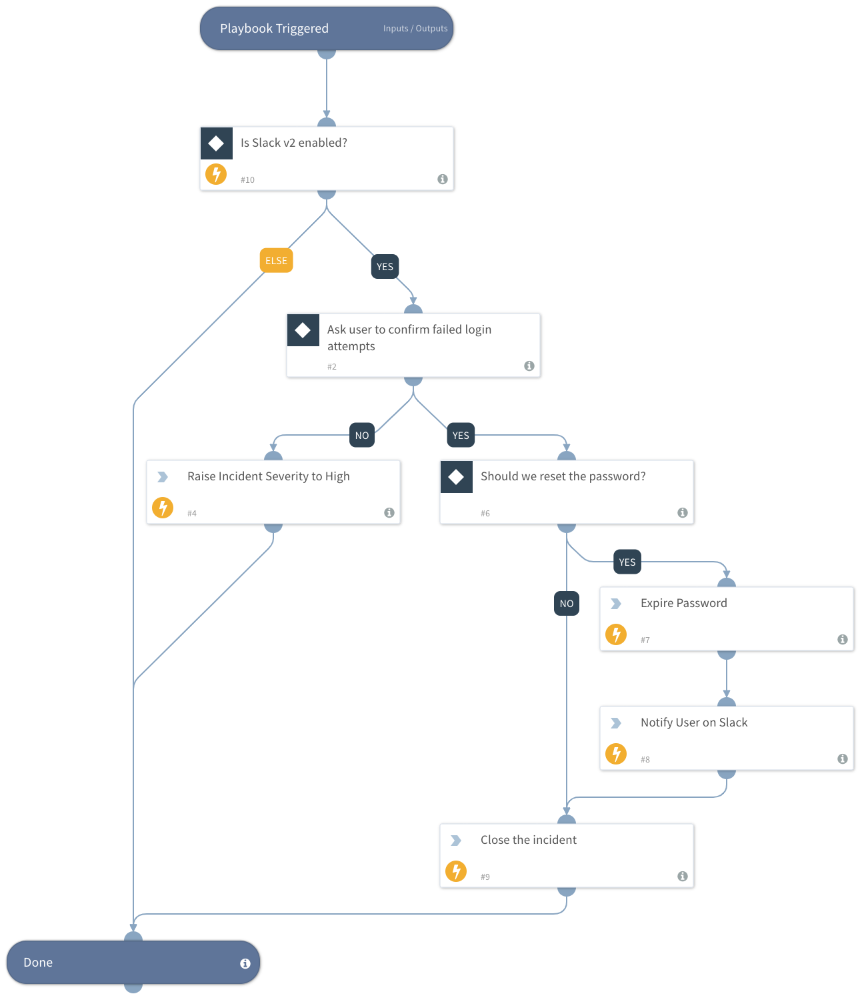

Investigates a failed login event. The playbook interacts with the user via the Slack integration, checks whether the logins were a result of the user's attempts or an attack, raises the severity, and expires the user's password according to the user's replies.

## Dependencies
This playbook uses the following sub-playbooks, integrations, and scripts.

### Sub-playbooks
This playbook does not use any sub-playbooks.

### Integrations
* Builtin

### Scripts
This playbook does not use any scripts.

### Commands
* setIncident
* closeInvestigation
* ad-expire-password
* send-notification

## Playbook Inputs
---

| **Name** | **Description** | **Default Value** | **Source** | **Required** |
| --- | --- | --- | --- | --- |
| UsernameOrEmail | The username or the email address of the user who failed to login. | srcuser | incident | Required |

## Playbook Outputs
---
There are no outputs for this playbook.

## Playbook Image
---

