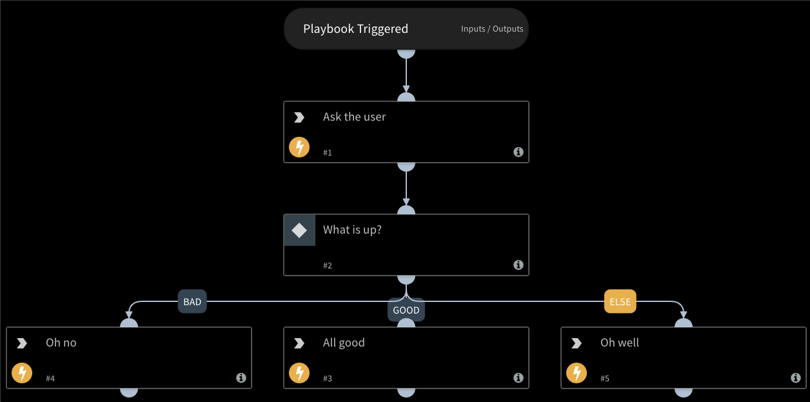

Sends a message (question) to either user (in a direct message) or to a channel. The message includes predefined reply options. The response can also close a task (might be conditional) in a playbook.

SlackAskV2 was added to support the release of SlackV3 is only compatible with SlackV3.

## Script Data

---

| **Name** | **Description** |
| --- | --- |
| Script Type | python3 |
| Tags | slack |
| Demisto Version | 5.5.0 |

## Use Case

---
This automation allows you to ask users in Slack (including external to Cortex XSOAR) questions, have them respond and 
reflect the answer back to Cortex XSOAR.

## Dependencies

---
Requires an instance of the SlackV3 integration.

This script uses the following commands and scripts.

* send-notification

## Inputs

---

| **Argument Name** | **Description** |
| --- | --- |
| user | The Slack user to which to send the message. Can be either an email address or a Slack user name. |
| channel | The Slack channel to which to send the message. |
| message | The message to send to the user or channel. |
| option1 | The first reply option. The default is "Yes" with a green button. To change the color of the button, add the pound sign \(\#\) followed by the name of the new color \(green, red, or black\). The default color is "green". For example, "Yes\#green". |
| option2 | The second reply option. The default is "No" with a red button. To change the button color, add the pound sign \(\#\) followed by the name of the new color \(green, red, or black\). The default color is "red". For example, "No\#red". |
| task | The task to close with the reply. If empty, then no playbook tasks will be closed. |
| replyEntriesTag | Tag to add to email reply entries. |
| persistent | Indicates whether to use one-time entitlement or persistent entitlement. |
| responseType | How the user should respond to the question. |
| additionalOptions | A comma-separated list of additional options in the format of "option\#color", for example, "maybe\#red". The default color is "black". |
| reply | The reply to send to the user. Use the templates \{user\} and \{response\} to incorporate these in the reply. \(i.e. "Thank you \{user\}. You have answered \{response\}."\) |
| lifetime | Time until the question expires. For example - 1 day. When it expires, a default response is sent. |
| defaultResponse | Default response in case the question expires. |
| slackInstance | The instance of SlackV3 this script should use. |
| slackVersion | The version of Slack to use. SlackV3 is configured by default. |

## Outputs

---
There are no outputs for this script.

## Guide

---
The automation is most useful in a playbook to determine the outcome of a conditional task - which will be one of the provided options.
It uses a mechanism that allows external users to respond in Cortex XSOAR (per investigation) with entitlement strings embedded within the message contents.

The automation can utilize the interactive capabilities of Slack to send a form with buttons - 
this requires the external endpoint for interactive responses to be available for connection (See the SlackV3 integration documentation for more information).
You can also utilize threads instead, simply by specifying the `responseType` argument.

## Notes

---

* When using the `replyEntriesTag` argument, the `persistent` argument must be set to `True`.
* `SlackAskV2` will not work when run in the playbook debugger. This is because the debugger does not generate entitlements, since they must be tied to an investigation. Entitlements are needed to track the response.
