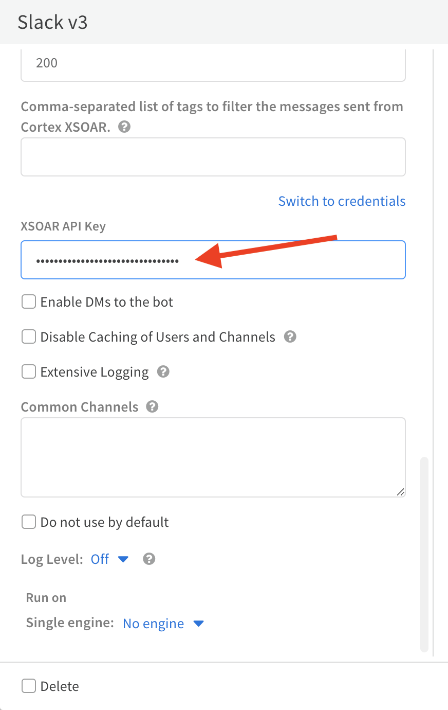
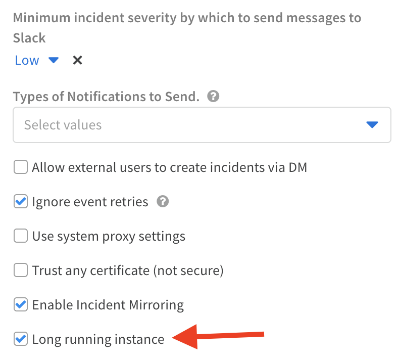

SlackBlockBuilder will format a given Slack block into a format readable by the SlackV3 integration. The script will also send the block to the given destination. Make sure to mark **Trust any certificate** and fill the **XSOAR API Key** integration parameters if you want to get a response to the incident context.

The Slack Block Kit Builder can be found [here](https://app.slack.com/block-kit-builder).

## Script Data
---

| **Name** | **Description** |
| --- | --- |
| Script Type | python3 |
| Tags | slack |
| Cortex XSOAR Version | 6.2.0 |

## Use Case
---
This automation allows you to send a survey to users (including external to Cortex XSOAR) via Slack, and have them respond and 
reflect the answer back to Cortex XSOAR. Within the survey, you can use all the different input types that are available 
via the Slack Block Kit, including buttons, text fields, datepickers, radio buttons, multi select, and more.

See this [blog post](https://www.paloaltonetworks.com/blog/security-operations/playbook-of-the-week-teaching-xsoar-a-few-new-tricks-with-slack-blocks/) for more detailed use case information and ideas.

## Dependencies
---
Requires an instance of the Slack v3 integration.

This script uses the following commands and scripts.
* send-notification

### Setup Requirements
1. In order to use **SlackBlockBuilder**, you must enter an API key created by a default admin user (username **admin** by default) into the Slack v3 integration instance settings. The API key must be generated by default admin, not just any user.


2. Ensure the "Long running instance" checkbox is checked in the Slack v3 integration instance settings.


## Inputs
---

| **Argument Name** | **Description**                                                                                                                                                               |
| --- |-------------------------------------------------------------------------------------------------------------------------------------------------------------------------------|
| blocks_url | The URL copied from Slack's Block Builder.                                                                                                                                    |
| list_name | The name of the Cortex XSOAR list to use as the block's input.                                                                                                                |
| user | The Slack user to which to send the message. Can be either an email address or a Slack user name.                                                                             |
| channel | The Slack channel to send the message to.                                                                                                                                     |
| channel_id | The Slack channel ID to send the message to.                                                                                                                                  |
| task | The task to close with the reply. If empty, then no playbook tasks will be closed.                                                                                            |
| replyEntriesTag | Tag to add to email reply entries.                                                                                                                                            |
| persistent | Indicates whether to use one-time entitlement or persistent entitlement.                                                                                                      |
| reply | The reply to send to the user. Use the templates \{user\} and \{response\} to incorporate these in the reply. \(i.e., "Thank you \{user\}. You have answered \{response\}."\) |
| lifetime | Time until the question expires. For example - 1 day. When it expires, a default response is sent.                                                                            |
| defaultResponse | Default response in case the question expires.                                                                                                                                |
| slackInstance | The instance of SlackV3 this script should use.                                                                                                                               |
| thread_id | The ID of the thread to which to reply. Can be retrieved from a previous send-notification command.                                                                           |


## Outputs
---

| **Path** | **Description** | **Type** |
| --- | --- | --- |
| SlackBlockState | The State of the response from the user will be stored under this context path. | unknown |

**Note**
Make sure to configure the "XSOAR API Key" instance parameter in the "Slack v3" integration. 

To get the API Key:
1. Go to **Settings** -> **API keys**.
2. Click **Get Your Key**.
3. Type a name for the key and click **Generate key**.
4. Copy and paste the key in the instance parameter.
#### Command Example using blocks_url
---
```text
!SlackBlockBuilder blocks_url=https://app.slack.com/block-kit-builder/T0DAYMVCM#%7B%22blocks%22:%5B%7B%22type%22:%22section%22
channel=random
task=4
replyEntriesTag=slackResponse
persistent=yes
```

#### Human Readable Output using blocks_url
---
```text
Message sent to Slack successfully.
Thread ID is: 1660645689.649679
```

#### Command Example using list_name
---
```text
!SlackBlockBuilder list_name=MySlackBlocksList channel=random task=4 replyEntriesTag=slackResponse persistent=yes
```

#### Human Readable Output using list_name
---
```text
Message sent to Slack successfully.
Thread ID is: 1660645689.649679
```

## Troubleshooting
---
**Issue**: The survey message is not sent to Slack.

**Troubleshooting**: Test the `send-notification` command on its own to verify it is working correctly. This will provide a more specific error message if there is an issue. Note that the Slack API bot you set up for the Slack v3 integration needs to be added to any channels you want to send SlackBlockBuilder surveys to.

Verify your Slack blocks payload is valid. Try simplifying the payload. Test with a simple dummy payload like the following:
```
{
	"blocks": [
		{
			"type": "section",
			"text": {
				"type": "plain_text",
				"text": "hello world",
				"emoji": true
			}
		}
	]
}
```
---
**Issue**: The survey is sent to Slack and submitted successfully, but the response does not show up in context data in Cortex XSOAR.

**Troubleshooting**: The most likely cause is that there is no API key entered into the Slack v3 integration instance settings, or the API key was not created by default admin. Ensure an API key created by a default admin user is entered into the Slack v3 integration instance settings. Also, make sure to mark the **Trust any certificate (not secure)** integration parameter.

---
**Issue**: The survey is sent to Slack successfully, but clicking the Submit button in Slack does nothing. No response is returned to Cortex XSOAR. There may be a ⚠️ icon next to the Submit button in Slack. 

**Troubleshooting**: Ensure the "Long running instance" checkbox is checked in the Slack v3 integration instance settings.

---
**Issue**: Migrating to pack version 3.3.0.

**Troubleshooting**: # Implementation Guide for Changes in SlackV3 for XSOAR (Version 3.3.0)

## 1. Review and Identify Affected Playbooks
- Identify all playbooks currently utilizing the SlackBlockBuilder script or its derivatives.

## 2. Implement Conditional Tasks
- Introduce a conditional task in your playbooks that waits for the expected response.
- Configure the task to proceed once the response is received.

## 3. Integrate the `GetSlackBlockBuilderResponse` Script
- After receiving the response and closing the conditional task, initiate a new task that runs the `ParseSlackResponse` script.

---
**Issue**: Running the script using the playbook debugger results with an error: "invalid_blocks_format".

**Troubleshooting**: `SlackBlockBuilder` will not work when run in the playbook debugger. This is because the debugger does not generate entitlements, since they must be tied to an investigation. Entitlements are needed to track the response. The workaround for this is running the playbook from an existing incident.
