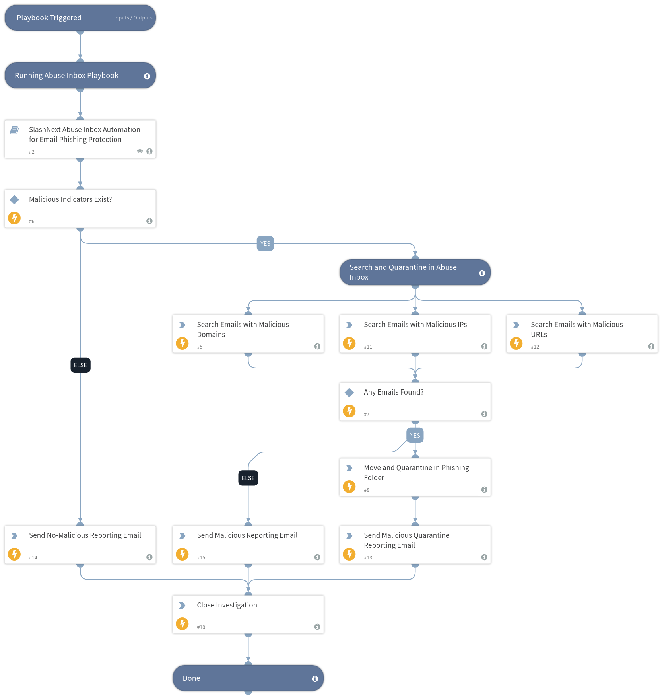

When combined with ‘SlashNext Abuse Management Protection’, this playbook fully automates the identification and remediation of phishing emails found in Microsoft 365 user inboxes. Using the indicators of compromise, URL, domain, and IP, found in the original email, it searches and remediates other emails containing the same IOCs.

## Dependencies
This playbook uses the following sub-playbooks, integrations, and scripts.

### Sub-playbooks
* Abuse Inbox Management Protection

### Integrations
* EWS Mail Sender
* EWS v2

### Scripts
This playbook does not use any scripts.

### Commands
* ews-search-mailbox
* send-mail
* ews-move-item
* closeInvestigation

## Playbook Inputs
---
There are no inputs for this playbook.

## Playbook Outputs
---
There are no outputs for this playbook.

## Playbook Image
---

