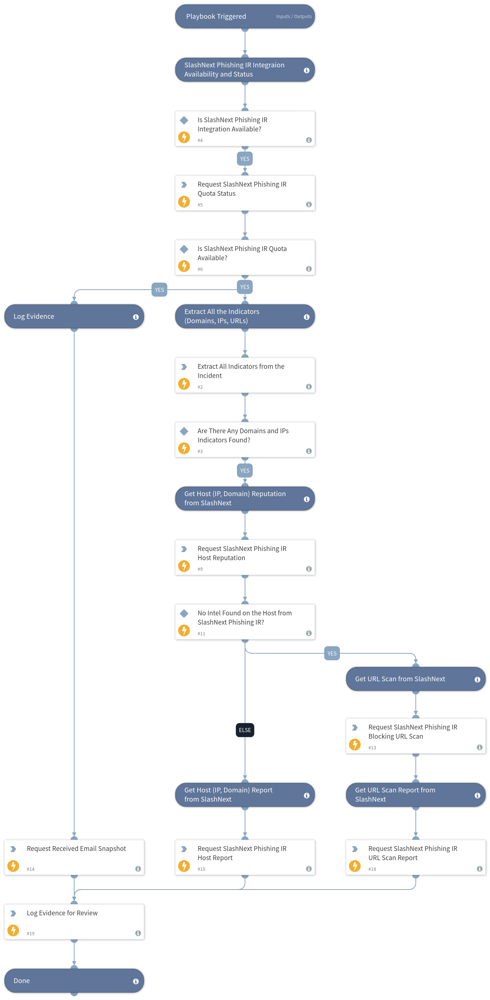

Analyzes the URLs, domains, and IPs in suspicious emails, reported by end users, and returns a binary verdict (malicious or benign) and forensic information including screenshot of attack page, threat name and type, threat status, and first/last seen date

## Dependencies
This playbook uses the following sub-playbooks, integrations, and scripts.

### Sub-playbooks
This playbook does not use any sub-playbooks.

### Integrations
* SlashNext Phishing Incident Response
* Rasterize

### Scripts
* AddEvidence
* IsIntegrationAvailable

### Commands
* rasterize-email
* slashnext-api-quota
* slashnext-url-scan-sync
* extractIndicators
* slashnext-host-reputation
* slashnext-host-report
* slashnext-scan-report

## Playbook Inputs
---

| **Name** | **Description** | **Default Value** | **Required** |
| --- | --- | --- | --- |
| content | Email/Message content to be scanned by SlashNext Phishing Incident Response | ${incident.details} | Required |
| email | Received email HTML for logging evidence | ${incident.labels.Email/html} | Required |

## Playbook Outputs
---

| **Path** | **Description** | **Type** |
| --- | --- | --- |
| SlashNext.IP | Complete IP Enrichment Data Returned by SlashNext | unknown |
| SlashNext.Domain | Complete Domain Enrichment Data Returned by SlashNext | unknown |
| SlashNext.URL | Complete URL Enrichment Data Returned by SlashNext | unknown |

## Playbook Image
---

