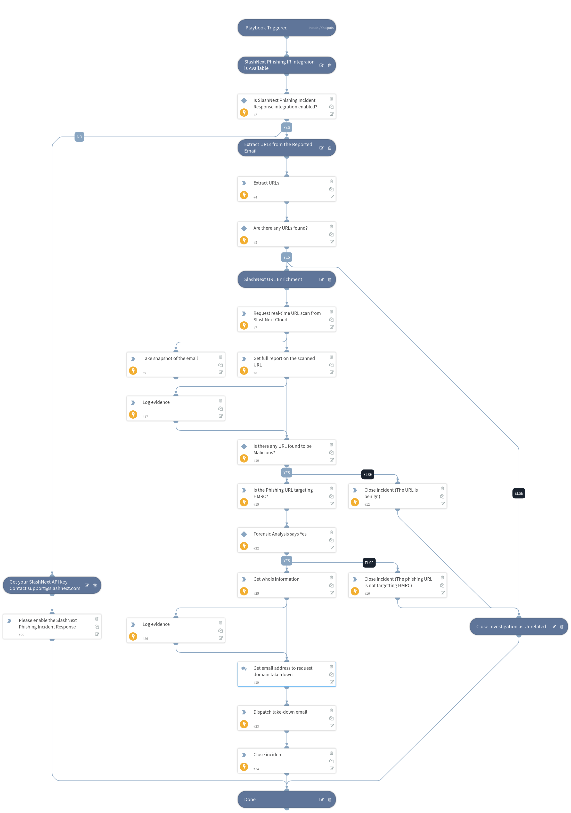

Analyzes the domains and URLs in suspicious emails, reported by end users, to determine if the phishing campaign is impersonating your company’s brand. Playbook can then trigger a domain take down email, with forensic evidence, to a target address.

## Dependencies
This playbook uses the following sub-playbooks, integrations, and scripts.

### Sub-playbooks
This playbook does not use any sub-playbooks.

### Integrations
* JsonWhoIs
* EWS Mail Sender
* Rasterize
* SlashNext Phishing Incident Response

### Scripts
* Exists
* BrandImpersonationDetection
* AddEvidence
* IsIntegrationAvailable

### Commands
* extractIndicators
* send-mail
* closeInvestigation
* rasterize-email
* slashnext-url-scan-sync
* slashnext-scan-report
* whois

## Playbook Inputs
---

| **Name** | **Description** | **Default Value** | **Required** |
| --- | --- | --- | --- |
| email_text | Text body of the email received at the abuse inbox setup for brand specific phishing protection. | ${incident.labels.Email/text} | Required |
| email_html | HTML body of the email received at the abuse inbox setup for brand specific phishing protection. | ${incident.labels.Email/html} | Required |
| reporting_email | Email address where brand targetted phish detection is to be reported. | brandprotection.hmrc@slashnext.net | Required |

## Playbook Outputs
---
There are no outputs for this playbook.

## Playbook Image
---

