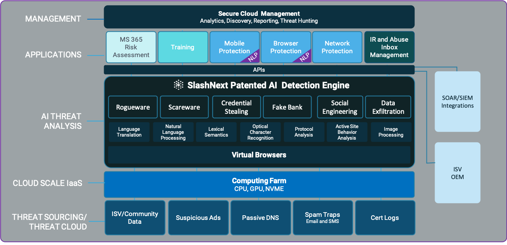

Automate phishing incident response and threat hunting with SlashNext’s on-demand URL analysis and enrichment. SlashNext Incident Response provides a scalable, cloud-based analysis engine purpose-built for analyzing suspicious URLs for phishing and social engineering attacks. Patented SEER™ threat detection engine uses virtual browsers and machine learning to dynamically analyze webpage contents (images, text etc.) and server behavior. Mature machine learning algorithms enable definitive, binary verdicts (not threat scores) with >99.07% precision.

### Benefits
* **Fully Automate URL Analysis:** Enables full automated analysis of suspected phishing URLs by extracting and scanning URLs or hosts from suspicious emails or logs automatically 
* **Improve Productivity:** Eliminate countless hours of analysis and further research on inconclusive results with suspicious URLs for improved performance of incident response and threat hunting
* **Rapid Detection:** High-precision phishing URL analysis and enrichment enables rapid detection of genuine threats, with near zero false positives 
* **Remediate Sites and Takedown Threat Sources:** Rich forensic data including screenshots, threat status, URLs, HTML and text downloads enable users to carefully plan a strategy to remediate sites or takedown threat sources
* **Comprehensive Threat Coverage:** Detect all major types of phishing and social engineering threats with rich forensics data for additional analysis and reporting 
* **Overcome Evasion Tactics:** SlashNext SEER™ technology conducts run-time analysis with virtual browsers to overcome evasion techniques to detect unknown threats, including those hosted on compromised websites and legitimate hosting infrastructure 

### SlashNext Advantage
SlashNext leads the industry with the greatest speed at internet scale, fast and highly scalable cloud-based sync API, developed on top of big data architecture.
* **Highly Accurate, Zero-hour Detection:** 3x greater accuracy vs. the top security vendors with 99.07% detection rate and 1 in 1M FP rate. SEER™ technology detects zero-hour threats missed by URL inspection and domain reputation technologies by following all re-directs and multi-stage attacks to the final destination for detection on compromised websites and legitimate hosting infrastructure
* **Smart and Predictive:** Overcome evasive tactics such as URL redirection, CAPTCHA and inspection blocking based on IP, to detect phishing webpages missed by other security solutions
* **Fast and Highly Scalable:** SlashNext Incident response operates at cloud scale, using millions of virtual browsers to analyze millions of suspicious URLs on demand, with millisecond response time
* **Comprehensive Coverage:** Total phishing detection for corporate credential theft, social engineering, Scareware and Rogue software webpages 
* **Robust List of API Commands:** Customize playbooks and take advantage of the full capabilities of SlashNext Incident Response technology
* **Fast and Highly Scalable:** SlashNext Incident response operates at cloud scale, using millions of virtual browsers to analyze millions of suspicious URLs on demand, with millisecond response time
* **Smart and Predictive:** Overcome evasive tactics such as URL redirection, CAPTCHA and inspection blocking based on IP, to detect phishing webpages missed by other security solutions
* **Playbooks** for automating abuse inbox management and online brand protection

### SlashNext Platform Architecture

### Package Includes
* URL Intelligence and Forensics
* Incident Response and Threat Hunting
* Online Brand Reputation

### Playbooks
* **Phishing IR Playbook for Abuse Inbox Management:** Fully automates the investigation and response to suspicious emails reported by internal employees and external customers to your organization’s abuse inbox. Accurate binary verdict (not a threat score) eliminates countless hours of analysis and further research on inconclusive results for improved performance of incident response 
* **Online Brand Protection Detect and Respond Playbook:** Fully automates the process of reviewing the emails sent by customers and the public to online brand abuse inboxes. It detects brand impersonators and malicious URLs using deep inspection of website content and packages everything required to request a take-down (IOCs, forensics, and screenshots) into an email sent to the abuse department to simply forward to the domain registrar

### Useful Links
* [https://www.slashnext.com/technology-partners/cortex-xsoar/](https://www.slashnext.com/technology-partners/cortex-xsoar/)
* [https://live.paloaltonetworks.com/t5/blogs/cortex-xsoar-amp-slashnext/ba-p/333682](https://live.paloaltonetworks.com/t5/blogs/cortex-xsoar-amp-slashnext/ba-p/333682)
* [https://www.slashnext.com/wp-content/uploads/2020/01/SlashNext-Phishing-IR-Integration-Guide-Demisto-SOAR.pdf](https://www.slashnext.com/wp-content/uploads/2020/01/SlashNext-Phishing-IR-Integration-Guide-Demisto-SOAR.pdf)
* [https://www.slashnext.com/wp-content/uploads/2020/07/SlashNext_CORTEX-XSOAR-Integration.pdf](https://www.slashnext.com/wp-content/uploads/2020/07/SlashNext_CORTEX-XSOAR-Integration.pdf)
