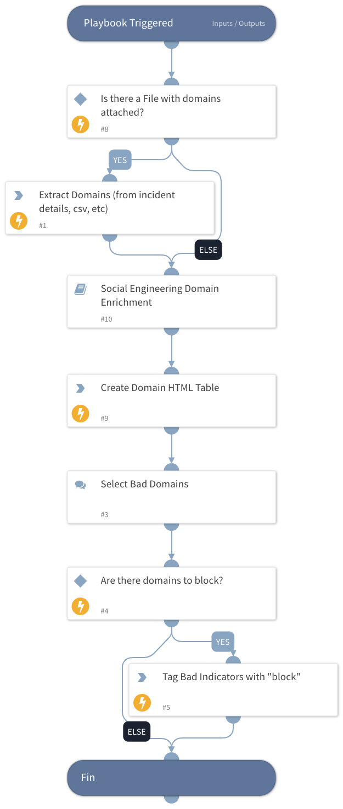

Social engineering attacks against organizations often rely on domains which are similar to those which are 
officially registered for business units.
Determining a potentially malicious domain based on its registration properties and similarity to legitimate domains end users
are expected to interact wtih can be an important step to protecting end users from potential social engineering attacks.

## What does this pack do?
The playbooks included in this pack perform analysis of suspicious domains against a specified organizational domain.
A known bad list of registrars can be leveraged to escalate the severity of domain indicators as well as the Levenshtein distance.
Two playbooks are included with this pack:

- Social Engineering Domain Investigation
- Social Engineering Domain Enrichment

The Social Engineering Domain Enrichment playbook can be used as a subplaybook in other investigations and an example usage is provided in the
Social Engineering Domain Investigation playbook.

