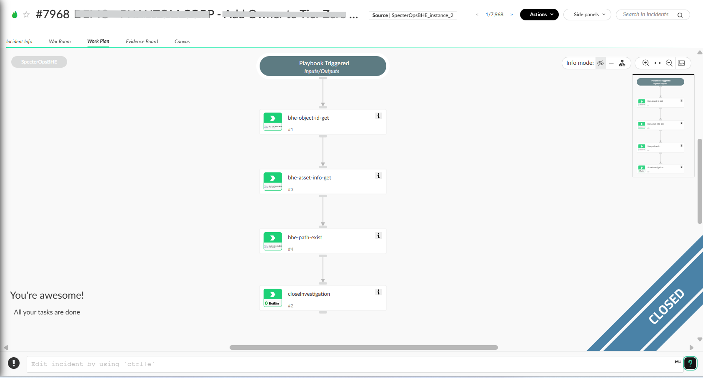

Automated playbook that enriches BloodHound Enterprise attack path incidents with object information and validates attack path existence between security principals.

## Dependencies

This playbook uses the following sub-playbooks, integrations, and scripts.

### Sub-playbooks

This playbook does not use any sub-playbooks.

### Integrations

* SpecterOpsBHE

### Scripts

This playbook does not use any scripts.

### Commands

* bhe-asset-info-get
* bhe-object-id-get
* bhe-path-exist
* closeInvestigation

## Playbook Inputs

---
There are no inputs for this playbook.

## Playbook Outputs

---
There are no outputs for this playbook.

## Playbook Image

---

