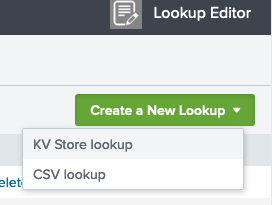

Use the SplunkPy integration to:
- Fetch events (logs) from within Cortex XSOAR
- Push events from Cortex XSOAR to SplunkPy
- Fetch SplunkPy ES notable events as Cortex XSOAR incidents.

This integration was integrated and tested with Splunk Enterprise v9.0.4 and Enterprise Security v7.2.0.

## Use Cases
---
* Query Splunk for events.
* Create a new event in Splunk.
* Get results of a search that was executed in Splunk.

## Configure SplunkPy in Cortex


| **Parameter** | **Description** | **Required** |
| --- | --- | --- |
| Server URL |  | True |
| Username |  | True |
| Password |  | True |
| Port | The port in Splunk server which is open to the REST API calls. | True |
| Fetch events query | The Splunk search query by which to fetch events. The default query fetches ES notable events. You can edit this query to fetch other types of events. Note, that to fetch ES notable events, make sure to include the \\\`notable\\\` macro in your query. | False |
| Fetch Limit (Max.- 200, Recommended less than 50) |  | False |
| Fetch incidents |  | False |
| Incident type |  | False |
| Use Splunk Clock Time For Fetch | Whether to use the Splunk clock time from the Splunk server for fetch, or not. | False |
| Parse Raw Part of Notable Events | Whether to parse the raw part of the Notables, or not. | False |
| Replace with Underscore in Incident Fields | Whether to replace special characters to underscore when parsing the raw data of the Notables, or not. | False |
| Timezone of the Splunk server, in minutes. For example, if GMT is gmt +3, set timezone to +180. For UTC, set the timezone to 0. This is relevant only for fetching and mirroring notable events. It must be specified when mirroring is enabled. |  | False |
| First fetch timestamp (&lt;number&gt; &lt;time unit&gt;, e.g., 12 hours, 7 days, 3 months, 1 year) | The amount of time to go back when performing the first fetch, or when creating a mapping using the Select Schema option. | False |
| Extract Fields - CSV fields that will be parsed out of _raw notable events |  | False |
| Event Type Field | Used only for mapping with the Select Schema option. The name of the field that contains the type of the event or alert. The default value is "source", which is a good option for notable events. However, you may choose any custom field. | False |
| Use CIM Schemas for Mapping | If selected, when creating a mapper using the \`Select Schema\` feature \(supported from Cortex XSOAR V6.0\), the Splunk CIM field will be pulled. See https://docs.splunk.com/Documentation/CIM/4.18.0/User/Overview for more information. | False |
| Incident Mirroring Direction | Choose the direction to mirror the incident: Incoming \(from Splunk to Cortex XSOAR\), Outgoing \(from Cortex XSOAR to Splunk\), or Incoming and Outgoing \(from/to Cortex XSOAR and Splunk\). | False |
| Close Mirrored Cortex XSOAR Incidents (Incoming Mirroring) | When selected, closing the Splunk notable event with a "Closed" status will close the Cortex XSOAR incident. | False |
| Additional Splunk status labels to close on mirror (Incoming Mirroring) | A comma-separated list of Splunk status labels to mirror as closed Cortex XSOAR incident \(Example: Resolved,False-Positive\). | False |
| Enable Splunk statuses marked as "End Status" to close on mirror (Incoming Mirroring) | When selected, Splunk Notable Events with a status that is marked as "End Status" will close the Cortex XSOAR incident. | False |
| Close Mirrored Splunk Notable Events (Outgoing Mirroring) | When selected, closing the Cortex XSOAR incident  will close the Notable Event in Splunk. | False |
| Trust any certificate (not secure) |  | False |
| Use system proxy settings |  | False |
| The app context of the namespace |  | False |
| HEC Token (HTTP Event Collector) |  | False |
| HEC Token (HTTP Event Collector) |  | False |
| HEC BASE URL (e.g: https://localhost:8088 or https://example.splunkcloud.com/). |  | False |
| Enrichment Types | Enrichment types to enrich each fetched notable. If none are selected, the integration will fetch notables as usual \(without enrichment\). Multiple drilldown searches enrichment is supported from Enterprise Security v7.2.0. For more info about enrichment types see [Enriching Notable Events](#enriching-notable-events). | False |
| Asset enrichment lookup tables | CSV of the Splunk lookup tables from which to take the Asset enrichment data. | False |
| Identity enrichment lookup tables | CSV of the Splunk lookup tables from which to take the Identity enrichment data. | False |
| Enrichment Timeout (Minutes) | When the selected timeout was reached, notable events that were not enriched will be saved without the enrichment. | False |
| Number of Events Per Enrichment Type | The limit of how many events to retrieve per each one of the enrichment types \(Drilldown, Asset, and Identity\). In a case of multiple drilldown enrichments the limit will apply for each drilldown search query. To retrieve all events, enter "0" \(not recommended\). | False |
| Advanced: Extensive logging (for debugging purposes). Do not use this option unless advised otherwise. |  | False |
| Advanced: Fetch backwards window for the events occurrence time (minutes) | The fetch time range will be at least the size specified here. This will support events that have a gap between their occurrence time and their index time in Splunk. To decide how long the backwards window should be, you need to determine the average time between them both in your Splunk environment. | False |
| Advanced: Unique ID fields | A comma-separated list of fields, which together are a unique identifier for the events to fetch in order to avoid fetching duplicates incidents. | False |
| Enable user mapping | Whether to enable the user mapping between Cortex XSOAR and Splunk, or not. For more information see https://xsoar.pan.dev/docs/reference/integrations/splunk-py\#configure-user-mapping-between-splunk-and-cortex-xsoar | False |
| Users Lookup table name | The name of the lookup table in Splunk, containing the username's mapping data. | False |
| XSOAR user key | The name of the lookup column containing the Cortex XSOAR username. | False |
| SPLUNK user key | The name of the lookup table containing the Splunk username. | False |
| Incidents Fetch Interval |  | False |
| Comment tag from Splunk | Add this tag to an entry to mirror it as a comment from Splunk. | False |
| Comment tag to Splunk | Add this tag to an entry to mirror it as a comment to Splunk. | False |

**Note:** To use a Splunk Cloud instance, contact Splunk support to request API access. Use a non-SAML account to access the API.

## Splunk Enterprise Security Users

**Note:** The following information is for Splunk Enterprise Security Users.  
For Splunk non-Enterprise Security Users, see [Splunk non-Enterprise Security Users](#splunk-non-enterprise-security-users).

### Fetching notable events
The integration allows for fetching Splunk notable events using a default query. The query can be changed and modified to support different Splunk use cases. (See [Existing users](#existing-users)).

### Enriching notable events
This integration allows 3 types of enrichments for fetched notables: Drilldown, Asset, and Identity.

#### Enrichment types
1. **Drilldown search enrichment**: Fetches the drilldown search configured by the user in the rule name that triggered the notable event and performs this search. The results are stored in the context of the incident under the **Drilldown** field as follows: [{result1}, {result2}, {result3}].
Getting results from multiple drilldown searches is supported from Enterprise Security v7.2.0. In that case, the results are stored in the context of the incident under the **Drilldown** field as follows: [{'query_name':<query_name>, 'query_search': <query_search>, 'query_results': [{result1}, {result2}, {result3}], 'enrichment_status': <enrichment_status>}].
2. **Asset search enrichment**: Runs the following query:
*| inputlookup append=T asset_lookup_by_str where asset=$ASSETS_VALUE | inputlookup append=t asset_lookup_by_cidr where asset=$ASSETS_VALUE | rename _key as asset_id | stats values(*) as * by asset_id*
where the **$ASSETS_VALUE** is replaced with the **src**, **dest**, **src_ip** and **dst_ip** from the fetched notable. The results are stored in the context of the incident under the **Asset** field.
3. **Identity search enrichment**: Runs the following query
*`| inputlookup identity_lookup_expanded where identity=$IDENTITY_VALUE*
where the **$IDENTITY_VALUE** is replaced with the **user** and **src_user** from the fetched notable event. The results are stored in the context of the incident under the **Identity** field.

#### How to configure
1. Configure the integration to fetch incidents.
2. *Enrichment Types*: Select the enrichment types you want to enrich each fetched notable with. If none are selected, the integration will fetch notables as usual (without enrichment).
3. *Fetch events query*: The query for fetching events. The default query is for fetching notable events. You can edit this query to fetch other types of events. Note that to fetch notable events, make sure the query uses the \`notable\` macro.  
4. *Enrichment Timeout (Minutes)*:  The timeout for each enrichment (default is 5min). When the selected timeout was reached, notable events that were not enriched will be saved without the enrichment.
5. *Number of Events Per Enrichment Type*: The maximal amount of events to fetch per enrichment type (Drilldown, Asset, and Identity). In a case of multiple drilldown enrichments the limit will apply for each drilldown search query. (default to 20).

#### Configure User Mapping between Splunk and Cortex XSOAR  
When fetching incidents from Splunk to Cortex XSOAR and when mirroring incidents between Splunk and Cortex XSOAR, the Splunk Owner Name (user) associated with an incident needs to be mapped to the relevant Cortex XSOAR Owner Name (user).  
You can use Splunk to define a user lookup table and then configure the SplunkPy integration instance to enable the user mapping. Alternatively, you can map the users with a script or a transformer.  

**note:** Owner field in Cortex XSOAR incident can only be uses for mirroring-out and cannot be changed according to Splunk values. Mirroring-in will be available via the *Assigned User* incident field. 

**Configure User Mapping Using Splunk**  
1. Define the lookup table in Splunk.  
   1. Under **App: Lookup Editor**, select **Lookup Editor**.  

        

   2. Select **Create a New Lookup** > **KV Store lookup**.  

        

   3. Enter the **Name** for the table. For example, **splunk_xsoar_users** is the default lookup table name defined in the SplunkPy integration settings.
   4. Under **App**, select **Enterprise Security**.
   5. Assign two **Key-value collection schema** fields, one for the Cortex XSOAR usernames and one for the corresponding Splunk usernames. For example, **xsoar_user** and **splunk_user** are the default field values defined in the SplunkPy integration settings.
   6. Click **Create Lookup**. 

       
       
     **Note:**  
    If the user keys are defined already in another table, you can use that table name and relevant key names in the SplunkPy integration settings.
    7. Add values to the table to map Cortex XSOAR users to the Splunk users.  

      
2. Configure the Splunk integration instance.  
Define the lookup table in Splunk.  
   1. Under **Settings** > **Integrations**, search for the SplunkPy integration and create an instance.
   2. In the Integration Settings:  
       1. Select **Enable user mapping**. 
       2. Set **Users Lookup table name** to the name of the lookup table defined in Splunk. By default it is **splunk_xsoar_users**.
       3. Set the **XSOAR user key**  to the field defined in the Splunk lookup table. By default it is **xsoar_user**.
       4. Set the **SPLUNK user key** to the field defined in the Splunk lookup table. By default it is **splunk_user**. 

          
   

#### Troubleshooting enrichment status
Each enriched incident contains the following fields in the incident context:
- **successful_drilldown_enrichment**: whether the drilldown enrichment was successful. In a case of multiple drilldown enrichments, the status is successful if at least one drilldown search enrichment was successful.
- **successful_asset_enrichment**: whether the asset enrichment was successful.
- **successful_identity_enrichment**: whether the identity enrichment was successful.

#### Resetting the enriching fetch mechanism
Run the ***splunk-reset-enriching-fetch-mechanism*** command and the mechanism will be reset to the initial configuration. (No need to use the **Last Run** button).

#### Limitations
- As the enrichment process is asynchronous, fetching enriched incidents takes longer. The integration was tested with 20+ notables simultaneously that were fetched and enriched after approximately ~4min.
- If you wish to configure a mapper, wait for the integration to perform the first fetch successfully. This is to make the fetch mechanism logic stable.
- The drilldown search, does not support Splunk's advanced syntax. For example: Splunk filters (**|s**, **|h**, etc.)  

### Incident Mirroring
**Important Notes*** 
 - This feature is available from Cortex XSOAR version 6.0.0.
 - This feature is supported by Splunk Enterprise Security only.
 - In order for the mirroring to work, the *Incident Mirroring Direction* parameter needs to be set before the incident is fetched.
 - In order to ensure the mirroring works as expected, mappers are required, both for incoming and outgoing, to map the expected fields in Cortex XSOAR and Splunk. 
 - For mirroring the *owner* field, the usernames need to be transformed to the corresponding in Cortex XSOAR and Splunk.
 
You can enable incident mirroring between Cortex XSOAR incidents and Splunk notables.
To set up mirroring:
1. Navigate to __Settings__ > __Integrations__ > __Servers & Services__.
2. Search for SplunkPy and select your integration instance.
3. Enable **Fetches incidents**.
4. You can go to the *Fetch notable events ES enrichment query* parameter and select the query to fetch the notables from Splunk. Make sure to provide a query which uses the \`notable\` macro, See the default query as an example.
4. In the *Incident Mirroring Direction* integration parameter, select in which direction the incidents should be mirrored:
    - Incoming - Any changes in Splunk notables (notable's status, status_label, urgency, comments, and owner) will be reflected in Cortex XSOAR incidents.
    - Outgoing - Any changes in Cortex XSOAR incidents (notable's status (not status_label), urgency, comments, and owner) will be reflected in Splunk notables.
    - Incoming And Outgoing - Changes in Cortex XSOAR incidents and Splunk notables will be reflected in both directions.
    - None - Turns off incident mirroring.
5. Optional: Check the *Close Mirrored Cortex XSOAR Incidents (Incoming Mirroring)* integration parameter to close the Cortex XSOAR incident when the corresponding notable is closed on the Splunk side.
   By default, only Notables closed with a "Closed" label will be mirrored. You can specify specific statuses (comma-separated) in the *Additional Splunk status labels to close on mirror (Incoming Mirroring)*, and enable the *Enable Splunk statuses marked as "End Status" to close on mirror (Incoming Mirroring)* option to add statuses marked as "End Status" in Splunk, and to add additional statuses to the mirroring process.
6. Optional: Check the *Close Mirrored Splunk Notable Event* integration parameter to close the Splunk notable when the corresponding Cortex XSOAR incident is closed.
7. Fill in the **timezone** integration parameter with the timezone the Splunk server is using.
Newly fetched incidents will be mirrored in the chosen direction.
**Note: This will not affect existing incidents.**

### Existing users
**NOTE: The enrichment and mirroring mechanisms use a new default fetch query.** 
This implies that new fetched events might have a slightly different structure than old events fetched so far.
Users who wish to enrich or mirror fetched notables and have already used the integration in the past:
1. Might have to slightly change the existing logic for some of their custom entities configured for Splunk (Playbooks, Mappers, Pre-Processing Rules, Scripts, Classifiers, etc.) in order for them to work with the modified structure of the fetched events. 
2. Will need to change the *Fetch events query* integration parameter to the following query (or a fetch query of their own that uses the \`notable\` macro): 

```
search `notable` | eval rule_name=if(isnull(rule_name),source,rule_name) | eval rule_title=if(isnull(rule_title),rule_name,rule_title) | `get_urgency` | `risk_correlation` | eval rule_description=if(isnull(rule_description),source,rule_description) | eval security_domain=if(isnull(security_domain),source,security_domain) | expandtoken
```

### Mapping fetched incidents using Select Schema
This integration supports the *Select Schema* feature of XSOAR 6.0 by providing the ***get-mapping-fields*** command. 
When creating a new field mapping for fetched incidents, the *Pull Instances* option retrieves current alerts which can be clicked to visually map fields.
The *Select Schema* option retrieves possible objects, even if they are not the next objects to be fetched, or have not been triggered in the past 24 hours. 
This enables you to map fields for an incident without having to generate a new alert or incident just for the sake of mapping.
The ***get-mapping-fields*** command can be executed in the Playground to test and review the list of sample objects that are returned under the current configuration.

To use this feature, you must set several integration instance parameters:
 - *Fetch events query* - The query used for fetching new incidents. *Select Schema* will run a modified version of this query to get the object samples, so it is important to have the correct query here. 
 - *Event Type Field* - The name of the field that contains the type of the event or alert. The default value is *source* which for *Notable Events* will contains the rule name. However, you may choose any custom field that suits this purpose.
 - *First fetch timestamp* - The time scope of objects to be pulled. You may choose to go back further in time to include samples for alert types that haven't triggered recently - so long as your Splunk server can handle the more intensive Search Job involved.

### Mapping Splunk CIM fields using Select Schema
This integration supports the *Select Schema* feature of XSOAR 6.0 by providing the ***get-mapping-fields*** command. 
When creating a new field mapping for fetched incidents, the *Pull Instances* option retrieves current alerts which can be clicked to visually map fields.
If the user has configured the *Use CIM Schemas for Mapping* parameter then the *Select Schema* option retrieves fields based on Splunk CIM.
For more information see: https://docs.splunk.com/Documentation/CIM/4.18.0/User/Overview.
The CIM mapping fields implemented in this integration are of 4.18.0 version.


## Splunk non-Enterprise Security Users

### Configure Splunk to Produce Alerts for SplunkPy for non-ES Splunk Users

It is recommended that Splunk is configured to produce basic alerts that the SplunkPy integration can ingest, by creating a summary index in which alerts are stored. The SplunkPy integration can then query that index for incident ingestion. It is not recommended to use the Cortex XSOAR application with Splunk for routine event consumption because this method is not able to be monitored and is not scalable.

1. Create a summary index in Splunk. For more information, click [here](https://docs.splunk.com/Documentation/Splunk/7.3.0/Indexer/Setupmultipleindexes#Create_events_indexes_2).
2. Build a query to return relevant alerts.

3. Identify the fields list from the Splunk query and save it to a local file.

4. Define a search macro to capture the fields list that you saved locally. For more information, click [here](https://docs.splunk.com/Documentation/Splunk/7.3.0/Knowledge/Definesearchmacros).
Use the following naming convention: (demisto_fields_{type}).


5. Define a scheduled search, the results of which are stored in the summary index. For more information about scheduling searches, click [here](https://docs.splunk.com/Documentation/Splunk/7.3.0/Knowledge/Definesearchmacros). 

6. In the Summary indexing section, select the summary index, and enter the {key:value} pair for Cortex XSOAR classification.

7. Configure the incident type in Cortex XSOAR by navigating to __Settings > Advanced > Incident Types.__ Note: In the example, Splunk Generic is a custom incident type.

8. Configure the classification. Make sure that your non ES incident fields are associated with your custom incident type.
   1. Navigate to __Settings > Integrations > Classification & Mapping__.
   1. Click your classifier.
   2. Select your instance.
   3. Click the fetched data.
   4. Drag the value to the appropriate incident type.

9. Configure the mapping. Make sure to map your non ES fields accordingly and make sure that these incident fields are associated with their custom incident type.
   1. Navigate to __Settings > Integrations > Classification & Mapping__.
   1. Click your mapper.
   2. Select your instance.
   3. Click the __Choose data path__ link for the field you want to map.
   4. Click the data from the Splunk fields to map it to Cortex XSOAR.

10. (Optional) Create custom fields.
11. Build a playbook and assign it as the default for this incident type.

### Constraints
The following features are not supported in non-ES (Enterprise Security) Splunk.
- Incident Mirroring
- Enrichment.
- Content in the Splunk content pack (such as mappers, layout, playbooks, incident fields, and the incident type). Therefore, you will need to create your own content. See the [Cortex XSOAR Administrator’s Guide](https://docs-cortex.paloaltonetworks.com/p/XSOAR) for information.

## Create KV Store
KV Store stores your data as key-value pairs in collections.  It provides a way to save and retrieve data within your Splunk apps. The following is an example for how to create a KV Store.

1. In Cortex XSOAR, create a new KV Store.
   
   **!splunk-kv-store-collection-create kv_store_name="\<kv_store_name\>"**
   
   For example:
   
   **!splunk-kv-store-collection-create kv_store_name=”test_kvstore”**
   
3. Define the fields and their type in the KV Store.

   **!splunk-kv-store-collection-config kv_store_collection_name="\<kv_store_name\>" kv_store_fields="field.\<field-name\>=\<type\>,index.\<index-name\>=\<type\>,field.\<field-name-or-index\>=\<type\>,..."**

   For example:
   
   **!splunk-kv-store-collection-config kv_store_collection_name="test_kvstore" kv_stre_fields="field.src=cidr,field.t=number,field.description=string"**

   **Note:** To see the fields in Splunk, you must install the _Splunk App for Lookup File Editing_ app in Splunk. For more information, see [Define a KV Store lookup in Splunk](https://docs.splunk.com/Documentation/Splunk/9.1.0/Knowledge/DefineaKVStorelookupinSplunkWeb#:~:text=Splunk%20Web%20currently,Editing%20on%20Splunkbase).

4. Make the KV Store usable in Splunk queries.

   **!splunk-kv-store-collection-create-transform kv_store_collection_name=\<kv-store-name\> supported_fields=\<field-name-or-index\>,\<field-name-or-index\>,\<field-name-or-index\>,...**

   For example:
   
   **!splunk-kv-store-collection-create-transform kv_store_collection_name=\<test_kvstore\> supported_fields=src,t,description**

   **Note:** If no value is specified, the KV Store collection configuration will be used.

### Add data to the KV Store

To add data to the fields in the KV Store, run the following command:

**!splunk-kv-store-collection-add-entries kv_store_data="{\"\<field-name-or-index\>\": \"\<value\>\", \"\<field-name-or-index\>\": \"\<value\>\", \"\<field-name-or-index\>\": \"\<value\>\"...}"**

For example:

**!splunk-kv-store-collection-add-entries kv_store_data="{\"src\": \"88.88.88.88\", \"t\": 9, \"description\": This is the description\"}"**


## Commands
You can execute these commands from the CLI, as part of an automation, or in a playbook.
After you successfully execute a command, a DBot message appears in the War Room with the command details.

### splunk-results
***
Returns the results of a previous Splunk search. This command can be used in conjunction with the `splunk-job-create` command.

##### Base Command

`splunk-results`

##### Input

| **Argument Name** | **Description** | **Required** |
| --- | --- | --- |
| sid | The ID of the search for which to return results. | Required | 
| limit | The maximum number of returned results per search. To retrieve all results, enter "0" (not recommended). | Optional | 


##### Context Output

There is no context output for this command.

##### Command Example
``` !splunk-results sid="1566221331.1186" limit="200" ```

### splunk-search
***
Searches Splunk for events. For human readable output, the table command is supported in the query argument. For example, `query=" * | table field1 field2 field3"` will generate a table with field1, field2, and field3 as headers.


##### Base Command

`splunk-search`

##### Input

| **Argument Name** | **Description** | **Required** |
| --- | --- | --- |
| query | The Splunk search language string to execute. For example, "index=* \| head 3". | Required | 
| earliest_time | Specifies the earliest time in the time range to search. The time string can be a UTC time (with fractional seconds), a relative time specifier (to now), or a formatted time string. The default is 1 week ago, in the format "-7d". You can also specify time in the format: 2014-06-19T12:00:00.000-07:00. | Optional | 
| latest_time | Specifies the latest time in the time range to search. The time string can be a UTC time (with fractional seconds), a relative time specifier (to now), or a formatted time string. For example: "2014-06-19T12:00:00.000-07:00" or "-3d" (for 3 days ago). | Optional | 
| event_limit | The maximum number of events to return. The default is 100. If "0" is selected, all results are returned. | Optional | 
| app | The string that contains the application namespace in which to restrict searches. | Optional|
| batch_limit | The maximum number of returned results to process at a time. For example, if 100 results are returned, and you specify a `batch_limit` of 10, the results will be processed 10 at a time over 10 iterations. This does not affect the search or the context and outputs returned. In some cases, specifying a `batch_size` enhances search performance. If you think that the search execution is suboptimal, it is  recommended to try several `batch_size` values to determine which works best for your search. The default is 25,000. | Optional |	
| update_context | Determines whether the results will be entered into the context. | Optional |
| polling | Use XSOAR built-in polling to retrieve the result when it's ready. | Optional |
| interval_in_seconds | Interval in seconds between each poll. | Optional |
| sid | The job sid. | Optional |
| fast_mode | Determines whether to retrieve the results in fast mode | Optional |

##### Context Output

| **Path** | **Type** | **Description** |
| --- | --- | --- |
| Splunk.Result | Unknown | The results of the Splunk search. The results are a JSON array, in which each item is a Splunk event. | 
| Splunk.JobStatus.SID | String | ID of the job. | 
| Splunk.JobStatus.Status | String | Status of the job. | 
| Splunk.JobStatus.TotalResults | String | The number of events that were returned by the job. | 

##### Command Example
```!splunk-search query="* | head 3" earliest_time="-1000d"```

**Note:** To display empty columns as well, the following should be added to the query: `| fillnull value=`

##### Human Readable Output
### Splunk Search results for query: * | head 3
|_bkt|_cd|_indextime|_kv|_raw|_serial|_si|_sourcetype|_time|host|index|linecount|source|sourcetype|splunk_server|
|---|---|---|---|---|---|---|---|---|---|---|---|---|---|---|
| main~445~66D21DF4-F4FD-4886-A986-82E72ADCBFE9 | 445:897774 | 1585462906 | 1 | InsertedAt="2020-03-29 06:21:43"; EventID="837005"; EventType="Application control"; Action="None"; ComputerName="ACME-code-007"; ComputerDomain="DOMAIN"; ComputerIPAddress="127.0.0.1"; EventTime="2020-03-29 06:21:43"; EventTypeID="5"; Name="LogMeIn"; EventName="LogMeIn"; UserName=""; ActionID="6"; ScanTypeID="200"; ScanType="Unknown"; SubTypeID="23"; SubType="Remote management tool"; GroupName="";\u003cbr\u003e | 2 | ip-172-31-44-193, main | sophos:appcontrol | 2020-03-28T23:21:43.000-07:00 | 127.0.0.1 | main | 2 | eventgen | sophos:appcontrol | ip-172-31-44-193 |

### splunk-submit-event
***
Creates a new event in Splunk.


##### Base Command

`splunk-submit-event`

##### Input

| **Argument Name** | **Description** | **Required** |
| --- | --- | --- |
| index | The Splunk index to which to push the data. Run the `splunk-get-indexes` command to get all of the indexes. | Required | 
| data | The new event data to push. Can be any string. | Required | 
| sourcetype | The event source type. | Required | 
| host | The event host. Can be "Local" or "120.0.0.1". | Required | 


##### Context Output

There is no context output for this command.

##### Command Example
``` !splunk-submit-event index="main" data="test" sourcetype="demisto-ci" host="localhost" ```

##### Human Readable Output


### splunk-get-indexes
***
Prints all Splunk index names.
##### Base Command

`splunk-get-indexes`

##### Input

There are no input arguments for this command.

##### Context Output

There is no context output for this command.

##### Command Example
``` !splunk-get-indexes extend-context="indexes="```

##### Human Readable Output


### splunk-notable-event-edit
***
Update an existing notable event in Splunk ES.

##### Base Command

`splunk-notable-event-edit`

##### Input

| **Argument Name** | **Description** | **Required** |
| --- | --- | --- |
| eventIDs | The comma-separated list of event IDs of notable events. | Required | 
| owner | The Splunk user to assign to the notable events. | Optional | 
| comment | The comment to add to the notable events. | Required | 
| urgency | The urgency of the notable events. | Optional | 
| status | The status of the notable events. Can be 0 - 5, where 0 - Unassigned, 1 - Assigned, 2 - In Progress, 3 - Pending, 4 - Resolved, 5 - Closed. | Optional | 
| disposition | The disposition of the notable events. Can be one of the default options: True Positive - Suspicious Activity, Benign Positive - Suspicious But Expected, False Positive - Incorrect Analytic Logic, False Positive - Inaccurate Data, Other, Undetermined. Or you can specify custom dispositions as `disposition:#` where `#` is the number of the custom configured disposition on Splunk. | Optional | 


##### Context Output

There is no context output for this command.

##### Command Example
``` !splunk-notable-event-edit eventIDs=66D21DF4-F4FD-4886-A986-82E72ADCBFE9@@notable@@a045b8acc3ec93c2c74a2b18c2caabf4 comment="Demisto"```

##### Human Readable Output


### splunk-job-create
***
Creates a new search job in Splunk.


##### Base Command

`splunk-job-create`

##### Input

| **Argument Name** | **Description** | **Required** |
| --- | --- | --- |
| query | The Splunk search language string to execute. For example,  "index=* \| head 3". | Required | 
| app | The string that contains the application namespace in which to restrict searches. | Optional|


##### Context Output

| **Path** | **Type** | **Description** |
| --- | --- | --- |
| Splunk.Job | Unknown | The SID of the created job. | 


##### Command Example
```!splunk-job-create query="index=* | head 3"```

##### Context Example	
```	
{
    "Splunk.Job": "1566221733.1628"
}
```
##### Human Readable Output


### splunk-parse-raw
***
Parses the raw part of the event.


##### Base Command

`splunk-parse-raw`

##### Input

| **Argument Name** | **Description** | **Required** |
| --- | --- | --- |
| raw | The raw data of the Splunk event (string). | Optional | 


##### Context Output

| **Path** | **Type** | **Description** |
| --- | --- | --- |
| Splunk.Raw.Parsed | unknown | The raw event data (parsed). | 


##### Command Example
``` !splunk-parse-raw ```


### splunk-submit-event-hec
***
Sends events Splunk. if `batch_event_data` or `entry_id` arguments are provided then all arguments related to a single event are ignored.

##### Base Command

`splunk-submit-event-hec`
##### Input

| **Argument Name** | **Description** | **Required** |
| --- | --- | --- |
| event | The event payload key-value pair. An example string: "event": "Access log test message.". | Optional |
| fields | Fields for indexing that do not occur in the event payload itself. Accepts multiple, comma-separated, fields. | Optional |
| index | The index name. | Optional |
| host | The hostname. | Optional |
| source_type | The user-defined event source type. | Optional |
| source | The user-defined event source. | Optional | 
| time | The epoch-formatted time. | Optional | 
| batch_event_data | A  batch of events to send to Splunk. For example, `{"event": "something happened at 14/10/2024 12:29", "fields": {"severity": "INFO", "category": "test2, test2"}, "index": "index0","sourcetype": "sourcetype0","source": "/example/something" } {"event": "something happened at 14/10/2024 13:29", "index": "index1", "sourcetype": "sourcetype1","source": "/example/something", "fields":{ "fields" : "severity: INFO, category: test2, test2"}}`. **If provided, the arguments related to a single event and the `entry_id` argument are ignored.** | Optional |
| batch_event_data | A  batch of events to send to splunk. For example, `{"event": "something happened at 14/10/2024 12:29", "fields": {"severity": "INFO", "category": "test2, test2"}, "index": "index0","sourcetype": "sourcetype0","source": "/example/something" } {"event": "something happened at 14/10/2024 13:29", "index": "index1", "sourcetype": "sourcetype1","source": "/exeample/something", "fields":{ "fields" : "severity: INFO, category: test2, test2"}}`. **If provided, the arguments related to a single event and the `entry_id` argument are ignored.** | Optional |
| entry_id | The entry id in Cortex XSOAR of the file containing a batch of events. Content of the file should be valid batch event's data, as it would be provided to the `batch_event_data`. **If provided, the arguments related to a single event are ignored.** | Optional |

##### Batched events description
This command allows sending events to Splunk, either as a single event or a batch of multiple events.
To send a single event: Use the `event`, `fields`, `host`, `index`, `source`, `source_type`, and `time` arguments.
To send a batch of events, there are two options, either use the batch_event_data argument or use the entry_id argument (for a file uploaded to Cortex XSOAR).
Batch format requirements: The batch must be a single string containing valid dictionaries, each representing an event. Events should not be separated by commas. Each dictionary should include all necessary fields for an event. For example: `{"event": "event occurred at 14/10/2024 12:29", "fields": {"severity": "INFO", "category": "test1"}, "index": "index0", "sourcetype": "sourcetype0", "source": "/path/event1"} {"event": "event occurred at 14/10/2024 13:29", "index": "index1", "sourcetype": "sourcetype1", "source": "/path/event2", "fields": {"severity": "INFO", "category": "test2"}}`.
This formatted string can be passed directly via `batch_event_data`, or, if saved in a file, the file can be uploaded to Cortex XSOAR, and the `entry_id` (e.g., ${File.[4].EntryID}) should be provided.

##### Context Output

There is no context output for this command.

##### Command Example
```!splunk-submit-event-hec event="something happened" fields="severity: INFO, category: test, test1" source_type=access source="/var/log/access.log"```

##### Human Readable Output
The event was sent successfully to Splunk.

### splunk-job-status
***
Returns the status of a job.

##### Base Command
`splunk-job-status`

##### Input
| **Argument Name** | **Description** | **Required** |
| --- | --- | --- |
| sid | The ID of the job for which to get the status. | Required |

##### Context Output
| **Path** | **Type** | **Description** |
| --- | --- | --- |
| Splunk.JobStatus.CID | Unknown | The ID of the job. |
| Splunk.JobStatus.Status | Unknown | The status of the job. |

##### Command Example
```!splunk-job-status sid=1234.5667```

##### Context Example
```
Splank.JobStatus = {
    'SID': 1234.5667,
    'Status': DONE
}
```

##### Human Readable Output


### get-mapping-fields
***
Gets one sample alert per alert type. Used only for creating a mapping with `Select Schema`. 
##### Base Command

`get-mapping-fields`
##### Input

There are no input arguments for this command.

##### Context Output

There is no context output for this command.

##### Command Example
```!get-mapping-fields using="SplunkPy_7.2" raw-response="true"```

##### Human Readable Output
```
{
    "Access - Brute Force Access Behavior Detected - Rule": {
        "_bkt": "notable~712~66D21DF4-F4FD-4886-A986-82E72ADCBFE9",
        "_cd": "712:21939",
        "_indextime": "1598464820",
        "_serial": "0",
        "_si": [
            "ip-1-1-1-1",
            "notable"
        ],
        "_sourcetype": "stash",
        "_time": "2020-08-26T11:00:20.000-07:00",
        "host": "ip-1-1-1-1",
        "host_risk_object_type": "system",
        "host_risk_score": "0",
        "index": "notable",
        "linecount": "1",
        "priority": "unknown",
        "risk_score": "460",
        "rule_description": "Access - Brute Force Access Behavior Detected - Rule",
        "rule_name": "Access - Brute Force Access Behavior Detected - Rule",
        "rule_title": "Access - Brute Force Access Behavior Detected - Rule",
        "security_domain": "Access - Brute Force Access Behavior Detected - Rule",
        "severity": "unknown",
        "source": "Access - Brute Force Access Behavior Detected - Rule",
        "sourcetype": "stash",
        "splunk_server": "ip-1-1-1-1",
        "src": "1.1.1.1",
        "src_risk_object_type": "system",
        "src_risk_score": "460",
        "urgency": "low"
    },
    "Access - Excessive Failed Logins - Rule": {
        "_bkt": "notable~712~66D21DF4-F4FD-4886-A986-82E72ADCBFE9",
        "_cd": "712:21515",
        "_indextime": "1598460945",
        "_serial": "22",
        "_si": [
            "ip-1-1-1-1",
            "notable"
        ],
        "_sourcetype": "stash",
        "_time": "2020-08-26T09:55:45.000-07:00",
        "host": "ip-1-1-1-1",
        "host_risk_object_type": "system",
        "host_risk_score": "0",
        "index": "notable",
        "linecount": "1",
        "priority": "unknown",
        "risk_score": "380",
        "rule_description": "Access - Excessive Failed Logins - Rule",
        "rule_name": "Access - Excessive Failed Logins - Rule",
        "rule_title": "Access - Excessive Failed Logins - Rule",
        "security_domain": "Access - Excessive Failed Logins - Rule",
        "severity": "unknown",
        "source": "Access - Excessive Failed Logins - Rule",
        "sourcetype": "stash",
        "splunk_server": "ip-1-1-1-1",
        "src": "1.1.1.1",
        "src_risk_object_type": "system",
        "src_risk_score": "380",
        "urgency": "low"
}
```
### splunk-kv-store-collection-create
***
Creates a new KV store table.


#### Base Command

`splunk-kv-store-collection-create`
#### Input

| **Argument Name** | **Description** | **Required** |
| --- | --- | --- |
| kv_store_name | The name of the KV store collection. | Required | 
| app_name | The name of the Splunk application in which to create the KV store. The default is "search". | Required | 


#### Context Output

There is no context output for this command.

#### Command Example
```!splunk-kv-store-collection-create app_name=search kv_store_name=demisto_store```

#### Human Readable Output

>KV store collection search created successfully

### splunk-kv-store-collection-config
***
Configures the KV store fields.


#### Base Command

`splunk-kv-store-collection-config`
#### Input

| **Argument Name** | **Description** | **Required** |
| --- | --- | --- |
| kv_store_collection_name | The name of the KV store collection. | Required | 
| kv_store_fields | The list of names and value types to define the KV store collection scheme, e.g., id=number, name=string, address=string.<br/> | Required | 
| app_name | The name of the Splunk application that contains the KV store collection. The default is "search". | Required | 


#### Context Output

There is no context output for this command.

#### Command Example
```!splunk-kv-store-collection-config app_name=search kv_store_collection_name=demisto_store kv_store_fields=addr=string```


#### Human Readable Output

>KV store collection search configured successfully

### splunk-kv-store-collection-add-entries
***
Adds objects to a KV store utilizing the batch-save API.


#### Base Command

`splunk-kv-store-collection-add-entries`
#### Input

| **Argument Name** | **Description** | **Required** |
| --- | --- | --- |
| kv_store_data | The data to add to the KV store collection, according to the collection JSON format, e.g., {"name": "Splunk HQ", "id": 123, "address": { "street": "250 Brannan Street", "city": "San Francisco", "state": "CA", "zip": "94107"}} | Required | 
| kv_store_collection_name | The name of the KV store collection. | Required | 
| indicator_path | The path to the indicator value in kv_store_data. | Optional | 
| app_name | The name of the Splunk application that contains the KV store collection. The default is "search". | Required | 


#### Context Output

There is no context output for this command.

#### Command Example
```!splunk-kv-store-collection-add-entries app_name=search kv_store_collection_name=demisto_store kv_store_data="{\"addr\": \"0.0.0.0\"}" indicator_path=addr```


#### Human Readable Output

>Data added to demisto_store

### splunk-kv-store-collections-list
***
Lists all collections for the specified application.


#### Base Command

`splunk-kv-store-collections-list`
#### Input

| **Argument Name** | **Description** | **Required** |
| --- | --- | --- |
| app_name | The name of the Splunk application in which to create the KV store. The default is "search". | Required | 


#### Context Output

| **Path** | **Type** | **Description** |
| --- | --- | --- |
| Splunk.CollectionList | String | List of collections. | 


#### Command Example
```!splunk-kv-store-collections-list app_name=search```

#### Context Example
```
{
    "Splunk": {
        "CollectionList": [
            "autofocus_tags",
            "files"
        ]
    }
}
```

#### Human Readable Output

>list of collection names search
>| name |
>| --- |
>|autofocus_tags|
>|files|

### splunk-kv-store-collection-data-list
***
Lists all data within a specific KV store collection or collections.


#### Base Command

`splunk-kv-store-collection-data-list`
#### Input

| **Argument Name** | **Description** | **Required** |
| --- | --- | --- |
| app_name | The name of the Splunk application that contains the KV store collection. Default is search. | Required | 
| kv_store_collection_name | A comma-separated list of KV store collections. | Required | 
| limit | Maximum number of records to return. The default is 50. | Optional | 


#### Context Output

| **Path** | **Type** | **Description** |
| --- | --- | --- |
| Splunk.KVstoreData | Unknown | An array of collection names. Each collection name will have an array of values, e.g., Splunk.KVstoreData.&lt;collection_name&gt; is a list of the data in the collection. | 


#### Command Example
```!splunk-kv-store-collection-data-list app_name=search limit=3 kv_store_collection_name=demisto_store```

#### Context Example
```
{
    "Splunk": {
        "KVstoreData": {
            "demisto_store": [
                {
                    "_key": "5f4e2e9c097d9e6749453536",
                    "_user": "nobody",
                    "addr": "0.0.0.0"
                }
            ]
        }
    }
}
```

#### Human Readable Output

>### list of collection values demisto_store
>|_key|_user|addr|
>|---|---|---|
>| 5f4e2e9c097d9e6749453536 | nobody | 0.0.0.0 |


### splunk-kv-store-collection-data-delete
***
Deletes all data within the specified KV store collection or collections.


#### Base Command

`splunk-kv-store-collection-data-delete`
#### Input

| **Argument Name** | **Description** | **Required** |
| --- | --- | --- |
| app_name | The name of the Splunk application that contains the KV store collection. For example, "search"." | Required | 
| kv_store_collection_name | A comma-separated list of KV store collections. | Required | 


#### Context Output

There is no context output for this command.

#### Command Example
```!splunk-kv-store-collection-data-delete app_name=search kv_store_collection_name=demisto_store```

#### Human Readable Output

>The values of the demisto_store were deleted successfully

### splunk-kv-store-collection-delete
***
Deletes the specified KV stores.


#### Base Command

`splunk-kv-store-collection-delete`
#### Input

| **Argument Name** | **Description** | **Required** |
| --- | --- | --- |
| app_name | The name of the Splunk application that contains the KV store. The default is "search". | Required | 
| kv_store_name | A comma-separated list of KV stores. | Required | 


#### Context Output

There is no context output for this command.

#### Command Example
```!splunk-kv-store-collection-delete app_name=search kv_store_name=demisto_store```


#### Human Readable Output

>The following KV store demisto_store were deleted successfully

### splunk-kv-store-collection-search-entry
***
Searches for specific objects in a store. Search can be a basic key-value pair or a full query.


#### Base Command

`splunk-kv-store-collection-search-entry`
#### Input

| **Argument Name** | **Description** | **Required** |
| --- | --- | --- |
| app_name | The name of the Splunk application that contains the KV store collection. The default is "search". | Required | 
| kv_store_collection_name | The name of the KV store collection | Required | 
| key | The key name to search in the store. If the query argument is used, this argument will be ignored. | Optional | 
| value | The value to search in the store. If the query argument is used, this argument will be ignored. | Optional | 
| query | Complex query to search in the store with operators such as "and", "or", "not", etc. For more information see the Splunk documentation: https://docs.splunk.com/Documentation/Splunk/8.0.3/RESTREF/RESTkvstore | Optional | 


#### Context Output

| **Path** | **Type** | **Description** |
| --- | --- | --- |
| Splunk.KVstoreData | Unknown | An array of collection names. Each collection name will have an array of values, e.g., Splunk.KVstoreData.&lt;collection_name&gt; is a list of the data in the collection. | 


#### Command Example
```!splunk-kv-store-collection-search-entry app_name=search kv_store_collection_name=demisto_store key=addr value=0.0.0.0```

#### Context Example
```
{
    "Splunk": {
        "KVstoreData": {
            "demisto_store": [
                {
                    "_key": "5f4e2e9c097d9e6749453536",
                    "_user": "nobody",
                    "addr": "0.0.0.0"
                }
            ]
        }
    }
}
```

#### Human Readable Output

>### list of collection values demisto_store
>|_key|_user|addr|
>|---|---|---|
>| 5f4e2e9c097d9e6749453536 | nobody | 0.0.0.0 |


### splunk-kv-store-collection-delete-entry
***
Deletes the specified object in store. Search can be a basic key-value pair or a full query.


#### Base Command

`splunk-kv-store-collection-delete-entry`
#### Input

| **Argument Name** | **Description** | **Required** |
| --- | --- | --- |
| app_name | The name of the Splunk application that contains the KV store collection. The default is "search". | Required | 
| kv_store_collection_name | The name of the KV store collection. | Required | 
| indicator_path | The path to the indicator value in kv_store_data. | Optional | 
| key | The key name to search in the store. If the query argument is used, this argument will be ignored. | Optional | 
| value | The value to search in the store. If the query argument is used, this argument will be ignored. | Optional | 
| query | Complex query to search in the store with operators such as "and", "or", "not", etc.<br/>For more information see the Splunk documentation: https://docs.splunk.com/Documentation/Splunk/8.0.3/RESTREF/RESTkvstore | Optional | 


#### Context Output

There is no context output for this command.

#### Command Example
```!splunk-kv-store-collection-delete-entry app_name=search kv_store_collection_name=demisto_store key=addr value=0.0.0.0 indicator_path=addr```

#### Human Readable Output

>The values of the demisto_store were deleted successfully


### get-remote-data
***
Gets data from a notable event. This method does not update the current incident, and should be used for debugging purposes.


#### Base Command

`get-remote-data`
#### Input

| **Argument Name** | **Description** | **Required** |
| --- | --- | --- |
| id | The remote event ID. | Required | 
| lastUpdate | ISO format date with timezone, e.g., 2021-02-09T16:41:30.589575+02:00. The incident is only updated if it was modified after the last update time.  | Required | 


#### Context Output

There is no context output for this command.


### get-modified-remote-data
***
Gets the list of notable events that were modified since the last update. This command should be used for debugging purposes, and is available from Cortex XSOAR version 6.1.


#### Base Command

`get-modified-remote-data`
#### Input

| **Argument Name** | **Description** | **Required** |
| --- | --- | --- |
| lastUpdate | ISO format date with timezone, e.g., 2021-02-09T16:41:30.589575+02:00. The incident is only returned if it was modified after the last update time. | Required | 


#### Context Output

There is no context output for this command.


### splunk-reset-enriching-fetch-mechanism
***
Resets the enriching fetch mechanism.


#### Base Command

`splunk-reset-enriching-fetch-mechanism`

#### Input

There are no input arguments for this command.


#### Context Output

There is no context output for this command.

#### Command Example
```splunk-reset-enriching-fetch-mechanism```

#### Human Readable Output

>Enriching fetch mechanism was reset successfully.

### splunk-get-username-by-xsoar-user
***
Returns the Splunk's username matching the given Cortex XSOAR's username.


#### Base Command

`splunk-get-username-by-xsoar-user`
#### Input

| **Argument Name** | **Description** | **Required** |
| --- | --- | --- |
| xsoar_username | Cortex XSOAR username to match in Splunk's usernames records. | Required | 

#### Context Output

| **Path** | **Type** | **Description** |
| --- | --- | --- |
| Splunk.UserMapping.XsoarUser | String | Cortex XSOAR user mapping. | 
| Splunk.UserMapping.SplunkUser | String | Splunk user mapping. | 


#### Command Example
```!splunk-get-username-by-xsoar-user xsoar_username=admin```

#### Context Example
```
{
    "Splunk": {
        "UserMapping": [
            {
                "SplunkUser": "unassigned", 
                "XsoarUser": "admin"
            }
        ]
    }
}
```

#### Human Readable Output
### Xsoar-Splunk Username Mapping
>|Xsoar User|Splunk User|
>|---|---|
>| admin | unassigned |


### splunk-kv-store-collection-create-transform

***
Creates the KV store collection transform.

#### Base Command

`splunk-kv-store-collection-create-transform`

#### Input

| **Argument Name** | **Description** | **Required** |
| --- | --- | --- |
| kv_store_collection_name | The name of the KV store collection. | Required | 
| supported_fields | A comma-delimited list of the fields supported by the collection, e.g., _key,id,name,address. If no value is specified, the KV Store collection configuration will be used. | Optional | 
| app_name | The name of the Splunk application that contains the KV store collection. Default is search. | Required | 

#### Context Output

There is no context output for this command.
## Additional Information
To get the HEC token
1. Go to the Splunk UI.
2. Under **Settings** > **Data** > **Data inputs**, click **HTTP Event Collector**.

 
4. Click **New Token**.
5. Add all the relevant details until done.


_For the HTTP Port number:_
Click on Global settings (in the HTTP Event Collector page)


The default port is 8088.

## Troubleshooting

### HTTP Errors

In case you encounter HTTP errors (e.g., IncompleteRead), we recommend using Python requests handler.

### Connectivity Issues

If you encounter connectivity issues while using **Splunk Cloud** within Cortex XSOAR8 or Cortex XSIAM you may receive the following error:

    requests.exceptions.ConnectTimeout:
    HTTPSConnectionPool(host='<name>.splunkcloud.com', port=8089)
    : Max retries exceeded with url: /services/auth/login (Caused by ConnectTimeoutError(<urllib3.connection.HTTPSConnection object at 0x7fc389a4e170>,
     'Connection to <name>.splunkcloud.com timed out. 
    (connect timeout=None)'))

To resolve this issue, add the IP addresses of Cortex XSOAR8 or Cortex XSIAM to the Splunk Cloud whitelist.
You can find the relevant IP addresses at:
[Cortex XSOAR Administrator Guide](https://docs-cortex.paloaltonetworks.com/r/Cortex-XSOAR/8/Cortex-XSOAR-Administrator-Guide/Enable-Access-to-Cortex-XSOAR) 
Under **Used for communication between Cortex XSOAR and customer resources**. Choose the IP address corresponding to your Cortex XSOAR region.

### Fetch Issues

If you encounter fetch issues and you have enriching enabled, the issue may be the result of pressing the `Reset the "last run" timestamp` button.  
Note that the way to reset the mechanism is to run the `splunk-reset-enriching-fetch-mechanism` command.  
See [here](#resetting-the-enriching-fetch-mechanism).