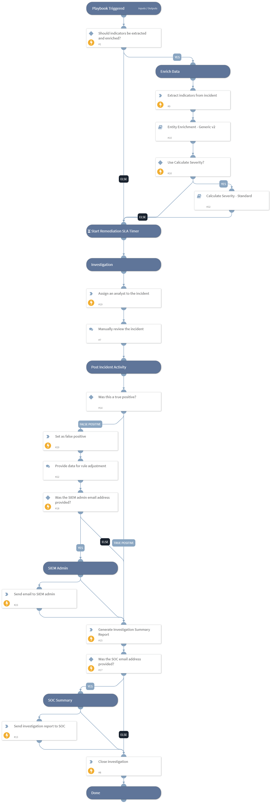

This is a generic playbook to be executed for the Splunk Notable Generic incident type. The playbook performs all the common parts of the investigation, including notifying the SOC, enriching the data for indicators and users, calculating the severity, assigning the incident, notifying the SIEM admin for false positives and more.

## Dependencies
This playbook uses the following sub-playbooks, integrations, and scripts.

### Sub-playbooks
* Entity Enrichment - Generic v2
* Calculate Severity - Standard

### Integrations
This playbook does not use any integrations.

### Scripts
* GenerateInvestigationSummaryReport
* AssignAnalystToIncident

### Commands
* setIncident
* send-mail
* closeInvestigation
* extractIndicators

## Playbook Inputs
---

| **Name** | **Description** | **Default Value** | **Required** |
| --- | --- | --- | --- |
| Enrich | Determines whether to enrich all indicators in the incident. Default is True. | true | Optional |
| OnCall | Set to true to assign only the user that is currently on shift. Default is False. Requires Cortex XSOAR v5.5 or later. | false | Optional |
| SocEmailAddress | The SOC team's email address. |  | Optional |
| SocMailSubject | The subject of the email to send to the SOC. | XSOAR Summary report, ID -  | Optional |
| SiemAdminEmailAddress | The SIEM admin's email address. |  | Optional |
| UseCalculateSeverity | Determines whether to use the Calculate Severity playbook to calculate the incident severity. Default is True. If the playbook isn't used, the severity is determined by the Splunk severity value. | true | Optional |
| SiemAdminMailSubject | The subject of the email to send to the SIEM admin. | Adjustment/Exclusion for notable  | Optional |

## Playbook Outputs
---
There are no outputs for this playbook.

## Playbook Image
---
