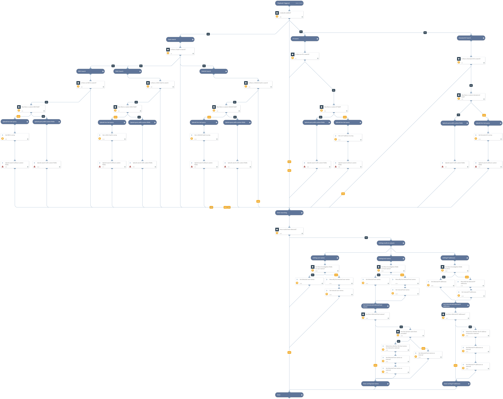

Queries Splunk for indicators such as file hashes, IP addresses, domains, or urls. It outputs detected users, IP addresses, and hostnames related to the indicators.

## Dependencies
This playbook uses the following sub-playbooks, integrations, and scripts.

### Sub-playbooks
This playbook does not use any sub-playbooks.

### Integrations
This playbook does not use any integrations.

### Scripts
* commentsToContext
* IsIPInRanges
* SetAndHandleEmpty
* IsInternalHostName
* Set

### Commands
* splunk-search

## Playbook Inputs
---

| **Name** | **Description** | **Default Value** | **Required** |
| --- | --- | --- | --- | 
| MD5 | The MD5 hash or an array of hashes for which to search. | - | Optional |
| SplunkMD5Field | The name of the fields, in Splunk, in which to find the MD5 hash. You can enter multiple field names using a comma-separated format. If no field is specified, the search uses quick filter. | - | Optional |
| SHA1 | The SHA1 hash or an array of hashes on which to search. | - | Optional |
| SplunkSHA1Field | The name of the fields, in Splunk, in which to find the SHA1 field. You can enter multiple field names using a comma-separated format. If no field is specified, the search uses quick filter. | - | Optional |
| SHA256 | The SHA256 hash or an array of hashes on which to search. | - | Optional |
| SplunkSHA256Field | The name of the fields, in Splunk, in which to find the SHA256. You can enter multiple field names using a comma-separated format. If no field is specified, the search uses quick filter. | - | Optional |
| IPAddress | The source or destination IP address on which to search. Can be a single address or an array of addresses.| - | Optional |
| SplunkIPField | The name of the fields, in Splunk, in which to find the IP addresses. You can enter multiple field names using a comma-separated format. For example, sourceip,destinationip. | - | Optional |
| URLDomain | The domain or URL can be single or an array of domain/urls to search. By default the LIKE clause is used. | - | Optional |
| SplunkURLDomainField | The name of the fields, in Splunk, in which to find the URL/Domain. If no field is specified, the search uses quick filter. Only one field can be used in this parameter. | - | Optional |
| earliest_time | The earliest time to search. For example, -7d, -24h. More examples can be found [here](https://docs.splunk.com/Documentation/Splunk/8.0.0/Search/Specifytimemodifiersinyoursearch). For more examples click [here](https://docs.splunk.com/Documentation/Splunk/8.0.0/SearchReference/SearchTimeModifiers). It is recommended to set a limit for the time frame. | -1d | Optional |
| latest_time | The latest time to search. For example, -6d, -23h. For more examples see [here](https://docs.splunk.com/Documentation/Splunk/8.0.0/Search/Specifytimemodifiersinyoursearch). For even more examples click [here](https://docs.splunk.com/Documentation/Splunk/8.0.0/SearchReference/SearchTimeModifiers) It is recommended to set a limit for the time frame. | - | Optional |
| event_limit | Limits the number of events returned by query. This argument is not mandatory for the command, but is mandatory for the playbook. | 100 | Required |
| IPFieldsToReturn | The value of the IP address fields to return from Splunk when the specified indicator is found. These values are used as inputs in the setting, IP addresses section. For example, src,src_ip,dst,dst_ip. | - | Optional |
| UserFieldsToReturn | The value of the username fields to return from Splunk when the specified indicator is found. These values are used as inputs in the setting, user names section. For example, username,src_username,dst_username. | - | Optional |
| HostFieldsToReturn | The value of the hostname fields to return from Splunk when the specified indicator is found. These values are used as inputs in the setting, host names section. For example, hostname,src_hostname, dst_hostname. | - | Optional |
| InternalIPRange | A list of internal IP address ranges to check IP addresses against. The list should be provided in CIDR format, separated by commas. An example of a list of ranges could be: 172.16.0.0/12,10.0.0.0/8,192.168.0.0/16. If a list of IP address ranges is not provided, the list provided in the `IsIPInRanges` script. The known IPv4 private address ranges is used by default. | - | Optional |
| IndexName | A single Splunk index to use in the search. | * | Required |
| SelectFields | Use this field to include additional enrichment data for the Splunk query. If you have defined one or more investigation fields, the `SelectField` should not include those fields. If there are no other investigation fields defined, the `SelectField` must contain some value. Enter a comma-separated list of field names as they appear in Splunk. * is a valid value, but not recommended since it creates large output. | source,timestamp | Required |
| InternalDomainName | The organizations internal domain name. This is provided for the script `IsInternalHostName` that checks if the detected host names are internal or external if the hosts contain the internal domains suffix. For example, demisto.com. If there is more than one domain, use the "|" character to separate values such as (demisto.com\|test.com) | Optional |
| InternalHostRegex | This is provided for the script `IsInternalHostName` that checks if the detected host names are internal or external. if the hosts match the organizations naming convention. For example the host `testpc1` will have the following regex w{6}d{1}. | - | Optional |

## Playbook Outputs
---

| **Path** | **Description** | **Type** |
| --- | --- | --- |
| Splunk.DetectedUsers | The users detected based on the username field in your search. | string |
| Splunk.DetectedInternalIPs | THe internal IP addresses detected by your search. | string |
| Splunk.DetectedExternalIPs | The external IP addresses detected by your search. | string |
| Splunk.DetectedInternalHosts | The internal host names detected based on the fields in your search. | string |
| Splunk.DetectedExternalHosts | The external host names detected based on the fields in your search. | string |

## Playbook Image
---

