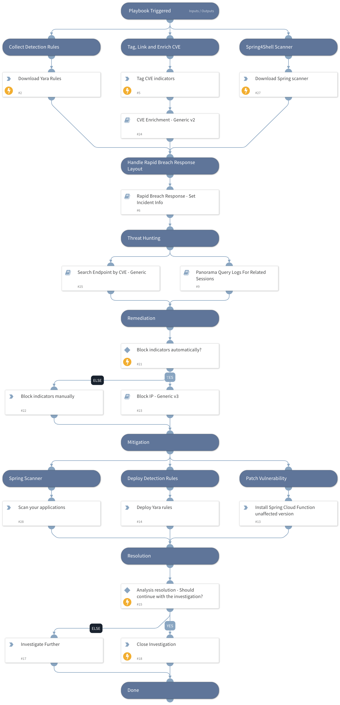

This pack is part of the [Rapid Breach Response](https://xsoar.pan.dev/marketplace/details/MajorBreachesInvestigationandResponse) pack.

**Critical RCE vulnerabilities in Spring Core and Cloud Function SpEL** refers to two 0-day exploits in the popular Spring framework.

Spring Framework is an extremely popular framework used by Java developers to build modern applications. If you rely on the Java stack, it is very likely that your development teams use Spring. In some cases, a single specially crafted request is enough to exploit the vulnerability.

Later, it was discovered that these are two separate vulnerabilities, one in Spring Core and the other in Spring Cloud Function:

**CVE-2022-22965 - RCE in "Spring Core" is a severe vulnerability, aka Spring4Shell**

**CVE-2022-22963 - RCE in "Spring Cloud Function SpEL"**

**CVE-2022-22947 - RCE in "Spring Cloud Gateway"**

**Spring Core vulnerability requirements:**

* JDK 9 or higher
* Apache Tomcat as the Servlet container
* Packaged as WAR
* spring-webmvc or spring-webflux dependency
* Spring Framework versions 5.3.0 to 5.3.17, 5.2.0 to 5.2.19, and older versions

**Spring Cloud Function unaffected versions:**

* 3.1.7
* 3.2.3

This pack will provide you with a first response kit which includes:
* Hunting
* Remediation
* Mitigations

More information about the vulnerability:

[CVE-2022-22965: Spring Core Remote Code Execution Vulnerability Exploited In the Wild
](https://unit42.paloaltonetworks.com/cve-2022-22965-springshell/)

Note: This is a beta playbook, which lets you implement and test pre-release software. Since the playbook is beta, it might contain bugs. Updates to the pack during the beta phase might include non-backward compatible features. We appreciate your feedback on the quality and usability of the pack to help us identify issues, fix them, and continually improve.

