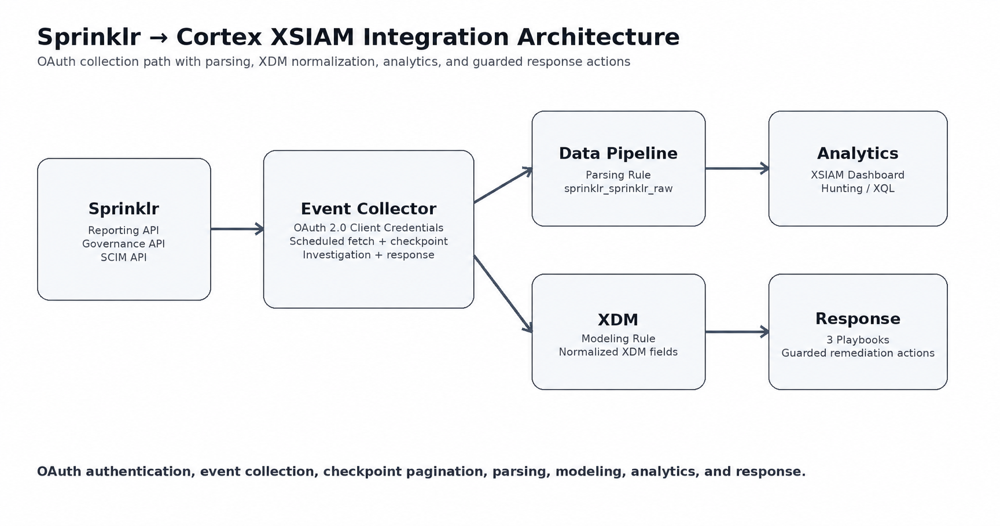
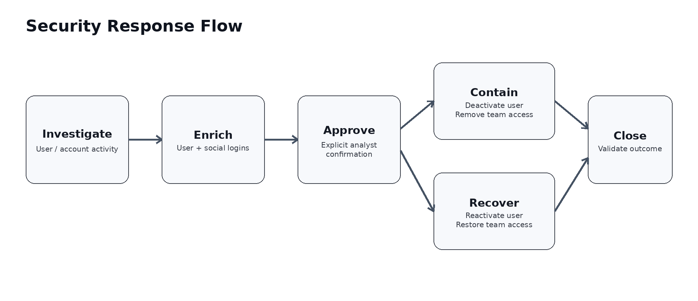

# Sprinklr

This content pack provides a complete path from **Sprinklr Reporting API collection** to **Cortex XSIAM parsing, XDM normalization, analytics, investigation, and controlled response actions**.



## Main capabilities

- OAuth 2.0 **Client Credentials** authentication with automatic token caching and one-time retry on HTTP 401.
- Scheduled collection from the Sprinklr **Reporting API** with checkpoint persistence and `data.hasMore` pagination handling.
- Parsing into the `sprinklr_sprinklr_raw` dataset.
- XDM normalization using the `[MODEL: dataset = sprinklr_sprinklr_raw]` rule.
- A **Sprinklr Activity Overview** XSIAM dashboard.
- Investigation commands for events, users, posts, deleted activity, social logins, and summaries.
- Guarded response commands for user containment, user recovery, deprovisioning, team-access removal, and social-account containment/recovery.
- Three visual playbooks with explicit approval controls before state-changing actions.

## Architecture and data flow

1. **Authenticate** — The integration requests an OAuth token from `/{env}/oauth/token` using `client_id`, `client_secret`, and `grant_type=client_credentials`.
2. **Collect** — The scheduled collector queries `/{env}/api/v2/reports/query` and sends events to XSIAM with vendor `Sprinklr` and product `Sprinklr`.
3. **Parse** — The parsing rule routes the events to `sprinklr_sprinklr_raw` and extracts commonly used Sprinklr fields.
4. **Normalize** — The modeling rule maps the raw fields to XDM event, user, identity, target-resource, URL, session, and observer fields.
5. **Analyze** — The existing dashboard and XQL can be used for activity analysis and hunting.
6. **Respond** — Commands and playbooks provide guarded response actions through documented Sprinklr Governance and SCIM APIs.



## Integration configuration

Create an instance of **Sprinklr Event Collector** and configure:

- **Sprinklr API root URL:** `https://api3.sprinklr.com`
- **Sprinklr environment:** `prod3`
- **Client ID / API Key:** Sprinklr Client ID
- **Client Secret / API Secret:** Sprinklr Client Secret
- **Reporting API path:** `/{env}/api/v2/reports/query`
- **Reporting API payload (JSON):** the required Sprinklr Reporting API v2 payload
- **Fetch events:** enable for scheduled ingestion
- **First fetch time interval:** set according to the required initial lookback
- **Maximum number of events per fetch:** default `200`
- **Events Fetch Interval:** default `1` minute
- **SCIM delete path template:** `/{env}/api/v1/scim/v2/Users/{userId}`

There is no manual access-token field. The integration obtains and renews access tokens automatically.

## Authentication lifecycle

The token request is:

```text
POST https://api3.sprinklr.com/prod3/oauth/token
Content-Type: application/x-www-form-urlencoded

client_id=<CLIENT_ID>
client_secret=<CLIENT_SECRET>
grant_type=client_credentials
```

Authenticated API calls use:

```text
Authorization: Bearer <access_token>
Key: <client_id>
```

The integration caches a valid token, refreshes it before expiry, and on HTTP 401 clears the cached token and retries once with a newly requested token.

## Event collection

The default payload is an `OUTBOUND_MESSAGE` request shape and should be verified against the target Sprinklr tenant before scheduled collection is enabled:

```json
{
  "reportingEngine": "OUTBOUND_MESSAGE",
  "report": "OUTBOUND_MESSAGE",
  "timeZone": "Etc/UTC",
  "pageSize": "20",
  "page": "0",
  "groupBys": [
    {
      "heading": "POST_ID",
      "dimensionName": "POST_ID",
      "groupType": "FIELD",
      "details": null
    }
  ],
  "projections": []
}
```

At runtime the integration sets `startTime`, `endTime`, `pageSize`, and `page`. Scheduled fetching keeps the same time window while Sprinklr reports `data.hasMore=true`; the completed checkpoint advances only after the current window is fully consumed.

If another Sprinklr report type is required, generate its API v2 payload in Sprinklr and place that payload in the integration configuration rather than constructing an undocumented payload.

## Parsing and XDM

### Dataset

`sprinklr_sprinklr_raw`

### Parsing

The parsing rule keeps the full Sprinklr record and derives common fields including post, message, account, author, channel, status, permalink, deletion state, and timestamps.

### XDM modeling

The modeling rule uses the following header:

```xif
[MODEL: dataset = sprinklr_sprinklr_raw]
```

It maps the event into XDM fields such as:

- `xdm.event.id`, `xdm.event.type`, `xdm.event.original_event_type`
- `xdm.event.outcome`, `xdm.event.outcome_reason`, `xdm.event.description`
- `xdm.source.user.identifier`, `xdm.source.identity.identifier`
- `xdm.target.resource.id`, `xdm.target.resource.type`, `xdm.target.resource.value`
- `xdm.target.url`
- `xdm.session_context_id`
- `xdm.observer.name`, `xdm.observer.type`

## Commands

### Collection and reporting

1. `sprinklr-get-events` — Fetch a selected Reporting API time range and optionally push the returned records to XSIAM.
2. `sprinklr-report-query` — Run the configured or supplied Reporting API v2 payload.

### Investigation and hunting

3. `sprinklr-search-events` — Search collected Reporting API activity by author, account, post, message, channel, status, deletion flag, and time range.
4. `sprinklr-get-user-activity` — Retrieve recent activity for a specific `authorId`.
5. `sprinklr-get-account-activity` — Retrieve recent activity for a specific `accountId`.
6. `sprinklr-get-post` — Find Reporting API activity for a specific `postId`.
7. `sprinklr-get-deleted-events` — Return activity where `deleted=true`.
8. `sprinklr-security-summary` — Summarize events by status, channel, author, account, and deletion state.
9. `sprinklr-get-user` — Retrieve Governance user details and team memberships by email.
10. `sprinklr-get-social-logins` — Retrieve social login profiles linked to a user email.
11. `sprinklr-get-account-details` — Fetch full Sprinklr social-account details by `accountId` using the documented Account API.
12. `sprinklr-get-message` — Retrieve Reporting API activity for a specific `messageId`.
13. `sprinklr-get-channel-activity` — Retrieve activity for a specific `channelType`.
14. `sprinklr-get-status-events` — Retrieve activity for an exact Sprinklr status.
15. `sprinklr-get-failed-events` — Retrieve activity with status `FAILED`.
16. `sprinklr-get-sent-events` — Retrieve activity with status `SENT`.
17. `sprinklr-get-author-account-activity` — Correlate an `authorId` with an `accountId`.
18. `sprinklr-get-account-channel-activity` — Correlate an `accountId` with a `channelType`.
19. `sprinklr-get-author-channel-activity` — Correlate an `authorId` with a `channelType`.

### Identity response and recovery

20. `sprinklr-deactivate-user` — Set SCIM `active=false` for user containment.
21. `sprinklr-activate-user` — Set SCIM `active=true` for recovery.
22. `sprinklr-remove-user-from-team` — Remove a user from a specific team.
23. `sprinklr-delete-user-by-email` — Delete a user through the Governance User API.
24. `sprinklr-deprovision-user` — Delete/deprovision a user through the configured SCIM DELETE path.
25. `sprinklr-create-user` — Create a user through the Governance User API for controlled recovery/re-provisioning.

### Social-account containment and recovery

26. `sprinklr-remove-ad-account-from-team` — Remove an ad account from a team.
27. `sprinklr-attach-ad-account-to-team` — Attach an ad account to a team.
28. `sprinklr-remove-page-account-from-team` — Remove a page account from a team.
29. `sprinklr-attach-page-account-to-team` — Attach a page account to a team.

All state-changing commands require `confirm=yes`.

## Playbooks

### Sprinklr - Suspicious User Activity Response

Investigates the user and recent author activity, then provides two separately controlled response stages:

- optional **deactivation** for containment;
- optional **SCIM deprovisioning** as a separate destructive action.

Both actions default to disabled and require explicit playbook input approval.

### Sprinklr - Social Account Containment

Removes a selected **page** or **ad** account from a Sprinklr team after explicit approval.

### Sprinklr - Social Account Recovery

Re-attaches a selected **page** or **ad** account to a Sprinklr team after explicit approval.

## Dashboard

**Sprinklr Activity Overview** displays collection volume, status and channel distributions, top accounts, recent activity, and collection freshness.

## Testing the integration

Before enabling scheduled collection in production, use the integration's **Test** button and run `sprinklr-get-events` with a short time range. Confirm the following flow in a non-production environment:

```text
OAuth Client Credentials
    -> token returned

Reporting API
    -> real OUTBOUND_MESSAGE records returned

Scheduled fetch
    -> events automatically collected

Parsing
    -> events reached sprinklr_sprinklr_raw

Dashboard
    -> working in Cortex XSIAM
```

## Official references

- [Cortex event collection integrations](https://xsoar.pan.dev/docs/integrations/event-collectors)
- [Cortex integration YAML file](https://xsoar.pan.dev/docs/integrations/yaml-file)
- [Cortex Common Server Python API](https://xsoar.pan.dev/docs/reference/api/common-server-python)
- [Sprinklr: Fetching data through an API payload](https://www.sprinklr.com/help/articles/reporting-use-cases/fetching-data-through-api-payload/63f9c61ee02459133724b3a1)
- [Sprinklr: Generate an API v2 payload](https://www.sprinklr.com/help/articles/integration-guides/generate-api-v2-payload/633c5ca8a0522e093b06c1a2)
- [Sprinklr Governance User API](https://www.sprinklr.com/help/articles/governance/user/686c8ebc174819486173e43e)
- [Sprinklr Governance Account Management API](https://www.sprinklr.com/help/articles/governance/account-management/686c8f7ef77c9b1aebd8c603)

No customer credential values are stored in this content pack.
