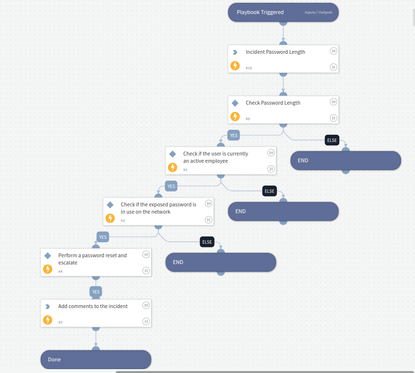

# SpyCloud - Breach Investigation

 This playbook enables the investigation of SpyCloud Breach incidents. This playbook can be used to perform the below actions. Please note that the playbook provides a 
 basic skeleton for the following actions users need to implement the logic according to their needs.

- Check if the breached password length is >= the minimum required by the organization. If not, exit the playbook.
- Check if the user is currently an active employee. If not, exit the playbook.
- Check if the exposed password is in use on the network (check AD, check Okta, check Ping, check G-Suite, etc).
- If the password is in use in one of the checked systems, perform a password reset, raise an incident, etc.

## Dependencies

This playbook uses the following sub-playbooks, integrations, and scripts.

### Sub-playbooks

This playbook does not use any sub-playbooks.

### Integrations

SpyCloud Enterprise Protection.

### Scripts

* StringLength

### Commands

* setIncident

## Playbook Inputs
| **Name**               | **Description** | **Default Value** | **Required** |
|------------------------| --- |-------------------|-----------|
| Minimum Password Length | Minimum Password Length | 8 | Required. |

## Playbook Outputs

---
There are no outputs for this playbook.

## Playbook Image

---

