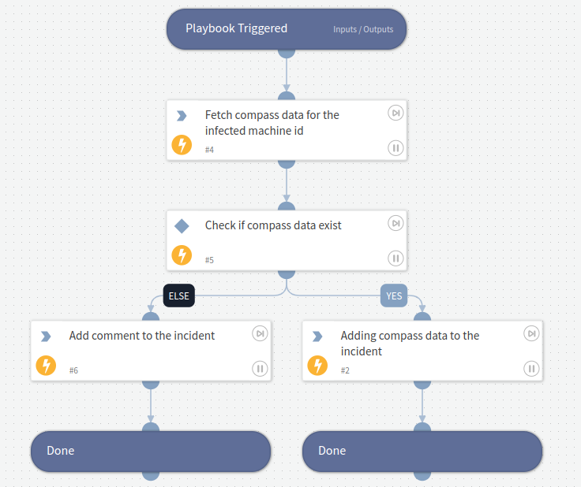

# SpyCloud - Malware Incident Enrichment

This playbook enables the enrichment of SpyCloud malware incidents. This playbook fetches the infected machine ID from the incident and if the organization has access to SpyCloud compass data, then it will pull all the additional records for the infected machine ID using `spycloud-compass-device-data-get` command and adds the data to the incident.

## Dependencies

This playbook uses the following sub-playbooks, integrations, and scripts.

### Sub-playbooks

This playbook does not use any sub-playbooks.

### Integrations

* SpyCloud Enterprise Protection

### Scripts

This playbook does not use any scripts.

### Commands

* spycloud-compass-device-data-get
* setIncident

## Playbook Inputs
| **Name**               | **Description** | **Default Value** | **Required** |
|------------------------| --- | --- |--------------|
| Infected Machine ID    | A unique identifier either extracted from an infostealer log, when present, or an RFC 4122-compliant universally unique identifier (UUID) generated by SpyCloud, when no identifier is present in an infected record. | ${incident.spycloudinfectedmachineid} | Required.    |

## Playbook Outputs

| **Path** | **Type** | **Description** |
| --- | --- | --- |
| SpyCloud.CompassDeviceData.username | String | Username. | 
| SpyCloud.CompassDeviceData.password | String | Account password. | 
| SpyCloud.CompassDeviceData.password_plaintext | String | The cracked, plaintext version of the password \(where the password is crackable\). | 
| SpyCloud.CompassDeviceData.password_type | String | Password type for original password as found in the data breach. This will either be plaintext or one of the many password hash/encryption types \(SHA1, MD5, 3DES, etc\). | 
| SpyCloud.CompassDeviceData.target_url | String | URL extracted from Botnet data. This is the URL that is captured from a key logger installed on an infected user's system. | 
| SpyCloud.CompassDeviceData.user_browser | String | Browser name. | 
| SpyCloud.CompassDeviceData.ip_addresses | String | List of one or more IP addresses in alphanumeric format. Both IPV4 and IPv6 addresses are supported. | 
| SpyCloud.CompassDeviceData.infected_machine_id | String | A unique identifier either extracted from an infostealer log, when present, or an RFC 4122-compliant universally unique identifier \(UUID\) generated by SpyCloud, when no identifier is present in an infected record. The method of generation of these identifiers varies by malware family and may or may not conform to a UUID format. For the ID's in the aforementioned UUID format, there is not currently any way to determine whether an infected_machine_id was extracted from a malware log or generated by SpyCloud. | 
| SpyCloud.CompassDeviceData.infected_path | String | The local path to the malicious software installed on the infected user's system. | 
| SpyCloud.CompassDeviceData.infected_time | Date | The time at which the user's system was infected with malicious software. | 
| SpyCloud.CompassDeviceData.user_sys_domain | String | System domain. This usually comes from Botnet data. | 
| SpyCloud.CompassDeviceData.user_hostname | String | System hostname. This usually comes from Botnet data. | 
| SpyCloud.CompassDeviceData.user_os | String | System OS name. This usually comes from Botnet data. | 
| SpyCloud.CompassDeviceData.user_sys_registered_owner | String | System registered owner name. This usually comes from Botnet data. | 
| SpyCloud.CompassDeviceData.source_id | Number | Numerical breach ID. This correlates directly with the id field in Breach Catalog objects. | 
| SpyCloud.CompassDeviceData.spycloud_publish_date | Date | The date on which we ingested the breached data into our systems. This is the same date on which the data becomes publicly available to our customers. | 
| SpyCloud.CompassDeviceData.target_domain | String | SLD extracted from 'target_url' field. | 
| SpyCloud.CompassDeviceData.target_subdomain | String | Subdomain and SLD extracted from 'target_url' field. | 
| SpyCloud.CompassDeviceData.severity | Number | Severity is a numeric code representing severity of a breach record. This can be used in API requests to ensure only Breach Records with plaintext password are returned. Possible values are: 2 -&gt; Email only severity. This record is part of an email-only list. 5 -&gt; Informational severity. This severity value is given to breach records where we have a non-crackable password hash, or no password at all. 20 -&gt; High severity. This severity value is given to breach records where we have an email address and a plaintext password. 25 -&gt; Critical severity. This severity value is given to breach records recovered from an infected machine \(botnet data\). These records will always have a plaintext password and most will have an email address. | 
| SpyCloud.CompassDeviceData.document_id | String | UUID v4 string which uniquely identifies this breach record in our data set. | 
| SpyCloud.CompassDeviceData.email | String | Email address. | 
| SpyCloud.CompassDeviceData.email_domain | String | Domain extracted from 'email_address' field. This is not a SLD, but everything after the '@' symbol. | 
| SpyCloud.CompassDeviceData.email_username | String | Username extracted from 'email' field. This is everything before the '@' symbol. | 
| SpyCloud.CompassDeviceData.domain | String | Domain name. | 

## Playbook Image

---

