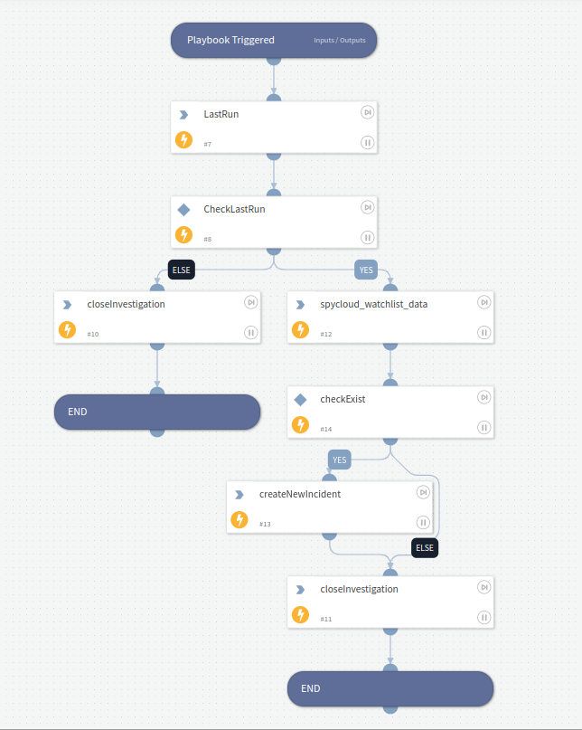

This playbook executes spycloud-watchlist command and creates incidents.

## Dependencies

This playbook uses the following sub-playbooks, integrations, and scripts.

### Sub-playbooks

This playbook does not use any sub-playbooks.

### Integrations

SpyCloud Enterprise.

### Scripts

* SpyCloudEnterpriseFeedLastRun
* Spycloud Watchlist Data

### Commands

* closeInvestigation
* createNewIncident

## Playbook Inputs

---
There are no inputs for this playbook.

## Playbook Outputs

---
There are no outputs for this playbook.

## Playbook Image

---

