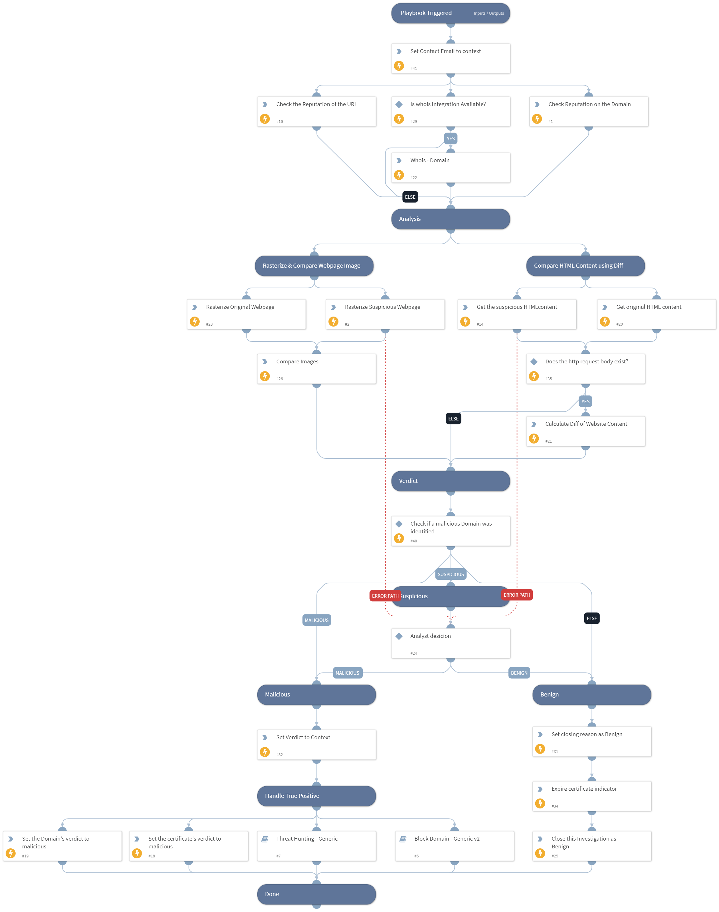

This playbook process "Suspicious Domain Hunting" incidents generated by the CertStream integration.

## Dependencies

This playbook uses the following sub-playbooks, integrations, and scripts.

### Sub-playbooks

* Block Domain - Generic v2
* Threat Hunting - Generic

### Integrations

This playbook does not use any integrations.

### Scripts

* HttpV2
* HtmlDifflibCheck
* Set
* SetAndHandleEmpty
* IsIntegrationAvailable
* imagecompare

### Commands

* domain
* expireIndicators
* whois
* url
* rasterize
* setIndicators
* closeInvestigation

## Playbook Inputs

---

| **Name** | **Description** | **Default Value** | **Required** |
| --- | --- | --- | --- |
| similarityMaxThreshold | The minimum threshold value for malicious verdict | 0.5 | Optional |
| similarityMinThreshold | The minimum threshold value for suspicious verdict | 0.2 | Optional |
| contactEmail | Email address to be used as contact email when sending a takedown request email |  | Optional |

## Playbook Outputs

---
There are no outputs for this playbook.

## Playbook Image

---

