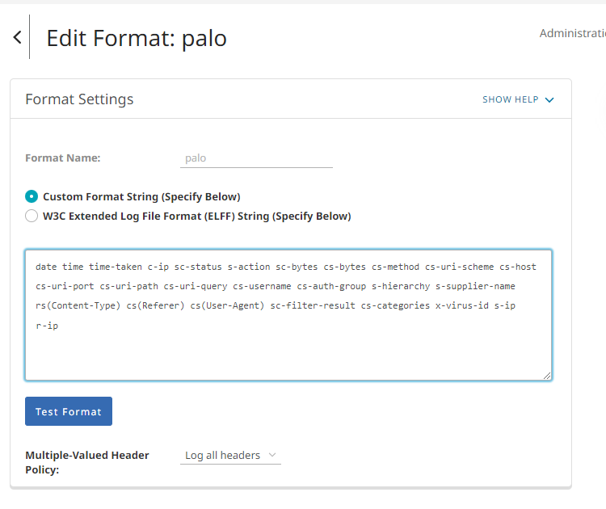
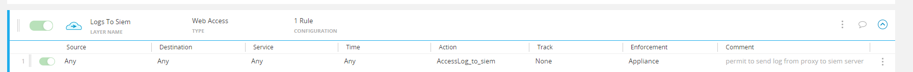

# Symantec Bluecoat ProxySG
This pack includes Cortex XSIAM content. 
## Configuration on Server Side
You need to configure Bluecoat ProxySG to forward Syslog messages with the access log 'main' format.

Go to the ProxySG software and open the "Configuration" tab [Product Doc](https://knowledge.broadcom.com/external/article/166529/sending-access-logs-to-a-syslog-server.html);
1. From the left sidebar, navigate to **Access Logging** > **Logs** > **Logs** tab, and create a new log with the `main` format defined for it:



```bash
   date time time-taken c-ip sc-status s-action sc-bytes cs-bytes cs-method cs-uri-scheme cs-host cs-uri-port cs-uri-path cs-uri-query cs-username cs-auth-group s-supplier-name rs(Content-Type) cs(Referer) cs(User-Agent) sc-filter-result cs-categories x-virus-id s-ip
```
2.  Click the **Upload Client** tab and configure your log as follows:

   | Field | Value |
   | --- | --- |
   | Client type | Custom Client |
   | Save the log file as | text file |
3. In the **Custom Client Settings** dialog box, point the Custom Client to the broker, specifying the IP address and port number.
4. Click the **Upload Schedule** tab. Make sure that the **Upload the access log** option is marked as **continuously**.
5. From the left sidebar, navigate to **Policy** > **Visual Policy Manager**
6. Add a new **Web Access Layer** and create a rule with the *Modify Access Logging* action.


7. In the **Add Access Logging Object** dialog box, enable logging for your new access log.
   
   Make sure the log is being written by going to **Statistics** > **Access Logging** > **Select "MyLog"** > **Start Tail**.



* Pay attention: Timestamp parsing is configured for **%Y-%m-%d %H:%M:%S** format in UTC timezone.
                 Follow the [Product Instructions](https://techdocs.broadcom.com/us/en/symantec-security-software/web-and-network-security/edge-swg/6-7/getting-started/page-help-administration/page-help-general/page-help-timezones.html) for selecting a timezone.
   
## Collect Events from Vendor
In order to use the collector, use the [Broker VM](#broker-vm) option.

### Broker VM
To create or configure the Broker VM, use the information described [here](https://docs-cortex.paloaltonetworks.com/r/Cortex-XDR/Cortex-XDR-Prevent-Administrator-Guide/Set-up-Broker-VM).

You can configure the specific vendor and product for this instance.

1. Navigate to **Settings** > **Configuration** > **Data Broker** > **Broker VMs**. 
2. Right-click, and select **Syslog Collector** > **Configure**.
3. When configuring the Syslog Collector, set the following values:
   - vendor as vendor - symantec
   - product as product - bluecoatproxysg