Query the Symantec Endpoint Protection Manager using the official REST API.

## Use Cases
- Scan/Quarantine/content-update an endpoint.
- Assign policy to an endpoint.
- Move client to different group.

**Unsupported use cases in the API:**

- Get scan results
- Get reports/logs
- Receive system alerts

## Required Permissions
The following role is required to use the Symantec Endpoint Protection API:
- sysadmin
Note: An **Administrator** role does not have enough permissions for this integration. A **System Administrator** (sysadmin) role is required. 

## Configure Symantec Endpoint Protection V2 in Cortex


| **Parameter** | **Required** |
| --- | --- |
| Server (e.g., https://1.2.3.4:8446) | True |
| Authentication | True |
| Password | True |
| SEPM domain for the user | False |
| Trust any certificate (not secure) | False |
| Use system proxy settings | False |
| Local time zone (e.g., +02:30,-06:00) | False |


## Commands
You can execute these commands from the CLI, as part of an automation, or in a playbook.
After you successfully execute a command, a DBot message appears in the War Room with the command details.
### sep-endpoints-info
***
Returns information about endpoints.


#### Base Command

`sep-endpoints-info`
#### Input

| **Argument Name** | **Description** | **Required** |
| --- | --- | --- |
| columns | A CSV list of the displayed columns. | Optional | 
| computerName | Filters by the host name of the computer. A wild card search can be done using '*' at the end of the query. | Optional | 
| lastUpdate | Indicates when a computer's status was last updated. The default is "0", which returns all results. Default is 0. | Optional | 
| os | The operating system by which to filter. Possible values are: CentOs, Debian, Fedora, MacOSX, Oracle, OSX, RedHat, SUSE, Ubuntu, Win10, Win2K, Win7, Win8, WinEmb7, WinEmb8, WinEmb81, WinFundamental, WinNT, Win2K3, Win2K8, Win2K8R2, WinVista, WinXP, WinXPEmb, WinXPProf64. | Optional | 
| pageSize | The number of results to include on each page. The default is 20. | Optional | 
| groupName | The name of the group to which the endpoint belongs. A wild card search can be done using '*' at the end of the query. | Optional | 


#### Context Output

| **Path** | **Type** | **Description** |
| --- | --- | --- |
| SEPM.Endpoint.Hostname | String | The hostname of the endpoint. | 
| SEPM.Endpoint.Domain | String | The domain of the endpoint. | 
| SEPM.Endpoint.IPAddresses | String | The IP addresses of the endpoint. | 
| SEPM.Endpoint.OS | String | The OS information of the endpoint. | 
| SEPM.Endpoint.Description | String | The description of the endpoint. | 
| SEPM.Endpoint.MACAddresses | String | The MAC address of the endpoint. | 
| SEPM.Endpoint.BIOSVersion | String | The BIOS version of the endpoint. | 
| SEPM.Endpoint.DHCPServer | String | The DHCP server address of the endpoint. | 
| SEPM.Endpoint.HardwareKey | String | The hardware key of the client to be moved. | 
| SEPM.Endpoint.LastScanTime | String | The last scan time of the endpoint. | 
| SEPM.Endpoint.RunningVersion | String | The running version of the endpoint. | 
| SEPM.Endpoint.TargetVersion | String | The target version of the endpoint. | 
| IP.Address | String | The IP address of the endpoint. | 
| IP.Host | String | The IP host of the endpoint. | 
| Endpoint.Hostname | Unknown | The hostname of the endpoint. | 
| Endpoint.MACAddress | Unknown | The MAC address of the endpoint. | 
| Endpoint.Domain | Unknown | The domain of the endpoint. | 
| Endpoint.IPAddress | Unknown | The IP address of the endpoint. | 
| Endpoint.DHCPServer | Unknown | The DHCP server of the endpoint. | 
| Endpoint.OS | String | The OS of the endpoint. | 
| Endpoint.OSVersion | String | The OS version of the endpoint. | 
| Endpoint.BIOSVersion | String | The BIOS version of the endpoint. | 
| Endpoint.Memory | String | The memory of the endpoint. | 
| Endpoint.Processors | String | The processors that the endpoint uses. | 
| IP.Hostname | String | The hostname that is mapped to this IP address. | 
| SEPM.Endpoint.Group | String | The group of the endpoint. | 
| SEPM.Endpoint.PatternIdx | String | The PatternIdx of the endpoint. | 
| SEPM.Endpoint.OnlineStatus | String | The online status of the endpoint. | 
| SEPM.Endpoint.UpdateTime | String | The update time of the endpoint. | 


#### Command Example
```
!sep-endpoints-info
```

#### Human Readable Output
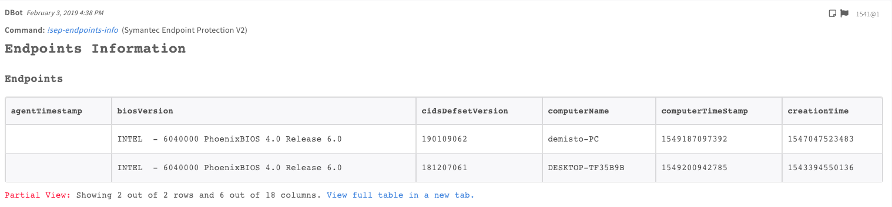


### sep-groups-info
***
Returns information about groups.


#### Base Command

`sep-groups-info`
#### Input

| **Argument Name** | **Description** | **Required** |
| --- | --- | --- |
| columns | The column by which the results are sorted. | Optional | 


#### Context Output

| **Path** | **Type** | **Description** |
| --- | --- | --- |
| SEPM.Groups | Unknown | The list of groups. | 
| SEPM.Groups.created | number | The time of creation time \(in Epoch\). | 
| SEPM.Groups.fullPathName | string | The name of the group. | 
| SEPM.Groups.id | string | The ID of the group. | 
| SEPM.Groups.numberOfPhysicalComputers | number | The number of physical computers in the group. | 
| SEPM.Groups.numberOfRegisteredUsers | number | The number of registered users in the group. | 
| SEPM.Groups.policyDate | number | The date of the policy \(in Epoch\). | 
| SEPM.Groups.policySerialNumber | number | The serial number of the policy. | 


#### Command Example
```
!sep-groups-info
```

#### Human Readable Output
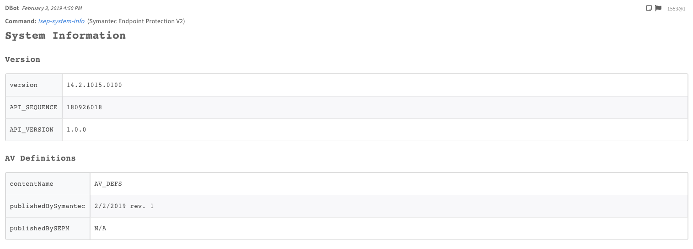


### sep-system-info
***
Returns information about the system, such as version or AV definition.


#### Base Command

`sep-system-info`
#### Input

There are no input arguments for this command.

#### Context Output

| **Path** | **Type** | **Description** |
| --- | --- | --- |
| SEPM.ServerAVDefVersion | string | The version of the AV definition. | 


#### Command Example
```
!sep-system-info
```

#### Human Readable Output


### sep-command-status
***
Retrieves the status of a command.


#### Base Command

`sep-command-status`
#### Input

| **Argument Name** | **Description** | **Required** |
| --- | --- | --- |
| commandId | The ID of the command. | Required | 


#### Context Output

| **Path** | **Type** | **Description** |
| --- | --- | --- |
| SEPM.LastCommand.CommandDetails | string | The details of the command. | 
| SEPM.LastCommand.CommandId | string | The ID of the command. | 


#### Command Example
```
!sep-command-status commandId=04A68CA5952B4726AAFEB421E0EB436C
```

#### Human Readable Output
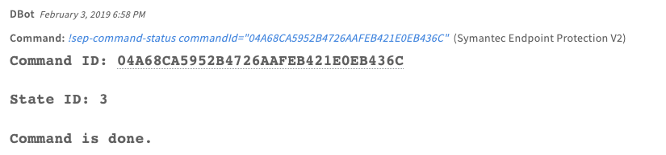


### sep-client-content
***
Retrieves the content of the client.


#### Base Command

`sep-client-content`
#### Input

There are no input arguments for this command.

#### Context Output

| **Path** | **Type** | **Description** |
| --- | --- | --- |
| SEPM.ClientContentVersions | string | Displays the versions for each client. | 
| SEPM.LastUpdated | string | The last update of a date. | 


#### Command Example
```
!sep-client-content
```

#### Human Readable Output
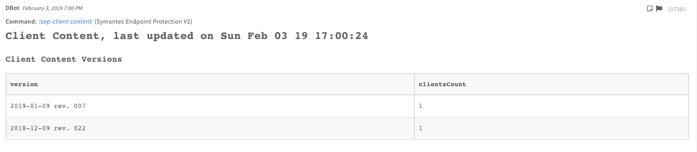


### sep-list-policies
***
Retrieves a list of existing policies.


#### Base Command

`sep-list-policies`
#### Input

There are no input arguments for this command.

#### Context Output

| **Path** | **Type** | **Description** |
| --- | --- | --- |
| SEPM.PoliciesList.PolicyName | string | The name of the policy. | 
| SEPM.PoliciesList.Type | string | The type of the policy. | 
| SEPM.PoliciesList.ID | string | The ID of the policy. | 
| SEPM.PoliciesList.Description | string | The description of the policy. | 
| SEPM.PoliciesList.Enabled | boolean | Whether the list of polices is enabled. Enabled if "True". | 
| SEPM.PoliciesList.AssignedLocations.GroupID | string | The ID of the group of the locations assigned to this policy. | 
| SEPM.PoliciesList.AssignedLocations.Locations | string | The list of location IDs assigned to this policy. | 
| SEPM.PoliciesList.AssignedCloudGroups.GroupID | string | The ID of the cloud group of the locations assigned to this policy. | 
| SEPM.PoliciesList.AssignedCloudGroups.Locations | string | The list of location IDs belonging to a cloud group assigned to this policy. | 


#### Command Example
```
!sep-list-policies
```

#### Human Readable Output
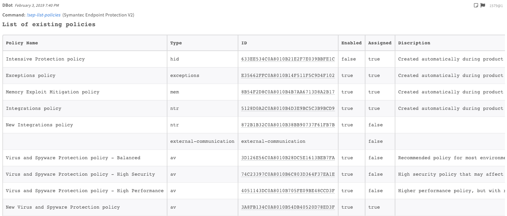


### sep-assign-policy
***
Assigns an existing policy to a specified location.


#### Base Command

`sep-assign-policy`
#### Input

| **Argument Name** | **Description** | **Required** |
| --- | --- | --- |
| groupID | The ID of the group to which the endpoint belongs. | Required | 
| locationID | The ID of the location of the endpoint. | Required | 
| policyType | The type of policy to be assigned. | Required | 
| policyID | The ID of the policy to be assigned. | Required | 


#### Context Output

There is no context output for this command.

#### Command Example
```
!sep-assign-policy groupID=44BE96AFC0A8010B0CFACB30929326C2 locationID=50FEEA3FC0A8010B739E49CB0C321A7E policyID=A00ADE188AA148D7AD319CBCA1FA2F23 policyType=hi
```

#### Human Readable Output
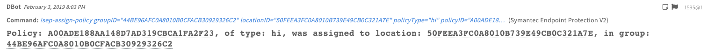


### sep-list-locations
***
Retrieves a list of location IDs for a specified group.


#### Base Command

`sep-list-locations`
#### Input

| **Argument Name** | **Description** | **Required** |
| --- | --- | --- |
| groupID | The group ID for which to list locations. | Required | 


#### Context Output

| **Path** | **Type** | **Description** |
| --- | --- | --- |
| SEPM.Locations.ID | Unknown | The ID of the location. | 


#### Command Example
```
!sep-list-locations groupID=44BE96AFC0A8010B0CFACB30929326C2
```

#### Human Readable Output
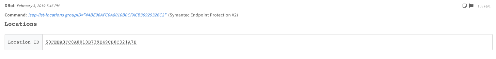


### sep-endpoint-quarantine
***
Quarantines an endpoint according to its policy.


#### Base Command

`sep-endpoint-quarantine`
#### Input

| **Argument Name** | **Description** | **Required** |
| --- | --- | --- |
| endpoint | The IP or hostname of the endpoint. | Required | 
| actionType | Adds or removes an endpoint from quarantine. Possible values are: Add, Remove. | Required | 


#### Context Output

| **Path** | **Type** | **Description** |
| --- | --- | --- |
| SEPM.Quarantine.CommandID | string | The ID of the command that was run. | 
| SEPM.Quarantine.Action | string | The type of the action type. Can be "Add" or "Remove". | 
| SEPM.Quarantine.Endpoint | string | The IP or hostname of the identifier of the endpoint. | 


#### Command Example
```
!sep-endpoint-quarantine actionType=add endpoint=demisto-PC
```

#### Human Readable Output
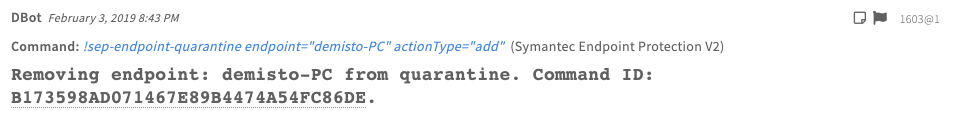


### sep-scan-endpoint
***
Scans an endpoint.


#### Base Command

`sep-scan-endpoint`
#### Input

| **Argument Name** | **Description** | **Required** |
| --- | --- | --- |
| endpoint | The IP address or hostname of the endpoint. | Required | 
| scanType | The scan type of the endpoint. Can be "ScanNow_Quick", "ScanNow_Full", or "ScanNow_Custom". Possible values are: ScanNow_Quick, ScanNow_Full, ScanNow_Custom. | Required | 


#### Context Output

| **Path** | **Type** | **Description** |
| --- | --- | --- |
| SEPM.Scan.CommandID | string | The ID of the command that was run. | 
| SEPM.Scan.Type | string | The type of the scan. Can be "ScanNow_Quick", "ScanNow_Full", or "ScanNow_Custom". | 
| SEPM.Scan.Endpoint | Unknown | The IP or hostname of the identifier of the endpoint. | 


#### Command Example
```
!sep-scan-endpoint endpoint=demisto-PC scanType=ScanNow_Quick
```

#### Human Readable Output
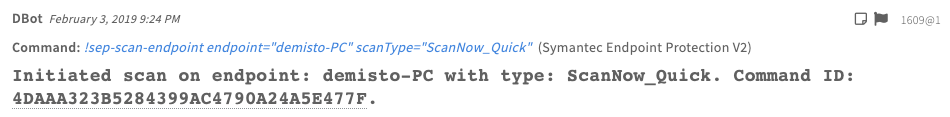


### sep-update-endpoint-content
***
Updates the content of a specified client.


#### Base Command

`sep-update-endpoint-content`
#### Input

| **Argument Name** | **Description** | **Required** |
| --- | --- | --- |
| endpoint | The IP address or hostname of the endpoint. | Required | 


#### Context Output

| **Path** | **Type** | **Description** |
| --- | --- | --- |
| SEPM.Update.Endpoint | String | The endpoint that is being updated. | 
| SEPM.Update.CommandID | String | The ID of the command for which to check the status. | 


#### Command Example
```
!sep-update-endpoint-content endpoint=demisto-PC
```

#### Human Readable Output
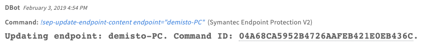


### sep-move-client-to-group
***
Moves a client to a group.


#### Base Command

`sep-move-client-to-group`
#### Input

| **Argument Name** | **Description** | **Required** |
| --- | --- | --- |
| groupID | The ID of the group to which to move the client. | Required | 
| hardwareKey | The hardware key of the client to be moved. | Required | 


#### Context Output

There is no context output for this command.

#### Command Example
```
!sep-move-client-to-group groupID=AA51516BC0A8010B3BFBBE37F7B71214 hardwareKey=269CE816FDB1BA25A2505D0A5A59294C
```

#### Human Readable Output
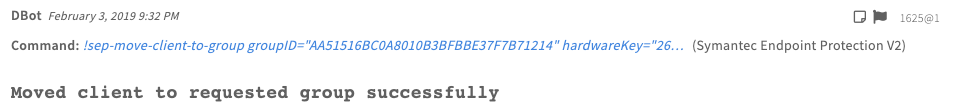


### sep-identify-old-clients
***
Get endpoints for a running version that is different than the target version or the desired version (if specified).


#### Base Command

`sep-identify-old-clients`
#### Input

| **Argument Name** | **Description** | **Required** |
| --- | --- | --- |
| columns | Sets which columns will be displayed. | Optional | 
| computerName | Filters by the host name of the computer. A wild card search can be done using '*' at the end of the query. | Optional | 
| lastUpdate | Indicates when a computer's status was last updated. The default is "0", which returns all results. | Optional | 
| os | The operating system by which to filter. | Optional | 
| pageSize | The number of results to include on each page. The default is 20. | Optional | 
| groupName | The name of the group to which the endpoint belongs. A wild card search can be done using '*'at the end of the query. | Optional | 
| desiredVersion | desiredVersion. | Optional | 


#### Context Output

There is no context output for this command.

#### Command Example
```
!sep-identify-old-clients desiredVersion=10
```

#### Human Readable Output
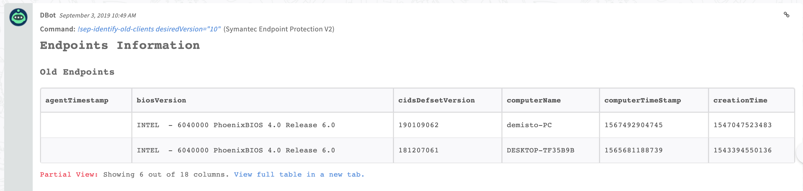


## Known Limitations
- SEPM REST- API currently exposes statistics, but does not expose extended information about Risks, Application and Device control, and Network logs.
- SEPM REST- API currently does not support an operation to get Host Names or IP addresses of clients who don’t have an update content version.
- SEPM REST- API currently does not support an operation to create or download reports.