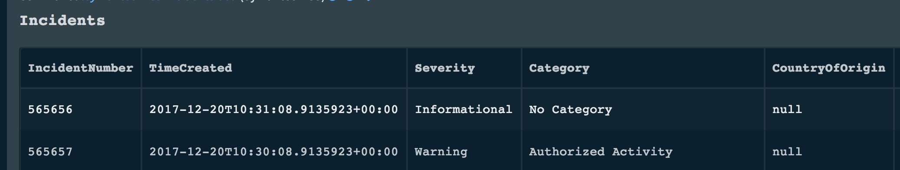
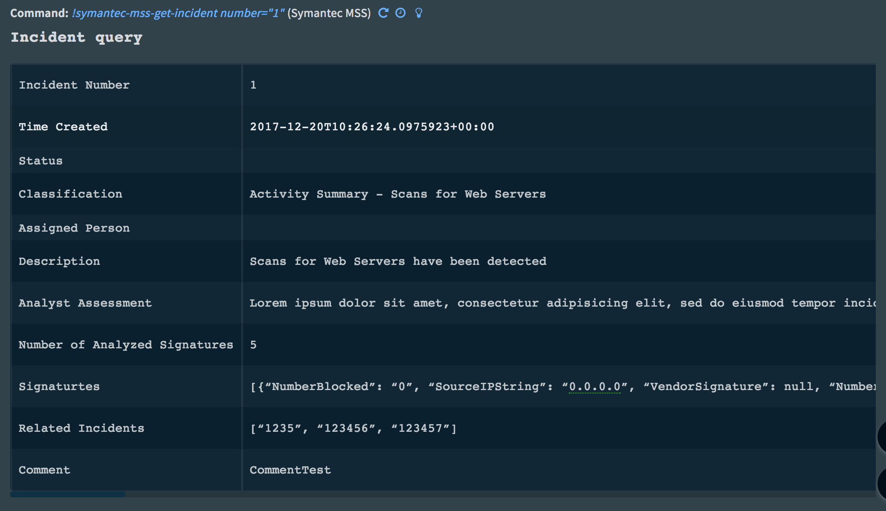
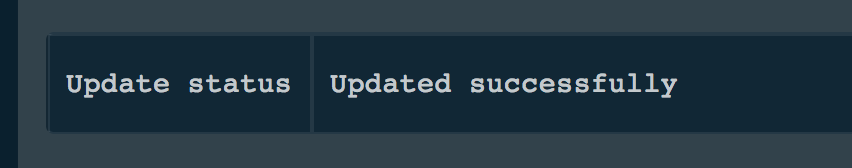

<!-- HTML_DOC -->

Use the Symantec Managed Security Services (Symantec MSS) integration to create Cortex XSOAR incidents from Symantec incidents.

<h2>Prerequisites</h2>
<ol>
<li>Export a Production certificate that enables you to access your organization’s information in SWS (<a href="https://api.monitoredsecurity.com/SWS/" rel="nofollow">https://api.monitoredsecurity.com/SWS/</a>) .p12 format.</li>
<li>Use any "File to Base64" converter to encode the .p12 file into a base64 string.</li>
</ol>

If not authorized, make sure that the exported .p12 certificate is for the production API and not the test API.

Verify that you can make HTTPS requests from your machine.

Make sure you use the correct proxy, and enable it in the configuration.

<h2>Configure the Symantec MSS Integration on Cortex XSOAR</h2>
<ol>
<li>Navigate to <strong>Settings</strong> &gt; <strong>Integrations</strong> &gt; <strong>Servers &amp; Services</strong>.</li>
<li>Search for Symantec MSS.</li>
<li>Click <strong>Add instance</strong> to create and configure a new integration instance. 
<ul>
<li>
<strong>Name</strong>: A textual name for the integration instance.</li>
<li>
<strong>Server URL</strong>: URL of Symantec MSS server</li>
<li>
<strong>Certificate</strong>: The base64 representation of the exported production certificate</li>
<li>
<strong>Certificate Passphrase</strong>: The passphrase used to create the .p12 certificate.</li>
<li><strong>Use system proxy settings</strong></li>
<li><strong>Fetch Incidents</strong></li>
<li>
<strong>Incident type</strong>: Incident type to trigger incident creation.</li>
<li><strong>Cortex XSOAR engine</strong></li>
</ul>
</li>
<li>Click <strong>Test</strong> to to validate that the certificate is authenticated and the SWS server is responsive.</li>
</ol>
<h2>Fetched Incidents Data</h2>

Incidents with the severities of "Emergency" or "Critical" will be fetched. When importing events for the first time, incidents from the last 10 minutes are imported. A maximum of 500 incidents will be created in one import.

<h2>Use Cases</h2>
<ul>
<li>Close an incident, change it's resolution to "Resolved" and assign to a person named "John" Example: "!symantec-mss-update-incident number=123 resolution=Resolved status=Closed assignPerson=John"</li>
<li>Query for a specific incident (Incident number 1 in this example) Example: "!symantec-mss-get-incident number=1"</li>
<li>Retreive a list of alerts and them as incidents into Cortex XSOAR Check "Import events as incidents" when configuring the integration. To get a list of incidents from the War Room, since 2017, with severity of "Informational" or "Warning" from the source IP "127.0.0.1", with a maximum of 20 entries: "!symantec-mss-incidents-list time=2017-01-01T00:00:00.000Z severities=Informational,Warning max=20 sourceIp=127.0.0.1"</li>
</ul>
<h2>Commands</h2>
<ol>
<li><a href="#h_67584355071530013270647">List all incidents: symantec-mss-incidents-list</a></li>
<li><a href="#h_678957016291530013276887">Get incident information: symantec-mss-incident</a></li>
<li><a href="#h_898299089511530013283952">Update an incident: symantec-mss-update-incident</a></li>
</ol>
<h3 id="h_67584355071530013270647">1. List all incidents</h3>

Gets a list of incidents. You can filters the results by like time, source IP, severity, and max incidents. If no time is specified, incidents from the last 24 hours are returned.

<h5>Base Command</h5>

<code>symantec-mss-incidents-list</code>

<h5>Input</h5>
<table style="width: 750px;" border="2" cellpadding="6">
<thead>
<tr>
<td><strong>Parameter</strong></td>
<td><strong>Description</strong></td>
</tr>
</thead>
<tbody>
<tr>
<td>list time</td>
<td>List timestamp</td>
</tr>
<tr>
<td>severities</td>
<td>Informational, Warning</td>
</tr>
<tr>
<td>max</td>
<td>Maximum number of incidents to return</td>
</tr>
<tr>
<td>sourceIp</td>
<td>Source incidents list IP address</td>
</tr>
</tbody>
</table>

 

<h5>Raw Output</h5>
<pre>[  
   {  
      "Category":"No Category",
      "Severity":"Warning",
      "DaysSeenGlobally":"0",
      "HostNameList":null,
      "GlobalLookbackDays":"2",
      "CustomerSeverity":null,
      "CountryCode":"CC0",
      "DaysSeenInLast30Days":"0",
      "DestOrganizationName":"Org0",
      "SourceOrganizationName":"Org1",
      "UserList":null,
      "IncidentNumber":"565656",
      "CountryOfOrigin":null,
      "SourceIPString":"127.0.0.1",
      "Correlation":"No",
      "IsInternalExternal":null,
      "LatestKeyEvent":"2017-12-20T10:04:35.4355923+00:00",
      "Classification":"Scan for Web Servers",
      "TimeCreated":"2017-12-20T10:04:35.4355923+00:00",
      "FirstSeenInLast30Days":"2017-12-20T10:04:35.4355923+00:00",
      "FirstSeenGlobally":"2017-12-20T10:04:35.4355923+00:00",
      "CountryName":"CName0",
      "UpdateTimestampGMT":"2017-12-20T10:04:35.4355923+00:00",
      "PrevalenceGlobally":"L"
   },
   {  
      "Category":"Authorized Activity",
      "Severity":"Warning",
      "DaysSeenGlobally":"0",
      "HostNameList":null,
      "GlobalLookbackDays":"2",
      "CustomerSeverity":null,
      "CountryCode":"CC1",
      "DaysSeenInLast30Days":"0",
      "DestOrganizationName":"Org1",
      "SourceOrganizationName":"Org2",
      "UserList":null,
      "IncidentNumber":"565657",
      "CountryOfOrigin":null,
      "SourceIPString":"127.0.0.1",
      "Correlation":"Yes",
      "IsInternalExternal":null,
      "LatestKeyEvent":"2017-12-20T10:03:35.4355923+00:00",
      "Classification":"Scan for Web Servers",
      "TimeCreated":"2017-12-20T10:03:35.4355923+00:00",
      "FirstSeenInLast30Days":"2017-12-20T10:03:35.4355923+00:00",
      "FirstSeenGlobally":"2017-12-20T10:03:35.4355923+00:00",
      "CountryName":"CName1",
      "UpdateTimestampGMT":"2017-12-20T10:03:35.4355923+00:00",
      "PrevalenceGlobally":"L"
   },
   ............................
]</pre>

 

<h5>War Room Output</h5>

 

<h3 id="h_678957016291530013276887">2. Get incident information</h3>

Query an incident by number.

<h5>Base Command</h5>

<code>symantec-mss-get-incident</code>

<h5>Input</h5>
<table style="width: 750px;" border="2" cellpadding="6">
<thead>
<tr>
<td><strong>Parameter</strong></td>
<td><strong>Description</strong></td>
</tr>
</thead>
<tbody>
<tr>
<td>number</td>
<td>Incident number</td>
</tr>
</tbody>
</table>

 

<h5>Raw Output</h5>
<pre>{  
   "Signaturtes":"[{"   NumberBlocked":"0",
   "SourceIPString":"0.0.0.0",
   "VendorSignature":null,
   "NumberNotBlocked":"0",
   "SignatureName":"Symantec AV Alert"
},
{  
   "NumberBlocked":"0",
   "SourceIPString":"1.1.1.1",
   "VendorSignature":null,
   "NumberNotBlocked":"0",
   "SignatureName":"Symantec AV Alert"
},
{  
   "NumberBlocked":"0",
   "SourceIPString":"2.2.2.2",
   "VendorSignature":null,
   "NumberNotBlocked":"0",
   "SignatureName":"Symantec AV Alert"
},
{  
   "NumberBlocked":"0",
   "SourceIPString":"3.3.3.3",
   "VendorSignature":null,
   "NumberNotBlocked":"0",
   "SignatureName":"Symantec AV Alert"
},
{  
   "NumberBlocked":"0",
   "SourceIPString":"4.4.4.4",
   "VendorSignature":null,
   "NumberNotBlocked":"0",
   "SignatureName":"Symantec AV Alert"
},
{  
   "NumberBlocked":"0",
   "SourceIPString":"5.5.5.5",
   "VendorSignature":null,
   "NumberNotBlocked":"0",
   "SignatureName":"Symantec AV Alert"
}
]", 
"Incident Number":"565656",
"Number of Analyzed Signatures":"5",
"Analyst Assessment":"Lorem ipsum dolor sit amet, consectetur 
 adipisicing elit, sed do eiusmod tempor incididunt ut labore et dolore magna aliqua.",
"Status":"",
"Description":"Scans for Web Servers have been detected",
"Classification":"Activity Summary - Scans for Web Servers",
"Assigned Person":"",
"Time Created":"2017-12-20T09:53:18.1855923+00:00",
"Related Incidents":"["1235", "123456", "123457"]",
"Comment":"CommentTest"
}</pre>
<h5>War Room Output</h5>

<h3 id="h_898299089511530013283952">3. Update an incident</h3>

Updates an incident's workflow, specified by number. Optional parameters that are not specified are taken from the current workflow. If there are none, an error is thrown, requiring a value for the parameter.

<h5>Base Command</h5>

<code>symantec-mss-update-incident</code>

 

<h5>Input</h5>
<table style="width: 750px;" border="2" cellpadding="6">
<thead>
<tr>
<td><strong>Parameter</strong></td>
<td><strong>Description</strong></td>
</tr>
</thead>
<tbody>
<tr>
<td>number</td>
<td>Incident number</td>
</tr>
<tr>
<td>resolution</td>
<td>Resolved status, for example, Closed</td>
</tr>
<tr>
<td>assignPerson</td>
<td>User assigned to the incident</td>
</tr>
</tbody>
</table>

 

<h5>Raw Output</h5>
<pre>Update status: Updated successfully</pre>
<h5>War Room Output</h5>

