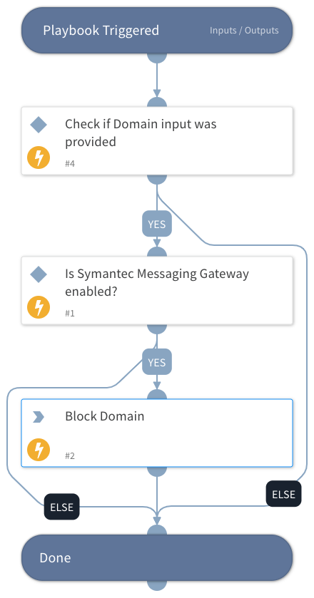

This playbook blocks domains using Symantec Messaging Gateway.
The playbook checks whether the Symantec Messaging Gateway integration is enabled, whether the Domain input has been provided and if so, blocks the domain.

## Dependencies
This playbook uses the following sub-playbooks, integrations, and scripts.

### Sub-playbooks
This playbook does not use any sub-playbooks.

### Integrations
* integration-Symantec_Messaging_Gateway

### Scripts
This playbook does not use any scripts.

### Commands
* smg-block-domain

## Playbook Inputs
---

| **Name** | **Description** | **Default Value** | **Required** |
| --- | --- | --- | --- |
| Domain | The Domain to block. |  | Optional |

## Playbook Outputs
---
There are no outputs for this playbook.

## Playbook Image
---
