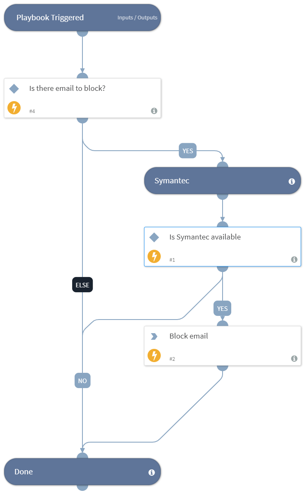

This playbook will block email address at your email gateway.

## Dependencies
This playbook uses the following sub-playbooks, integrations, and scripts.

### Sub-playbooks
This playbook does not use any sub-playbooks.

### Integrations
integration-Symantec_Messaging_Gateway

### Scripts
IsIntegrationAvailable

### Commands
smg-block-email

## Playbook Inputs
---

| **Name** | **Description** | **Default Value** | **Required** |
| --- | --- | --- | --- |
| EmailToBlock | The email address that will be blocked. |  | Optional |

## Playbook Outputs
---
There are no outputs for this playbook.

## Playbook Image
---

