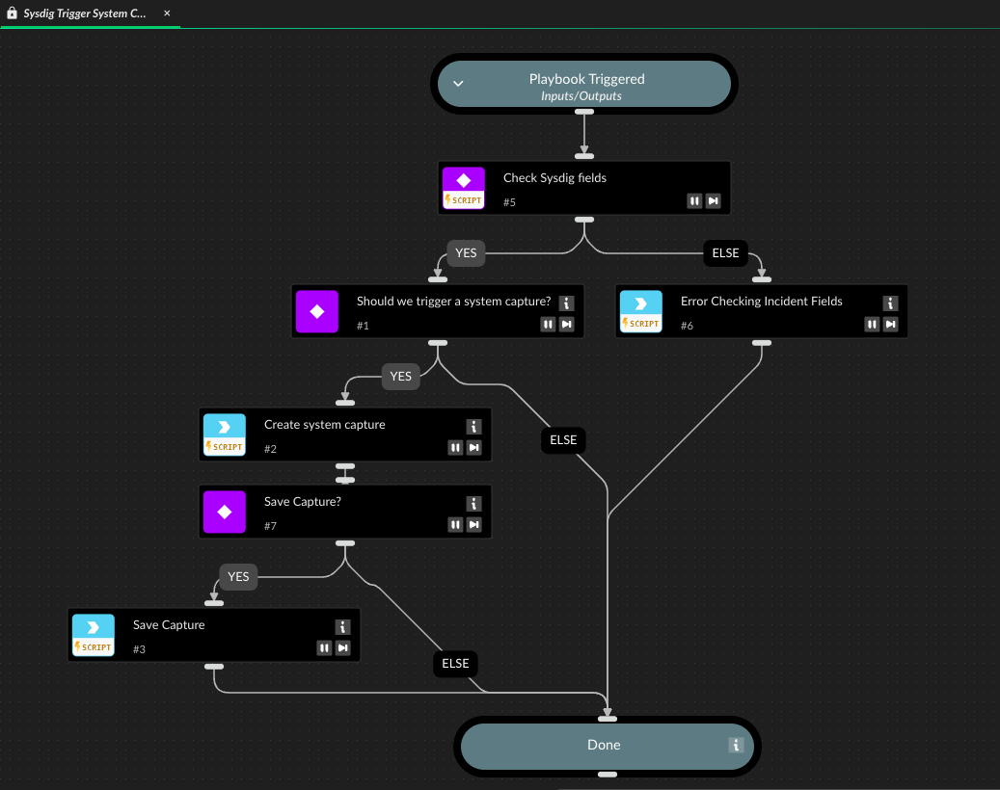

Example playbook on how to manage different response actions based on incident fields.

## Dependencies

This playbook uses the following sub-playbooks, integrations, and scripts.

### Sub-playbooks

This playbook does not use any sub-playbooks.

### Integrations

* SysdigResponseActions

### Scripts

* PrintErrorEntry

### Commands

* create-system-capture
* get-capture-file

## Playbook Inputs

---
There are no inputs for this playbook.

## Playbook Outputs

---
There are no outputs for this playbook.

## Playbook Image

---

