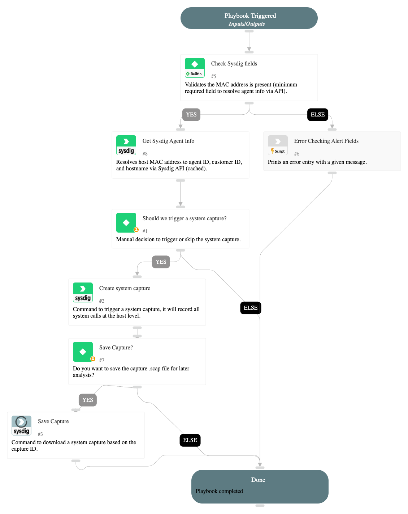

Enriches Sysdig runtime event incidents with agent information via API and optionally triggers a system capture on the affected host.

## Dependencies

This playbook uses the following sub-playbooks, integrations, and scripts.

### Sub-playbooks

This playbook does not use any sub-playbooks.

### Integrations

* SysdigResponseActions

### Scripts

* IsIntegrationAvailable
* PrintErrorEntry

### Commands

* create-system-capture
* get-capture-file
* sysdig-agent-info-get

## Playbook Inputs

---
There are no inputs for this playbook.

## Playbook Outputs

---
There are no outputs for this playbook.

## Playbook Image

---

