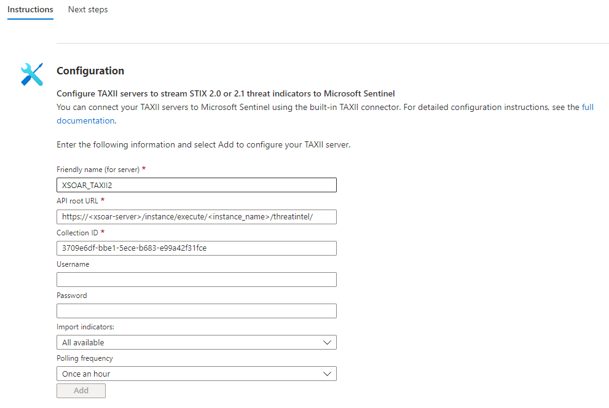

## TAXII2 Server Integration

This integration provides TAXII2 Services for system indicators (outbound feed).
You can choose to use TAXII v2.0 or TAXII v2.1.

The TAXII2 Server integration is a long-running integration. For more information about long-running integrations, see the [Cortex XSOAR 8 Cloud](https://docs-cortex.paloaltonetworks.com/r/Cortex-XSOAR/8/Cortex-XSOAR-Cloud-Documentation/Forward-Requests-to-Long-Running-Integrations), [Cortex XSOAR 8 On-prem](https://docs-cortex.paloaltonetworks.com/r/Cortex-XSOAR/8.7/Cortex-XSOAR-On-prem-Documentation/Integration-commands-in-the-CLI) or [Cortex XSIAM](https://docs-cortex.paloaltonetworks.com/r/Cortex-XSIAM/Cortex-XSIAM-Administrator-Guide/Forward-Requests-to-Long-Running-Integrations) documentation.

## Configure Collections

Each TAXII collection in the integration is represented by a Cortex XSOAR indicator query.

The collections are defined by a JSON object in the following format:

```json
{
  "collection1_name":{
    "query": "<Cortex XSOAR indicator query>",
    "description": "<Custom collection description>"
  },
  "collection2_name": "<Cortex XSOAR indicator query>"
}
```

You can add a collection description as is done in *collection1_name*, or enter only a collection query, as in *collection2_name*.

## How to Access the TAXII2 Server

### For Cortex XSOAR 6.x
Use one of the following options:

- `https://<xsoar_address>/instance/execute/<instance_name>/<taxii2_api_endpoint>/`
- `http://<xsoar_address>:<listen_port>/<taxii2_api_endpoint>/`

### For Cortex XSOAR 8 On-prem, Cortex XSOAR 8 Cloud, or Cortex XSIAM

Use `https://ext-<tenant>/xsoar/instance/execute/<instance-name>/<taxii2_api_endpoint>/`  

**Note**:  
- For Cortex XSOAR 8 On-prem, you need to add the `ext-` FQDN DNS record to map the Cortex XSOAR DNS name to the external IP address.  
  For example, `ext-xsoar.mycompany.com`.  
- The instance name cannot be changed after saving the integration configuration.


## Access the TAXII Service by Instance Name

To access the TAXII service by instance name, make sure ***Instance execute external*** is enabled. 

In Cortex XSOAR 6.x:
1. Navigate to **Settings > About > Troubleshooting**.
2. In the **Server Configuration** section, verify that the ***instance.execute.external*** key is set to **true**. If this key does not exist, click **+ Add Server Configuration**, add the ***instance.execute.external*** and set the value to **true**.

## How to Use HTTPS

To use HTTPS, a certificate and private key have to be supplied in the integration configuration. 

## Set up Authentication
### For Cortex XSOAR 8 Cloud Tenant or Cortex XSIAM Tenant
The TAXII2 Server integration running on a Cortex XSOAR 8 Cloud tenant or Cortex XSIAM tenant enables using basic authentication in the requests.  
To enable basic authentication, a user and password must be supplied in the **Credentials** parameters in the integration configuration.  
The server will then authenticate the requests by the `Authorization` header, expecting basic authentication encrypted in base64 to match the given credentials.  
### For Cortex XSOAR On-prem (6.x or 8) or When Using Engines
For Cortex XSOAR On-prem (6.x or 8) or when using engines, you can set up authentication using custom certificates. For more information on setting up a custom certificate for Cortex XSOAR 8 On-prem, see [HTTPS with a signed certificate](https://docs-cortex.paloaltonetworks.com/r/Cortex-XSOAR/8.7/Cortex-XSOAR-On-prem-Documentation/HTTPS-with-a-signed-certificate). For more information on setting up a custom certificate for Cortex XSOAR 6.x, see [HTTPS with a Signed Certificate](https://docs-cortex.paloaltonetworks.com/r/Cortex-XSOAR/6.13/Cortex-XSOAR-Administrator-Guide/HTTPS-with-a-Signed-Certificate).

## TAXII v2.0 API Endpoints


| **URL** | **Method** | **Response** | **TAXII2 Documentation** |
| --- | --- | --- | --- |
| /taxii/ | GET | Server Discovery Information. | [Server Discovery](http://docs.oasis-open.org/cti/taxii/v2.0/cs01/taxii-v2.0-cs01.html#_Toc496542727) |
| /{api_root}/ | GET | Cortex XSOAR API root is *threatintel*. | [API Root Information](http://docs.oasis-open.org/cti/taxii/v2.0/cs01/taxii-v2.0-cs01.html#_Toc496542729) |
| /{api_root}/collections/ | GET | All Cortex XSOAR collections that configure in Collection JSON parameter. | [Collections Resource](http://docs.oasis-open.org/cti/taxii/v2.0/cs01/taxii-v2.0-cs01.html#_Toc496542734) |
| /{api_root}/collections/{collection_id}/ | GET | Cortex XSOAR Collection with given *collection_id*. | [Collection Response](http://docs.oasis-open.org/cti/taxii/v2.0/cs01/taxii-v2.0-cs01.html#_Toc496542736) |
| /{api_root}/collections/{collection_id}/manifest/ | GET | Object manifests from the given collection. | [Objects Manifest Resource](http://docs.oasis-open.org/cti/taxii/v2.0/cs01/taxii-v2.0-cs01.html#_Toc496542741) |
| /{api_root}/collections/{collection_id}/objects/ | GET | Objects (Cortex XSOAR Indicators) from the given collection. | [Object Resource](http://docs.oasis-open.org/cti/taxii/v2.0/cs01/taxii-v2.0-cs01.html#_Toc496542738) |

For more information, visit [TAXII2 Documentation](http://docs.oasis-open.org/cti/taxii/v2.0/taxii-v2.0.html).

## TAXII v2.1 API Endpoints

| **URL**                                           | **Method** | **Response**                                                                   | **TAXII2 Documentation**                                                                                   |
|---------------------------------------------------|------------|--------------------------------------------------------------------------------|------------------------------------------------------------------------------------------------------------|
| /taxii2/                                          | GET        | Server Discovery Information.                                                  | [Server Discovery](https://docs.oasis-open.org/cti/taxii/v2.1/os/taxii-v2.1-os.html#_Toc31107526)          |
| /{api_root}/                                      | GET        | XSOAR API root is *threatintel*.                                               | [API Root Information](https://docs.oasis-open.org/cti/taxii/v2.1/os/taxii-v2.1-os.html#_Toc31107528)      |
| /{api_root}/collections/                          | GET        | All Cortex XSOAR collections that configure in Collection JSON parameter.      | [Collections Resource](https://docs.oasis-open.org/cti/taxii/v2.1/os/taxii-v2.1-os.html#_Toc31107533)      |
| /{api_root}/collections/{collection_id}/          | GET        | Cortex XSOAR Collection with given *collection_id*.                            | [Collection Response](https://docs.oasis-open.org/cti/taxii/v2.1/os/taxii-v2.1-os.html#_Toc31107535)       |
| /{api_root}/collections/{collection_id}/manifest/ | GET        | Object manifests from the given collection.                                    | [Objects Manifest Resource](https://docs.oasis-open.org/cti/taxii/v2.1/os/taxii-v2.1-os.html#_Toc31107537) |
| /{api_root}/collections/{collection_id}/objects/  | GET        | Objects (Cortex XSOAR Indicators and Relationships) from the given collection. | [Object Resource](https://docs.oasis-open.org/cti/taxii/v2.1/os/taxii-v2.1-os.html#_Toc31107539)           |

For more information, visit [TAXII2 Documentation](https://docs.oasis-open.org/cti/taxii/v2.1/taxii-v2.1.html).

## Known Limitations

- GET objects by ID is not allowed.
- Filtering objects by ID or version not allowed.
- POST and DELETE objects are not allowed. Cannot add or delete indicators using TAXII2 Server. 


## How UUIDs Work for TAXII2 in Cortex XSOAR

---

### STIX Cyber Objects (SCO)

All STIX SCOs UUIDs follow [STIX 2.1 guidelines](https://docs.oasis-open.org/cti/stix/v2.1/os/stix-v2.1-os.html#_64yvzeku5a5c) and use UUID5 with STIX unique namespace 
(*00abedb4-aa42-466c-9c01-fed23315a9b7*). This is used so all SCOs created have persistent UUID across all producers.

### STIX Domain Objects (SDO)

Unlike SCOs, STIX 2.1 specs for SDOs require a UUID4. While this solution works if the UUID is part of the database,
it is not the case in Cortex XSOAR. If the SDO already has a unique UUID stored it will use it, if not it will generate a unique and *persistent* UUID using the following method.

A general UUID5 is created using the NameSpace_URL as follows:

`PAWN_UUID = uuid.uuid5(uuid.NAMESPACE_URL, 'https://www.paloaltonetworks.com')`

The generated UUID is then used to create a unique UUID5 per customer:

`UNIQUE_UUID = uuid.uuid5(PAWN_UUID, <UniqueCostumerString>)`

We then use this UUID as a base namespace to generate UUIDs for SDOs following the STIX 2.1 specs. Using this method,
we create unique and persistent UUIDs per customer.

## Cortex XSOAR TIM Extension Fields

---
When selected in the integration settings (Cortex XSOAR Extension Fields) the TAXII2 integration will generate an extension object and an extension attribute that holds Cortex XSOAR additional
TIM fields (system generated and custom). An example of these two related objects:

```JSON
{
  "id": "extension-definition--<UUID>",
  "type": "extension-definition",
  "spec_version": "2.1",
  "name": "XSOAR TIM <Cortex XSOAR Type>",
  "description": "This schema adds TIM data to the object",
  "created": "<creation date>",
  "modified": "<modification date>",
  "created_by_ref": "identity--<UUID of creator>",
  "schema": "https://github.com/demisto/content/blob/4265bd5c71913cd9d9ed47d9c37d0d4d3141c3eb/Packs/TAXIIServer/doc_files/XSOAR_indicator_schema.json",
  "version": "1.0",
  "extension_types": ["property-extension"]
},
{
    "type": "ipv4-addr",
    "spec_version": "2.1",
    "id": "ipv4-addr--2f689bf9-0ff2-545f-aa61-e495eb8cecc7",
    "value": "8.8.8.8",
    "extensions":{
        "extension-definition--<UUID>": {
           "Extension_type": "property_extension",
           "Field_1": "Value1",
           "Field_2": "Value2",
           "Field_3": "Value3"
        }
    }
}
```

## Performance Benchmark


| **Indicators Amount** | **Request time (seconds)** |
| --- | --- |
| 10,000 | 5-10 | 
| 50,000 | 30-40 |
| 100,000 | 50-90 |


## Microsoft Sentinel Configuration Guide

### Configure the TAXII2 Server Instance

  1. Set **TAXII2 Server version** to **2.0** (The integration currently doesn't work with Microsoft Sentinel in TAXII Version 2.1).
    
  2. Under **STIX types for STIX indicator Domain Object** select the indicator types you want to ingest.

  3. Set the **Listen Port** and **Collection JSON** to your linking.


### Find the Information Required for the Sentinel TAXII Connector

#### For Cortex XSOAR 6.x

  1. All your server info can be found by running `!taxii-server-info`, the default API root for you server will usually be - `https://<xsoar-server>/instance/execute/<instance_name>/threatintel/`
  2. You can use the `!taxii-server-list-collections` command in order to get a list of your server's collections and their IDs. You can also do it manually by running `curl https://<xsoar-server>/instance/execute/<instance_name>/threatintel/collections/ | jq .` to get a list  of the collections available and on your TAXII server. From the list, copy the correct ID of the collection you want to ingest. 

#### For Cortex XSOAR 8 On-prem, Cortex XSOAR Cloud, or Cortex XSIAM

  1. All your server info can be found by running `!taxii-server-info`, the default API root for you server will usually be - `https://ext-<tenant>.crtx.<region>.paloaltonetworks.com/xsoar/instance/execute/<instance-name>/threatintel/`
  2. You can use the `!taxii-server-list-collections` command in order to get a list of your server's collections and their IDs. You can also do it manually by running `curl https://ext-<tenant>.crtx.<region>.paloaltonetworks.com/xsoar/instance/execute/<instance-name>/threatintel/collections/ | jq .` to get a list of the collections available and on your TAXII server. From the list, copy the correct ID of the collection you want to ingest.


 Response Example:

  ```JSON
  {
    "collections": [
      {
        "can_read": true,
        "can_write": false,
        "description": "",
        "id": "3709e6df-bbe1-5ece-b683-e99a42f31fce",
        "media_types": [
          "application/vnd.oasis.stix+json; version=2.0"
        ],
        "query": "type:IP",
        "title": "AllIPs"
      },
      {
        "can_read": true,
        "can_write": false,
        "description": "",
        "id": "16763019-5ee6-59bc-b4d9-be586235b308",
        "media_types": [
          "application/vnd.oasis.stix+json; version=2.0"
        ],
        "query": "type:File",
        "title": "AllHashes"
      }
    ]
  }
  ```

### Set up the Microsoft Sentinel TAXII Connector

Now that we have the API root URL and the collection ID we can configure the Threat intelligence - TAXII Connector in Microsoft Sentinel.

Paste your API root URL in the field marked **API Root URL** and the desired collection ID we got in step (2) under **Collection ID**.

Example:



## Commands

You can execute these commands from the Cortex XSOAR CLI, as part of an automation, or in a playbook.
After you successfully execute a command, a DBot message appears in the War Room with the command details.

### taxii-server-list-collections

***
Returns all the collections.


#### Base Command

`taxii-server-list-collections`

#### Input

There are no input arguments for this command.

#### Context Output

| **Path** | **Type** | **Description** |
| --- | --- | --- |
| TAXIIServer.Collection.id | String | The collection ID. | 
| TAXIIServer.Collection.query | String | The collection query. | 
| TAXIIServer.Collection.title | String | The collection title. | 
| TAXIIServer.Collection.description | String | The collection description. | 

#### Command example

```!taxii-server-list-collections```

#### Context Example

```json
{
    "TAXIIServer": {
        "Collection": {
            "can_read": true,
            "can_write": false,
            "description": "",
            "id": "2eb7bfae-7739-5863-9b00-1681309c3d8c",
            "media_types": [
                "application/stix+json;version=2.1"
            ],
            "query": "",
            "title": "ALL"
        }
    }
}
```

#### Human Readable Output

>### Collections

>|id|title|query|description|
>|---|---|---|---|
>| 2eb7bfae-7739-5863-9b00-1681309c3d8c | ALL |  |  |


### taxii-server-info

***
Returns the TAXII server info, default URL, title, etc.


#### Base Command

`taxii-server-info`

#### Input

There are no input arguments for this command.

#### Context Output

| **Path** | **Type** | **Description** |
| --- | --- | --- |
| TAXIIServer.ServerInfo.title | String | The server title | 
| TAXIIServer.ServerInfo.api_roots | Unknown | The server API roots URLs. | 
| TAXIIServer.ServerInfo.default | String | The default URL. | 
| TAXIIServer.ServerInfo.description | String | The server description | 

#### Command Example

```!taxii-server-info```

#### Context Example

```json
{
    "TAXIIServer": {
        "ServerInfo": {
            "api_roots": [
                "https://foo.cooo.com/inc/threatintel/"
            ],
            "default": "https://foo.cooo.com/inc/threatintel/",
            "description": "This integration provides TAXII Services for system indicators (Outbound feed).",
            "title": "Cortex XSOAR TAXII2 Server"
        }
    }
}
```

#### Human Readable Output

>**In case the default URL is incorrect, you can override it by setting the "TAXII2 Service URL Address" field in the integration configuration**
>
>### Server Info

>|api_roots|default|description|title|
>|---|---|---|---|
>| https:<span>//</span>foo.cooo.com/inc/threatintel/ | https:<span>//</span>foo.cooo.com/inc/threatintel/ | This integration provides TAXII Services for system indicators (Outbound feed). | Cortex XSOAR TAXII2 Server |

