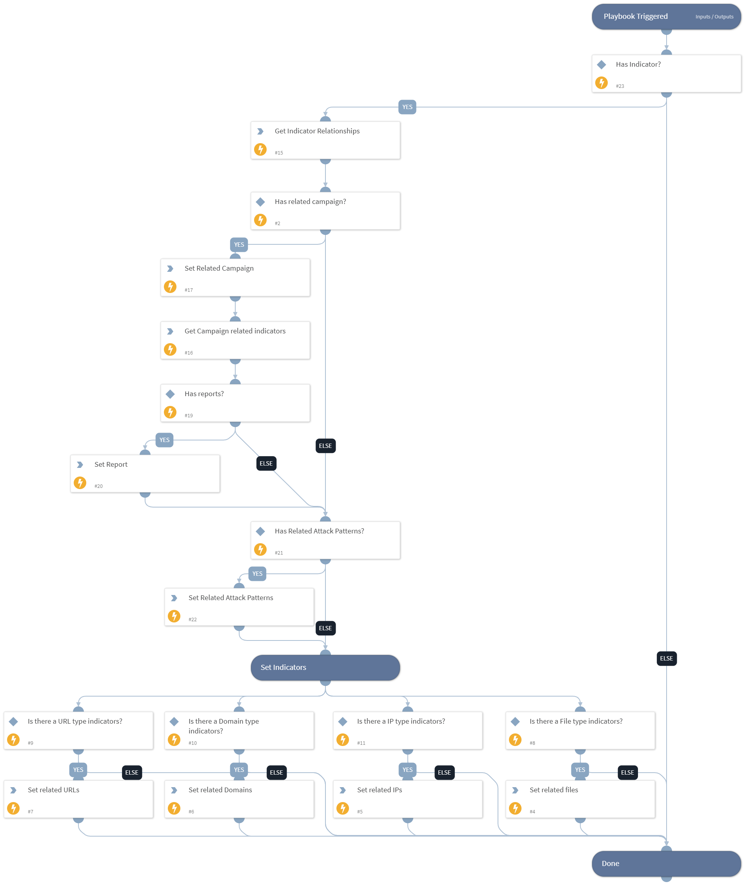

This playbook is designed to assist with a security investigation by providing an analysis of indicator relationships. The following information is included:
- Indicators of compromise (IOCs) related to the investigation.
- Attack patterns related to the investigation.
- Campaigns related to the investigation.
- IOCs associated with the identified campaigns.
- Reports containing details on the identified campaigns.

## Dependencies
This playbook uses the following sub-playbooks, integrations, and scripts.

### Sub-playbooks
This playbook does not use any sub-playbooks.

### Integrations
This playbook does not use any integrations.

### Scripts
* Set
* SearchIndicatorRelationships

### Commands
This playbook does not use any commands.

## Playbook Inputs
---

| **Name** | **Description** | **Default Value** | **Required** |
| --- | --- | --- | --- |
| Indicator | Input an indicator to analyze its relationships. |  | Optional |
| LimitResults | The number of results to return. If the input is empty, the limit will be 20. | 200 | Optional |

## Playbook Outputs
---

| **Path** | **Description** | **Type** |
| --- | --- | --- |
| RelatedAttackPatterns | Attack patterns related to the indicator. | unknown |
| RelatedCampaign | Campaign related to the indicator. | unknown |
| RelatedReport | Report related to the campaign. | unknown |
| RelatedFiles | Files related to the indicator and campaign. | unknown |
| RelatedDomains | Domains related to the indicator and campaign. | unknown |
| RelatedIPs | IPs related to the indicator and campaign. | unknown |
| RelatedURLs | URLs related to the indicator and campaign. | unknown |

## Playbook Image
---
