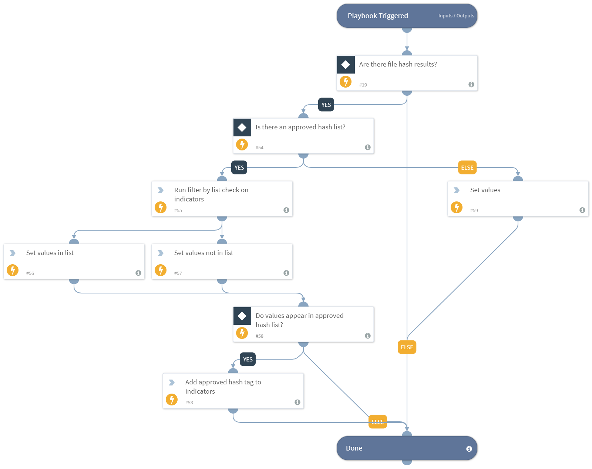

This playbook checks if file hash indicators exist in a Cortex XSOAR list. If the indicators exist in the list, they are tagged as approved_hash.

## Dependencies
This playbook uses the following sub-playbooks, integrations, and scripts.

### Sub-playbooks
This playbook does not use any sub-playbooks.

### Integrations
This playbook does not use any integrations.

### Scripts
* FilterByList
* SetAndHandleEmpty

### Commands
* appendIndicatorField

## Playbook Inputs
---

| **Name** | **Description** | **Default Value** | **Required** |
| --- | --- | --- | --- |
| ApprovedHashList | A Cortex XSOAR list containing approved hash values. Hash indicators that appear in the list are tagged as approved. |  | Optional |
| Indicator Query | Indicators matching the indicator query will be used as playbook input |  | Optional |

## Playbook Outputs
---

| **Path** | **Description** | **Type** |
| --- | --- | --- |
| HashesInApprovedList | File hashes that are found in the approved\_hash list. | string |
| HashesNotInApprovedList | File hashes that are not found in the approved\_hash list. | string |

## Playbook Image
---
