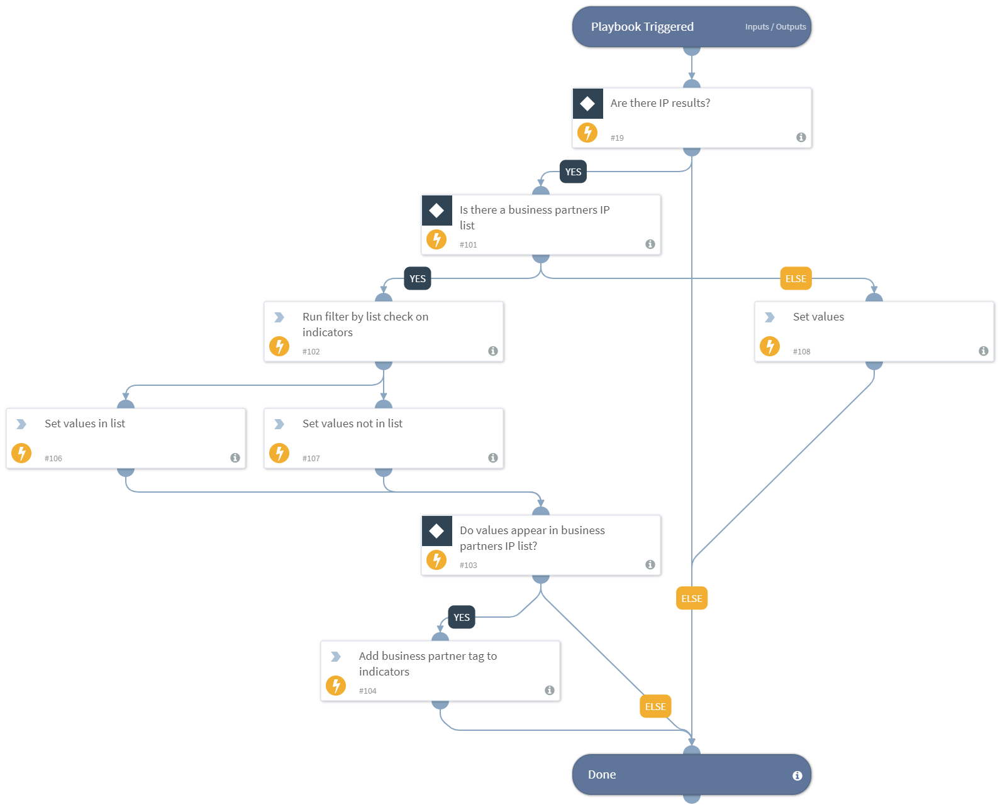

This playbook processes indicators to check if they exist in a Cortex XSOAR list containing the business partner domains, and tags the indicators accordingly.

## Dependencies
This playbook uses the following sub-playbooks, integrations, and scripts.

### Sub-playbooks
This playbook does not use any sub-playbooks.

### Integrations
This playbook does not use any integrations.

### Scripts
* SetAndHandleEmpty
* FilterByList

### Commands
* appendIndicatorField

## Playbook Inputs
---

| **Name** | **Description** | **Default Value** | **Required** |
| --- | --- | --- | --- |
| Indicator Query | Indicators matching the indicator query will be used as playbook input |  | Optional |
| BusinessPartnersDomainsListName | A Cortex XSOAR list containing business partner domain names values. Domain Indicators that appear in the list are tagged as business partner. |  | Optional |

## Playbook Outputs
---

| **Path** | **Description** | **Type** |
| --- | --- | --- |
| BusinessPartnerDomain | Domain that are found in the business partner domains list. | string |
| NotBusinessPartnerDomain | Domain that are not found in the business partner domains list. | string |

## Playbook Image
---
