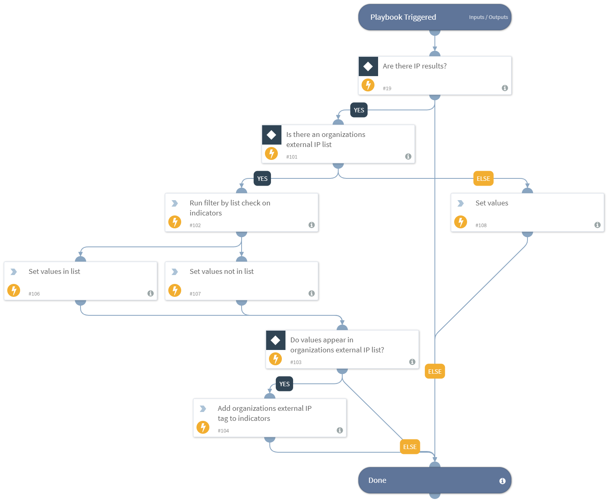

This playbook processes indicators to check if they exist in a Cortex XSOAR list containing the organizational External IP addresses or CIDR, and tags the indicators accordingly.

## Dependencies
This playbook uses the following sub-playbooks, integrations, and scripts.

### Commands
* appendIndicatorField

## Playbook Inputs
---

| **Name** | **Description** | **Default Value** | **Required** |
| --- | --- | --- | --- |
| Indicator Query | Indicators matching the indicator query will be used as playbook input | type:IP | Optional |
| OrganizationsExternalIPList | A Cortex XSOAR list containing the organization's External IP address values. The value should be taken from the Lists inputs. The list should be with comma separated values.|  | Optional |
| OrganizationsExternalCIDRList | A Cortex XSOAR list containing the organization's External CIDR values. The value should be taken from the Lists inputs. The list should be with comma separated values.|  | Optional |

## Playbook Outputs
---
There are no outputs for this playbook.

## Playbook Image
---
